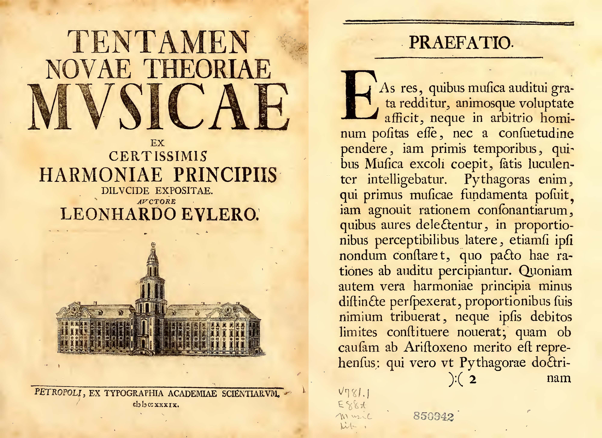
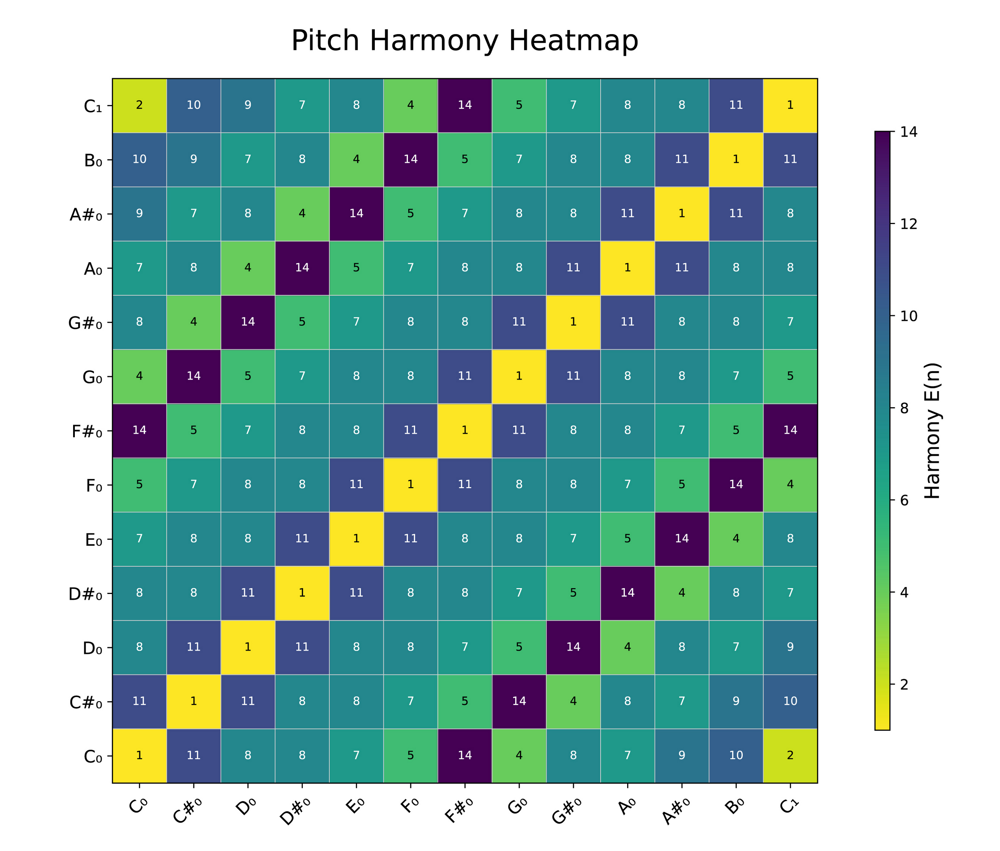
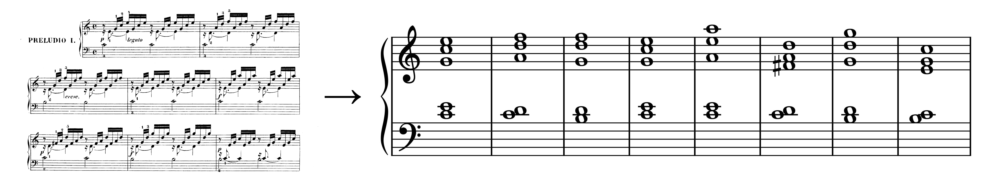
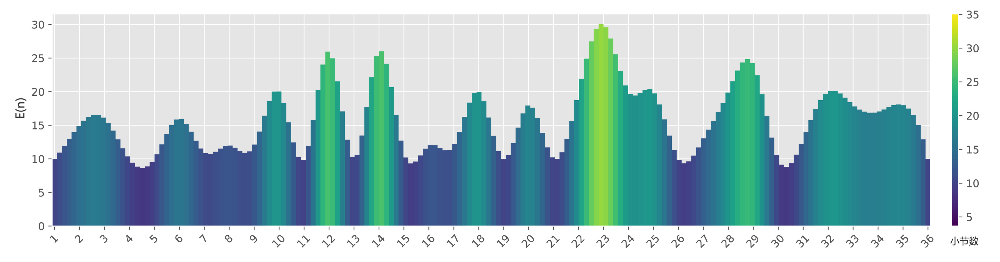

# The Forgotten Mathematical Masterpiece: How Euler Explained Music with Mathematics? An Introduction to *Tentamen Novae Theoriae Musicae*

[TOC]

> **Attention**: This article was originally written in Chinese and published on [this website](https://blog.csdn.net/liaoziqiang/article/details/144675266). The English version was translated using GPT-4o. Apologies, as I am not a professional columnist and did not have enough time to personally translate or thoroughly proofread the content. I hope this does not affect your reading experience. If you notice any language or content errors, or have any suggestions for improvement, feel free to contact me at [liaoziqiang7@gmail.com](mailto:liaoziqiang7@gmail.com).

### 1. Introduction

Anyone interested in mathematics has undoubtedly heard of the renowned name—Leonhard Euler. Celebrated as a legendary figure, Euler is known for deriving the divine formula $e^{i\pi} + 1 = 0$ and is recognized as one of the greatest mathematicians of all time. His contributions span almost every domain of mathematics, as well as physics, engineering, and economics. Euler's name is associated with numerous formulas across different subjects.


> Image: Ludwig van Euler engaging in music theory research (just kidding)

However, few are aware that Euler also ventured into the area of music theory. In 1739, at the age of 32, Euler authored *Tentamen Novae Theoriae Musicae Ex Certissimis Harmoniae Principiis Dilucide Expositae* (An Attempt at a New Theory of Music: Clearly Expounded from the Most Certain Principles of Harmony), aiming to integrate music theory into the framework of mathematics. Unfortunately, this book did not receive the attention it deserved. Even in the English-speaking world, references are sparse, while in the Chinese-speaking community, it remains virtually unknown. Fortunately, some academic papers have explored this work, and an independent researcher from [17th Century Math](https://www.17centurymaths.com/contents/eulermusice33.html) has translated it from Latin into English, making it accessible to a broader audience. The original Latin version is available for download from [this website](https://archive.org/details/tentamennovaethe00eule/). This article might be the first comprehensive introduction to this remarkable book in the Chinese internet sphere.



The intersection of music and mathematics has a long history. From Pythagoras' discovery of interval ratios and the Chinese "Rule of Three," to the calculations of twelve-tone equal temperament, mathematics has always provided a theoretical foundation for music. Following the Renaissance, with the rise of rationalism, mathematicians and musicians began describing music with mathematical language. Euler was among those visionaries, drawing inspiration from ancient Greek philosophy and Baroque music. He used mathematics to study scales, intervals, and harmony, proposing a new system to balance various tuning methods, mathematically describing harmony and modes, and even including guidance on composition techniques.

Given my limited expertise, both as a music and mathematics enthusiast, this article can only offer a rough exploration of certain elements of *Tentamen Novae Theoriae Musicae*. It primarily serves to satisfy curiosity and hopefully act as a catalyst to attract more readers on the Chinese internet to this intriguing book, prompting them to explore its mysteries.

> For a better reading experience, visit [this webpage](https://liao-ziqiang.github.io/fyaxm-blog/euler-music/euler-music.html). Don't forget to leave a like and bookmark before you go!

### 2. Book Introduction

While this article focuses only on a few simple and intriguing points from the book, given the scarcity of introductions to it in the Chinese internet, we will first provide an overview of the book's overall structure. The table of contents is as follows (page numbers correspond to the Latin original):

- **Chapter 1**: On Sound and Hearing, page 1
- **Chapter 2**: On the Principles of Aesthetics and Harmony, page 26
- **Chapter 3**: On the General Study of Music, page 44
- **Chapter 4**: On Harmonic Intervals, page 56
- **Chapter 5**: On the Continuity of Harmonic Intervals, page 76
- **Chapter 6**: On the Sequence of Harmonic Intervals, page 90
- **Chapter 7**: On the General Names of Various Intervals, page 102
- **Chapter 8**: On the Types of Musical Scales, page 113
- **Chapter 9**: On the Natural-Chromatic Scale, page 132
- **Chapter 10**: On Other More Complex Musical Scales, page 151
- **Chapter 11**: On Harmonic Intervals in the Natural-Chromatic Scale, page 165
- **Chapter 12**: On Modes and Systems in the Natural-Chromatic Scale, page 175
- **Chapter 13**: On Composition Methods in Specific Modes and Systems, page 195
- **Chapter 14**: On the Transformation of Modes and Systems, page 252

I believe the book can be roughly divided into the following sections:

1. **The first part** consists of Chapters 1 and 3, which predominantly study the concepts of sound and music, offering foundational background knowledge.
2. **The second part** includes Chapters 2, 4, and 7, focusing on the aspects of harmonic intervals.
3. **The third part** encompasses Chapters 5 and 6, where the analysis extends from single chords to entire musical compositions.
4. **The fourth part** comprises Chapters 8, 9, and 10, where Euler employs mathematical methods to create musical scales.
5. **The fifth part** involves Chapters 11, 12, 13, and 14, where Euler develops a new theoretical framework for music based on preceding theoretical foundations, providing insights into tuning, composition, and beyond.

Even though the book is only 300 pages long, which might seem insignificant compared to Euler's extensive corpus, the profound ideas it contains could easily engage an average individual in deep study for a significant amount of time. This article will take readers on a journey to experience how Euler, during the Baroque period, elucidated music theory through mathematics.

### 3. The Mathematical Principles of Harmony and Pleasure

This section primarily corresponds to Chapters 2 and 4 of the original book. To begin, we clarify: Euler's music theory framework focuses on only two dimensions—**pitch** and **duration (rhythm)**. Although factors such as volume can also affect musical effects and show certain patterns, Euler considered volume too subjective and arbitrary, choosing not to include it in his theoretical system.

This brings to mind a definition of "texture" from a video by Bilibili creator [Wang Lele Leyou](https://space.bilibili.com/39034282). In [the video](https://www.bilibili.com/video/BV1EZ4y1z7gu/), he mentioned that texture involves organizing sounds to create richness when control over timbre is not possible. Reflecting on the considerable limitations of volume control on the harpsichord during Bach’s era, we can say that pitch and rhythm form the **skeleton** of music, while timbre and volume are its **flesh and blood**. Euler's goal was to set aside the "flesh and blood" and concentrate on the "skeleton" of music.

#### 3.1 Harmony: The Order Hidden Within Notes

> All the pleasure we find in music arises from the perception of ratios, which exist among various numbers, as the duration of time can also be expressed numerically.  
> — Euler

In the tonal music system, whether music sounds "pleasant" from a harmonic perspective involves at least two core factors: the **consonance** of the harmony itself and the **transition** between harmonies. We will focus on the former for now. It's known that the harmoniousness of various intervals varies significantly. For example, a perfect fifth is relatively harmonious, while a minor second or a major seventh sounds more dissonant. Furthermore, different chords exhibit unique auditory characteristics: a major triad (C-E-G) sounds pleasing due to its stability, while a diminished seventh chord (B-D-F-A♭) is full of tension. Euler believed that the essence of harmony is a pleasure derived from a sense of "**order**" embedded in sound. This order is neither purely a subjective feeling nor a phenomenon unique to one culture, but a universally applicable objective rule that can be mathematically described.

This theory was not originated by Euler but has long historical roots. Readers with some music theory background might be familiar with this concept. For instance, when the frequency ratio of two notes is 2:1 (meaning one note's frequency is twice that of the other), they form an octave. Such a proportional relationship is straightforward, thus humans perceive a clear sense of order in these sounds. Similarly, a frequency ratio of 3:2 (a perfect fifth) is also considered harmonious because it's another simple mathematical relationship. Generally, harmonious sounds are pleasing because there **exist simple and clear integer ratio relationships** between their frequencies. The simpler the ratio, the more harmonious the sound; the more complex the ratio (such as those approaching irrational numbers), the more dissonant it is perceived.

Euler further pointed out that harmony and pleasure are related but not identical. He wrote in his book:

> It can be seen that experiencing pleasure is not the same as being amused, just as being saddened is not the opposite of displeasure. We have explained to some extent why: anything that allows us to perceive order brings pleasure. Among these, those with simpler, more easily understood orders induce joy, while those with more complex and less perceptible orders often lead to sadness.

It is evident that Euler's notion of "pleasure" here does not merely refer to joy, but rather to aspects that are "moving," "likable," and "beautiful." Generally speaking, harmonious sounds bring joy, whereas discordant sounds evoke sadness, as long as they both adhere to a certain order, differing only in how easily this order is perceived. Sounds without order at all tend to be displeasing, as Euler puts it:

> If we cannot perceive order in certain things, our level of pleasure diminishes; if there's absolutely no order detectable, the appeal of the object diminishes significantly. If we not only fail to discern order but find that the object contradicts reason and possibly disrupts existing order, we experience aversion, almost perceiving these objects with a sense of pain.

However, when 20th-century tonal music reached its peak, Schoenberg introduced atonal music, challenging the long-held norms. However, this is beyond the scope of our discussion here.

Euler, being a mathematician, did not restrict himself to conceptual debates. He proposed a **formula for measuring dissonance**, which quantifies the harmony of any chord. The formula is:

$$
E(n) = 1 + \sum_{k=1}^r a_k(p_k - 1)
$$

Where:

- $E(n)$ represents the degree of dissonance, and $n$ is the least common multiple of the frequency ratios.
- $n$ is broken down into its prime factors: $n = p_1^{a_1} p_2^{a_2} \dots p_r^{a_r}$, where $p_k$ denotes different prime numbers, and $a_k \geq 1$.

Here are two examples:

1. **Perfect Fifth**: Ratio is $3:2$.
   - Least common multiple: $\text{LCM}(3, 2) = 6$.
   - Prime factorization: $6 = 2^1 \cdot 3^1$.
   - Calculation: $E(6) = 1 + 1 \cdot (2-1) + 1 \cdot (3-1) = 1 + 1 + 2 = 4$.

2. **Major Third**: Ratio is $5:4$.
   - Least common multiple: $\text{LCM}(5, 4) = 20$.
   - Prime factorization: $20 = 2^2 \cdot 5^1$.
   - Calculation: $E(20) = 1 + 2 \cdot (2-1) + 1 \cdot (5-1) = 1 + 2 + 4 = 7$.

We can implement this algorithm using Python, although it is not shown here. Interested readers can download and view the code from the [Github repository](https://github.com/Liao-Ziqiang/fyaxm-blog/tree/main/euler-music/code). They are encouraged to run and verify the code themselves.

##### 3.1.1 Conjecture: Physical Principles of Euler's Dissonance Formula

We already know that the simpler the ratio, the more harmonious it sounds. But how do we quantify this "simplicity"? Let's assume the ratio is already in its simplest coprime form. For instance, we might intuitively think that the sum of the numerator and denominator can reflect its complexity. For example, the sum for $ 1/2 $ is $ 1+2=3 $, for $ 1/3 $ it is $ 1+3=4 $, and for $ 9/11 $ it is $ 9+11=20 $. Clearly, the more complex the ratio, the higher the sum of the numerator and denominator. Similarly, one could use the product of the numerator and denominator instead of their sum. However, such simple methods are unlikely to satisfy us completely.

Euler proposed a different metric with more flexibility and physical significance: the **Least Common Multiple (LCM)**. A major advantage of this method is that it is not only applicable to the frequency ratio of two tones, but it can also be easily extended to include multiple tones. Next, he performed **prime factorization** and calculated based on the number of prime factors. Why use the least common multiple and prime factorization? I speculate it might first relate to the "misalignment degree" of sound waves. When sound waves are misaligned, they may produce irregular "spikes" or zero points, which could be the source of dissonance. Additionally, this could relate to the degree of overlap in the harmonic series; for two sound waves with a frequency ratio of $ a:b $, their harmonics proportional to $ \text{LCM}(a,b) $ overlap. The greater the overlap of harmonics, the more harmonious the interval might sound. In summary, if the periodic cycles between two sound frequencies coincide only after a long time, there will be frequent interferences, beat frequencies, or complex transitions in a shorter period. More, and larger, prime factors might correspond to more severe disruptive factors that take longer to "synchronize" or "align." Of course, these are just simple conjectures, and Euler's formula is considered problematic by today's standards.


##### 3.1.2 Limitations of Euler's Dissonance Formula

Human understanding of chord harmony, or the harshness of any sound, has evolved gradually over time. Initially, only the simplicity of integer ratios was used for measurement, and early scholars explained this by suggesting that "sound waves synchronize more easily in time/space domains." However, this understanding was rudimentary. Later research, such as resonance theory, subsequent auditory physiology, and 20th-century psychoacoustic experiments, demonstrated that dissonance relates to "beating frequencies," overlap of frequency bands on the basilar membrane of the inner ear, auditory masking, and "mutual disturbances" among harmonics.

In modern auditory science, one of the most common and basic quantitative measures of "dissonance" is "beat roughness." When two or more frequencies that are close but not identical sound simultaneously, periodic interweaving/interference occurs in the cochlea, resulting in beat frequencies. Beat frequencies within a certain range (approximately 20–40 Hz) are often subjectively perceived as "rough" or harsh. Specific quantification methods include the consonance theory proposed by Plomp and Levelt.

In fact, many theories involving vision and hearing need to be integrated with physiology and psychology to be fully understood. For instance, the sensitivity of the human eye to different colors varies (see: spectral luminous efficiency curve), and the perception of loudness for different frequencies varies for the human ear (see: equal-loudness contour). The specific shapes of these curves can even relate to region and ethnicity. Thus, Euler's attempt to describe the phenomenon of dissonance using elementary mathematics now seems to have significant limitations. Additionally, Euler excluded timbre and loudness from his considerations, which reduces the theory's general applicability—it can only explain chords and not extend to any other sounds.

Of course, the great Euler was aware of these limitations:

> I do not deny (and later I will prove) that through practice and repeated listening, we can grow to enjoy music that initially displeased us, or vice versa. However, this so-called "principle of sufficient reason" is not thereby refuted. For we must explore not only the reasons why things please or displease us from themselves, but also consider how the senses convey the image of objects to the mind, and, indeed, what primary judgment the mind makes of the image presented to it. Since such factors might vary from person to person, and even the same person may change over time, it is not surprising that the same object could appeal to some and displease others. —Euler

Perhaps he simply wished to capture the primary contradictions of the problem, providing a broadly applicable framework. Euler, renowned for his strong numerical intuition, proposed such a concise and insightful formula, earning the admiration of the world.

### 3.2 Visualization of Interval Dissonance

By substituting the approximate ratios for each interval, we obtain the following table:

|      Name      | Approximate Ratio | Least Common Multiple (n) |    Prime Factorization    | Count E(n) |
| :------------: | :---------------: | :-----------------------: | :-----------------------: | :--------: |
|     Unison     |        1:1        |             1             |             -             |     1      |
|  Minor Second  |       16:15       |            240            |  $ 2^4 \cdot 3 \cdot 5 $  |     11     |
|  Major Second  |        9:8        |            72             |     $ 2^3 \cdot 3^2 $     |     8      |
|  Minor Third   |        6:5        |            30             |   $ 2 \cdot 3 \cdot 5 $   |     8      |
|  Major Third   |        5:4        |            20             |      $ 2^2 \cdot 5 $      |     7      |
| Perfect Fourth |        4:3        |            12             |      $ 2^2 \cdot 3 $      |     5      |
|    Tritone     |       45:32       |           1440            | $ 2^5 \cdot 3^2 \cdot 5 $ |     14     |
| Perfect Fifth  |        3:2        |             6             |       $ 2 \cdot 3 $       |     4      |
|  Minor Sixth   |        8:5        |            40             |      $ 2^3 \cdot 5 $      |     8      |
|  Major Sixth   |        5:3        |            15             |       $ 3 \cdot 5 $       |     7      |
| Minor Seventh  |       16:9        |            144            |     $2^4 \cdot 3 ^2$      |     9      |
| Major Seventh  |       15:8        |            120            |  $ 2^3 \cdot 3 \cdot 5 $  |     10     |
|     Octave     |        2:1        |             2             |           $ 2 $           |     2      |

We can visualize this as a heatmap:



As observed, the results in the figure largely align with our experience: A single note (Unison) has a dissonance of 1, making it the most harmonious; fifths and fourths are relatively harmonious, while the minor second and seventh are less harmonious. The tritone's value is higher than one might expect, but this is understandable. In ancient China, this interval was known as the "Bianzhi" tone, capable of disrupting the pentatonic scale to express emotions of sadness, lament, melancholy, or other complex emotions. Note that this table is based on approximate ratios and is for reference only.

#### 3.3 Visualization of Harmonic Dissonance

As mentioned earlier, Euler's algorithm can be extended to chords consisting of multiple notes. We will use Bach's classic "Prelude in C Major" as an example to explore this. First, let's restore the broken chords into block chords:



Next, we apply Python code to analyze the chords, resulting in the following graph (with interpolation for smoothness):



From this graph, we can clearly identify the fluctuating pattern of dissonance, resembling the rhythm of breathing, as it rises and falls, contributing to the music's continuous development. This perspective enables a deeper understanding of the foundational logic of traditional music theory.

> You can find the code used to generate the above two graphs in the [Github repository](https://github.com/Liao-Ziqiang/fyaxm-blog/tree/main/euler-music/code).

Readers might wonder how the development of music is conveyed in the T-S-D-T harmonic progression if each chord utilizes only root position major triads with identical dissonance levels. This topic leads us to the concept of dissonance in harmonic connections.

Euler expanded upon harmonic theory in Chapter Four, an area not covered here, but interested readers are encouraged to explore it. He also examined the theory of harmonic connections in Chapters Five and Six, extending the method of quantifying individual chords to chord sequences, ultimately analyzing the entire piece's harmony. This aspect is also beyond our current discussion.

### 4. Inharmonious Scales: Euler's New Music System

This section primarily corresponds to Chapter Eight of the original book. Readers with some basic knowledge of music are likely to be familiar with common scales such as the major scale, minor scale, Dorian mode, chromatic scale, and pentatonic scale. These scales are generated by various methods, including the Chinese "Three-Part Division and Subtraction" method, the ancient Greek Pythagorean tuning, and later systems such as just intonation and the twelve-tone equal temperament.

The earliest methods for constructing scales were based on simple ratios, such as $2:1$ for an octave and $3:2$ for a perfect fifth. However, as these methods were further refined, a frustrating property emerged: if one aimed to maintain pure intervals, scales could not be closed regardless of how they were constructed; if one insisted on closing the scales, there would always be some deviation in the ratios. For example, the "Three-Part Division and Subtraction" method derives frequency relationships of adjacent notes by increasing or decreasing the string length by one-third: reducing the string length by one-third (subtracting) results in a perfect fifth, while increasing it by one-third (adding) results in a perfect fourth. Repeated applications of this process produce twelve tones, but after many iterations, these twelve tones cannot completely close, resulting in minor discrepancies known as "pitch discrepancies" when compared to the modern twelve-tone equal temperament. Likewise, using the twelve-tone equal temperament means that the perfect fifth is no longer exactly $3:2$, but approximately so.

This presents an almost unsolvable trade-off, requiring music theorists to constantly fine-tune the tuning system to suit auditory aesthetics. Let's explore how Euler employed mathematical methods to generate scales.

#### 4.1 How to Divide the Octave

Euler began by establishing a principle: the octave is directly defined by the 1:2 ratio, and all other notes fall within this octave, forming a foundational premise. Euler represented all notes within the octave using a mathematical "exponent" (Exponens), expressed with the following formula:
$$
2^m A
$$
where:

- $A$ is an odd number, consisting of products of the prime numbers $3$ and $5$, expressed as $A=3^a5^b$. Other numbers, like 7, can also be included for experimental purposes. Each combination of $(a, b)$ represents a distinct scale.
- $2^m$ is a power of two, extending the generated note to other octaves. For example, generating a G note and multiplying it by $2^m$ extends it to all G notes across octaves. Here, $m$ must ensure the frequency remains within the range audible to humans.

Below is the detailed calculation process:

1. Input: $a, b$
2. Calculate $A = 3^a \times 5^b$
3. Identify all positive integer divisors of $A$, denoted as $\{d_1, d_2, \dots, d_n\}$, including 1 and $A$ itself, resulting in $n$ divisors, with the first number being 1.
4. Scale each divisor of $A$ using a factor of $2^m$ to ensure it falls within the interval $[1, 2)$.
5. Consequently, we obtain $n$ frequency ratios. By adding the octave $2$, our scale consists of $n+1$ notes.
6. Sort and adjust these ratios so that they become coprime integers.

> **Note 1**: Due to concerns about the precision of floating-point computations, the actual implementation of the code slightly deviates from these steps.
>
> **Note 2**: The method can theoretically be extended to $A=3^a5^b7^c11^d\cdots$ for scale generation, ensuring that the bases are prime numbers, although this extension is not utilized in practice.

Let's illustrate with the case where $a = 1$ and $b = 1$. First, calculate $A = 3^1 \times 5^1 = 3 \times 5 = 15$, and factorize it to get $\{1, 3, 5, 15\}$. Through calculation, we find:

| Factor $d_i$ |    Scaled to $[1, 2)$     | Integer Scaling Factor | Final Frequency |
| :----------: | :-----------------------: | :--------------------: | :-------------: |
|      1       |    $2^0 \times 1 = 1$     |          $8$           |        8        |
|      3       |  $2^{-1} \times 3 = 3/2$  |          $8$           |       12        |
|      5       |  $2^{-2} \times 5 = 5/4$  |          $8$           |       10        |
|      15      | $2^{-3} \times 15 = 15/8$ |          $8$           |       15        |

Adding the octave $16$, and after sorting and simplifying, we finally obtain the scale $8:10:12:15:16$, which corresponds to C-E-G-B-C'. By further scaling these notes with powers of $2$, we can obtain the same notes in different octaves. Thus, we have constructed a scale. This algorithm has a Python version available, and readers can download and verify it from the [Github repository](https://github.com/Liao-Ziqiang/fyaxm-blog/tree/main/euler-music/code).

Euler listed a table in his book, where he used 17 pairs of $a, b$ to construct 17 scales, as follows:

| Mode |  a   |  b   |                 Scale Ratios                  |            Scale            |
| :--: | :--: | :--: | :-------------------------------------------: | :-------------------------: |
|  I   |  0   |  0   |                     $1:2$                     |             F-F             |
|  II  |  1   |  0   |                    $2:3:4$                    |            F-C-F            |
| III  |  0   |  1   |                    $4:5:8$                    |            F-A-F            |
|  IV  |  2   |  0   |                  $8:9:12:16$                  |           F-G-C-F           |
|  V   |  1   |  1   |                $8:10:12:15:16$                |          F-A-C-E-F          |
|  VI  |  0   |  2   |                 $16:20:25:32$                 |          F-A-C♯-F           |
| VII  |  3   |  0   |               $16:18:24:27:32$                |          F-G-C-D-F          |
| VIII |  2   |  1   |            $32:36:40:45:48:60:64$             |        F-G-A-B-C-E-F        |
|  IX  |  1   |  2   |           $54:75:80:96:100:120:128$           |       F-G♯-A-C-C♯-E-F       |
|  X   |  0   |  3   |              $64:80:100:125:128$              |        F-A-C♯-F\*-F         |
|  XI  |  4   |  0   |             $64:72:81:96:108:128$             |        F-G-A\*-C-D-F        |
| XII  |  3   |  1   |     $128:135:144:160:180:192:216:240:256$     |     F-F♯-G-A-B-C-D-E-F      |
| XIII |  2   |  2   |   $128:144:150:160:180:192:200:225:240:256$   |     F-G-A-B-C-C♯-D♯-E-F     |
| XIV  |  1   |  3   |     $256:300:320:375:384:400:480:500:512$     |   F-G♯-A-B\*-C-C♯-E-F\*-F   |
|  XV  |  0   |  4   |          $512:625:640:800:1000:1024$          |      F-A\*-A-C♯-F\*-F       |
| XVI  |  5   |  0   |         $128:144:162:192:216:243:256$         |      F-G-A\*-C-D-E\*-F      |
| XVII |  4   |  1   | $256:270:288:320:324:360:384:405:432:480:512$ | F-F♯-G-A-A\*-B-C-C♯\*-D-E-F |

> **Note 1**: In Euler's original work, H should represent B, and B should represent B♭.
>
> **Note 2**: F\* represents a microtone very close to F.

All these scales can be visualized in the following chart, where the vertical coordinates are in the form $(a,b)$, and readers can easily see the frequency deviations:


#### 4.2 Euler's New Musical System

In Chapter 9, Euler introduces the 18th type of musical scale; in Chapter 10, he explores even more complex scales. He also provides a feasible tuning procedure. Some of these generated scales align roughly with existing ones, though certain notes may exhibit slight frequency deviations, requiring adjustments. But which adjustments are favorable? At least two criteria are involved: firstly, aesthetics—the scales should conform to human physiological and psychological principles, evoking a sense of beauty. Secondly, practicality—since music requires instrumental performance, a scale that is difficult to play, hard to transpose, or challenging to harmonize remains purely theoretical.

> Many musicians assert that true music should be grounded in the equality of intervals rather than the simplicity of interval ratios. Consequently, they have readily divided the octave into 12 equal parts, thereby establishing the commonly used 12 tones. This system fosters the belief that all intervals have become equal, enabling any musical piece to be played across all keys without alteration and facilitating smooth modulation from the original key to any other. In this respect, they are not mistaken. However, they overlook the fact that this approach essentially nullifies the harmonic properties of the keys. — Euler

Euler's ambition was to devise a method for generating a series of scales that are compatible with the existing ones, ensuring an enjoyable listening experience while allowing for corrections in special cases—by adding microtones to enhance the purity and harmony of certain chords. Subsequently, using mathematical methods, he sought to examine the intervals, harmony, tuning, modulation, and other aspects of these scales to create a comprehensive musical theory system entirely based on mathematics. This is the focus of the book from Chapter 8 onwards. It is important to note that this theory system only identifies which compositions are irrational, explains the principles behind pleasing music, and offers compositional guidance. However, it cannot produce a musical composition through computation. Additionally, the system does not rigidly define the boundaries between consonance and dissonance, maintaining an open-ended nature. Therefore, this theory does not inhibit composers' creativity.

> **Note**: This is not about "generating a scale," but about discovering a "method to generate a series of scales," allowing the system to include multiple modes and facilitating transitions between them.

##### 4.2.1 The Diatonic-Chromatic Scale

> We refer to the eighteenth scale as the "diatonic-chromatic scale," a name that stems from its exponential form **$2^m \cdot 3^3 \cdot 5^2$**. This form is the least common multiple of the "diatonic scale" exponent **$2^m \cdot 3^3 \cdot 5$** and the "chromatic scale" exponent **$2^m \cdot 3^2 \cdot 5^2$**, thus effectively combining the two scales. We could speculate that this scale might correspond with those commonly accepted by contemporary musicians, since it is also seen as integrating the ancient diatonic and chromatic scales. — Euler

In simple terms, the "diatonic-chromatic scale" is generated using the formula $2^m \cdot 3^3 \cdot 5^2$. By employing the Python program presented earlier, we arrive at the following results:

```
Calculate A = 3^3 * 5^2 * 7^0 * 11^0 = 675
Factors of A: [1, 3, 5, 9, 15, 25, 27, 45, 75, 135, 225, 675]
Generated scale: 512:540:576:600:640:675:720:768:800:864:900:960:1024
Number of scale notes (excluding the octave): 12
```

Assuming a reference pitch of $A=440 \text{Hz}$, the following table is derived:

| Note | Diatonic-Chromatic Scale Frequency (Hz) | Equal Temperament Frequency (Hz) | Difference (Hz) | Difference (Cents) |
| :--: | :-------------------------------------: | :------------------------------: | :-------------: | :----------------: |
|  A   |                440.0000                 |             440.0000             |     0.0000      |       0.0000       |
|  A♯  |                464.0625                 |             466.1638             |     2.1013      |       7.8213       |
|  B   |                495.0000                 |             493.8833             |     -1.1167     |      -3.9100       |
|  C   |                515.6250                 |             523.2511             |     7.6261      |      25.4176       |
|  C♯  |                550.0000                 |             554.3653             |     4.3653      |      13.6863       |
|  D   |                580.0781                 |             587.3295             |     7.2514      |      21.5076       |
|  D♯  |                618.7500                 |             622.2540             |     3.5040      |       9.7763       |
|  E   |                660.0000                 |             659.2551             |     -0.7449     |      -1.9550       |
|  F   |                687.5000                 |             698.4565             |     10.9565     |      27.3726       |
|  F♯  |                742.5000                 |             739.9888             |     -2.5112     |      -5.8650       |
|  G   |                773.4375                 |             783.9909             |     10.5534     |      23.4626       |
|  G♯  |                825.0000                 |             830.6094             |     5.6094      |      11.7313       |
|  A   |                880.0000                 |             880.0000             |     0.0000      |       0.0000       |

The above diagram (Comparison of scales) illustrates the scenario for $a=3, b=2$. Readers are encouraged to refer back to it. Typically, a difference over 20 cents is noticeable as significant. According to Euler, this scale can be applied after certain microtonal adjustments are made.

> Consequently, the existing division of the octave has achieved ultimate refinement through practice. To achieve greater perfection, a single adjustment is needed: slightly lowering the note marked by the letter B by a microtone (i.e., the difference between a major and a minor semitone). This adjustment creates the most perfect scale, ideally suited for harmonic formation. Regarding the number of notes, this scale will include precisely the number needed to fulfill harmonic demands, nothing more, nothing less. The relationships among these notes adhere fully to the proportions dictated by the laws of harmony. — Euler
>
> **Note**: Here, B refers to B♭.

##### 4.2.2 Tuning of the Natural Semitone-Semimeasure Scale


> Therefore, individuals with acute hearing can tune an instrument in the following way. First, identify the note F according to the specific context, using this note as the foundation for all pitches marked with the same letter. Next, find the perfect fifth C and the major third A from note F, thereby determining all other pitches marked with the same letter according to the earlier specified rule. From note C, derive the perfect fifth G and the major third E; note E is also the perfect fifth of note A. From note A, find its major third C♯. Proceed by deriving the perfect fifth D and the major third B from note G, and the major third G♯ from note E, which is also the perfect fifth of note C♯. From note B, derive its perfect fifth F♯ and the major third D♯, or alternatively, derive note D♯ from note G♯. Finally, find note B from the perfect fifth of note D♯. By repeating this octave process, the entire instrument can be precisely tuned.
>
> The entire tuning procedure can be made clearer using an accompanying diagram. Since notes E, B, G♯, F♯, and D♯ can be determined through both perfect fifths and major thirds, this provides substantial assistance in tuning, allowing any errors to be immediately identified and corrected.

The passage above from Euler's book is quite clear, so no further explanation is provided. The serpentine symbol, “s,” in the lower right of C, G, D in the diagram represents a sharp.

##### 4.2.3 New Musical System

Euler attempts to construct his new musical system in the following chapters. For example, in Chapter Eleven, Euler categorizes the concords and chords within this system according to degrees of dissonance and provides practical uses for different types of chords. In Chapter Twelve, Euler describes modulation, integrating pre- and post-modulation scales into $2^n \cdot 3^a \cdot 5^b$, and indicates that modulation within $2^n \cdot 3^3 \cdot 5^2$ is pure, while beyond this but within $2^n \cdot 3^7 \cdot 5^2$ is impure, and anything beyond this range is illegal. In Chapter Thirteen, Euler explores compositional methods extensively. These topics are vast and exceed my current ability to learn comprehensively in the short term, so they are not discussed here. Once again, I express admiration for Euler's genius! Some say the gap between a genius and an ordinary person is greater than that between an ordinary person and a dog, which certainly appears true to me!

> Even within a single system, no matter how varied, adhering to the same system for a long period will inevitably lead to boredom rather than pleasure. Music requires not only the harmonious beauty of sound and harmony but also diversity. Thus, auditory subjects need constant variation. — Euler

### 5. Conclusion

Euler's *Tentamen Novae Theoriae Musicae* is an extraordinary work that bridges the fields of mathematics and music, highlighting not only Euler's deep mathematical knowledge but also his acute sensitivity to the arts. By utilizing simple elementary operations, Euler succeeded in unifying music within a framework of order and beauty, a truly remarkable achievement.

Throughout his lifetime, Euler was a prolific author. According to what I know, the complete works of Euler, which took over a century to compile, were published a few years ago, and this book is likely included in that compilation. I believe there are still many hidden treasures of wisdom within this book awaiting discovery by the wider world. Of course, we shouldn't presume that obtaining this "ancient scroll" would overturn or radically reform current systems. The combination of music theory and mathematics has long been a well-developed field, and both music and mathematics have made substantial progress since Euler's time. We can now describe musical phenomena with greater precision, such as using group theory for musical scales. However, the experience of uncovering thoughts from the past and engaging with the wisdom of our ancestors is both thrilling and profoundly meaningful, wouldn't you agree?

### References

```
[1] Sándor26, J. (2009). Euler and music. A forgotten arithmetic function by Euler. Gao Mingzhe Some new Hilbert type inequalities and applications....... 4 Song-Zhimin, Dou-Xiangkai and Yin Li On some new inequalities for the Gamma function....... 14 Mihály Bencze, 17(1), 265-271.
[2] Pesic, P. (2013). Euler's Musical Mathematics. Mathematical Intelligencer, 35(2).
[3] Archibald, R. C. (1924). Mathematicians and music. The American Mathematical Monthly, 31(1), 1-25.
[4] Euler, L. (1739). Tentamen novae theoriae musicae: Ex certissimis harmoniae principiis dilucide exposita. Petropoli: Ex Typographia Academiae Scientiarum.
[5] Plomp, R., & Levelt, W. J. (1965). Tonal consonance and critical bandwidth. Journal of the Acoustical Society of America, 38, 548-560.
```
