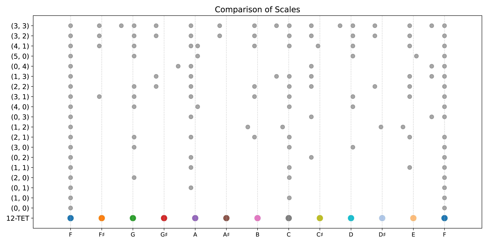
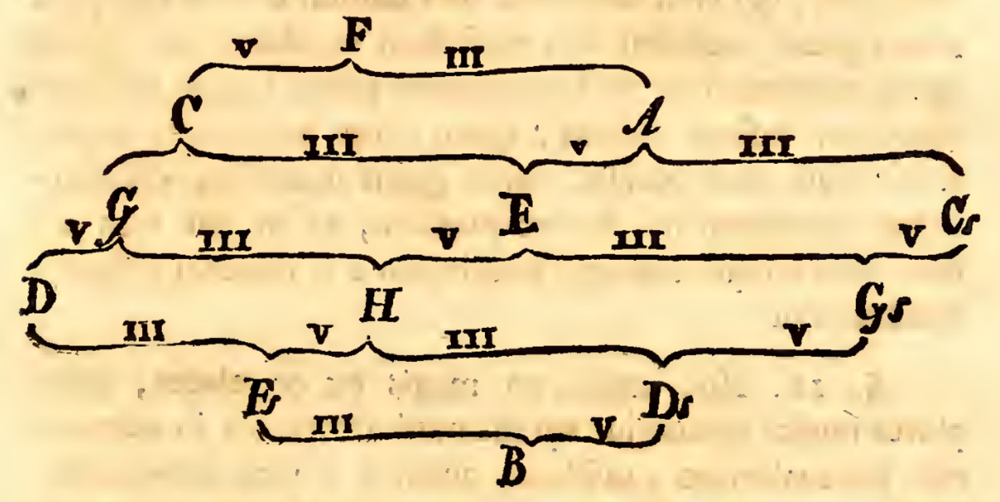

# 被遗忘的数学奇书：欧拉如何用数学解释音乐？《尝试音乐新理论》 (Tentamen novae theoriae musicae) 介绍

[TOC]

### 1. 引言

只要是对数学有兴趣的人，一定都知道这个如雷贯耳的名字——欧拉（Leonhard Euler）。这位上帝公式$e^{i\pi} + 1 = 0$的推导者，被誉为广大数学爱好者称之为神的传奇人物，是公认的有史以来最伟大的数学家之一。他的贡献不仅覆盖了数学的几乎所有领域，还对物理学、工程学、经济学等进行了研究。你几乎能在各个科目中找到以欧拉命名的公式。


> 图：路德维希·凡·欧拉在进行乐理研究（bushi）

然而，鲜有人知道，欧拉还涉足了音乐理论的研究。1739年，欧拉（32岁）撰写了《尝试新音乐理论：基于确凿的和声原理的清晰阐述》（*Tentamen Novae Theoriae Musicae Ex Certissimis Harmoniae Principiis Dilucide Expositae*），试图将音乐理论纳入数学的体系之中。然而，这本书并未得到足够的关注，即便在外网相关资料也寥寥无几，中文世界则几乎是一片空白。幸运的是，仍有部分学术论文对该书进行了研究，[17th Century Math](https://www.17centurymaths.com/contents/eulermusice33.html)的版主——一位独立研究者，还将这本书从拉丁文翻译成了英文，使得普通读者也能一窥这部奇书的内容。拉丁文原版则可以从[这个网站](https://archive.org/details/tentamennovaethe00eule/)下载。本文也许是中文互联网第一篇较全面对该书进行介绍的文章。


音乐与数学的结合由来已久，从毕达哥拉斯发现音程与弦长比例、中国的“三分损益法”，到十二平均律的计算，数学始终为音乐提供理论基础。文艺复兴后，理性主义兴起，数学家与音乐家尝试用数学语言描述音乐。欧拉亦是其中一员，他从古希腊哲学和巴洛克音乐汲取灵感，用数学研究音阶、音程与和声，提出平衡各种律法的新体系，数学化地描述和声与调式，同时也包含了对写作方法的指导。

由于本人水平有限，对音乐和数学都仅停留在普通爱好者的阶段，因此本文只能粗略探讨《尝试音乐新理论》的部分内容，主要还是猎奇，满足一下好奇心。希望本文能够抛砖引玉，吸引更多中文互联网的读者关注这本奇书，挖掘其中的奥妙。

> 如果您想要更好的阅读体验，可以到[这个网页](https://liao-ziqiang.github.io/fyaxm-blog/euler-music/euler-music.html)阅读。走之前记得留个赞和收藏哦~

### 2. 书籍简介

虽然本文仅关注书中几个简单的、有趣的点，但考虑到中文互联网对该书的介绍几乎为零，这里还是对该书的大致结构先做一个介绍。该书目录结构如下（页码按拉丁文原版）：

-------------

- **第1章** 关于声音与听觉，第1页
- **第2章** 关于美感与和声的原则，第26页
- **第3章** 关于音乐的总体研究，第44页
- **第4章** 关于和声音程，第56页
- **第5章** 关于和声音程的连续性，第76页
- **第6章** 关于和声音程的序列，第90页
- **第7章** 关于各种音程的通用名称，第102页
- **第8章** 关于音乐的音阶类型，第113页
- **第9章** 关于自然-半音阶音阶，第132页
- **第10章** 关于其他更复杂的音乐音阶，第151页
- **第11章** 关于自然-半音阶音阶中的和声音程，第165页
- **第12章** 关于自然-半音阶音阶中的调式与体系，第175页
- **第13章** 关于特定调式与体系中的作曲方法，第195页
- **第14章** 关于调式与体系的转换，第252页

-----------

我认为大致可以分为以下几个部分：

1. 第一部分是第1、3章，这两章主要从概念上对声音、音乐等进行了研究，有助于我们了解背景知识；
2. 第二部分是第2、4、7章，这里主要研究音程和谐度这个问题；
3. 第三部分是第5、6章，这里开始从更大的层面研究，从单个和弦扩展到完整的音乐作品；
4. 第四部分是第8、9、10章，这里欧拉使用数学方法生成音阶；
5. 第五部分是第11、12、13、14章，这里欧拉基于前面的理论基础构建一个新的音乐理论体系，并给出了调律、写作等方面的指导意见；

这本书虽然仅有300页，相较于欧拉著作的总量而言可谓微不足道，但其中蕴含的精妙思想也足够普通人潜心研究一年半载。本文将带领读者一同感受，巴洛克时期的欧拉是如何通过数学来阐释音乐理论的。

### 3. 和谐与愉悦的数学原理

本篇内容主要对应原书第二章和第四章的内容。首先，我们明确：欧拉的音乐理论体系关注的维度只有两个——**音高**和**持续时间（节奏）**。虽然音量等因素也会影响音乐效果，并具备一定的规律，但欧拉认为音量具有较强的主观性与随意性，因此未将其纳入体系之中。

这让我想起了B站up主[王乐乐乐游](https://space.bilibili.com/39034282)在[一个视频](https://www.bilibili.com/video/BV1EZ4y1z7gu/)中对“织体”的定义。他提到，所谓织体，就是当不能对音色进行控制的时候，如何仅通过音的组织来勾勒出丰富的音响。如果考虑到巴赫时期羽管键琴对音量控制的极大局限性，我们可以说，是音高和节奏构成了音乐的**骨架**，而音色和音量则是音乐的**血肉**。欧拉的研究目标就是抛开“血肉”，专注于这个音乐的“骨架”。

#### 3.1 和谐：隐藏在音符中的秩序

> 音乐中的所有愉悦都源于对比率的感知，这些比率存在于多个数字之间，因为时间的持续也可以用数字来表示。   ——欧拉

在调性音乐体系中，音乐是否“好听”，从和声层面来看，至少涉及两个核心因素：一是和声本身的**协和程度**，二是和声之间的**连接过渡**。我们暂时仅关注前者。我们知道，不同音程的和谐程度差异显著，例如纯五度较为和谐，而小二度或大七度则较为刺耳。同时，不同和弦的听感也各有特点：例如大三和弦（C-E-G）因其稳定性显得悦耳，而减七和弦（B-D-F-A♭）则张力十足。欧拉认为，和谐的本质是一种隐藏在声音中的“**秩序**”带来的愉悦感。这种秩序并非纯粹的主观感受，也不是特定文化独有现象，而是一种可以用数学描述的、普适的客观规律。

这种理论并非欧拉首创，而是源远流长。读者若具备一定乐理基础，对该理论应有所了解。例如，当两个音的频率比为2:1时（即一个音的频率是另一个音的两倍），它们构成了八度音。这种比例关系非常简单，因此人类对这种声音的秩序感知最为清晰。同样，频率比为3:2（即纯五度）也被认为和谐，因为这也是一种简单的数学关系。总体来说，和谐的声音听起来悦耳，是因为它们的频率之间存在**简单明确的整数比例关系**。比例越简单，听感越和谐；比例越复杂（如趋向无理数），听感则越刺耳。

欧拉进一步指出，和谐和愉悦是相关的，但并不等同。欧拉在书中写到：

> 因此可以看出，让人感到愉悦与引发欢笑并非同一回事，而令人感到悲伤与令人不悦也并非对立。关于其中的道理，我们已在某种程度上解释过了：凡是能让我们感知到秩序的事物，都会让人感到愉悦。而其中，那些秩序更简单、更容易理解的事物，会引发欢乐；而那些秩序较为复杂、不易被察觉的事物，往往让人感到悲伤。

可见，这里欧拉的“愉悦”并不仅指欢乐，而是指“打动人心”、“令人喜欢”、“感到美”。总的来说，和谐的音使人欢乐，不和谐的音使人悲伤，前提是它们都遵循秩序，只是感知秩序的难易程度不同。而毫无秩序的音符则令人生厌，正如欧拉所说：

> 如果我们无法在某些事物中感知到秩序，我们会感到愉悦的程度会减弱；如果完全察觉不到任何秩序，那么我们对所呈现的事物将再也不会感到喜爱。而如果我们不仅无法察觉到秩序，反而发现某些事物完全违背了理性，甚至扰乱了原本可能存在的秩序，那么我们将会对此感到厌恶，甚至几乎会带着痛苦来感知这些事物。

不过，当20世纪调性音乐发展到极致后，勋伯格提出了无调性音乐体系，打破了以上被人们奉为圭臬的规律。但这就不是我们要探讨的了。

当然，欧拉作为数学家不可能止步于概念的探讨，他在书中提出了一种**度量不和谐度的公式**，可以用来衡量任何和弦的和谐程度。具体公式如下：

$$
E(n) = 1 + \sum_{k=1}^r a_k(p_k - 1)
$$

其中：

- $E(n)$ 表示不和谐度，$n$是频率比率的最小公倍数。
- $n$ 被分解为质因数的形式：$n = p_1^{a_1} p_2^{a_2} \dots p_r^{a_r}$，其中 $p_k$ 为不同的质数，$a_k \geq 1$。

我们可以举两个例子：

1. **纯五度**：比率为 $3:2$。
   - 最小公倍数：$\text{LCM}(3, 2) = 6$。
   - 质因数分解：$6 = 2^1 \cdot 3^1$。
   - 计算：$E(6) = 1 + 1 \cdot (2-1) + 1 \cdot (3-1) = 1 + 1 + 2 = 4$。
2. **纯三度**：比率为 $5:4$。
   - 最小公倍数：$\text{LCM}(5, 4) = 20$。
   - 质因数分解：$20 = 2^2 \cdot 5^1$。
   - 计算：$E(20) = 1 + 2 \cdot (2-1) + 1 \cdot (5-1) = 1 + 2 + 4 = 7$。

我们可以使用python实现这个算法，这里就不做展示了，感兴趣的读者可以到[Github仓库](https://github.com/Liao-Ziqiang/fyaxm-blog/tree/main/euler-music/code)中下载查看代码。读者可以自行运行验证。

##### 3.1.1 最小公倍数与不和谐度

我们已经知道，比例越简单，听感越和谐。那么，如何量化这种“简单程度”呢？假设比例已化为最简互质的形式。我们可能会直观地认为，分子分母的和可以反映其复杂度。例如，$1/2$的分子分母和为$1+2=3$，$1/3$的和为$1+3=4$，$9/11$的和为$9+11=20$。显然，比例越复杂，分子分母的和就越高。类似地，也可以用分子分母的乘积替代求和。

然而，欧拉首先计算了另一个更具扩展性和物理意义的指标：**最小公倍数（LCM）**。这种方法的第一个优势在于，它不仅适用于两个音的频率比，还可以轻松扩展到多个音的情况，并且与声音的物理本质紧密相关。下面我给一个不一定正确的猜想：声音本质上是波的振动。假设两个音的频率比为$2:3$，可以类比为两个球在跳动：第一个球每3秒跳一次，第二个球每2秒跳一次（注意周期长度和频率成反比），那么它们会在多久后同时落地？答案是6秒，即它们频率比的最小公倍数。由此可知，**最小公倍数正是描述多个音的波形在多长时间单位内“对齐”的一个量化指标**。为直观理解，我们可以优化欧拉在书中给出的图片：


更复杂的例子如$4:5:6$，对应的最小公倍数为$60$，意味着三个音的波形需要60个单位时间才能完全对齐一次。我猜想原理可能是：音波的相位在此期间大部分时间都是错开的，并且每个区间错开的程度不同，因而这60个单位时间内，声音波形都是不一样的，复合后的波形呈现出复杂、不规律的形状。事实上，对于复合的音波函数，这个60就是它的周期（60与周期成正比，具体值需要通过频率计算）。

##### 3.1.2 质因数分解与不和谐度

那么，是不是通过最小公倍数，我们就可以衡量和弦的不和谐度了呢？答案是不行，欧拉认为，还需要进行质因数分解（是否有对声学较熟悉的读者能够给出物理层面的解释）。一个数的质因数分解反映了其构造的基本成分。质数可以看作是整数的“基本单位”，通过它们的组合能唯一地构造出任意整数。因此，质因数分解能清晰地刻画出一个数的复杂性。此外，欧拉认为，小的质因数更为简单，因而在公式中的求和项 **$\sum_{k=1}^r a_k(p_k - 1)$**中乘以了这个质因数本身，这使得较大的质因数能显著提高得分。这本质上是对最小公倍数的质因数分解进行“加权处理”。总的来说，不和谐度取决于两个方面：质因数的数量，和质因数的大小。

#### 3.2 音程不和谐度的可视化

将各个音程的近似比例代入后，我们可以得到下表：

|            名称            | 近似比率 | 最小公倍数 (n) |        质因数分解         | 次数 E(n) |
| :------------------------: | :------: | :------------: | :-----------------------: | :-------: |
|      纯一度（Unison）      |   1:1    |       1        |             -             |     1     |
|   小二度（Minor Second）   |  16:15   |      240       |  $ 2^4 \cdot 3 \cdot 5 $  |    11     |
|   大二度（Major Second）   |   9:8    |       72       |     $ 2^3 \cdot 3^2 $     |     8     |
|   小三度（Minor Third）    |   6:5    |       30       |   $ 2 \cdot 3 \cdot 5 $   |     8     |
|   大三度（Major Third）    |   5:4    |       20       |      $ 2^2 \cdot 5 $      |     7     |
|  纯四度（Perfect Fourth）  |   4:3    |       12       |      $ 2^2 \cdot 3 $      |     5     |
|     增四度（Tritone）      |  45:32   |      1440      | $ 2^5 \cdot 3^2 \cdot 5 $ |    14     |
| 减五度（Diminished Fifth） |  64:45   |      2880      | $ 2^6 \cdot 3^2 \cdot 5 $ |    15     |
|  纯五度（Perfect Fifth）   |   3:2    |       6        |       $ 2 \cdot 3 $       |     4     |
|   小六度（Minor Sixth）    |   8:5    |       40       |      $ 2^3 \cdot 5 $      |     8     |
|   大六度（Major Sixth）    |   5:3    |       15       |       $ 3 \cdot 5 $       |     7     |
|  小七度（Minor Seventh）   |   9:5    |       45       |      $ 3^2 \cdot 5 $      |     9     |
|  大七度（Major Seventh）   |   15:8   |      120       |  $ 2^3 \cdot 3 \cdot 5 $  |    10     |
|      纯八度（Octave）      |   2:1    |       2        |           $ 2 $           |     2     |

我们可以可视化为一张热图：


可以看到，图中的结果和我们的经验是基本吻合的，单音不和谐度为1，因而最和谐；属音、下属音相对较和谐；小二度、七度等较不和谐。增四度的值比想象中大一些，不过也合情合理，这个音中国古代称之为变徵之音，这个音能打破五音调式，表达悲伤、感叹、忧郁或其他复杂情感。注意这个表仅基于近似比率，仅供参考。

#### 3.3 和声不和谐度的可视化

前面已经提到，欧拉的算法是可以扩展到多个音的和弦的。下面我们就以经典的巴赫《C大调前奏曲》为例进行处理。首先将分解和弦还原为柱式和弦：


接下来使用python代码对和弦进行分析，最终得到下面的图（进行了插值以保证平滑）：


从中我们可以明显看到不和谐度的变化规律，音乐像是呼吸一般跌宕起伏，在一张一弛中不断发展。这使得我们能够从另一个侧面理解传统乐理的底层逻辑。

> 以上两张图的生成代码可以在[Github仓库](https://github.com/Liao-Ziqiang/fyaxm-blog/tree/main/euler-music/code)中获取。

这里读者可能会问，在和声的T-S-D-T的变化中，如果各个和弦都仅使用正三和弦原位，不和谐度都一样，那音乐的发展从何体现？这就是接下来的内容了，即和声连接的不和谐度。

欧拉在第四章对和声理论进行了进一步的研究，这里不再涉及，感兴趣的读者可以自行阅读。此外，欧拉还在第五、六章研究了和声连接的理论，他将对单个和弦的量化方法推广到和弦序列，从而对音乐整体的和谐程度进行分析。这部分也不再涉及。

### 4. 难以协调的音阶——欧拉的新音乐体系

这一节主要对应原书第八章的内容。对音乐只要有基本了的读者应该都知道一些常见的音阶，例如大调音阶、小调音阶、Dorian音阶、半音阶、五声音阶等，它们由不同的方法生成，例如中国的三分损益法，古希腊的五度相生律，后来的纯律、十二平均律等。

最早的生成音阶的方法总是基于简单比例的原则，例如$2:1$是八度，$3:2$是五度等。但随着不断地推演，音阶显示出一个恼人的性质：如果要保证音程的纯粹，则无论怎么推，音阶都无法闭合；如果要保证音阶闭合，则比例总是有一些偏差。例如三分损益法，其原理是通过将弦长按三分之一增减，来推导相邻音的频率关系：将弦长减少三分之一（损三分）得到五度音，再将弦长增加三分之一（益三分）得到四度音。以此反复操作，推导出十二个音。但经过多次迭代后，这十二律无法完全闭合，与现代的十二平均律相比存在微小误差（即“音差”）。同时，如果使用十二平均律，则五度也不再是3:2，而是接近但不相同的一个比例。

这就导致了一个几乎无解的权衡问题，音律学家们只能不断微调音律，使其至少符合听觉的美感。下面，我们来看看欧拉是如何使用数学方法生成音阶的。

#### 4.1 如何切开八度

首先，欧拉确定了一个原则：就是首先通过1:2直接确定八度的位置，其他音符都落在八度内，这是一个基本的前提。欧拉将八度范围内的所有音符通过数学“指数”（Exponens）来表示，公式如下：
$$
2^m A
$$
其中：

- $A$ 是一个奇数，由多个质数 $3$ 和 $5$ 的乘积构成，即$A=3^a5^b$。当然也可以添加7等数字进行尝试。每一个$(a,b)$组合对应一种音阶。
- $2^m$ 是二进制幂，它的作用是将生成的音扩展到其他八度，例如生成一个G，则通过乘以$2^m$将其扩展为所有八度上的G。这里$m$要保证在人耳的听觉范围内

下面是完整的计算过程：

-----------

1. 输入：$a, b$
2. 计算$A = 3^a \times 5^b$
3. 找出 $ A $ 的所有正整数因数 $\{d_1, d_2, \dots, d_n\}$，包括1和它自己，共$n$个，此时第一个数一定是1
4. 对A的所有因数使用$2^m$进行缩放，使其落入$[1, 2)$之间
5. 最终，我们得到$n$个频率的比例，加上八度音$2$，我们的音阶共推出$n+1$个音
7. 进行排序和缩放，使比例重新变为互质的整数

> **注**1：由于担心浮点运算有偏差，因此实际代码实现步骤有所不同
>
> **注**2：理论上可以扩展$A=3^a5^b7^c11^d\cdots$进行音阶生成，保证底数为质数，但实际不使用

-----------

下面以$a = 1$, $b = 1$的情况进行说明。首先，计算出$A = 3^1 \times 5^1 = 3 \times 5 = 15$，分解因式得$\{1, 3, 5, 15\}$。经过计算发现，我们可以找到$m=3$，使得：

| 因数 $d_i$ |      缩放到$[1, 2)$       | 整数缩放因子 | 最终频率 |
| :--------: | :-----------------------: | :----------: | :------: |
|     1      |    $2^0 \times 1 = 1$     |     $8$      |    8     |
|     3      |  $2^{-1} \times 3 = 3/2$  |     $8$      |    12    |
|     5      |  $2^{-2} \times 5 = 5/4$  |     $8$      |    10    |
|     15     | $2^{-3} \times 15 = 15/8$ |     $8$      |    15    |

加上八度音$16$，经过排序、化简步骤，我们最后得到音阶$8:10:12:15:16$，即C-E-G-B-C'。对这些音继续使用$2$的幂进行缩放，则可以得到各个八度上的同名音。这样我们就构造出了一个音阶。这个算法我已经写好了一个python版本，读者可以到[Github仓库](https://github.com/Liao-Ziqiang/fyaxm-blog/tree/main/euler-music/code)下载并验证。

欧拉在书中列出了一个表格，他使用$17$组$a,b$构造了$17$组音阶，如下：

| Mode |  a   |  b   |                   音阶比例                    |            音阶             |
| :--: | :--: | :--: | :-------------------------------------------: | :-------------------------: |
|  I   |  0   |  0   |                     $1:2$                     |             F-F             |
|  II  |  1   |  0   |                    $2:3:4$                    |            F-C-F            |
| III  |  0   |  1   |                    $4:5:8$                    |            F-A-F            |
|  IV  |  2   |  0   |                  $8:9:12:16$                  |           F-G-C-F           |
|  V   |  1   |  1   |                $8:10:12:15:16$                |          F-A-C-E-F          |
|  VI  |  0   |  2   |                 $16:20:25:32$                 |          F-A-C♯-F           |
| VII  |  3   |  0   |               $16:18:24:27:32$                |          F-G-C-D-F          |
| VIII |  2   |  1   |            $32:36:40:45:48:60:64$             |        F-G-A-B-C-E-F        |
|  IX  |  1   |  2   |           $54:75:80:96:100:120:128$           |       F-G♯-A-C-C♯-E-F       |
|  X   |  0   |  3   |              $64:80:100:125:128$              |        F-A-C♯-F\*-F         |
|  XI  |  4   |  0   |             $64:72:81:96:108:128$             |        F-G-A\*-C-D-F        |
| XII  |  3   |  1   |     $128:135:144:160:180:192:216:240:256$     |     F-F♯-G-A-B-C-D-E-F      |
| XIII |  2   |  2   |   $128:144:150:160:180:192:200:225:240:256$   |     F-G-A-B-C-C♯-D♯-E-F     |
| XIV  |  1   |  3   |     $256:300:320:375:384:400:480:500:512$     |   F-G♯-A-B\*-C-C♯-E-F\*-F   |
|  XV  |  0   |  4   |          $512:625:640:800:1000:1024$          |      F-A\*-A-C♯-F\*-F       |
| XVI  |  5   |  0   |        $128:144:162:1922:216:243:256$         |      F-G-A\*-C-D-E\*-F      |
| XVII |  4   |  1   | $256:270:288:320:324:360:384:405:432:480:512$ | F-F♯-G-A-A\*-B-C-C♯\*-D-E-F |

> **注**1：欧拉的原著应该是使用H代表B，B代表B♭。
>
> **注**2：F\*表示和F很接近的一个微分音

所有这些音阶可以可视化为下面的图表，纵坐标形式为$(a,b)$，读者可以轻松看出频率的偏差：



#### 4.2 欧拉的新音乐体系

在第九章，欧拉提出了第18种音阶；在第10章又探讨了更多复杂的音阶。欧拉还给出了一个可行的调音步骤。总的来说，这些生成的音阶有一部分可以和现有的音阶大致吻合，但部分音的频率会有一些极小的偏差，这便是对音阶的修正。但是，哪些修正是好的呢？这里至少有两个规则：首先是美感，音阶应符合人的生理心理规律，使人感到美；第二个则是可操作性，音乐毕竟需要乐器演奏，如果一个音阶难以演奏、难以转调、难以配和声，那么它就仅能存在于理论层面。

> 许多音乐家认为真正的音乐应建立在音程的均等性上，而不是音程比例的简单性。因此，他们毫不犹豫地将八度音程分为12个相等的部分，并根据这一划分确立了习惯使用的12个音。在这一体系中，他们愈加确信所有音程都变得相等，因此任何音乐作品都可以无须更改地在所有所谓的调式中演奏，并能够从原调轻松转调至任何其他调式。在这一观点上，他们并没有错。然而，他们没有意识到，这种方式实际上消除了调式中的和声特性。  ——欧拉

而欧拉的野心就是找到生成一系列音阶方法：它们首先和旧有的音阶大致兼容，保证听感使人愉悦，同时对特殊情况进行修正——通过加入一些微分音使一些和弦更加纯粹、和谐。然后，使用数学方法对这些音节的音程、和声、调律、转调等进行研究，形成一套完整的乐理体系，它完全基于数学。这正是该书第八章之后的内容。这里需要说明，这个乐理体系只是说明哪些写作是不合理的，并解释令人愉悦的音乐的原理，也能为写作提供一些原则的指导，但它并不能通过计算创作出一部音乐作品。同时，这个体系并不明确规定和谐、不和谐的边界，是开放性的。因而，这套理论实际并不打压作曲家的创造性。

> **注**：这里并不是“生成一个音阶”，而是找到“生成一系列音阶的方法”，使该体系包含多种调式，且能够转调。

##### 4.2.1 自然半音-半音音阶 (diatonic-chromatic)

> 我们将第十八种音阶称作“自然半音-半音音阶”，这一命名的依据显然来自其指数形式 **$2^m \cdot 3^3 \cdot 5^2$**，因为它是“自然半音音阶”指数 **$2^m \cdot 3^3 \cdot 5$** 和“半音音阶”指数 **$2^m \cdot 3^2 \cdot 5^2$** 的最小公倍数，因此结合了这两种音阶。由此我们可以推测，这种音阶可能会与当前音乐家普遍接受的音阶相符，因为音乐家也曾将这种音阶视为由古代的自然半音与半音结合而成。  ——欧拉

简单来说，“自然半音-半音音阶”就是通过公式$2^m \cdot 3^3 \cdot 5^2$生成的音阶，使用上面我给出的python程序，可以得到如下结果：

```
计算 A = 3^3 * 5^2 * 7^0 * 11^0 = 675
A 的因数: [1, 3, 5, 9, 15, 25, 27, 45, 75, 135, 225, 675]
生成音阶: 512:540:576:600:640:675:720:768:800:864:900:960:1024
音阶数（不含八度音）: 12
```

我们假定以$A=440 \text{Hz}$为基准音，则可以得到以下表格：

| 音名 | 自然半音-半音音阶频率  (Hz) | 十二平均律频率 (Hz) | 差异（Hz） | 差异（音分） |
| :--: | :-------------------------: | :-----------------: | :--------: | :----------: |
|  A   |          440.0000           |      440.0000       |   0.0000   |    0.0000    |
|  A♯  |          464.0625           |      466.1638       |   2.1013   |    7.8213    |
|  B   |          495.0000           |      493.8833       |  -1.1167   |   -3.9100    |
|  C   |          515.6250           |      523.2511       |   7.6261   |   25.4176    |
|  C♯  |          550.0000           |      554.3653       |   4.3653   |   13.6863    |
|  D   |          580.0781           |      587.3295       |   7.2514   |   21.5076    |
|  D♯  |          618.7500           |      622.2540       |   3.5040   |    9.7763    |
|  E   |          660.0000           |      659.2551       |  -0.7449   |   -1.9550    |
|  F   |          687.5000           |      698.4565       |  10.9565   |   27.3726    |
|  F♯  |          742.5000           |      739.9888       |  -2.5112   |   -5.8650    |
|  G   |          773.4375           |      783.9909       |  10.5534   |   23.4626    |
|  G♯  |          825.0000           |      830.6094       |   5.6094   |   11.7313    |
|  A   |          880.0000           |      880.0000       |   0.0000   |    0.0000    |

| 音名 | 自然半音-半音音阶频率  (Hz) | 纯律频率 (Hz) | 差异（Hz） | 差异（音分） |
| :--: | :-------------------------: | :-----------: | :--------: | :----------: |
|  A   |          440.0000           |   440.0000    |   0.0000   |    0.0000    |
|  B   |          495.0000           |   493.8833    |  -1.1167   |   -3.9100    |
|  C♯  |          550.0000           |   554.3653    |   4.3653   |   13.6863    |
|  D   |          586.6667           |   587.3295    |   0.6629   |    1.9550    |
|  E   |          660.0000           |   659.2551    |  -0.7449   |   -1.9550    |
|  F♯  |          733.3333           |   739.9888    |   6.6555   |   15.6413    |
|  G♯  |          825.0000           |   830.6094    |   5.6094   |   11.7313    |
|  A   |          880.0000           |   880.0000    |   0.0000   |    0.0000    |

上图 (Comparison of scales) 对$a=3,b=2$的情况做了可视化，读者可以回去查看。一般而言，差异超过20音分就能感觉到明显的差异了。欧拉认为，这个音阶在微调一些微分音后可以使用。

> 因此，现行的八度划分方式已经通过实践达到了极致的完善，若想使其更加完美，仅需进行一个修正：将用字母 B 标记的音稍微降低一个微分音（即大半音和小半音的差异）。通过这一修正，就可以得到一种最完美的音阶，最适合用于和声的形成。至于音阶包含的音数，这种音阶将包含与和声需求完全一致的音数，且不多也不少。此外，这些音之间的关系完全符合和声的规律所决定的比例。  ——欧拉
>
> **注**：这里的B指B♭

##### 4.2.2 自然半音-半音音阶的调律



> 因此，具备如此敏锐听觉的人可以按照以下顺序对乐器进行调音。首先根据具体情况确定音 F，并用此音作为基础获得所有标记为同样字母的音高。接着，找到音 F 的纯五度 C 和大三度 A，由此可以通过前述第一条的要求确定其余所有同字母标记的音高。然后，从音 C 得到其纯五度 G 和大三度 E，这个音 E 同时也是音 A 的纯五度；并从音 A 得到其大三度 C♯。接着，从音 G 得到其纯五度 D 和大三度 B，从音 E 得到其大三度 G♯，这个音 G♯ 同时也是音 C♯ 的纯五度。然后，从音 B 得到其纯五度 F♯ 和大三度 D♯，或者也可以从音 G♯ 得到音 D♯。最后，从音 D♯ 的纯五度找到音 B。以这种方法，通过重复八度音程，整个乐器就可以被正确地调节完成。
>
> 整个调音过程可以通过附加的图表更加清晰地理解。由于音 E、B、G♯、F♯ 和 D♯ 都可以通过纯五度和大三度双重方式确定，因此在调节乐器时可以获得不小的助益，因为一旦出现错误，可以立即发现并加以纠正。

以上为欧拉书中原话，应该讲得比较清楚了，这里不再解释。图中最右侧如C, G, D右下角的蛇形符号是“s”，代表升号。

##### 4.2.3 新音乐体系

欧拉试图在剩余的章节构建他的新音乐体系。例如在第十一章中，欧拉对该体系内的协和音、和弦等进行归纳，并按不和谐度进行分类，还结合实际对不同类的和弦进行了使用方面的解释；在第十二章中，欧拉描述了转调，他将转调前后的音阶整合到$2^n \cdot 3^a \cdot 5^b$中，并指出转调在 $2^n \cdot 3^3 \cdot 5^2$ 内为纯净转调，超出但在 $2^n \cdot 3^7 \cdot 5^2$ 内为不纯转调，超出此范围则非法；在第十三章中，欧拉用巨量的篇幅对作曲方法进行了探讨。这些内容过于庞杂，已经超出了我短期内进行学习的能力，这里就不再涉及。这里再次感叹欧拉的伟大！有人云，天才与普通人的差距，比普通人和狗的差距还大，此话诚不欺我！

> 即便单一体系内的变化再丰富，若长时间坚持同一体系，难免会让人感到厌倦而非愉悦。因为音乐不仅需要声音与和声的和谐美感，还要求多样性。因此，听觉对象需要不断变化。  ——欧拉

### 5. 结语

欧拉的《尝试音乐新理论》是一部横跨数学与音乐的奇书，它不仅展现了欧拉作为数学家的深厚功力，也体现了他对艺术的敏锐感知力。欧拉使用简单的初等运算将音乐统一于秩序与美感中，令人叹为观止。

欧拉一生著作颇丰，根据我的了解，前几年，整理了100多年才整理完的欧拉全集出版了，里面应该会包含此书。我相信这本书中还藏着许多智慧的宝藏供世人挖掘。当然，我们不应该认为，有了这本“上古卷轴”就能颠覆、革新现有的体系。乐理与数学的结合早已是一个较成熟的领域，音乐和数学也在欧拉之后有了长足的发展，我们已经能够更精确的描述音乐现象，例如用群论对音阶进行描述。但能够发现古人的思想碎片，感受古人的智慧本就是令人激动且有意义的，不是吗？
