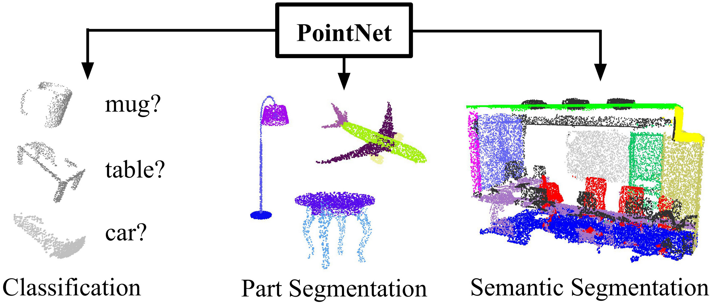
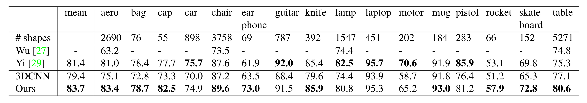
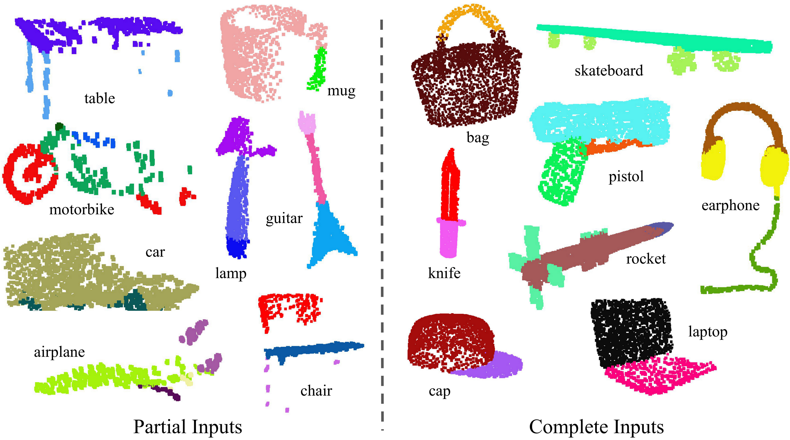
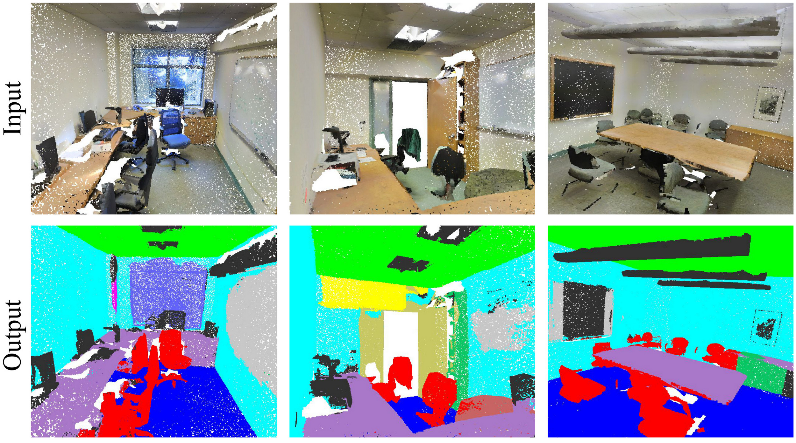
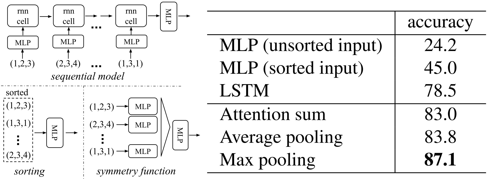
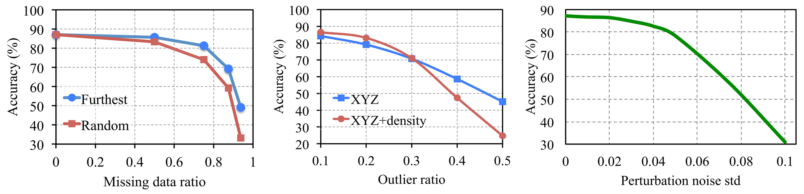
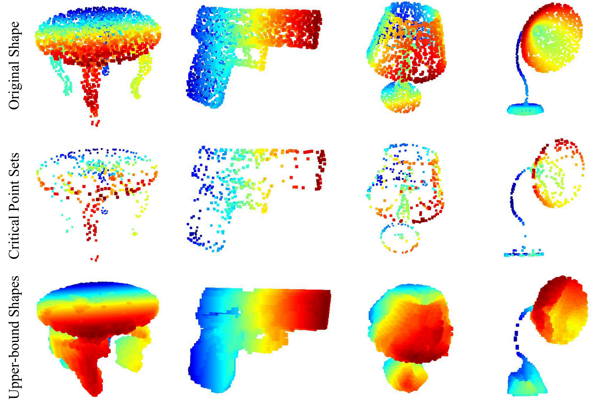

# PointNet: Deep Learning on Point Sets for 3D Classification and Segmentation

[TOC]

### 作者前言

近十年来，深度学习技术在解决各领域问题方面展现出了强大的能力，包括三维数据处理领域。由于二维图像数据在深度信息上的丢失，很多对精度要求高的任务必须使用三维数据，如三维重建、自动驾驶，以及其延伸出的点云对齐、三维实体识别、三维语义分割等，这就为深度学习的研究者们提供了很大的研究空间。本文提出了一种具有通用性的模型结构PointNet，它对点云格式的数据进行处理，能被复用与分类、分割等多个领域。由于点云数据在结构上的特殊性，传统的深度学习网络无法直接应用，因此作者对模型进行了重新设计，理论上证明了PointNet的泛化能力，并通过可视化解释了它的工作机制。该模型在多个3D任务上达到了与或超过现有方法的性能，展示了其在实际应用中的潜力。

本文假设读者对点云和其他常见三维表示的原理、特点、操作有基本的认识，对此不了解的读者可以自行查找相关介绍文章。下面我们就按原文进行逐段的翻译和详解。

-----

### Abstract（摘要）

> Point cloud is an important type of geometric data structure. Due to its irregular format, most researchers transform such data to regular 3D voxel grids or collections of images. This, however, renders data unnecessarily voluminous and causes issues. In this paper, we design a novel type of neural network that directly consumes point clouds, which well respects the permutation invariance of points in the input. Our network, named PointNet, provides a unified architecture for applications ranging from object classification, part segmentation, to scene semantic parsing. Though simple, PointNet is highly efficient and effective. Empirically, it shows strong performance on par or even better than state-of-the-art. Theoretically, we provide analysis towards understanding what the network has learned and why the network is robust with respect to input perturbation and corruption.

**翻译**：① 点云是一种重要的几何数据结构。② 由于其不规则格式，大多数研究者将这类数据转换为规则的3D体素网格或图像集合。然而，这样的转换往往导致数据冗余，造成了一些问题。③ 在本文中，我们设计了一种新的神经网络，能够直接处理点云，同时很好地尊重输入点的置换不变性。④ 我们的网络名为PointNet，提供了一个统一的架构，适用于从物体分类、部件分割到场景语义解析等多个应用。⑤ 尽管结构简单，PointNet却非常高效且有效。实证结果表明，其性能与最先进的技术相当，甚至更优。从理论上，我们提供了对网络学习内容的分析，解释了该网络为何能对输入扰动和损坏保持鲁棒性。

**解释**：

- ①句提到作者首先提到点云是一种“**不规则**”的数据格式，那么，何为“不规则”，“规则”又是什么呢？事实上，这里的规则可以理解为**有固定的网格**。例如体素格式，它有固定的分辨率、固定的网格大小，指定起点坐标后就可以在空间中指定出一个个排列规则的小方格，就像图像的像素一样。这种规则排列又带来另一个性质，即**有序**。显然如果我们使用索引`(i, j, k)`分别访问两个体素网格，那么索引出来的体素一定是相对应的。而点云数据结构没有固定的网格，它可以占用空间中的任意一个连续位置，它也没有顺序，两个点云之间的各个点也没有明确的对应关系，这就是所谓的**不规则**。如果要用更精确的几个词来描述这个性质的话，可以概括为**连续** (continuous)、**稀疏** (sparse)、**无序** (unordered)。
- ②句提到，以往的工作往往会实现将不规则的点云格式转为体素网格格式，甚至采样为图片进行处理，以适应需要规则输入的神经网络。但这就导致了数据的冗余。可以设想一下，点云作为一种稀疏的数据结构仅需要保存物体部分的数据即可，空白部分是不占用空间的，但体素网格却要保存所有位置的信息。再考虑到$N^3$的增长速率，一个$128 \times 128 \times 128$的网格，就需要差不多200万个体素。一个直观的例子是，笔者的一个项目中，点云表示平均3~5MB，而网格则需要500MB，这对于内存、显存、IO来说都形成了巨大的压力。可见，这类转换确实会带来巨大的问题。
- ③句提到，该网络尊重了输入点的**置换不变性**（permutation invariance）。**不变性**（Invariance）是指某个系统、函数或模型在输入发生某种特定变化（例如平移、旋转、缩放或排列）时，其输出保持不变的性质。相信读者如果学习过计算机视觉相关的课程应该不难理解，一个简单的例子是，好的图像识别算法应该具有**平移不变性**（translation invariance），因为物体的类别显然不取决于它出现在图像的什么位置。置换不变性指输出和输入的顺序无关，例如对于函数$f(x)$，如果输入$x = (a,b,c)$，$a,b,c$的位置可任意互换，输出都是一致的，则$f(x)$具有置换不变性。
- ④句提到，PointNet适用于多种下游任务。这说明PointNet架构不仅仅关注点云某方面的特征，而是能够较为全面地提取包括局部结构、全局结构、语义等各个层面的特征。假设提取出来的特征可以用一个特征向量表示的话，那么我们仅需要训练一个新的输出层就可以实现不同的功能。

----------

### 1. Introduction（引言）

> In this paper, we explore deep learning architectures capable of reasoning about 3D geometric data such as point clouds or meshes. Typical convolutional architectures require highly regular input data formats, like those of image grids or 3D voxels, in order to perform weight sharing and other kernel optimizations. Since point clouds or meshes are not in a regular format, most researchers typically transform such data to regular 3D voxel grids or collections of images (e.g., views) before feeding them to a deep net architecture. This data representation transformation, however, renders the resulting data unnecessarily voluminous—while also introducing quantization artifacts that can obscure natural invariances of the data.

**翻译**：在本文中，我们探讨了能够推理3D几何数据（如点云或网格）的深度学习架构。① 典型的卷积架构需要高度规则的输入数据格式，例如图像网格或3D体素，以便进行权重共享和其他核优化。② 然而，由于点云或网格并不是规则格式，大多数研究者通常会在将其输入深度网络架构之前，将这些数据转换为规则的3D体素网格或图像集合（例如视图）。③ 然而，这种数据表示转换使得结果数据不必要地冗长，同时还引入了量化伪影，这可能会掩盖数据的自然不变性。

**解释**：

- ①句已经进行了部分解释，这里再说明下为什么高度规则的输入数据格式才能实现权重共享和其他核优化。**权重共享**（weight sharing）是指在深度学习中，卷积核的参数（权重）在输入的不同位置重复使用，从而减少参数数量。只有规则的输入（比如图片像素网格或3D体素）才能实现权重共享，因为它们的结构在不同的位置是一致的，是不变的，卷积核在任意位置都能匹配到相同大小、相同排列的局部区域，因此可以使用一个固定的规则对不同位置的信息进行处理。而点云的排列是任意的，不存在一个能同时处理任意位置的通用方法，也就无法实现权重共享。
- ②句在摘要部分已经进行了说明。这里解释一下③句中的**量化伪影**（quantization artifacts）。与之类似的一个概念是**混叠**（aliasing），它在4.2小节出现，因而笔者觉得有必要对这两个概念进行说明：
  - **模拟信号**（Analog Signal）转为**数字信号**（Digital Signal）需要进行**离散化**（Discretization）以储存，它一共涉及两个主要步骤：**采样**（Sampling）、**量化**（quantization）。读者可以阅读[这篇文章](https://blog.csdn.net/weixin_45476502/article/details/108753733)了解什么是采样和量化。
  - **混叠**是指在**采样**过程中，采样率低于信号的奈奎斯特频率时，高频信号被错误地映射为低频信号，导致失真。用2D图像举例，就是把细节丰富的物体变为具有固定分辨率的图像，例如从远处拍摄一棵树，就不可能从中分辨出每片树叶，因为一个像素的位置已经对应多片树叶，它们的信息“**混**合重**叠**”在一起了；用体素网格举例也是类似的。
  - **量化伪影**是由于将连续信号的**幅值离散化**为有限的离散值集合（即量化）时，引入的误差或失真。这种伪影通常表现为细节丢失、不平滑的过渡或非自然的特点。例如，在2D图像中，由于色彩空间的限制，天空的渐变色可能分段化，变成一条色带；在三维体素网格中，如果一个网格变换后有30%落入新的网格中，那么它就会被量化为0（不占用），这种由量化导致的误差会导致其边缘形状和原始形状不一样。由于我们原本期待一条垂直的线在旋转30度后仍然是直线，但由于量化伪影，它变成了阶梯状，因而原文说量化伪影“掩盖了数据的自然不变性”。

-------



**Figure 1. Applications of PointNet.** We propose a novel deep net architecture that consumes raw point cloud (set of points) without voxelization or rendering. It is a unified architecture that learns both global and local point features, providing a simple, efficient and effective approach for a number of 3D recognition tasks.
**图1. PointNet的应用。**我们提出了一种新颖的深度网络架构，它能够直接处理原始点云（点集），无需体素化或渲染。 这是一种统一的架构，能够学习全局和局部点特征，为多种3D识别任务提供了一种简单、高效且有效的方法。

-------------------

> For this reason, we focus on a different input representation for 3D geometry using simply point clouds—and name our resulting deep nets PointNets. Point clouds are simple and unified structures that avoid the combinatorial irregularities and complexities of meshes, and thus are easier to learn from. The PointNet, however, still has to respect the fact that a point cloud is just a set of points and therefore invariant to permutations of its members, necessitating certain symmetrizations in the net computation. Further invariances to rigid motions also need to be considered.

**翻译**：因此，我们专注于使用点云作为3D几何的不同输入表示，并将我们所得到的深度网络称为PointNets。点云是简单且统一的结构，避免了网格的组合不规则性和复杂性，因此更容易进行学习。然而，PointNet仍然必须考虑到点云仅仅是一组点，因此对其成员的排列是不变的，这就需要在网络计算中进行某些对称化。此外，还需要考虑对刚体运动的不变性。

**解释**：

- 这段话主要是说明了PointNet的不变性，它对于刚体运动（平移、旋转）是鲁棒的，点云的位置和姿态不会影响网络的输出。同时PointNet还具有置换不变性，点云的顺序也不会影响到输出。PointNet对每个点进行独立的特征提取，然后使用对顺序不敏感的方式对这些独立特征进行聚合形成全局特征，从而保障输出和输入点顺序无关。这部分原理后面再做介绍。

----------------

> Our PointNet is a unified architecture that directly takes point clouds as input and outputs either class labels for the entire input or per point segment/part labels for each point of the input. The basic architecture of our network is surprisingly simple, as in the initial stages, each point is processed identically and independently. In the basic setting, each point is represented by just its three coordinates $(x, y, z)$. Additional dimensions may be added by computing normals and other local or global features.

**翻译**：我们的PointNet是一个统一的架构，能够直接将点云作为输入，并输出整个输入的类别标签或每个点的分段/部分标签。我们的网络基本架构出奇简单，因为在初始阶段，每个点都是独立且相同地处理。在基本设置中，每个点仅由其三个坐标$(x,y,z)$表示。通过计算法线和其他局部或全局特征，可以添加额外的维度。

**解释**：

- 这一段介绍了PointNet的输入输出。输入就是一个点云，每个点由三个坐标分量描述，数据的维度为`(N, 3)`。在Open3D库中，对一个点云对象获取其`points`属性，打印`pcd.points.shape`，输出正是`(N, 3)`，其中N是点的数量。
- 输出则根据任务的不同有不同的形态。总的来说，在全局特征聚合后，网络会输出一个全局特征向量，这一步过后网络会开始分化。对于分类任务，这个向量会通过一系列全连接层直接转化为对类别的预测。对于分割任务，则会将每个点的局部特征和全局特征向量分别拼接，形成新的更长的向量，然后这些向量会分别通过一个多层感知机转化为各个点的类别得分。关于输出的具体维度和使用方法，我们后面再做介绍。

--------------

> Key to our approach is the use of a single symmetric function, max pooling. Effectively, the network learns a set of optimization functions/criteria that select interesting or informative points of the point cloud and encode the reason for their selection. The final fully connected layers of the network aggregate these learned optimal values into the global descriptor for the entire shape as mentioned above (shape classification) or are used to predict per point labels (shape segmentation).

**翻译**：① 我们方法的关键是使用一个单一的对称函数——最大池化。② 实际上，网络学习了一组优化函数/标准，用于选择点云中有趣或信息丰富的点，并编码其选择的原因。③ 网络的最终全连接层将这些学习到的最优值汇总为整个形状的全局描述符，如前所述（形状分类），或者用于预测每个点的标签（形状分割）。

**解释**：

- 前面我们提到PointNet使用了对顺序不敏感的函数对特征进行聚合，①句则介绍了这个函数的名称——**最大池化**（Max Pooling）。在PointNet中，该函数对每个特征维度求最大值，找出在这个特征下特征最显著的点，并使用这个点在该维度上的值作为全局特征在该维度上的值。
  - 举例说明：如果点$p_1$的特征向量为$[2, 3, 1]^T$，点$p_2$的特征向量为$[1, 4, 2]^T$，那么经过最大池化后生成的全局特征向量就是$[2, 4, 2]^T$。
- “使用每个特征维度中最显著的点的值来描述整体特征”是一种通用且有效的思路。其核心思想是：通过最大池化操作，保留每个特征维度中最重要或最突出的信息（即最大值），这些值往往来自关键点，能够反映点云的核心几何结构和语义特征。相比于平均池化，最大池化更关注显著特征，不会被不相关的点（如噪声点或背景点）稀释掉。
- ②句提到“选择点云中有趣或信息丰富的点”，指的就是通过最大池化找到每个特征维度下该特征最显著的点，并获取其特征值。而“网络学习的一组优化函数/标准”指的是局部特征提取的过程，它对单个点的各个特征显著程度进行打分，让最大池化能够判断哪些点的特征最有价值。这个打分的操作就是原文所说的“编码其选择的原因”。
- ③句在上一部分已经提过，指的是特征向量转换到输出结果的过程。

---------

> Our input format is easy to apply rigid or affine transformations to, as each point transforms independently. Thus, we can add a data-dependent spatial transformer network that attempts to canonicalize the data before the PointNet processes them, so as to further improve the results.

**翻译**：① 我们的输入格式便于对每个点独立应用刚性或仿射变换。② 因此，我们可以添加一个数据依赖的空间变换网络，在PointNet处理数据之前尝试对数据进行规范化，以进一步提高结果。

**解释**：

- ①句说明了使用点云的一个优势。由于点云的各个点是独立、无序的，因此只需要对每个点进行相应的变换，就可以使整体进行变换，非常简便。

- 这里读者可能有一个疑问，对每个单元进行相同的变换，不就能实现整体的变换了吗？为什么只说点云能够对每个点独立应用变换呢？事实上，基于规则采样的数据格式，如2D图像、体素网格的确都是无法做到这一点的。我们可以用2D图像举例：

  

  可以看到，原来的2D图像在每个单元（即像素）进行单独变换后，新的单元不再适配原有的网格了。因此，我们就必须通过线性插值等手段（上图使用双线性插值）重新确定每个网格的值，结果如上图中最右边的图像。类似地，体素网格在变换后也需要重新进行规则化，实现较为复杂。相比之下，点云在每个点单独变换后不需要任何后处理，因而最为简便，而且也不会产生任何信息丢失和偏差。

- ②句提到了一个新的**网络空间变换网络T-Net**（Spatial Transformer Network），它可以看做是PointNet的外挂组件，分别在输入点云前、提取局部特征后计算一个变换矩阵，将它们对齐到一个标准化的几何空间。这部分详细内容见后文。原文中“**数据依赖**”是指变换是根据输入数据内容动态学习得到的，而不是一个固定的或预设的变换矩阵。具体来说，T-Net 会根据输入点云或点的特征，利用神经网络自动计算出一个最优的变换矩阵。

---------------

> We provide both a theoretical analysis and an experimental evaluation of our approach. We show that our network can approximate any set function that is continuous. More interestingly, it turns out that our network learns to summarize an input point cloud by a sparse set of key points, which roughly corresponds to the skeleton of objects according to visualization. The theoretical analysis provides an understanding of why our PointNet is highly robust to small perturbations of input points as well as to corruption through point insertion (outliers) or deletion (missing data).

**翻译**：我们提供了对我们方法的理论分析和实验评估。① 我们展示了我们的网络能够逼近任何连续的集合函数。② 更有趣的是，结果表明，网络通过一组稀疏的关键点来总结输入的点云，这些关键点大致对应于物体的骨架，从可视化的角度来看。理论分析帮助我们理解了为什么PointNet对输入点的小扰动以及通过点插入（离群点）或删除（缺失数据）造成的损坏具有很高的鲁棒性。

**解释**：

- ①句如果翻译为数学语言，可以是：假设一个点集表示为 **$S = \{ x_1, x_2, \dots, x_n \}$**，其中 $x_i \in \mathbb{R}^d$ 是一个向量，可以是点的坐标，也可以是特征向量或任意向量。点集函数 $f(S)$ 是一个连续的函数，定义在点集 $S$ 上。PointNet 的目标是学习一个函数 $g(S; \theta)$，使得对于任意的连续点集函数 $f(S)$，存在模型参数 $\theta$，使得$g(S; \theta)$能以任意精度近似 $f(S)$。相关内容读者可以查询**神经网络的“万能逼近定理”**。这部分不理解可以跳过，后面会有更详细的说明。
- ②句在前文已经进行了解释。PointNet通过选择一组稀疏的关键点对整体特征进行表示，避免了不显著点、无关点的影响，具有很强的鲁棒性。作者通过理论推导、实验、可视化等手段进行了说明。

--------------

> On a number of benchmark datasets ranging from shape classification, part segmentation to scene segmentation, we experimentally compare our PointNet with state-of-the-art approaches based upon multi-view and volumetric representations. Under a unified architecture, not only is our PointNet much faster in speed, but it also exhibits strong performance on par or even better than state of the art.

**翻译**：在多个基准数据集上，包括形状分类、部件分割和场景分割，我们对我们的PointNet与基于多视图和体素表示的最先进方法进行了实验比较。在统一架构下，我们的PointNet不仅速度更快，而且在性能上与最先进的方法相当，甚至更优。

---------------

> The key contributions of our work are as follows:
>
> - We design a novel deep net architecture suitable for consuming unordered point sets in 3D;
> - We show how such a net can be trained to perform 3D shape classification, shape part segmentation, and scene semantic parsing tasks;
> - We provide thorough empirical and theoretical analysis on the stability and efficiency of our method;
> - We illustrate the 3D features computed by the selected neurons in the net and develop intuitive explanations for its performance.
>
> The problem of processing unordered sets by neural nets is a very general and fundamental problem – we expect that our ideas can be transferred to other domains as well.

**翻译**：

我们工作的关键贡献如下：

- 我们设计了一种新颖的深度网络架构，适用于处理3D中的无序点集；
- 我们展示了如何训练这样的网络以执行3D形状分类、形状部件分割和场景语义解析任务；
- 我们对方法的稳定性和效率进行了深入的实证和理论分析；
- 我们展示了网络中选定神经元计算的3D特征，并为其性能发展出直观的解释。

处理无序集合的神经网络问题是一个非常普遍和基础的问题——我们期望我们的想法能够转移到其他领域。

**解释**：

- 可以看到，这篇论文不仅十分具有开创新，涉及的内容也是非常全面的。它不仅提出了一种新的点云处理结构，而且论证了它能够泛化到所有无序集合问题中。这篇论文也对PointNet的原理给出了分析，为我们理解这篇论文提供了很大的便利。

-------------

### 2. Related Work（相关工作）

> **Point Cloud Features**: Most existing features for point clouds are handcrafted towards specific tasks. Point features often encode certain statistical properties of points and are designed to be invariant to certain transformations, which are typically classified as intrinsic [2, 24, 3] or extrinsic [20, 19, 14, 10, 5]. They can also be categorized as local features and global features. For a specific task, it is not trivial to find the optimal feature combination.

**翻译**：

**点云特征**：① 大多数现有的点云特征是人工设计的，针对特定任务进行优化。点云特征通常编码了点的某些统计属性，并且设计时考虑了对某些变换的不变性，②这些特征通常被分为内在特征（intrinsic）[2, 24, 3]和外在特征（extrinsic）[20, 19, 14, 10, 5]。③ 它们还可以分为局部特征（Local features）和全局特征（Global features）。对于一个特定任务，找到最佳的特征组合并非易事。

**解释**：

- ①句说明了传统方法的两个局限，一是人工设计，而是专用性。与之对比，PointNet通过神经网络进行自动特征提取，且可以适用于多种下游任务。这一句还说明了特征选择的一些原则，比如对不变性的满足。
- **内在特征** vs **外在特征**：内部特征与物体自身的几何属性相关，是物体的内部属性，如形状、曲率等；外部特征和坐标系相关，例如物体的位置、姿态等，显然这些都是相对于一个外部的参考系而言的。
- **局部特征** vs **全局特征**：局部特征主要是针对单个点及其领域的，比如法向量、局部形状等，更加注重局部的细节；全局特征关注点云整体的一些特性，例如几何中心、形状、大小等。这里需要注意，点云有一个特性，就是全局特征几乎相同的两个点云，局部特征不一定相同（也和局部特征提取的算法是否鲁棒有关），例如，一个相同的正方体，微观上可以使用完全不同的点云分布进行描述。

----------

> **Deep Learning on 3D Data**： 3D data has multiple popular representations, leading to various approaches for learning.
>
> - **Volumetric CNNs**: [28, 17, 18] are the pioneers applying 3D convolutional neural networks on voxelized shapes. However, volumetric representation is constrained by its resolution due to data sparsity and computation cost of 3D convolution. FPNN [13] and Vote3D [26] proposed special methods to deal with the sparsity problem; however, their operations are still on sparse volumes, and it's challenging for them to process very large point clouds
> - **Multiview CNNs**: [23, 18] have tried to render 3D point clouds or shapes into 2D images and then apply 2D conv nets to classify them. With well-engineered image CNNs, this line of methods has achieved dominating performance on shape classification and retrieval tasks [21]. However, it's nontrivial to extend them to scene understanding or other 3D tasks such as point classification and shape completion
> - **Spectral CNNs**: Some latest works  [4, 16] use spectral CNNs on meshes. However, these methods are currently constrained on manifold meshes such as organic objects, and it's not obvious how to extend them to non-isometric shapes such as furniture
> - **Feature-based DNNs**: [6, 8] firstly convert the 3D data into a vector, by extracting traditional shape features and then use a fully connected net to classify the shape. We think they are constrained by the representation power of the features extracted.

**翻译**：

**3D数据的深度学习**：3D 数据有多种流行的表示方式，因此出现了不同的学习方法。

- **体积卷积神经网络**：[28, 17, 18] 是最早将 3D 卷积神经网络应用于体素化形状的先驱。然而，体积表示由于数据稀疏性和 3D 卷积的计算成本而受限于分辨率。FPNN [13] 和 Vote3D [26] 提出了针对稀疏性问题的特殊方法；然而，它们的操作仍然是在稀疏体积上，处理非常大的点云依然具有挑战性。
- **多视图卷积神经网络**：[23, 18] 尝试将 3D 点云或形状渲染为 2D 图像，然后应用 2D 卷积网络进行分类。在经过精心设计的图像卷积网络支持下，这类方法在形状分类和检索任务中取得了优异的性能 [21]。然而，将它们扩展到场景理解或其他 3D 任务（如点分类和形状补全）并非易事。
- **谱卷积神经网络**：一些最新的研究 [4, 16] 在网格上使用谱卷积神经网络。然而，这些方法目前仅限于流形网格（如有机物体），如何将其扩展到非等距形状（如家具）尚不明确。
- **基于特征的深度神经网络**：[6, 8] 首先通过提取传统形状特征将 3D 数据转换为向量，然后使用全连接网络对形状进行分类。我们认为，它们受到提取特征的表示能力的限制。

**解释**：

- 这里对现有的对3D数据进行学习的方法进行了分析，并指出了它们的优缺点。体积卷积神经网络直接继承了2D图像的卷积操作，因而十分直观。但缺点也是显而易见的：体素占用空间过大。
- 多视图卷积神经网络则是将3D问题转化为传统的2D问题进行解决。事实上，传统的2D任务解决的也是现实的3维世界的问题，例如图像识别任务就是从3维现实世界采集单张2维图像进行识别。因而这也是一个比较直观的思路。但缺点也非常致命：它只能解决分类、检索等任务，和3D直接相关的任务无法解决。
- 谱卷积神经网络的“谱”应理解为“频谱”。在图像处理中，当空域操作较为困难时，可以转换到频域进行处理。类似地，虽然3维模型无法直接进行聚集，但Spectral CNNs [4] 通过在图拉普拉斯算子的特征值和特征向量（即频谱域）上定义卷积操作，将卷积扩展到非欧几里得空间。这种方法适用于**流形网格**（Manifold Meshes），即表面连续、无自交叠或裂缝的规则三维网格结构，常用于表示有机物体等流形模型。而**非等距形状**（Non-Isometric Shapes），即无法通过等距变换相互映射的形状，由于其复杂性和缺乏统一的几何结构，导致频谱特征不一致，因此无法直接使用谱卷积神经网络处理。这里读者理解到该方法适用范围窄即可。
- 基于特征的深度神经网络的优势在于结构简单，但缺点也十分明显：对特征设计的要求较高。总的来说，上述四种方法都或多或少地存在问题。

------------

> **Deep Learning on Unordered Sets**: From a data structure point of view, a point cloud is an unordered set of vectors. While most works in deep learning focus on regular input representations like sequences (in speech and language processing), images, and volumes (video or 3D data), not much work has been done in deep learning on point sets.
>
> One recent work from Oriol Vinyals et al. [25] looks into this problem. They use a read-process-write network with an attention mechanism to consume unordered input sets and show that their network has the ability to sort numbers. However, since their work focuses on generic sets and NLP applications, it lacks the consideration of geometry in the sets.

**翻译**：

**针对无序集合的深度学习**：从数据结构的角度来看，点云是一个无序的向量集合。尽管深度学习的许多研究集中在序列（如语音和语言处理）、图像以及体积（如视频或三维数据）等规则输入表示上，但在点集的深度学习研究方面尚未有太多工作。

Oriol Vinyals 等人最近的一项研究 [25] 探讨了这个问题。他们使用了带有注意力机制的读-处理-写网络来处理无序输入集合，并展示了该网络具有对数字进行排序的能力。然而，由于他们的工作主要集中在通用集合和自然语言处理应用上，因此对集合中的几何特性考虑不足。

**解释**：

- 在作者所处的2017年，针对无序集合的研究工作相对较少。就深度学习最热门的两大任务——图像处理和自然语言处理而言，图像具有规则性和有序性，语言则是自相关的序列结构。它们都与无序集合存在较大差异。

--------------

### 3. Problem Statement（问题陈述）

> We design a deep learning framework that directly consumes unordered point sets as inputs. A point cloud is represented as a set of 3D points $\{P_i| \ i=1,...,n\}$, where each point $P_i$ is a vector of its $(x,y,z)$ coordinate plus extra feature channels such as color, normal, etc. For simplicity and clarity, unless otherwise noted, we only use the $(x,y,z)$ coordinate as our point's channels.

**翻译**：

我们设计了一个深度学习框架，能够直接处理无序的点集作为输入。点云表示为一组3D点 $\{P_i| \ i=1,...,n\}$，其中每个点 $P_i$ 是其 $(x,y,z)$ 坐标的向量，外加额外的特征通道，如颜色、法线等。为简明起见，除非另有说明，我们仅使用 $(x,y,z)$ 坐标作为点的通道。

--------

> For the object classification task, the input point cloud is either directly sampled from a shape or pre-segmented from a scene point cloud. Our proposed deep network outputs $k$ scores for all the $k$ candidate classes. For semantic segmentation, the input can be a single object for part region segmentation, or a sub-volume from a 3D scene for object region segmentation. Our model will output $n \times m$ scores for each of the $n$ points and each of the $m$ semantic sub-categories.

**翻译**：

对于物体分类任务，输入的点云可以直接从形状中采样，也可以从场景点云中预先分割而来。我们提出的深度网络为所有 $k$ 个候选类别输出 $k$ 个评分。对于语义分割，输入可以是用于部件区域分割的单个物体，或者是用于物体区域分割的3D场景中的子体积。我们的模型将为每个 $n$ 个点和每个 $m$ 个语义子类别输出 $n \times m$ 个评分。

**解释**：

- 笔者认为，读者如果对深度学习有基本的理解，知道深度学习如何表示并学习分类、语义分割问题，应该都能够理解上面的两段话。“输入可以是用于部件区域分割的单个物体”指输入单个物体的点云，如一个台灯，然后将其分割为各个组件。“用于物体区域分割的3D场景中的子体积”指将整个场景拆分成较小的局部区域，逐块按不同物体进行分割。

-----------

### 4. Deep Learning on Point Sets（针对点集的深度学习）

> The architecture of our network (Sec 4.2) is inspired by the properties of point sets in $\mathbb{R}^n$ (Sec 4.1).

**翻译**：我们网络的架构（第4.2节）受到$\mathbb{R}^n$中点集特性的启发（第4.1节）。

--------------

#### 4.1 Properties of Point Sets in $\mathbb{R}^n$（$\mathbb{R}^n$中点云的属性）

> Our input is a subset of points from an Euclidean space. It has three main properties:
>
> - **Unordered.**  Unlike pixel arrays in images or voxel arrays in volumetric grids, point cloud is a set of points without specific order. In other words, a network that consumes $N$ 3D point sets needs to be invariant to $N!$ permutations of the input set in data feeding order.
> - **Interaction among points.**  The points are from a space with a distance metric. It means that points are not isolated, and neighboring points form a meaningful subset. Therefore, the model needs to be able to capture local structures from nearby points, and the combinatorial interactions among local structures.
> - **Invariance under transformations.**  As a geometric object, the learned representation of the point set should be invariant to certain transformations. For example, rotating and translating points all together should not modify the global point cloud category nor the segmentation of the points.

**翻译**：

我们的输入是欧几里得空间中若干点构成的子集。它具有三个主要特性：

- **无序性**。与图像中的像素阵列或体素网格中的体素阵列不同，点云是一组没有特定顺序的点集。换句话说，一个处理$N$个三维点集的网络，需要在数据输入顺序的$N!$种排列变换下保持不变性。
- **点间相互作用**。这些点来自具有距离度量的空间。这意味着点并非孤立存在，相邻的点会构成有意义的子集。因此，模型需要能够从邻近点中捕捉局部结构，以及局部结构之间的组合相互作用。
- **变换下的不变性**。作为一种几何对象，点集经过学习得到的表示应当在某些变换下保持不变。例如，将所有点一起旋转和平移，不应改变整个点云的类别，也不应改变点的分割情况。 

**解释**：

- 无序性和不变性在前文已经进行了说明。
- 第二点说明了提取局部特征的必要性。语义之所以能够存在，就是因为一个集合或一个序列中的各个元素不是互相孤立的，而是相互联系的。正是这些联系使它们产生了意义。点云虽然是无序的，但不同点之间存在空间上的近邻关系，这为提取局部信息提供了基础。

----------------


**Figure 2. PointNet Architecture**. The classification network takes n points as input, applies input and feature transformations, and then aggregates point features by max pooling. The output is classification scores for k classes. The segmentation network is an extension to the classification net. It concatenates global and local features and outputs per point scores. “mlp” stands for multi-layer perceptron, numbers in bracket are layer sizes. Batchnorm is used for all layers with ReLU. Dropout layers are used for the last mlp in classification net.

**图2. PointNet架构**。分类网络以n个点作为输入，应用输入和特征变换，然后通过最大池化聚合点特征。输出是k个类别的分类得分。分割网络是分类网络的扩展。它连接全局和局部特征，并输出每个点的得分。“mlp”代表多层感知器，括号中的数字是层的大小。所有层都使用批归一化和ReLU激活函数。分类网络最后的mlp使用了Dropout层。

-----------

#### 4.2 PointNet Architecture（PointNet架构）

> Our full network architecture is visualized in Fig 2, where the classification network and the segmentation network share a great portion of structures. Please read the caption of Fig 2 for the pipeline.
>
> Our network has three key modules: the max pooling layer as a symmetric function to aggregate information from all the points, a local and global information combination structure, and two joint alignment networks that align both input points and point features.
>
> We will discuss our reason behind these design choices in separate paragraphs below.

**翻译**：

我们的完整网络架构在图2中进行了可视化，其中分类网络和分割网络共享了很大一部分结构。请参阅图2的说明以了解整个流程。

我们的网络有三个关键模块：作为对称函数的最大池化层，用于从所有点聚合信息；局部和全局信息组合结构；以及两个联合对齐网络，用于对齐输入点和点特征。

我们将在下面的段落中分别讨论这些设计选择背后的原因。

**解释**：

- 正如论文在前文中说的，这个网络的结构“surprisingly simple”，没有用到任何复杂的组件。如果您通过前文已经了解了各个主要步骤的原理，相信这个架构图也不难理解。这里我们对整个网络的流程进行梳理。笔者一般习惯于通过追踪信息流动的方式梳理流程，即通过每一步的输入、输出及其格式将各个部分串联起来。
- A部分可以看做是一个整体。
  - 我们首先有一个点云作为输入，其维度为$(n, 3)$，其中$n$为点的数量，每个点共$x, y, z$三个分量。
  - 在正式送入**MLP（多层感知机）**进行处理前，这个输入会首先送到T-Net中。T-Net输入一个维度为$(n, 3)$的点云，输出一个$3 \times 3$的变换矩阵（对变换矩阵不太熟悉的读者可以参考[这篇文章](https://blog.csdn.net/weixin_46773434/article/details/127417579)，它的功能是对点进行平移、旋转等操作）。
  - 接下来让这个变换矩阵作用于输入的点云，得到对齐后的点云，此时维度仍是$(n, 3)$。
  - 将对齐的点云送入MLP得到输出，输出维度为$(n, 64)$，这个输出可以看作是点云的低级特征，如几何特征。此处MLP标了一个“shared”，即共享权重。这说明对每个点应用的是相同的MLP网络，而不是对每个点单独训练网络，这使得PointNet能够适应任意大小的点云输入。
- B部分也可以看作是一个整体，它的结构和A几乎一样，只是输入变成了$(n, 64)$的特征向量组合。B部分输出维度为$(n, 1024)$的特征向量组合，反映了更多高级特征。这一步还对特征空间进行了一次对齐，仍使用T-Net，这次T-Net输出的是$64 \times 64$的变换矩阵。
- C部分是Max Pooling操作。这一步在前文已经讲解过了。它输出$(1, 1024)$的一个特征向量。
- 其他部分则是具体任务的应用了。D部分是针对分类任务的，它将维度为$(1, 1024)$的特征向量变换为$k$各分类的得分，用于最终的判断。
- G、H、I对应的是语义分割任务。G处首先将维度为$(1, 1024)$的特征向量复制$n$份，形成$(n, 1024)$的矩阵。然后和维度为$(n, 64)$的中间输出进行拼接，形成$(n, 1088)$的大矩阵。此时，每个点对应的特征向量共1088维，它既包含了64维的局部低级特征，又包含了1024维的全局高级特征，我们通过H对这两部分信息进行整合，然后通过I输出每个点云所属的类别。语义分割任务和分类任务的不同在于，分类任务仅关心全局的、整体的特征，而点云语义分割任务需要为每个点分配类别，这不仅要求了解全局上下文（整体语义信息），还需要保留局部特征，以捕捉点与其邻域的细粒度结构信息。因此，语义分割需要拼接局部特征和全局特征来同时考虑局部几何和整体语义。

----------------

> **说明**：到这里我们就已经对PointNet的整体架构和基本原理有了一个基本的、全面的认识，如果您只是想在自己的项目中应用PointNet，希望对其架构、原理进行基本的了解，那么到这里就已经足够了，您可以直接跳到实验或结论部分。但如果您对PointNet的原理感兴趣，或者希望基于PointNet进行学术研究，笔者建议您阅读完剩余的部分，这部分包含理论分析和大量数学计算，建议读者静心阅读、反复思考。

-------------

> **Symmetry Function for Unordered Input**
>
> In order to make a model invariant to input permutation, three strategies exist: 
>
> 1. Sort input into a canonical order.
> 2. Treat the input as a sequence to train an RNN, but augment the training data by all kinds of permutations.
> 3. Use a simple symmetric function to aggregate the information from each point.
>
> Here, a symmetric function takes $n$ vectors as input and outputs a new vector that is invariant to the input order. For example, $+$ and $\times$ operators are symmetric binary functions.

**翻译**：

##### 适用于无序输入的对称函数

为了使模型对输入的排列不变性（permutation invariant）具有鲁棒性，通常有以下三种策略：

1. 将输入排序为一种规范顺序；
2. 将输入当作序列并训练一个 RNN，同时通过各种排列对训练数据进行数据增强；
3. 使用一种简单的对称函数来汇总每个点的信息。

这里，对称函数接受 $n$ 个向量作为输入，并输出一个对输入顺序不敏感的新向量。例如，$+$ 和 $\times$ 运算符是对称的二元函数。

**解释**：

- 这里作者开始对PointNet关键部分的原理进行介绍。为帮助读者对PointNet有一个初步的认识，前文已经涉及到这部分内容，这里我们进行更加深入的解释。
- 首先，作者需要解决“无序输入”的问题，即让PointNet实现**置换不变性**（permutation invariance）。作者列出了三种可能的解决方案。首先是使用一定的规则对点云进行排序，这个方法要求无论如何打乱原来的序列，算法排序后的结果都是保持一致，相关内容作者在下一段进行了论述。
- 第二种则是通过随机打乱顺序进行输入，使得神经网络能够适应任意顺序的输入。
- 第三种则是作者使用的方法。这里再介绍一下什么是对称函数。作者提到了加法和乘法，我们小学四年级就学过，加法和乘法是具有交换律的，例如：$a+b+c=b+c+a=a+c+b$，也就是输出和输入的顺序无关。一个反例是减法，它显然是非对称的。

---

**定义**：

设 $f : (X^n) \to Y$ 是一个函数，其输入是 $n$ 个来自集合 $X$ 的向量，输出是集合 $Y$ 中的一个元素。如果对于任意 $n$ 个相同的输入向量 $v_1, v_2, \dots, v_n \in X$ 和它们的任意排列 $\sigma \in S_n$（其中 $S_n$ 是所有 $n$ 个元素的排列的集合），有：
$$
f(v_1, v_2, \dots, v_n) = f(v_{\sigma(1)}, v_{\sigma(2)}, \dots, v_{\sigma(n)}),
$$

则称 $f$ 是一个**对称函数**。

---------

> While sorting sounds like a simple solution, in high-dimensional space there does not exist an ordering that is stable with respect to point perturbations in the general sense. This can be easily shown by contradiction. If such an ordering strategy exists, it defines a bijection map between a high-dimensional space and a $1d$ real line. It is not hard to see that requiring an ordering to be stable with respect to point perturbations is equivalent to requiring that this map preserves spatial proximity as the dimension reduces, a task that cannot be achieved in the general case. Therefore, sorting does not fully resolve the ordering issue, and it's hard for a network to learn a consistent mapping from input to output as the ordering issue persists. As shown in experiments (Fig 5), we find that applying a MLP directly on the sorted point set performs poorly, though slightly better than directly processing an unsorted input.

**翻译**：

① 尽管排序看起来是一个简单的解决方案，但在高维空间中，并不存在一种对点扰动（point perturbations）稳定的排序方法。② 这可以通过反证法轻松证明。如果这样一种排序策略存在，它将定义一个**高维空间**与 **$1d$ 实数线**之间的**双射映射**。③ 而很容易看出，要求这种排序对点扰动稳定相当于要求这种映射在降维过程中保持空间的接近性（spatial proximity），④ 而在一般情况下这是无法实现的。因此，排序并不能完全解决排列问题，⑤ 并且由于排列问题的存在，神经网络难以学习输入到输出的一致映射。⑥ 正如实验中所示（图 5），我们发现直接对排序后的点集应用 MLP 表现较差，但比直接处理未排序输入稍好。

**解释**：

- 这一段解释了为什么难以找到一种稳定的算法对点云进行排序。这里首先说明什么是“对点扰动稳定”。排序的“稳定性”是指如果点云中的点发生了轻微扰动（例如由于噪声或测量误差），排序的结果也应该只发生轻微变化，而不是完全乱掉，这是我们对一个排序算法最基本的期待。

- ②③④句作者用几句话论述了为什么这样一个排序算法是无法找到的，但作者说得比较模糊。下面笔者尝试用更加精确的语言进行分析。由于笔者水平原因，下面的数学论述可能有错误，而且并没有直接证明该结论，但笔者希望提供一个分析的思路供读者理解。

- 首先，我们说明“定义一个高维空间与 $1d$ 实数线之间的双射映射”是什么意思。

  - 这里我们首先思考这样一个问题：我们大一就学习了各种排序算法，但如何统一描述这些算法呢？这里我指的是所有种类的排序算法，与其实现原理无关。如果使用输入输出来描述排序算法的话，排序算法可以抽象为：输入一个$n$个元素的顺序数组$[x_1, x_2, \dots, x_n]$，输出一个同等长度的数组$[i_{x_1}, i_{x_2}, \dots, i_{x_n}]$，其中$i_{x_n}$代表$x_n$在排序后数组的索引。例如，输入$[8, 10, 5]$，则输出$[2, 3, 1]$（假设从1开始计数）。注意，特定的元素总是对应一个确定的输出，例如，输入$[5, 10, 8]$则输出$[1, 3, 2]$，$5$总是对应$1$，$10$总是对应$3$。

  - 作者所说的“高维空间”指的就是$x_n$的维度。排序算法中输入的顺序数组的元素类型是任意的，对应到点云排序这个具体任务，$x_n$的格式就是一个数组，我们设它为$d$维，对应一个点的坐标或一个点的特征向量。

  - 而排序算法的输出$i_{x_n}$显然一定是一个整数。当然，如果我们扩展下定义，输出实数也是可以的，只要能够按大小排出先后即可。这些数都排列在一个1维的数轴上，这正是原文说的“$1d$ 实数线”。

  - 前面提到，特定的元素总是对应一个确定的输出，不管输入的顺序如何。不管输入是$[x_2, x_1, \dots, x_{n}]$还是$[x_n, x_{n-1}, \dots, x_1]$，$x_1$都一定对应$i_{x_1}$，$x_n$都一定对应$i_{x_n}$，反过来也成立。因此，我们就可以构建这样一个双射映射：

    

    其中，$x_n$代表一个$d$维向量；$i_{x_n}$代表该点的排序序号，是一个实数。这就是原文所说的“定义一个高维空间与 $1d$ 实数线之间的双射映射”。

- 接下来，我将用自己的思路分析③④的结论。

  - 首先，我们给点集做一个定义。设一个高维空间中的点集用矩阵 **$X \in \mathbb{R}^{n \times d}$** 表示，其中$n$是点的数量，$d$代表空间的维度，可以是三维空间，也可以是更高维的特征空间。

  - 从高维空间映射到低维空间也叫**投影**（projection）。这里我们假设投影是线性的，从高维空间 **$\mathbb{R}^d$** 映射到低维空间 **$\mathbb{R}^k$** 的过程可以描述为：
    $$
    Y = XW, \quad W \in \mathbb{R}^{d \times k},
    $$
    其中 $Y \in \mathbb{R}^{n \times k}$ 是投影后的点集，$W$ 是投影矩阵。

- 上面我们对问题进行了更加严谨、清晰地定义。不过由于笔者水平原因，无法继续给出严谨的证明，当然论文作者也没有。不过为了方便读者理解、感受为什么找到这样一个排序算法是困难的，我们可以继续做如下思考：

  - 找到一个排序算法，其实可以转换为这样一个问题，即对于$Y = XW$，是否存在$V \in \mathbb{R}^{k \times d}$，使得$X=YV$，即从高维空间通过$W$映射到低维空间后，不会产生多对一情况，可以通过$V$唯一地映射回去。根据实际情况，这里$k=1, d \gt k$。这里不能使用逆矩阵的概念，而应该使用[**伪逆**](https://zh.wikipedia.org/wiki/%E5%B9%BF%E4%B9%89%E9%80%86%E9%98%B5)（pseudoinverse）。
  - 具体过程太复杂就不写了，但根据伪逆的存在性定理和实际情况，这个$V$应该是不存在的。也就是说，上面说的双射实际构建不出来。
  - 如果我们摆脱线性变换这个条件的话，能否构建出这样的双射呢？结合我浅薄的数学知识，我认为应该是**可以**的，**因为$\mathbb{R}^{n}$空间中点的数量和$\mathbb{R}$中点的数量（即实数的数量）是一样的，且可以为每个点构造一个双射**。证明过程可以参照[这个网页](https://liao-ziqiang.github.io/random-htmls-0310/infty_compare.html)，按照该网页提供的构造方法，我们是可以构造一个函数，将每个点云的坐标或特征向量映射为一个实数，并用它来排序的。
  - 然而，一个好的排序算法除了正确还应该具有稳定性，即点的位置（包括在特征空间中的位置）发生轻微扰动后，映射到实数轴上的位置大致不变。换句话说，高维空间中相近的点在映射后仍然相近，即原文④句所说。至于是否能构造出这样一个算法，或能否通过神经网络学习出这样一个算法，这里就无法继续深入了。作者⑥中的实验也表明进行排序效果并不好。


--------

> The idea to use RNN considers the point set as a sequential signal and hopes that by training the RNN with randomly permuted sequences, the RNN will become invariant to input order. However, in "OrderMatters" [25], the authors have shown that order does matter and cannot be totally omitted. While RNNs have relatively good robustness to input ordering for sequences with small lengths (dozens), it's hard to scale to thousands of input elements, which is the common size for point sets. Empirically, we have also shown that models based on RNN do not perform as well as our proposed method (Fig 5).

**翻译**：

使用 RNN 的方法将点集视为一个序列信号，希望通过用随机排列的序列训练 RNN，使 RNN 对输入顺序具有不变性。然而，在 "OrderMatters" [25] 一文中，作者表明顺序确实重要，且无法完全忽略。尽管 RNN 对于小长度序列（几十个点）的输入顺序具有较好的鲁棒性，但很难扩展到数千个输入元素，这在点集处理中相当常见。从经验上看，我们也表明基于 RNN 的模型性能不如我们提出的方法（图 5）。

**解释**：

- 这一段更多地是从经验入手进行分析。对于点云这种大规模数据，RNN似乎难以展现出对输入顺序的鲁棒性，即使使用数据增强等手段进行训练。

----------

> Our idea is to approximate a general function defined on a point set by applying a symmetric function on transformed elements in the set:
>
> $$
> f(\{x_1, \dots, x_n\}) \approx g(h(x_1), \dots, h(x_n)),
> $$
>
> where $f: 2^{\mathbb{R}^N} \rightarrow \mathbb{R}$, $h: \mathbb{R}^N \rightarrow \mathbb{R}^K$, and $g: \underbrace{\mathbb{R}^K \times \dots \times \mathbb{R}^K}_n \rightarrow \mathbb{R}$ is a symmetric function.
>
> Empirically, our basic module is very simple: we approximate $h$ by a multi-layer perceptron network and $g$ by a composition of a single variable function and a max pooling function. This is found to work well by experiments. Through a collection of $h$, we can learn a number of $f$'s to capture different properties of the set.

**翻译**：

我们的想法是，通过对点集中每个元素的变换应用**对称函数**，来近似一个定义在点集上的广义函数：

$$
f(\{x_1, \dots, x_n\}) \approx g(h(x_1), \dots, h(x_n)),  \quad \quad (1)
$$

其中 $f: 2^{\mathbb{R}^N} \rightarrow \mathbb{R}$，$h: \mathbb{R}^N \rightarrow \mathbb{R}^K$，而 $g: \underbrace{\mathbb{R}^K \times \dots \times \mathbb{R}^K}_n \rightarrow \mathbb{R}$ 是一个对称函数。

从经验上看，我们的基本模块非常简单：我们用一个多层感知机（MLP）网络来近似 $h$，用单变量函数与最大池化（max pooling）函数的组合来近似 $g$。实验表明这种方法效果很好。① 通过一组 $h$ 函数，我们可以学习多个 $f$ 函数，从而捕获点集的不同属性。

**解释**：

- 这一部分使用了数学定义，看起来很难懂，但其实掌握其实际意义后就不难理解了。$f$是一个点集函数，它输入一个集合，集合的每个元素都是一个$N$维的向量，$2^{\mathbb{R}^N}$ 是 $\mathbb{R}^N$ 的幂集，表示所有可能的点集（无序集合）。输出维度为什么是$\mathbb{R}$我不太理解，它应该是对每个维度进行聚合的，输出应该是一个向量？这里只能暂时存疑。
- 而PointNet做的，就是使用一个神经网络去拟合这个理论上的$f$函数，这里作者用$g$表示这个近似的函数。其中$x_i$表示第$i$个点，共$N$维；$h$函数对应网络中的MLP，而$g$函数对应网络中的Max Pooling。
- ①是说，在$g$保持不变的情况下（使用Max Pooling），学习不同的$h$，函数复合后就近似不同的$f$，这就可以用于多个下游任务。由此看来，完成不同下游任务时基本网络的结构相同，但参数不相同，需要重新针对任务进行训练。

----------

> While our key module seems simple, it has interesting properties (see Sec 5.3) and can achieve strong performance (see Sec 5.1) in a few different applications. Due to the simplicity of our module, we are also able to provide theoretical analysis as in Sec 4.3.

**翻译**：

虽然我们的关键模块看起来简单，但它具有一些有趣的特性（见 5.3 节），并且在几种不同的应用中表现出色（见 5.1 节）。由于模块简单，我们还能够提供理论分析（见 4.3 节）。

--------------

> ##### Local and Global Information Aggregation
>
> The output from the above section forms a vector $[f_1, \dots, f_K]$, which is a global signature of the input set. We can easily train a SVM or multi-layer perceptron classifier on the shape global features for classification. However, point segmentation requires a combination of local and global knowledge. We can achieve this in a simple yet highly effective manner. 

**翻译**：

##### 局部和全局信息的聚合

上述部分的输出形成一个向量 $[f_1, \dots, f_K]$，这是输入集的全局特征。我们可以轻松地在形状全局特征上训练支持向量机（SVM）或多层感知器分类器进行分类。然而，点分割需要局部和全局知识的结合。我们可以通过一种简单而高效的方法来实现这一点。

-----------

> Our solution can be seen in Figure 2 (Segmentation Network). After computing the global point cloud feature vector, we feed it back to per-point features by concatenating the global feature with each of the point features. Then we extract new per-point features based on the combined point features—this time the per-point feature is aware of both the local and global information. 

**翻译**：

我们的解决方案可以在图2（分割网络）中看到。在计算全局点云特征向量后，我们通过将全局特征与每个点特征连接，将其反馈到每个点特征中。然后，我们基于组合后的点特征提取新的每点特征——这次每点特征能够意识到局部和全局信息。

---------

> With this modification, our network is able to predict per-point quantities that rely on both local geometry and global semantics. For example, we can accurately predict per-point normals (see figure in supplementary materials), validating that the network is able to summarize information from the point's local neighborhood. In the experimental section, we also show that our model can achieve state-of-the-art performance on shape part segmentation and scene segmentation.

**翻译**：

通过这一修改，我们的网络能够预测依赖于局部几何和全局语义的每点量。例如，我们可以准确预测每点法线（参见补充材料中的图），验证网络能够总结点的局部邻域信息。在实验部分，我们还展示了我们的模型在形状部件分割和场景分割方面能够实现最先进的性能。

**解释**：

- “Local and Global Information Aggregation”部分的内容在PointNet Architecture部分都已经进行了解释说明，这里不再赘述。
- 这里可以补充介绍一下“向量拼接”这种技巧。**向量拼接**（Vector Concatenation）是深度学习中常用的一种操作，用于将多个向量合并为一个更大的向量。其核心思想是将不同来源或不同特征的向量沿某一维度直接连接，从而保留各向量的原始信息并形成一个新的表示。例如，向量$[a, b, c]$和向量$[d, e, f]$可以拼接为$[a,b,c,d,e,f]$。这一操作的基本原理在于，深度学习可以将所有不同形式的信息，如图像信息与文本信息、局部信息与全局信息全部统一编码为向量形式。当信息有了统一的规范，相互的操作就变得容易。此外，拼接本质上是一个无损操作，不会丢失原始数据的细节，因而被广泛使用。

-----------

> ##### Joint Alignment Network
>
> The semantic labeling of a point cloud must be invariant under certain geometric transformations, such as rigid transformations. Therefore, we expect that the learned representation by our point set is invariant to these transformations.
>
> A natural solution is to align all input sets to a canonical space before feature extraction. Jaderberg et al. [9] introduced the idea of a spatial transformer to align 2D images through sampling and interpolation, achieved by a specifically tailored layer implemented on GPU.

**翻译**：

##### 联合对齐网络

点云的语义标注必须在某些几何变换（例如刚体变换）下保持不变。因此，我们期望点集学习到的表示对这些变换具有不变性。

一个自然的解决方案是在特征提取之前将所有输入点集对齐到一个规范空间。Jaderberg 等人 [9] 提出了空间变换器（spatial transformer）的概念，通过采样和插值实现对二维图像的对齐，这一过程通过专门设计的 GPU 层实现。

**解释**：

- 笔者在Abstract部分已经对不变性有了初步的介绍，相信读者可以理解为什么作者会希望PointNet具有不变性的特征。笔者认为，实现不变性可能有以下的途径（不保证正确，参考了[这篇博文](https://blog.csdn.net/qq_43426908/article/details/124062235)）:
  - 网络结构自身的不变性：神经网络可以看作是大量函数的复合，如果这些函数本身满足某种不变性，则网络整体也可能满足该不变性。
  - 训练的不变性：通过数据增强，让网络能够适应变换后的数据，使网络总体上体现出不变性。
  - 预处理：对输入进行预处理，将其规范化、对齐到某个规范空间，直接避免不变性问题。这个空间既可以是2D图像空间、3D空间，也可以是任意维的特征空间。
- 原文提到了 [9] 的工作，该工作是针对二维图像的。它首先会给出变换的参数（如平移、旋转、缩放等），然后会在一个采样网格中对变换后的数据进行规范化，即原文所说的“采样和插值”。这个网络是可微的，能够作为组件挂载到现有网络中一并训练并使用。

-------------

> Our input form of point clouds allows us to achieve this goal in a much simpler way compared with [9]. We do not need to invent any new layers, and no aliasing is introduced as in the image case. We predict an affine transformation matrix by a mini-network (T-net in Fig 2) and directly apply this transformation to the coordinates of the input points. The mini-network itself resembles the larger network and is composed of basic modules for point-independent feature extraction, max pooling, and fully connected layers. More details about the T-net are in the supplementary.

**翻译**：

① 相比 [9]，我们的点云输入形式使得实现这一目标更加简单。② 我们不需要设计新的层结构，③ 也不会像图像处理那样引入混叠现象。④ 我们通过一个小型网络（如图 2 中的 T-net）预测一个**仿射变换矩阵**，直接将此变换应用于输入点的坐标。⑤ 小型网络本身的结构类似于主网络，由用于点独立特征提取的基础模块、最大池化层以及全连接层组成。关于 T-net 的更多细节，请参见补充材料。

**解释**：

- 根据前文对点云性质的介绍（见Introduction部分），点云的变换不需要经历规范化的过程，因而十分简单。
- ③句提到了混叠现象，这个术语和量化伪影相对，笔者在Introduction部分的第一段对这两个名词进行详细解释，读者如果忘记了可以回去复习一下。这里不再重复说明。
- ②句是说，PointNet和T-Net不需要设计一种新的层类型，仅使用MLP、Max Pooling等结构即可。论文中，T-Net是一个和PointNet类似的架构。
- ④句提到**仿射变换矩阵**。仿射变换矩阵是一种数学工具，用于描述**仿射变换**（Affine Transformation）。常见的仿射变换包括平移、缩放、旋转、剪切等操作。通过仿射变换，原有的点可以转换到一个规范化的空间。在传统的数字图像处理中，仿射变换就常用于校正图像，此处将其用于高维点的对齐也就不难理解了。
- ⑤句简单提了T-Net的网络结构，由于不影响主体部分的介绍，所以这部分暂时搁置。

-------------

> This idea can be further extended to the alignment of feature space as well. We can insert another alignment network on point features and predict a feature transformation matrix to align features from different input point clouds. However, the transformation matrix in the feature space has a much higher dimension than the spatial transform matrix, which greatly increases the difficulty of optimization. Therefore, we add a regularization term to our softmax training loss, constraining the feature transformation matrix to be close to an orthogonal matrix:
>
> $$
> L_{reg} = \|I - AA^T\|_F^2,
> $$
>
> where $A$ is the feature alignment matrix predicted by a mini-network. An orthogonal transformation will not lose information in the input, which is desirable. We find that by adding the regularization term, the optimization becomes more stable, and our model achieves better performance.

**翻译**：

这一思想还可以进一步扩展到特征空间的对齐中。我们可以在点特征上插入另一个对齐网络，并预测一个特征变换矩阵，从而对齐来自不同输入点云的特征。然而，特征空间中的变换矩阵维度远高于空间变换矩阵，这极大地增加了优化的难度。因此，我们在 softmax 训练损失中加入一个正则化项，将特征变换矩阵约束为接近正交矩阵：

$$
L_{reg} = \|I - AA^T\|_F^2,
$$

其中 $A$ 是由小型网络预测的特征对齐矩阵。理想情况下，正交变换不会丢失输入信息。我们发现，通过加入这一正则化项，优化过程变得更加稳定，同时模型性能也得到了提升。

**解释**：

- 这一段是说，T-Net不仅可以用于三维空间的对齐，可以用于特征空间的对齐。同时，这段话又提到了损失函数相关的内容。大部分论文并非自顶向下进行介绍，而是按创新点分散介绍，因而造成了一些理解的障碍。这里我们进行一些梳理。

- 先说明为什么希望T-Net输出一个正交矩阵。正交矩阵一个基本的特性是，变换后向量的长度不变、夹角不变。正交矩阵不会引入特征的缩放、扭曲或信息丢失。希望 $A$ 接近正交矩阵，可以确保特征变换时原始输入的几何结构和信息量尽可能被保留。

- 然后说明这个公式是怎么回事。

  - $I$是单位矩阵，$A$是T-Net输出的变换矩阵，作者希望它是一个正交矩阵。
  - 如果$A$是一个正交矩阵，则$A^T = A^{-1}$，因此$I-AA^T$为零矩阵。这里我们用单位矩阵和$AA^T$作差，得到的结果可以衡量$A$和正交矩阵之间的差距。
  - 这里$\left\|  \cdot  \right\|_F^2$是 Frobenius 范数的平方，用于度量矩阵之间的距离。Frobenius 范数是矩阵所有元素平方和的平方根，因此 $\|I - AA^T\|_F^2$ 表明 $AA^T$ 偏离单位矩阵 $I$ 的程度。作者用这个值度量$A$偏移正交矩阵的程度。

- 最后再整体介绍下PointNet使用的Loss函数：
  $$
  L = L_{task} + \lambda L_{reg}
  $$
  Loss可以分为两部分，第一部分是相应任务的损失，例如分类、语义分割等。第二部分就是刚才计算的正则项了，它会乘以一个系数加入到整体的Loss函数中。这里只有一个正则项，是因为根据原文“特征空间中的变换矩阵维度远高于空间变换矩阵”，PointNet仅计算了对特征空间变换的矩阵的Loss，第一个T-Net不产生Loss。

- 我们可以结合源代码理解：

  ```python
  def get_loss(pred, label, end_points, reg_weight=0.001):
      """ pred: B*NUM_CLASSES,
          label: B, """
      loss = tf.nn.sparse_softmax_cross_entropy_with_logits(logits=pred, labels=label)
      classify_loss = tf.reduce_mean(loss)
      tf.summary.scalar('classify loss', classify_loss)
  
      # Enforce the transformation as orthogonal matrix
      transform = end_points['transform'] # B x K x K
      K = transform.get_shape()[1].value
      mat_diff = tf.matmul(transform, tf.transpose(transform, perm=[0,2,1]))
      mat_diff -= tf.constant(np.eye(K), dtype=tf.float32)
      mat_diff_loss = tf.nn.l2_loss(mat_diff) 
      tf.summary.scalar('mat loss', mat_diff_loss)
  
      return classify_loss + mat_diff_loss * reg_weight
  ```

------------

#### 4.3 Theoretical Analysis（理论分析）

> ##### Universal Approximation
>
> We first show the universal approximation ability of our neural network to continuous set functions. By the continuity of set functions, intuitively, a small perturbation to the input point set should not greatly change the function values, such as classification or segmentation scores.
>
> Formally, let $\mathcal{X}=\{S: S\subseteq [0,1]^m \text{ and } |S|=n\}$, and let $f:\mathcal{X}\rightarrow \mathbb{R}$ be a continuous set function on $\mathcal{X}$ with respect to the Hausdorff distance $d_H(\cdot, \cdot)$, i.e., $\forall \epsilon > 0, \exists \delta >0$, for any $S, S'\in\mathcal{X}$, if $d_H(S, S') < \delta$, then $|f(S)-f(S')|< \epsilon$. Our theorem states that $f$ can be arbitrarily approximated by our network given enough neurons at the max pooling layer, i.e., $K$ in Equation (1) is sufficiently large.

**翻译**：

##### 通用近似性

我们首先展示了神经网络对连续集合函数的通用近似能力。由于集合函数的连续性，① 直观上，对输入点集进行微小扰动不应显著改变函数值，例如分类或分割得分。

形式化地，② 令 $\mathcal{X} = \{S: S \subseteq [0,1]^m \text{ and } |S| = n\}$，③ 令 $f: \mathcal{X} \rightarrow \mathbb{R}$ 是定义在 $\mathcal{X}$ 上的一个关于 **Hausdorff 距离** $d_H(\cdot, \cdot)$ 连续的集合函数，④ 即 $\forall \epsilon > 0, \exists \delta > 0$，对于任意的 $S, S' \in \mathcal{X}$，若 $d_H(S, S') < \delta$，则有 $|f(S) - f(S')| < \epsilon$。⑤ 我们的定理表明，当最大池化层中的神经元数量（即公式 (1) 中的 $K$）足够大时，$f$ 可以被网络任意逼近。

**解释**：

- 到这里我们迎来了论文最难懂的部分之一（不含附录）。在这一部分，作者对PointNet的性质进行了数学上的分析，给出了数学语言的描述。作者还对定理进行了证明，这部分见论文附录部分。
- 关于通用近似定理，读者可以参考[维基百科](https://zh.wikipedia.org/wiki/%E9%80%9A%E7%94%A8%E8%BF%91%E4%BC%BC%E5%AE%9A%E7%90%86)的介绍。一句话概括就是：神经网络可以用来近似任意的复杂函数，并且可以达到任意近似精准度。这里作者说明了PointNet的通用近似能力。之所以需要近似一个连续函数，①句进行了说明。为保证函数的鲁棒性，我们需要这个性质。设想一下，如果输入仅发生微小变化，但输出却可能产生跳变，或直接趋于无穷，函数是不可能稳定的。
- 接下来我们拆解这个形式化定义。
  - 首先是$\mathcal{X}$的定义。$[0,1]^m$ 是一个 $m$ 维的单位超立方体，包含所有坐标在 $[0,1]$ 之间的点，可以看做全集。$S \subseteq [0,1]^m$就是说$S$是这个全集的子集，即$S$的所有元素都属于这个超立方体。$|S| = n$是说$S$一共有$n$个元素。
  - ③句有些绕，它其实是定义了点集比较的方法。就好比想要比较实数集上的两个数，我们可以用$x_1 - x_2$；比较二维平面的两个点，我们需要用$\| x_1 - x_2 \|_2$。当定义域换为$\mathcal{X}$时，我们需要给出类似的定义。**Hausdorff 距离 $d_H(S, S')$** 是用来衡量两个点集 $S$ 和 $S'$ 有多接近的一个指标。它表示两个点集之间的“最大最小距离”，简单来说就是：  
    - 对 $S$ 中的每个点，找出它到 $S'$ 的最近点的距离，产生$n$个距离。取这些距离的最大值。  
    - 反过来对 $S'$ 做同样的操作。  
    - 最后取这两个值的较大者作为 Hausdorff 距离。如果 $d_H(S, S')$ 很小，说明 $S$ 和 $S'$ 很接近。
  - ④句读者应该非常熟悉，这就是经典的$\epsilon-\delta$语言，如果读者还记得同济版高数第一章关于极限的定义，对此应该并不陌生。这句话其实是对函数$f: \mathcal{X} \rightarrow \mathbb{R}$连续性的数学描述。如果用一句话说明其原理，即**当输入变化足够小，输出的变化也会相应地足够小**。在同济版高数中，还给出了另一种基于极限的定义。为方便读者对比理解，笔者给出定义在实数集的函数的连续性定义，读者可以感受其逻辑：
    - 对于$f: \mathbb{R} \to \mathbb{R}$，连续性定义为：对任意 $\epsilon > 0$，存在 $\delta > 0$，使得当 $|x - x'| < \delta$ 时，有 $|f(x) - f(x')| < \epsilon$
    - 对于$f: \mathcal{X} \rightarrow \mathbb{R}$，连续性定义为：对任意 $\epsilon > 0$，存在 $\delta > 0$，使得当 $d_H(S, S') < \delta$ 时，有 $|f(S) - f(S')| < \epsilon$
- ⑤句留到定理2再做说明。

-------------

> **Theorem 1**  
> Suppose $f:\mathcal{X}\rightarrow \mathbb{R}$ is a continuous set function with respect to the Hausdorff distance $d_H(\cdot, \cdot)$. For any $\epsilon > 0$, there exists a continuous function $h$ and a symmetric function $g(x_1, \dots, x_n)=\gamma \circ \text{MAX}$, such that for any $S\in\mathcal{X}$,
> $$
> \left|f(S) - \gamma\left(\underset{x_i\in S}{\text{MAX}}\left\{h(x_i)\right\}\right)\right| < \epsilon
> $$
>
> where $x_1, \ldots, x_n$ is the full list of elements in $S$ ordered arbitrarily, $\gamma$ is a continuous function, and $\text{MAX}$ is a vector max operator that takes $n$ vectors as input and returns a new vector of the element-wise maximum.

**翻译**：

**定理 1**  
假设 $f: \mathcal{X} \rightarrow \mathbb{R}$ 是一个关于 Hausdorff 距离 $d_H(\cdot, \cdot)$ 连续的集合函数。对于任意 $\epsilon > 0$，存在一个连续函数 $h$ 和一个对称函数 $g(x_1, \dots, x_n) = \gamma \circ \text{MAX}$，使得对于任意 $S \in \mathcal{X}$，有：
$$
\left|f(S) - \gamma\left(\underset{x_i \in S}{\text{MAX}}\left\{h(x_i)\right\}\right)\right| < \epsilon
$$

其中 $x_1, \ldots, x_n$ 是 $S$ 中元素的任意排列，$\gamma$ 是一个连续函数，$\text{MAX}$ 是一个向量最大值操作符，它以 $n$ 个向量为输入并返回逐元素（element-wise）的最大值。

**解释**：

- 我们分两步进行理解。首先，这个定理定义了一个函数$m: \mathcal{X} \rightarrow \mathbb{R}$，其中$m$能够以任意精度逼近$f$。在实数集上，“能够以任意精度逼近”用数学语言可以描述为：对于任意 $\epsilon > 0$，存在一个函数 $g(x)$，使得对任意 $x$ 都有
  $$
  |f(x) - g(x)| < \epsilon.
  $$

- 定理一的目的在于找到这样一个函数$m$。该函数描述如下：

  - 输入点集是 $S$，它包含了 $n$ 个点，记为 $x_1, x_2, \dots, x_n$。这些点的顺序是随意的——因为集合函数的输出不应该依赖点的排列顺序。
  - **$h(x_i)$** 是一个连续的函数，它将每个点 $x_i$ 单独映射到一个值（或者一个向量）。这一步可以理解为“对每个点提取特征”。在PointNet中，$h$对应MLP部分，MLP一定是一个连续函数。
  - **$\text{MAX}\{h(x_i)\}$** 是对所有点的特征进行逐元素的最大值操作。比如，如果每个 $h(x_i)$ 是一个三维向量，那么 $\text{MAX}$ 操作会对每个维度取最大值，得到一个新的三维向量。$\text{MAX}$函数是对称函数，与输入数据的顺序无关。
  - **$\gamma$** 把 $\text{MAX}$ 的结果进一步映射到最终的输出值。
  - 最终公式的含义是：一定存在连续函数$h$和连续函数$\gamma \circ \text{MAX}$，它们的复合可以以任意精度逼近任意连续集合函数 $f$。

- 这个定理就是要在理论上证明PointNet设计的合理性。具体证明过程在附录部分。

------

> The proof of this theorem can be found in our supplementary material. The key idea is that in the worst case, the network can learn to convert a point cloud into a volumetric representation by partitioning the space into equal-sized voxels. In practice, however, the network learns a much smarter strategy to probe the space, as discussed further in the visualizations of point functions.

**翻译**：

定理的证明见附加材料。关键思想是，在最坏情况下，网络可以通过将空间划分为大小相等的体素（voxels）来学习将点云转换为体积表示。然而在实际中，网络会学习一种更加智能的策略来探索空间，具体内容可以参考点函数的可视化分析部分。

**解释**：

- 这里作者提供了一个直观的思路，说明为什么这样一个函数一定存在，但作者只是一带而过，看样子作者认为这是“显然易得的”😭。这里我们展开来说：
  - 我们先假设输入是$n$个点，组成一个点云，这里不局限于三维空间。
  - 接下来点云将经过$h$函数，这个过程其实将$N$维向量映射到$K$维（$N, K$的含义见公式 (1) ）。
  - 假设我们正好将空间划分为K个体素（K可能非常大），则在最坏情况下，我们可以让$h$输出一个稀疏向量$[0, 0, \dots, 1, \dots, 0]$，这个向量仅第$j$个元素为1，其他都为0，含义为该点出现在第$j$个体素内。这样我们就得到了$n$个稀疏向量。
  - 接下来是$\text{MAX}$函数，这一步我们会检查输出的每一维，即检查每个体素。只要这一维有至少一个$1$出现，这一维最终就会输出$1$，否则输出$0$。这一步可以看作是检查每一个体素是否至少包含了一个点，如果有则体素被标记为占用。
  - 这样一来，PointNet的Global Feature向量其实就是被展平的体素网格了，理论上我们可以直接通过全连接网络将体素信息转为结果，即$\gamma$函数。
- 以上就是作者所说的“最差情况”，可以看到，理论上这种网络也能完成任务。当然，PointNet实际的原理更加高级、灵活，我们前面已经介绍过。

------------

> ##### Bottleneck Dimension and Stability
>
> Theoretically and experimentally, we find that the expressiveness of our network is strongly affected by the dimension of the max pooling layer, i.e., $K$ in Equation (1). Here we provide an analysis, which also reveals properties related to the stability of our model.
>
> We define $\mathbf{u}=\underset{x_i\in S}{\text{MAX}}\{h(x_i)\}$ to be the sub-network of $f$ which maps a point set in $[0,1]^m$ to a $K$-dimensional vector. The following theorem tells us that small corruptions or extra noise points in the input set are not likely to change the output of our network:

**翻译**：

##### 瓶颈维度与稳定性

理论和实验表明，网络的表达能力受到最大池化层维度（即公式 (1) 中的 $K$）的强烈影响。这里我们进行相关的分析，同时揭示模型稳定性的一些性质。

我们定义 $\mathbf{u} = \underset{x_i \in S}{\text{MAX}}\{h(x_i)\}$ 为 $f$ 的子网络，它将一个点集从 $[0,1]^m$ 映射到一个 $K$ 维向量。以下定理表明，输入集合中的微小扰动或额外的噪声点对网络输出的影响很小：

**解释**：

- 第一段说了$K$对网络性能的影响。要想通俗理解，我们可以用人大代表来举例子：
  - 前面已经提到，Max Pooling操作就是在各个特征维度选择最显著的点，这就好比在科技、文艺、社科、体育等各界选人大代表，他们往往来自特定领域，对特定领域十分了解或颇有建树，因而能够代表该领域。这些代表们汇总到一起，他们就能从总体上代表全国。这里的“领域”可以类比为深度学习的“特征”。
  - 如果$K$过小，我们就无法细分那么多领域，例如只选两个代表，那就只能找一个文体跨界和一个文理跨界的代表了，或者只能漏掉一些领域。这两个代表两方面都懂一些，但又都不太懂，代表整体的能力就更弱。因此，作者认为$K$的大小是网络性能的瓶颈。
- 作者接下来说明了网络的稳定性。这里第二段应该不难理解。

-----------

> **Theorem 2**  
> Suppose $\mathbf{u}:\mathcal{X}\rightarrow \mathbb{R}^K$ such that $\mathbf{u}=\underset{x_i\in S}{\text{MAX}}\{h(x_i)\}$ and $f=\gamma \circ \mathbf{u}$. Then:
>
> - (a) $\forall S, \exists~\mathcal{C}_S, \mathcal{N}_S\subseteq \mathcal{X}$, such that $f(T)=f(S)$ if  $\mathcal{C}_S\subseteq T\subseteq \mathcal{N}_S$.
> - (b) $|\mathcal{C}_S| \le K$.
>
> **Explanation of the Theorem**  
>
> - (a) implies that $f(S)$ is unchanged up to input corruption if all points in $\mathcal{C}_S$ are preserved; it is also unchanged with extra noise points up to $\mathcal{N}_S$.  
> - (b) implies that $\mathcal{C}_S$ only contains a bounded number of points, determined by $K$ in Equation (1). In other words, $f(S)$ is determined entirely by a finite subset $\mathcal{C}_S\subseteq S$ of at most $K$ elements. We therefore call $\mathcal{C}_S$ the *critical point set* of $S$ and $K$ the *bottleneck dimension* of $f$.  

**翻译**：

**定理 2**  
假设 $\mathbf{u}: \mathcal{X} \rightarrow \mathbb{R}^K$，并且 $\mathbf{u} = \underset{x_i \in S}{\text{MAX}}\{h(x_i)\}$，$f = \gamma \circ \mathbf{u}$。则：

- (a) $\forall S, \exists~\mathcal{C}_S, \mathcal{N}_S \subseteq \mathcal{X}$，使得当 $\mathcal{C}_S \subseteq T \subseteq \mathcal{N}_S$ 时，$f(T) = f(S)$。  
- (b) $|\mathcal{C}_S| \le K$。

**定理解释**  

- (a) 表明，如果 $\mathcal{C}_S$ 中的所有点在输入中被保留，则即使输入中存在一定的扰动或额外的噪声点，$f(S)$ 仍然保持不变；  
- (b) 表明 $\mathcal{C}_S$ 仅包含有限数量的点，其数量由公式 (1) 中的 $K$ 决定。换句话说，$f(S)$ 完全由 $\mathcal{C}_S \subseteq S$ 的至多 $K$ 个元素决定。因此，我们称 $\mathcal{C}_S$ 为 $S$ 的*关键点集*（critical point set），并称 $K$ 为 $f$ 的*瓶颈维度*（bottleneck dimension）。  

**解释**：

- 这部分仅使用数学语言进行描述，比较难懂。我们同样拆解分析。
- (a) 对于每个点集 $S$，我们定义两个集合 $\mathcal{C}_S$ 和 $\mathcal{N}_S$，它们都是$\mathcal{X}$的子集。
  - **$\mathcal{C}_S$** 是点集 $S$ 的一个子集，叫做“关键点集”。例如，一个$10^5$个点的点云，可以选出$1024$个关键点，它们在各自的特征维度下最为显著。
  - **$\mathcal{N}_S$** 可以理解为把一些没选上的点加入到$\mathcal{C}_S$中构成的集合，极端情况下，$S$中所有点都属于$\mathcal{N}_S$。注意，特征最显著的点都已经放入$\mathcal{C}_S$中了，所以$\mathcal{N}_S$中的点特征不会更加显著，因此在Max Pooling步骤**一定会被筛下**。
  - $T$是我们的输入，它包含关键点集$\mathcal{C}_S$中的所有点，同时包含一些噪声点。
  - 算法的核心在于，$f(\mathcal{C}_S) = f(T) = f(S)$。这说明仅关键点对网络的输出产生了影响，其他噪声点即使输入也不被处理，就好像加权时被乘以了$0$一样。
  - 这里作者将点集划分为关键点和其他点进行分析，非常巧妙。
- (b) 这句是说，关键点集最多包含$K$个点。在最理想情况下，$K$个特征两两正交，每个点至多在一个特征维度下最为显著，此时关键点集包含$K$个点；实际情况下，则可能出现不同维度学习到同一个特征，或一个点同时在不同特征下都最为显著的情况。此时 $|\mathcal{C}_S| \lt K$。因此，网络能够学习到多少个特征，找到多少个特征点，就取决于$K$，因此称 $K$ 为 $f$ 的瓶颈维度。

---------------

> Combined with the continuity of $h$, this explains the robustness of our model with respect to point perturbation, corruption, and extra noise points. The robustness is gained in analogy to the sparsity principle in machine learning models. **Intuitively, our network learns to summarize a shape by a sparse set of key points**. In experiment section we see that the key points form the skeleton of an object.

**翻译**：

结合 $h$ 的连续性，这解释了模型对点扰动、损坏和额外噪声点的鲁棒性。这种鲁棒性类似于机器学习模型中的稀疏性原理。**直观上，网络学习通过稀疏的关键点集合来概括一个形状**。在实验部分，我们看到这些关键点构成了一个物体的骨架。

**解释**：

- 前文提到，$h$的连续性也是函数稳定的一大因素。总的来说，网络的输出只依赖于点集中的少量“关键点”，这些点对网络来说是最重要的，因而网络可以免受噪声点的影响。这些关键点可以看作是点云的骨架，它们能够大致反映点云的特征。这里读者可能产生一个疑问，为什么不使用**平均池化**（Average Pooling）呢？事实上，作者在后文对此进行了实验，平均池化的效果也不错，但不如最大池化。

----------------------

### 5. Experiment（实验）

> Experiments are divided into four parts. First, we show PointNets can be applied to multiple 3D recognition tasks (Sec 5.1). Second, we provide detailed experiments to validate our network design (Sec 5.2). At last we visualize what the network learns (Sec 5.3) and analyze time and space complexity (Sec 5.4).

**翻译**：

实验分为四个部分。首先，我们展示了 PointNet 可以应用于多个 3D 识别任务（第5.1小节）。其次，我们提供了详细的实验来验证我们的网络设计（第5.2小节）。最后，我们可视化网络学习的内容（第5.3小节），并分析时间和空间复杂度（第5.4小节）。

------------

#### 5.1 Applications（应用）

> In this section, we show how our network can be trained to perform 3D object classification, object part segmentation, and semantic scene segmentation. Even though we are working on a brand-new data representation (point sets), we are able to achieve comparable or even better performance on benchmarks for several tasks.

**翻译：**

在本节中，我们展示了如何训练我们的网络以执行3D物体分类、物体部件分割以及语义场景分割。尽管我们采用了一种全新的数据表示形式（点集），但我们在多个任务的基准测试中仍能够实现与现有方法相当甚至更好的性能。

----------

> ##### 3D Object Classification
>
> Our network learns a global point cloud feature that can be used for object classification. We evaluate our model on the ModelNet40 [28] shape classification benchmark. There are 12,311 CAD models from 40 man-made object categories, split into 9,843 for training and 2,468 for testing. While previous methods focus on volumetric and multi-view image representations, we are the first to directly work on raw point clouds.
>
> We uniformly sample 1,024 points on mesh faces according to face area and normalize them into a unit sphere. During training, we augment the point cloud on-the-fly by randomly rotating the object along the up-axis and jittering the position of each point by Gaussian noise with zero mean and a standard deviation of 0.02. 

**翻译：**

##### 3D物体分类

我们的网络学习了一种全局点云特征，可用于物体分类。我们在ModelNet40 [28] 形状分类基准上对模型进行了评估。该数据集包含来自40个人造物体类别的12,311个CAD模型，其中9,843个用于训练，2,468个用于测试。虽然以往的方法主要关注体素化和多视图图像表示，但我们是首个直接处理原始点云数据的方法。

我们在网格面上根据面面积均匀采样1,024个点，并将其归一化到单位球体内。在训练过程中，我们通过随机绕物体的上轴旋转以及对每个点的位置添加均值为零、标准差为0.02的高斯噪声来对点云进行动态增强。

--------------

|       方法       | 输入 | 视图数 | 平均类别准确率 | 总体准确率 |
| :--------------: | :--: | :----: | :------------: | :--------: |
|     SPH [11]     | 网格 |   -    |      68.2      |     -      |
| 3DShapeNets [28] | 体素 |   1    |      77.3      |    84.7    |
|   VoxNet [17]    | 体素 |   12   |      83.0      |    85.9    |
|  Subvolume [18]  | 体素 |   20   |      86.0      |  **89.2**  |
|     LFD [28]     | 图像 |   10   |      75.5      |     -      |
|    MVCNN [23]    | 图像 |   80   |    **90.1**    |     -      |
|  我们的Baseline  |  点  |   -    |      72.6      |    77.4    |
|  我们的PointNet  |  点  |   1    |      86.2      |  **89.2**  |

**Table 1. Classification results on ModelNet40**. Our net achieves state-of-the-art among deep nets on 3D input.

**表格：ModelNet40 的分类结果**。 我们的网络在 3D 输入上达到了深度网络的最先进水平。

-------------

> In Table 1, we compare our model with previous works as well as our baseline using MLP on traditional features extracted from point clouds (point density, D2, shape contour, etc.). Our model achieved state-of-the-art performance among methods based on 3D input (volumetric and point cloud). With only fully connected layers and max pooling, our network gains a strong lead in inference speed and can be easily parallelized on CPUs as well. There is still a small gap between our method and the multi-view-based method (MVCNN [23]), which we think is due to the loss of fine geometry details that can be captured by rendered images.

**翻译：**

在表1中，我们将我们的模型与之前的工作以及基于点云传统特征（点密度、D2、形状轮廓等）的多层感知机（MLP）基线进行了对比。我们的方法在基于3D输入（体素和点云）的方法中取得了最先进的性能。通过仅使用全连接层和最大池化操作，我们的网络在推理速度上具有显著优势，同时可以轻松地在CPU上实现并行化。然而，我们的方法与基于多视图的MVCNN [23] 方法之间仍存在一定的性能差距，我们认为这是由于渲染图像能够捕获的精细几何细节在点云中有所丢失。

--------------------

> ##### 3D Object Part Segmentation
>
> Part segmentation is a challenging fine-grained 3D recognition task. Given a 3D scan or a mesh model, the task is to assign part category labels (e.g., chair leg, cup handle) to each point or face.
>
> We evaluate on the ShapeNet part dataset from [29], which contains 16,881 shapes from 16 categories, annotated with 50 parts in total. Most object categories are labeled with two to five parts. Ground truth annotations are labeled on sampled points on the shapes.

**翻译：**

##### 3D物体部件分割

部件分割是一项具有挑战性的细粒度3D识别任务。给定一个3D扫描或网格模型，任务是为每个点或面分配部件类别标签（例如，椅子腿、杯子把手）。

我们在ShapeNet部件数据集 [29] 上进行了评估，该数据集包含来自16个类别的16,881个形状，总共标注了50个部件。大多数物体类别被标注了两到五个部件。标注的真值是基于形状上采样的点进行的。

---------------

> We formulate part segmentation as a per-point classification problem. The evaluation metric is mean Intersection over Union (mIoU) on points. For each shape `S` of category `C`, to calculate the shape's mIoU: for each part type in category `C`, compute the IoU between ground truth and prediction. If the union of ground truth and prediction points is empty, then count the part IoU as 1. Then, we average IoUs for all part types in category `C` to get the mIoU for that shape. To calculate the mIoU for the category, we take the average of mIoUs for all shapes in that category.

**翻译**：

我们将部件分割任务形式化为逐点分类问题。评估指标是点的平均交并比（mean Intersection over Union，mIoU）。对于类别`C`中的某个形状`S`，计算其mIoU的方法如下：对于类别`C`中的每种部件类型，计算预测结果与真值之间的IoU。如果预测点和真值点的并集为空，则将该部件的IoU计为1。然后，我们对类别`C`中所有部件类型的IoU取平均，得到该形状的mIoU。类别的mIoU是该类别中所有形状mIoU的平均值。

-----------



**Table 2**. **Segmentation results on ShapeNet part dataset.** Metric is mIoU (%) on points. We compare with two traditional methods [27] and [29] and a 3D fully convolutional network baseline proposed by us. Our PointNet method achieved the state-of-the-art in mIoU.

**表2：ShapeNet 部件数据集的分割结果。**指标是点上的 mIoU (%)。我们与两种传统方法 [27] 和 [29] 进行了比较，以及我们提出的一个 3D 完全卷积网络基线。我们的 PointNet 方法在 mIoU 上达到了最先进水平。

---------

> In this section, we compare our segmentation version, PointNet (a modified version of Figure 2, *Segmentation Network*), with two traditional methods [27] and [29] that both take advantage of point-wise geometry features and correspondences between shapes, as well as our own 3D CNN baseline. See supplementary for the detailed modifications and network architecture for the 3D CNN.
>
> In Table 2, we report per-category and mean IoU (%) scores. We observe a 2.3% mean IoU improvement, and our network beats the baseline methods in most categories.

**翻译：**

在本节中，我们将我们的分割版本PointNet（图2中的修改版，分割网络）与两种传统方法 [27] 和 [29] 进行了比较，这些方法都利用了逐点几何特征以及形状之间的对应关系，同时我们还对比了我们自己的3D CNN基线。有关3D CNN的详细修改和网络架构，请参阅补充材料。

在表2中，我们报告了每个类别以及平均IoU（%）的分数。我们观察到平均IoU提升了2.3%，并且我们的网络在大多数类别上都超越了基线方法。

---------------



**Figure 3. Qualitative results for part segmentation.** We visualize the CAD part segmentation results across all 16 object categories. We show both results for partial simulated Kinect scans (left block) and complete ShapeNet CAD models (right block).

**图3. 部件分割的定性结果。** 我们展示了所有16个物体类别的CAD部件分割结果。左侧模块显示部分模拟Kinect扫描的结果，右侧模块显示完整的ShapeNet CAD模型的结果。

----------

> We also perform experiments on simulated Kinect scans to test the robustness of these methods. For every CAD model in the ShapeNet part data set, we use Blensor Kinect Simulator [7] to generate incomplete point clouds from six random viewpoints. We train our PointNet on the complete shapes and partial scans with the same network architecture and training setting. Results show that we lose only 5.3% mean IoU. In **Fig. 3**, we present qualitative results on both complete and partial data. One can see that though partial data is fairly challenging, our predictions are reasonable.

**翻译**：

我们还在模拟的 Kinect 扫描数据上进行了实验，以测试这些方法的鲁棒性。对于 ShapeNet part 数据集中的每个 CAD 模型，我们使用 Blensor Kinect Simulator [7] 从六个随机视角生成不完整的点云。在完整形状和部分扫描数据上，我们使用相同的网络架构和训练设置训练了 PointNet。结果显示，我们的平均 IoU 仅下降了 5.3%。在 图 3 中，我们展示了完整数据和部分数据的定性结果。可以看到，尽管处理部分数据非常具有挑战性，我们的预测仍然是合理的。

-----------

> ##### Semantic Segmentation in Scenes
>
> Our network on part segmentation can be easily extended to semantic scene segmentation, where point labels become semantic object classes instead of object part labels.
>
> We experiment on the Stanford 3D semantic parsing data set [1]. The dataset contains 3D scans from Matterport scanners in 6 areas including 271 rooms. Each point in the scan is annotated with one of the semantic labels from 13 categories (chair, table, floor, wall, etc., plus clutter).

**翻译**：

##### 场景中的语义分割

我们在部件分割上的网络可以轻松扩展到场景的语义分割，其中点的标签从对象部件的标签变为语义对象类别的标签。

我们在 Stanford 3D 语义解析数据集 [1] 上进行了实验。该数据集包含使用 Matterport 扫描仪扫描的 3D 数据，涵盖 6 个区域，包括 271 个房间。扫描中的每个点都被标注为 13 个类别之一（如椅子、桌子、地板、墙壁等，以及杂物）。

-----------

> To prepare training data, we firstly split points by room, and then sample rooms into blocks with an area of 1m by 1m. We train our segmentation version of PointNet to predict per-point class in each block. Each point is represented by a 9-dim vector of XYZ, RGB, and normalized location relative to the room (from 0 to 1). At training time, we randomly sample 4096 points in each block on-the-fly. At test time, we test on all the points. We follow the same protocol as [1] to use a k-fold strategy for train and test.

**翻译**：

为了准备训练数据，我们首先按房间拆分点云，然后将房间划分为面积为 $1m \times 1m$ 的块。我们训练用于分割的 PointNet 网络来预测每个块中每个点的类别。每个点被表示为一个 9 维向量，包含 XYZ 坐标、RGB 值以及相对于房间的归一化位置（从 0 到 1）。在训练时，我们在线随机采样每个块中的 4096 个点。在测试时，我们使用全部点进行测试。我们遵循与 [1] 相同的协议，使用 k 折策略进行训练和测试。

------------


**表 3. 场景中语义分割的结果**。评价指标为 13 个类别（包括结构元素、家具元素以及杂物）的平均 IoU，以及基于点的分类准确率。

**表 4. 场景中 3D 目标检测的结果**。评价指标为 3D 空间中 IoU 阈值为 0.5 时计算的平均精度（average precision）。

----------



**Figure 4. Qualitative results for semantic segmentation**. The top row shows the input point cloud with color. The bottom row displays the output semantic segmentation result (on points) from the same camera viewpoint as the input.

**图4. 语义分割的定性结果**。 上排显示带颜色的输入点云。下排展示与输入相同摄像机视角下的输出语义分割结果（在点上）。

---------

> We compare our method with a baseline using handcrafted point features. The baseline extracts the same 9-dim local features and three additional ones: local point density, local curvature, and normal. We use a standard MLP as the classifier. Results are shown in Table 3, where our PointNet method significantly outperforms the baseline method. In Fig 4, we show qualitative segmentation results. Our network is able to output smooth predictions and is robust to missing points and occlusions.

**翻译**：

我们将我们的方法与基于手工设计点特征的基线方法进行了比较。基线方法提取了同样的 9 维局部特征，以及三个额外特征：局部点密度、局部曲率和法向量。我们使用标准的多层感知机（MLP）作为分类器。结果如 表 3 所示，我们的 PointNet 方法显著优于基线方法。在 图 4 中，我们展示了定性的分割结果。我们的网络能够输出平滑的预测结果，并且对点云缺失和遮挡具有很强的鲁棒性。

--------

> Based on the semantic segmentation output from our network, we further build a 3D object detection system using connected components for object proposals (see supplementary for details). We compare with the previous state-of-the-art method in Table 4. The previous method is based on a sliding shape method (with CRF post-processing) with SVMs trained on local geometric features and global room context features in voxel grids. Our method outperforms it by a large margin on the furniture categories reported.

**翻译**：

基于我们的网络输出的语义分割结果，我们进一步构建了一个使用连通组件生成对象候选区域的 3D 目标检测系统（详细信息参见补充材料）。我们在 表 4 中与之前的最先进方法进行了比较。之前的方法基于滑动形状方法（使用 CRF 后处理），并结合 SVM 对局部几何特征和体素网格中的全局房间上下文特征进行训练。在家具类别的检测上，我们的方法以较大优势超越了之前的方法。

-------

#### 5.2 Architecture Design Analysis（架构设计分析）

> In this section, we validate our design choices by control experiments. We also show the effects of our network's hyperparameters.

**翻译**：

在本节中，我们通过对照实验验证了我们的设计选择。同时，我们还展示了网络超参数的影响。

----------



**Figure 5. Three Approaches to Achieve Order Invariance**. The multilayer perceptron (MLP) applied to points consists of five hidden layers with neuron sizes 64, 64, 64, 128, and 1024, where all points share a single copy of the MLP. The MLP close to the output consists of two layers with sizes 512 and 256.

**图5. 实现顺序不变性的三种方法**。 应用于点的多层感知器（MLP）由五个隐藏层组成，神经元大小为64、64、64、128和1024，所有点共享一个MLP的副本。靠近输出的MLP由两个层组成，大小为512和256。

---------

> ##### Comparison with Alternative Order-invariant Methods
>
> As mentioned in Sec 4.2, there are at least three options for consuming unordered set inputs. We use the ModelNet40 shape classification problem as a test bed for comparisons of those options. The following two control experiments will also use this task.
>
> The baselines (illustrated in Figure 5) we compared with include multi-layer perceptrons on unsorted and sorted points as $n \times 3$ arrays, an RNN model that considers input points as a sequence, and a model based on symmetry functions. The symmetry operations we experimented with include max pooling, average pooling, and an attention-based weighted sum. The attention method is similar to that in [25], where a scalar score is predicted from each point feature, then the score is normalized across points by computing a softmax. The weighted sum is then computed on the normalized scores and the point features. As shown in Figure 5, the max-pooling operation achieves the best performance by a large winning margin, which validates our choice.

**翻译：**

##### 与其他顺序无关方法的比较

如第 4.2 节所述，对于处理无序集合输入，至少有三种可选方法。我们以 ModelNet40 形状分类问题为测试平台，对这些方法进行了比较。以下的两项对照实验也将基于这一任务。

我们比较的基线模型（如图 5 所示）包括：基于无排序和排序点作为 $n \times 3$ 数组输入的多层感知机（MLP）、将输入点视为序列的 RNN 模型，以及基于对称函数的模型。我们实验的对称操作包括最大池化、平均池化和基于注意力的加权求和。注意力方法类似于文献 [25] 中的做法，其中从每个点特征预测出一个标量分数，然后通过计算 softmax 对分数进行归一化。最终通过归一化分数和点特征计算加权求和。如图 5 所示，最大池化操作以较大优势取得了最佳性能，这验证了我们的选择。

--------

|       Transform        | Accuracy |
| :--------------------: | :------: |
|          none          |   87.1   |
|      input (3x3)       |   87.9   |
|    feature (64x64)     |   86.9   |
| feature (64x64) + reg. |   87.4   |
|        **both**        | **89.2** |

**Table 5: Effects of input feature transforms**. Metric is overall classification accuracy on the ModelNet40 test set.

**表5：输入特征变换的效果**。指标为ModelNet40测试集上的整体分类准确率。

----------

> ##### Effectiveness of Input and Feature Transformations
>
> In Table 5, we demonstrate the positive effects of our input and feature transformations (for alignment). It's interesting to see that the most basic architecture already achieves quite reasonable results. Using input transformation gives a $0.8\%$ performance boost. The regularization loss is necessary for the higher dimension transform to work. By combining both transformations and the regularization term, we achieve the best performance.

**翻译**：

##### 输入与特征变换的有效性

在表 5 中，我们展示了输入和特征变换（用于对齐）带来的正面效果。值得注意的是，即使是最基础的架构也已经取得了相当不错的效果。使用输入变换可提升 $0.8\%$ 的性能表现。正则化损失对于高维变换的有效性至关重要。通过结合输入变换、特征变换和正则化项，我们实现了最佳性能。

---------



**Figure 6. PointNet robustness test**. The metric used is the overall classification accuracy on the ModelNet40 test set. **Left:** Point deletion. "Furthest" indicates that the original 1024 points are sampled using farthest point sampling. **Middle:** Point insertion. Outliers are uniformly scattered within the unit sphere. **Right:** Point perturbation. Gaussian noise is independently added to each point.

**图6. PointNet鲁棒性测试**。测试指标为ModelNet40测试集上的整体分类准确率。**左图：**删除点。“Furthest”表示使用最远点采样法从原始1024个点中进行采样。**中图：**插入点。离群点均匀分布在单位球内。**右图：**扰动点。对每个点独立添加高斯噪声。

-------

> ##### Robustness Test
>
> We show our PointNet, while simple and effective, is robust to various kinds of input corruptions. We use the same architecture as in Figure 5's max pooling network. Input points are normalized into a unit sphere. Results are in Figure 6.
>
> As to missing points, when there are $50\%$ points missing, the accuracy only drops by $2.4\%$ and $3.8\%$ with respect to furthest and random input sampling. Our network is also robust to outlier points, if it has seen those during training. We evaluate two models: one trained on points with $(x, y, z)$ coordinates; the other on $(x, y, z)$ plus point density. The network has more than $80\%$ accuracy even when $20\%$ of the points are outliers. Figure 6 (right) shows the network is robust to point perturbations.

**翻译**：

##### 鲁棒性测试

我们证明了 PointNet 模型既简单又高效，同时对多种输入扰动具有鲁棒性。我们使用图 5 中最大池化网络的相同架构。输入点被归一化到单位球体内，结果如图 6 所示。

关于点丢失问题，当 $50\%$ 的点丢失时，使用最远点采样和随机采样的准确率分别仅下降了 $2.4\%$ 和 $3.8\%$。此外，如果网络在训练期间见过异常点（离群点），其对异常点也表现出鲁棒性。我们评估了两种模型：一种基于点的 $(x, y, z)$ 坐标训练，另一种基于 $(x, y, z)$ 坐标加点密度训练。即使有 $20\%$ 的点是异常点，网络的准确率仍然超过 $80\%$。如图 6（右图）所示，网络对点扰动也表现出鲁棒性。

-----

#### 5.3 Visualizing PointNet（可视化 PointNet）

--------------



**Figure 7. Critical points and the upper bound shape**. While the critical points collectively determine the global shape feature for a given shape, any point cloud that lies between the set of critical points and the upper bound shape will yield exactly the same feature. Depth information is color-coded in all figures for better visualization.

**图 7. 关键点与上界形状**。虽然关键点共同决定了给定形状的整体特征，但任何位于关键点集合与上界形状之间的点云都会产生完全相同的特征。所有图中均使用颜色编码来显示深度信息。

---------------

> In Fig. 7, we visualize *critical point sets* $\mathcal{C}_S$ and *upper-bound shapes* $\mathcal{N}_S$ (as discussed in Theorem 2) for some sample shapes $S$. The point sets between the two shapes will give exactly the same global shape feature $f(S)$. 
>
> We can see clearly from Fig. 7 that the *critical point sets* $\mathcal{C}_S$, those contributed to the max pooled feature, summarize the skeleton of the shape. The *upper-bound shapes* $\mathcal{N}_S$ illustrate the largest possible point cloud that gives the same global shape feature $f(S)$ as the input point cloud $S$. $\mathcal{C}_S$ and $\mathcal{N}_S$ reflect the robustness of PointNet, meaning that losing some non-critical points does not change the global shape signature $f(S)$ at all.
>
> The $\mathcal{N}_S$ is constructed by forwarding all the points in an edge-length-2 cube through the network and selecting points $p$ whose point function values $(h_1(p), h_2(p), \cdots, h_K(p))$ are no larger than the global shape descriptor.

**翻译**：

在图 7 中，我们对一些示例形状 $S$ 的关键点集 $\mathcal{C}_S$ 和上界形状 $\mathcal{N}_S$（如定理 2 中讨论）进行了可视化。介于两者之间的点集将产生完全相同的全局形状特征 $f(S)$。

从图 7 中可以清楚地看到，关键点集 $\mathcal{C}_S$（对最大池化特征有贡献的点）总结了形状的骨架结构。而上界形状 $\mathcal{N}_S$ 则展示了能够产生与输入点云 $S$ 相同全局形状特征 $f(S)$ 的最大可能点云。$\mathcal{C}_S$ 和 $\mathcal{N}_S$ 反映了 PointNet 的鲁棒性，这意味着丢失一些非关键点完全不会改变全局形状特征 $f(S)$。

$\mathcal{N}_S$ 是通过将边长为 2 的立方体中的所有点输入网络，并选择那些点函数值 $(h_1(p), h_2(p), \cdots, h_K(p))$ 不大于全局形状描述符的点 $p$ 构建的。

-------

|    Architecture    | \#params | FLOPs/sample |
| :----------------: | :------: | :----------: |
| PointNet (vanilla) |   0.8M   |     148M     |
|      PointNet      |   3.5M   |     440M     |
|     Subvolume      |  16.6M   |    3633M     |
|       MVCNN        |  60.0M   |    62057M    |

**Table 6. Time and space complexity of deep architectures for 3D data classification**. PointNet (vanilla) is the classification PointNet without input and feature transformations. FLOP stands for floating-point operation. The "M" stands for million. Subvolume and MVCNN used pooling on input data from multiple rotations or views, without which they have much inferior performance.

**表6. 深度架构在3D数据分类中的时间和空间复杂度**。PointNet（原始）指的是不进行输入和特征变换的分类PointNet。FLOP代表浮点运算。 "M"代表百万。Subvolume和MVCNN在输入数据上使用来自多个旋转或视角的池化，否则它们的性能会大幅下降。

------

#### 5.4 Time and Space Complexity Analysis（时间和空间复杂度分析）
> Table 6 summarizes space (number of parameters in the network) and time (floating-point operations/sample) complexity of our classification PointNet. We also compare PointNet to a representative set of volumetric and multi-view based architectures in previous works.
>
> While MVCNN [23] and Subvolume (3D CNN) [18] achieve high performance, PointNet is orders more efficient in computational cost (measured in FLOPs/sample: $141 \times$ and $8 \times$ more efficient, respectively). Besides, PointNet is much more space efficient than MVCNN in terms of the number of \#param in the network ($17 \times$ fewer parameters). Moreover, PointNet is much more scalable—its space and time complexity is $O(N)$—*linear* in the number of input points. However, since convolution dominates computing time, the time complexity of the multi-view method grows *squarely* with image resolution, and the volumetric convolution-based method grows *cubically* with the volume size.
>
> Empirically, PointNet is able to process more than one million points per second for point cloud classification (around 1K objects/second) or semantic segmentation (around 2 rooms/second) with a 1080X GPU on TensorFlow, showing great potential for real-time applications.

**翻译**：

表 6 总结了我们分类 PointNet 的空间（网络中参数数量）和时间（每个样本的浮点运算次数，FLOPs）复杂度。我们还将 PointNet 与之前工作中基于体素和多视图的代表性架构进行了对比。

虽然 MVCNN [23] 和 Subvolume (3D CNN) [18] 在性能上表现出色，但 PointNet 在计算成本上高效得多（以每个样本的浮点运算次数衡量，分别高效 $141 \times$ 和 $8 \times$）。此外，PointNet 在网络参数数量（\#param）上也比 MVCNN 更加节省（参数量减少 $17 \times$）。更重要的是，PointNet 的可扩展性更强——其空间和时间复杂度为 $O(N)$，即线性于输入点的数量。然而，由于卷积操作占主导地位，多视图方法的时间复杂度随图像分辨率平方增长，而基于体素卷积的方法的时间复杂度则随体素大小立方增长。

从实验来看，PointNet 在 TensorFlow 平台和 1080X GPU 上可以每秒处理超过 100 万个点云，用于点云分类时可以达到每秒约 1K 个对象，或用于语义分割时每秒约 2 个房间，展现了其在实时应用中的巨大潜力。

----------

### 6. Conclusion（结论）

> In this work, we propose a novel deep neural network **PointNet** that directly consumes point cloud. Our network provides a unified approach to a number of 3D recognition tasks including object classification, part segmentation and semantic segmentation, while obtaining on par or better results than state of the arts on standard benchmarks. We also provide theoretical analysis and visualizations towards understanding of our network.

**翻译**：

在本文中，我们提出了一种新颖的深度神经网络 **PointNet**，该网络可以直接处理点云数据。我们的网络为多个3D识别任务（包括物体分类、部件分割和语义分割）提供了统一的解决方案，并在标准基准测试中取得了与当前最先进方法相当或更优的结果。此外，我们还提供了对网络的理论分析和可视化，以帮助理解其工作原理。
