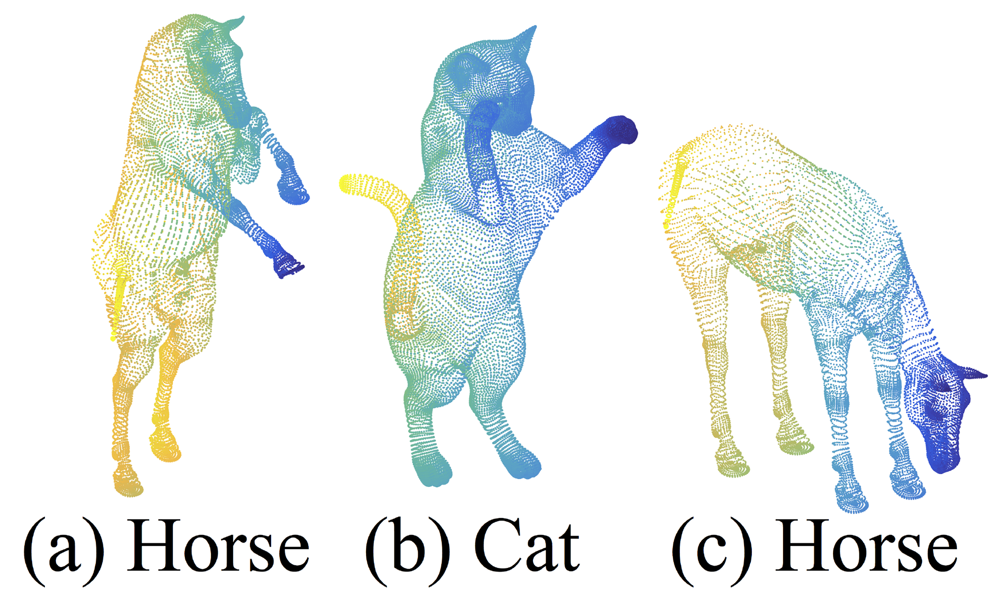

# PointNet++ Paper Deep Dive: Everything You Need to Fully Understand PointNet++

[TOC]

> **Attention**: This article was originally written in Chinese and published on [this website](https://blog.csdn.net/liaoziqiang/article/details/144987352). The English version was translated using GPT-4o. Apologies, as I am not a professional columnist and did not have enough time to personally translate or thoroughly proofread the content. I hope this does not affect your reading experience. If you notice any language or content errors, or have any suggestions for improvement, feel free to contact me at [liaoziqiang7@gmail.com](mailto:liaoziqiang7@gmail.com).

### Foreword by the Author

About a month ago, I wrote an analysis of the [PointNet paper](https://liao-ziqiang.github.io/fyaxm-blog/pointnet/pointnet-Interpretion-en.html). Given the somewhat obscure and academic nature of the content, along with the niche field it covers, I assumed only a few would read it. However, to my surprise, views have reached 1.2K over the past month. Here, I sincerely thank everyone for supporting my humble effort! Today, I'm bringing an analysis of the PointNet++ paper, as promised in the previous article. Compared to PointNet, PointNet++ is a more mature model and is a better choice for our projects. It extends the work of PointNet, so I urge readers to **first read** the [**PointNet paper analysis**](https://liao-ziqiang.github.io/fyaxm-blog/pointnet/pointnet-Interpretion-en.html) to familiarize themselves with the architecture and principles of PointNet before diving into this article. Many repetitive contents will not be reintroduced here. Below, I've posed several questions for self-assessment to see how well you're acquainted with PointNet:

1. What is permutation invariance? What other types of invariance are mentioned in the paper? How does PointNet achieve permutation invariance?
2. What is a critical point set? How should one understand the actual significance of these points? Can you describe Theorem 2 in layman's terms?
3. Briefly describe the main function of T-Net. What are its input and output forms? How does it operate within the entire network?
4. In semantic segmentation tasks, how does PointNet integrate local and global features?
5. Can you, without referring to the original text, trace the data flow path against the network architecture diagram (Figure 2) and describe each step in detail?

If you can smoothly answer the questions above, congratulations, you're ready to proceed with the next part. This article continues from the style of the PointNet paper analysis and is mainly targeted at readers who wish to understand the principles of PointNet, especially those just beginning their research journey. I will not only expand on the concepts and background knowledge designed in the original text but also attempt to provide insights into my thought process while understanding the paper. Moreover, as PointNet++ involves fewer details relative to the PointNet but includes more manually designed steps, I will strive to incorporate code to cover more specifics. Of course, I am just a budding researcher with limited expertise. If you find any errors or have suggestions for improvement, please feel free to share them. I hope this article can aid your learning and research. For a better reading experience, you can visit [this webpage](https://liao-ziqiang.github.io/fyaxm-blog/pointnet/pointnet-pp-Interpretion-en.html). Don't forget to leave a like and bookmark before you leave~ You can also access the original files via the corresponding [GitHub repository](https://github.com/Liao-Ziqiang/fyaxm-blog). Let's officially begin.

---------

### Abstract

① Few prior works study deep learning on point sets. PointNet [20] is a pioneer in this direction. ② However, by design, PointNet does not capture local structures induced by the metric space points live in, limiting its ability to recognize fine-grained patterns and generalizability to complex scenes. ③ In this work, we introduce a hierarchical neural network that applies PointNet **recursively** on a **nested partitioning** of the input point set. By exploiting metric space distances, our network is able to learn local features with increasing contextual scales. ④ With further observation that point sets are usually sampled with varying densities, which results in greatly decreased performance for networks trained on uniform densities, we propose novel set learning layers to adaptively combine features from multiple scales. ⑤ Experiments show that our network called PointNet++ is able to learn deep point set features efficiently and robustly. In particular, results significantly better than state-of-the-art have been obtained on challenging benchmarks of 3D point clouds.

**Explanation**:

- In the [PointNet explanation](https://liao-ziqiang.github.io/fyaxm-blog/pointnet/pointnet-Interpretion-en.html), it is detailed why deep learning methods for point clouds are scarce. In summary, the issue lies in the challenge of adequately resolving the **irregularity** of point clouds.
- Sentence ② highlights that although PointNet architecture has achieved excellent results in point cloud tasks, it has a significant drawback—it does not integrate information across multiple scales. Simply put, you can think of each scale as a pyramid layer, with the pyramid's top representing global information and the bottom representing local information for each point. PointNet is effectively a two-level pyramid. PointNet++ extends this pyramid by adding intermediate layers, enabling the network to extract information simultaneously across multiple levels, such as density, curvature, and local shapes, thereby significantly boosting feature extraction capabilities.
- Sentence ③ explains how this idea is specifically implemented: a hierarchical architecture. It recursively partitions and groups point clouds to incrementally extract features from local to global. Here, two terms need clarification. Firstly, **nested partitioning** is achieved by segmenting the input point cloud into local regions based on metric space distances (like Euclidean distance), with this division being nested, meaning a local region is further subdivided. Secondly, **recursive** can be understood as follows: PointNet++ uses PointNet as its basic module. When PointNet++ extracts global information of a point cloud, it can be seen as invoking the function `pointnet(pc)`. This `pc` is further divided into `N` parts, each invoking `pointnet(pc[i])`, where `pc[i]` is further divided into `M` parts, each calling `pointnet(pc[i][j])` until reaching maximum depth. The top-level `pointnet(pc)` effectively only processes a point cloud with `N` abstracted points. The original feature of a point at any level is, in fact, the global feature of the corresponding region at the next lower level. Such an invocation structure is recursive. Of course, this is a theoretical structure; in practice, point cloud processing is from bottom to top.
- Sentence ④ notes that this dependence on spatial metric division causes results to be sensitive to point cloud density distribution. In sparse regions, small-scale neighborhoods may contain too few points, resulting in the loss of local geometric information. PointNet++ addresses this issue with two strategies: Multi-Scale Grouping, which divides neighborhoods using multiple radii, conducts feature extraction on each, and then integrates them, thereby mitigating the issue of incomplete content in sparse regions; and Multi-Resolution Grouping, which extracts and combines features using multiple resolutions at the same scale. The specific principles and network positions of these strategies will be introduced later, but this explanation provides an overview of the concepts.

---------

### 1. Introduction

We are interested in analyzing geometric point sets which are collections of points in a Euclidean space. A particularly important type of geometric point set is point cloud captured by 3D scanners, e.g., from appropriately equipped autonomous vehicles. As a set, such data has to be invariant to permutations of its members. In addition, the distance metric defines local neighborhoods that may exhibit different properties. For example, the density and other attributes of points may not be uniform across different locations — in 3D scanning, the density variability can come from perspective effects, radial density variations, motion, etc.

**Explanation**:

- Point clouds obtained through 3D scanning and those derived from transforming 3D meshes differ significantly in terms of density non-uniformity. For instance, the point cloud of distant objects is always sparser; surfaces oriented at a certain angle to the sensor also have lower density because, according to the area projection formula $A_{\text{proj}} = |A| \cdot |\cos\theta|$, these surfaces only occupy a small, compressed part when projected onto the sensor, naturally resulting in lower resolution. PointNet does not need to partition based on spatial distance, so it does not specifically address this issue, but PointNet++ must propose a solution.

---------

① Few prior works study deep learning on point sets. PointNet [20] is a pioneering effort that directly processes point sets. The basic idea of PointNet is to learn a spatial encoding of each point and then aggregate all individual point features to a global point cloud signature. By its design, PointNet does not capture local structure induced by the metric. ② However, exploiting local structure has proven to be important for the success of convolutional architectures. A CNN takes data defined on regular grids as the input and is able to progressively capture features at increasingly larger scales along a multi-resolution hierarchy. At lower levels, neurons have smaller receptive fields, whereas at higher levels, they have larger receptive fields. The ability to abstract local patterns along the hierarchy allows better generalizability to unseen cases.

**Explanation**:

- Sentence ① is mostly consistent with the summary, so it won't be repeated. Sentence ② explains the inspiration for this paper, which is CNN. The success of CNN has demonstrated that multi-level abstraction of local patterns provides better generalization ability, partly because it can be considered a higher level of thinking, and partly because the integration of small-scale information can be seen as a "denoising" process. By considering each local area as a whole, the higher layers can focus more on the overall characteristics and core features without being affected by small disturbances and redundant noise. I have provided some introduction on this aspect in [this article](https://blog.csdn.net/liaoziqiang/article/details/143206275).

---------

We introduce a hierarchical neural network, named PointNet++, to process a set of points sampled in a metric space in a hierarchical fashion. The general idea of PointNet++ is simple. We first partition the set of points into overlapping local regions by the distance metric of the underlying space. Similar to CNNs, we extract local features capturing fine geometric structures from small neighborhoods; such local features are further grouped into larger units and processed to produce higher-level features. This process is repeated until we obtain the features of the whole point set.

**Explanation**:

- This section initially introduces the basic idea of space partitioning. First, it is overlapping, which means that each partition shares some overlapping area with adjacent partitions. This makes feature extraction more detailed and ensures stronger continuity. Readers can compare this to the stride in convolution operations, where the region for each convolution operation generally includes overlapping areas. Second, it is based on **Farthest Point Sampling (FPS)**, which is an algorithm for sampling point clouds. Similar algorithms include random sampling. FPS requires a parameter $k$, representing the number of points to be sampled. I will introduce the specific principle later; for now, readers only need to know that it ensures maximum coverage and retains the distribution characteristics of points to the greatest extent possible. After selecting these $k$ points, neighborhoods are constructed with these $k$ points as centers for partitioning. Here's a question to consider: What is the strategy for choosing the radius? If the radius is too small, some points or regions might not be included in any spherical neighborhood, leading to information loss. If the radius is too large, local features might get "diluted," making it impossible to capture the details of the point cloud.

---------

The design of PointNet++ needs to tackle two issues: how to generate the partitioning of the point set and how to abstract sets of points or local features through a local feature learner. ① These two issues are interconnected because the partitioning must result in common structures across partitions so that the weights of local feature learners can be shared, similar to the convolutional setting. ② We choose PointNet as our local feature learner. As demonstrated in the original work, PointNet is an effective architecture for processing unordered sets of points for semantic feature extraction. Moreover, this architecture is robust to input data corruption. As a fundamental building block, PointNet abstracts sets of local points or features into higher-level representations. From this perspective, PointNet++ applies PointNet recursively on a nested partitioning of the input set.

**Explanation**:

- Regarding the "weight sharing" part, readers familiar with CNN concepts should understand this. It is important to note that parameter sharing only occurs within the same level, analogous to CNNs. Different levels correspond to different scales of features, requiring different networks for extraction, meaning the specific parameters are different. In fact, although each layer uses the PointNet network, the network's hyperparameters, such as network size, vary. This is understandable, as aside from the last layer which processes the three-dimensional space, the remaining parts process the feature space, and the feature dimensions of each layer are set differently, hence the network sizes also differ naturally.
- For point ②, we can recall why PointNet is well-suited for handling unordered point sets and is robust to input data corruption. This corresponds to Theorem 1 and Theorem 2 from Section 4.3 of PointNet. If the reader has forgotten, they can return [here](https://liao-ziqiang.github.io/fyaxm-blog/pointnet/pointnet-Interpretion-en.html) for a review. In brief, PointNet uses symmetric functions and the output depends only on a critical set of points.

---------

One issue that still remains is how to generate overlapping partitioning of a point set. Each partition is defined as a neighborhood ball in the underlying Euclidean space, whose parameters include centroid location and scale. To evenly cover the whole set, the centroids are selected among input point set by a farthest point sampling (FPS) algorithm. Compared with volumetric CNNs that scan the space with fixed strides, our local receptive fields are dependent on both the input data and the metric, and thus more efficient and effective.

**Explanation**:

- The PointNet paper already mentioned that point clouds are a type of unnormalized data format. We can refer to CNN and divide the point cloud into fixed-size grids for processing. However, the authors chose the FPS sampling algorithm, which makes the distribution of sample points not reliant on a fixed scale but determined by the distribution of the point cloud itself. This can maximize the use of a limited number of samples, ensuring complete coverage while avoiding waste.

---------


**Figure 1:** Visualization of a scan captured from a Structure Sensor (left: RGB; right: point cloud).

---------

Deciding the appropriate scale of local neighborhood balls, however, is a more challenging yet intriguing problem, due to the entanglement of feature scale and non-uniformity of input point set. We assume that the input point set may have variable density at different areas, which is quite common in real data such as Structure Sensor scanning. Our input point set is thus very different from CNN inputs which can be viewed as data defined on regular grids with uniform constant density. In CNNs, the counterpart to local partition scale is the size of kernels. ① Research shows that using smaller kernels helps to improve the ability of CNNs. ② Our experiments on point set data, however, give counter evidence to this rule. Small neighborhoods may consist of too few points due to sampling deficiency, which might be insufficient to allow PointNets to capture patterns robustly.

**Explanation**:

- Regarding sentence ①, in CNNs, smaller convolutions can reduce the number of parameters, thereby lowering the possibility of overfitting; at the same time, smaller kernels lead to more layers, enhancing the non-linear representation capability. VGG networks (such as VGG-16 and VGG-19), as classical CNN architectures, fully utilize 3×3 kernels.
- However, the situation is different in point cloud processing. My personal understanding of sentence ② is, firstly, the local features of points do not depend on the point itself, but on its position and function within the overall structure, as no point exists in isolation. For instance, a single point cannot define curvature, but with multiple points, each point can have its own curvature. Therefore, the neighborhood should not be too large, but certainly not too small; secondly, the density of point clouds is not uniform. If the neighborhood is too small, sparse areas may result in small neighborhoods containing too few points, insufficient for expressing local geometric features. Additionally, having too few points makes the data more susceptible to noise.

---------

A significant contribution of our paper is that PointNet++ leverages neighborhoods at multiple scales to achieve both robustness and detail capture. Assisted with random input dropout during training, the network learns to adaptively weight patterns detected at different scales and combine multi-scale features according to the input data. Experiments show that our PointNet++ is able to process point sets efficiently and robustly. In particular, results that are significantly better than state-of-the-art have been obtained on challenging benchmarks of 3D point clouds.

**Explanation**:

- This paragraph introduces a key innovation: Multi-Scale Grouping (MSG). Since there is no fixed scale, feature extraction is conducted simultaneously at multiple scales, followed by integration. Note that different radii are used at the same level, and these neighborhoods are not nested. Technical details can be seen in Chapter 3.

---------

### 2. Problem Statement

Suppose that $\mathcal{X}=(M,d)$ is a discrete metric space whose metric is inherited from a Euclidean space $\mathbb{R}^n$, where $M \subseteq \mathbb{R}^n$ is the set of points and $d$ is the distance metric. In addition, the density of $M$ in the ambient Euclidean space may not be uniform everywhere. We are interested in learning set functions $f$ that take such $\mathcal{X}$ as the input (along with additional features for each point) and produce information of semantic interest regarding $\mathcal{X}$. In practice, such $f$ can be a classification function that assigns a label to $\mathcal{X}$ or a segmentation function that assigns a per-point label to each member of $M$.

---------

### 3. Method

Our work can be viewed as an extension of PointNet [20] with added hierarchical structure. We first review PointNet (Sec. 3.1) and then introduce a basic extension of PointNet with hierarchical structure (Sec. 3.2). Finally, we propose our PointNet++ that is able to robustly learn features even in non-uniformly sampled point sets (Sec. 3.3).

**Explanation**:

- Readers can download the source code of PointNet++ from [PointNet++'s Github homepage](https://github.com/charlesq34/pointnet2). Enter the project directory, then navigate into `./models`, where you will find six files. Below, we will explain the code using the example of object category recognition.
- Among them, `pointnet_cls_basic.py` is the implementation of PointNet (Section 3.1), `pointnet2_cls_ssg.py` implements SSG (Single Scale Grouping) (Section 3.2), and `pointnet2_cls_msg.py` implements the previously mentioned MSG (Multi-Scale Grouping), which is PointNet++ (Section 3.3).

---------

#### 3.1 Review of PointNet [20]: A Universal Continuous Set Function Approximator

Given an unordered point set $\{x_1,x_2,\ldots,x_n\}$ with $x_i \in \mathbb{R}^d$, one can define a set function $f:\mathcal{X} \to \mathbb{R}$ that maps a set of points to a vector:
$$
f\left( {x_1,x_2, \ldots ,x_n} \right) = \gamma \left( {\mathop {{\mathop{\rm MAX}\nolimits} }\limits_{i = 1, \ldots ,n} \left\{ {h\left( {{x_i}} \right)} \right\}} \right)\ \quad \quad (1)
$$
where $\gamma$ and $h$ are usually multi-layer perceptron (MLP) networks.

The set function $f$ in Eq. 1 is invariant to input point permutations and can arbitrarily approximate any continuous set function [20]. Note that the response of $h$ can be interpreted as the spatial encoding of a point (see [20] for details).

PointNet achieved impressive performance on a few benchmarks. However, it lacks the ability to capture local context at different scales. We will introduce a hierarchical feature learning framework in the next section to resolve the limitation.

**Explanation**:

- If readers have already understood the principles and architecture of PointNet, this part should not be difficult to grasp. Here is a brief review: Equation (1) in section 4.3 of PointNet discusses permutation invariance and arbitrary approximation abilities in Theorem 1 of section 4.3.
- Additionally, here's an explanation of why the output of $h$ can be interpreted as the spatial encoding of a point. In PointNet, information between points is integrated only during the max pooling step, and in the previous processing stage (i.e., the $h$ function), each point is handled independently. Given that the initial information for each point by default only includes the three-dimensional coordinates, the final output feature vector is effectively a re-encoding of these coordinates, namely spatial encoding.

---------

#### 3.2 Hierarchical Point Set Feature Learning

While PointNet uses a single max pooling operation to aggregate the whole point set, our new architecture builds a hierarchical grouping of points and progressively abstracts larger and larger local regions along the hierarchy.

> The code used in this section is from `./models/pointnet2_cls_ssg.py` and its related code.

---------


**Figure 2:** Illustration of our hierarchical feature learning architecture and its application for set segmentation and classification using points in 2D Euclidean space as an example. Single scale point grouping is visualized here. For details on density adaptive grouping, see Fig. 3

---------

Our hierarchical structure is composed of a number of *set abstraction* levels (Fig. 2). At each level, a set of points is processed and abstracted to produce a new set with fewer elements. The set abstraction level is made of three key layers: *Sampling layer,* *Grouping layer*, and *PointNet layer*. The *Sampling layer* selects a set of points from input points, which defines the centroids of local regions. The *Grouping layer* then constructs local region sets by finding “neighboring” points around the centroids. The *PointNet layer* uses a mini-PointNet to encode local region patterns into feature vectors.

**Explanation**:

- Simply put, the processing steps of PointNet++ are multi-level, each level is further divided into three steps: first, determine which points to center around for grouping; then, with these points as centers, group the points within a certain radius; finally, execute PointNet on each group to obtain a feature vector that reflects the overall characteristics within each group.
- The Sampling layer and Grouping layer correspond to the `sample_and_group` function in `pointnet_util.py`.

---------

A set abstraction level takes an $N \times (d + C)$ matrix as input, which represents $N$ points with $d$-dimensional coordinates and $C$-dimensional point features. It outputs an $N' \times (d + C')$ matrix of $N'$ subsampled points with $d$-dimensional coordinates and new $C'$-dimensional feature vectors summarizing local context. We introduce the layers of a set abstraction level in the following paragraphs.

**Explanation**:

- The core processing code is as follows:

  ```python
  l1_xyz, l1_points, l1_indices = pointnet_sa_module(l0_xyz, l0_points, npoint=512, radius=0.2, nsample=32, mlp=[64,64,128], mlp2=None, group_all=False, is_training=is_training, bn_decay=bn_decay, scope='layer1', use_nchw=True)
  l2_xyz, l2_points, l2_indices = pointnet_sa_module(l1_xyz, l1_points, npoint=128, radius=0.4, nsample=64, mlp=[128,128,256], mlp2=None, group_all=False, is_training=is_training, bn_decay=bn_decay, scope='layer2')
  l3_xyz, l3_points, l3_indices = pointnet_sa_module(l2_xyz, l2_points, npoint=None, radius=None, nsample=None, mlp=[256,512,1024], mlp2=None, group_all=True, is_training=is_training, bn_decay=bn_decay, scope='layer3')
  ```

  The variables with the suffix `xyz` represent $d$-dimensional coordinates, while those with the suffix `points` are $C$-dimensional features. Initially, `xyz` represents the coordinates of the points, but later it denotes the center coordinates of the blocks. Although the features already include position encoding, the remaining layers will still concatenate the original coordinate information into the $C$-dimensional feature.

---------

**Sampling layer.** Given input points $\{x_1, x_2, \ldots, x_n\}$, we use iterative farthest point sampling (FPS) to choose a subset of points $\{x_{i_1}, x_{i_2}, \ldots, x_{i_m}\}$, such that $x_{i_j}$ is the most distant point (in metric distance) from the set $\{x_{i_1}, x_{i_2}, \ldots, x_{i_{j-1}}\}$ with regard to the rest points. Compared with random sampling, it has better coverage of the entire point set given the same number of centroids. In contrast to CNNs that scan the vector space agnostic of data distribution, our sampling strategy generates receptive fields in a data-dependent manner.

**Explanation**:

- Here, let's explain the principle and steps of the FPS algorithm along with some code details. The main code is located in `./tf_ops/sampling/tf_sampling_g.cu`:
  - First, choose any initial point $s_1$ from the point set $P$, and define the set $S = \{s_1\}$. The code directly selects the point with index 0.
  - Next, iterate over all points $s_k$ and compute $d(s_k, S)$, finding the point with the largest $d(s_k, S)$ to add as $s_2$ into $S$.
    - Here, we need to define the distance from a point to a set. The definition in PointNet++ is $d(s, S) = \min_{t \in S} \|s - t\|$, which is the minimum distance between the point and all points in the set.
    - The idea here is to maximize the minimum distance. Simply put, if the point is the furthest from the nearest point in the set, it is also furthest from the entire set.
    - In the code, the distance from a point to the set is updated dynamically, so it does not need to be recalculated each time. It is stored in the `td` array of the `farthestpointsamplingKernel` function.
  - Repeat the above process until $m$ points are successfully selected.
- The choice of the initial point is random, and therefore there is some uncertainty. However, the author performed experiments in Appendix C.3 and found that results remain stable under different random seeds.

---------

**Explanation of the Code Implementation**:

- Since sampling and grouping are implemented in the same function, they are explained together. Below is the complete code:

  ```python
  def sample_and_group(npoint, radius, nsample, xyz, points, knn=False, use_xyz=True):
      new_xyz = gather_point(xyz, farthest_point_sample(npoint, xyz)) # (batch_size, npoint, 3)
      if knn:
          _, idx = knn_point(nsample, xyz, new_xyz)
      else:
          idx, pts_cnt = query_ball_point(radius, nsample, xyz, new_xyz)
      grouped_xyz = group_point(xyz, idx) # (batch_size, npoint, nsample, 3)
      grouped_xyz -= tf.tile(tf.expand_dims(new_xyz, 2), [1,1,nsample,1]) # translation normalization
      if points is not None:
          grouped_points = group_point(points, idx) # (batch_size, npoint, nsample, channel)
          if use_xyz:
              new_points = tf.concat([grouped_xyz, grouped_points], axis=-1) # (batch_size, npoint, nsample, 3+channel)
          else:
              new_points = grouped_points
      else:
          new_points = grouped_xyz
      return new_xyz, new_points, idx, grouped_xyz
  ```

- Line 2: `farthest_point_sample(npoint, xyz)` selects `npoint` points (i.e., $N'$ points) from all point coordinates using the FPS algorithm, returning their indices. `gather_point(xyz, farthest_point_sample(npoint, xyz))` then retrieves the actual coordinates of these points using the indices. This constitutes the sampling layer.

- Line 6: For each sampled point, `query_ball_point` draws a sphere around it with a given radius, and includes all encompassed points into a group. This also returns indices. `group_point(xyz, idx)` extracts the coordinates corresponding to these indices. Note the output size `(batch_size, npoint, nsample, 3)`, although each neighborhood likely won't have exactly `nsample` (i.e., $K$) points. The solution is to iterate over all points in the cloud, calculate their distances from the sampled point, and add them to the group if the distance is less than `r`, stopping once `nsample` is reached; if fewer than `nsample` points are found, the first encountered point clouds fill the gap. It cannot be the case that no point is found since the point itself is always included. Detailed code can be found in the `query_ball_point_gpu` function in `./tf_ops/grouping/tf_grouping_g.cu`. According to Theorem 2 of the PointNet paper, such filling operations do not affect the output results. This operation increases computation but is reasonable considering that filling facilitates parallelism. The `knn` strategy that selects the $k$ nearest points performs less effectively.

- Line 8: Three actions are performed here; first, `tf.expand_dims(new_xyz, 2)` expands `new_xyz` dimensions to `(batch_size, npoint, 1, 3)`, then repeats it along the third dimension to `(batch_size, npoint, nsample, 3)`. At this point, the last two dimensions are a repeated list where each element is the coordinate of the current group center point, aligning with all points in the current group. This operation eases parallel computation by avoiding iteration. Lastly, `-=` subtracts the center point coordinates from all point coordinates in the group, executing translation normalization. Scaling is not performed, likely to preserve scale information.

- At the `l1` layer, `l0_points` are `None` because there are no initial features, necessitating feature extraction from the original coordinates; hence, line 16 directly feeds `grouped_xyz` as the initial feature into the PointNet layer. For subsequent layers, features are rearranged according to previous groupings and fed into the PointNet layer. In the code, `use_xyz` is consistently kept `True`, meaning original coordinates are preserved as features across all levels.

---------

① In convolutional neural networks, a local region of a pixel consists of pixels with array indices within a certain Manhattan distance (kernel size) of the pixel. In a point set sampled from a metric space, the neighborhood of a point is defined by metric distance.

Ball query finds all points that are within a radius to the query point (an upper limit of $K$ is set in implementation). An alternative range query is K nearest neighbor (kNN) search which finds a fixed number of neighboring points. Compared with kNN, ball query’s local neighborhood guarantees a fixed region scale, thus making local region features more generalizable across space, which is preferred for tasks requiring local pattern recognition (e.g. semantic point labeling).

**Explanation**:

- ① The sentence discusses how CNNs and this paper define neighborhoods. Mathematics often seeks universality, desiring a unified measure, such as distance, across different systems. Here, PointNet uses Euclidean distance for measurement, dividing point clouds into segments; discrete pixel space uses **Manhattan distance**. This may be a mistake, because a Manhattan distance $d_M=r$ constructs a diamond or a square rotated $45 \degree$, with an edge length of $\sqrt{2}r$, which seems inconsistent with the author's description. The local region of a pixel should be defined using **Chebyshev distance**. For a pixel $p$ in an image $I$, its neighborhood is $\{q \mid d_C(p, q) \le r \and q \in I\}$, where $d_C(p, q) = \max(|x_p - x_q|, |y_p - y_q|)$, $r = \left\lfloor k/2 \right\rfloor$, $k$ is the kernel size. Readers can verify this on their own.
- The implementation of kNN strategy is in the `selection_sort_gpu` function located in `./tf_ops/grouping/tf_grouping_g.cu`. It is a selection sort-based algorithm, where each time it finds the point with the shortest distance to the center from all unsorted points, iterates $k$ times to complete. It also returns indices.

---------

**PointNet layer.** In this layer, the input consists of $N'$ local regions of points with data size $N' \times K \times (d + C)$. Each local region in the output is abstracted by its centroid and local feature that encodes the centroid’s neighborhood. The output data size is $N' \times (d + C')$.

The coordinates of points in a local region are firstly translated into a local frame relative to the centroid point:

$$
x_i^{(j)} = x_i^{(j)} - \hat{x}^{(j)} \quad \text{for } i = 1, 2, \ldots, K \text{ and } j = 1, 2, \ldots, d
$$

where $\hat{x}$ is the coordinate of the centroid. We use PointNet [20] as described in Sec. 3.1 as the basic building block for local pattern learning. By using relative coordinates together with point features, we can capture point-to-point relations in the local region.

**Explanation**:

- The translation of coordinates is actually implemented in the previous `sample_and_group` function.

- The implementation of the PointNet layer is in the `pointnet_sa_module` function located in `./utils/pointnet_utils.py`. Here is the source code:

  ```python
  def pointnet_sa_module(xyz, points, npoint, radius, nsample, mlp, mlp2, group_all, is_training, bn_decay, scope, bn=True, pooling='max', knn=False, use_xyz=True, use_nchw=False):
      data_format = 'NCHW' if use_nchw else 'NHWC'
      with tf.variable_scope(scope) as sc:
          # Sample and Grouping
          if group_all:
              nsample = xyz.get_shape()[1].value
              new_xyz, new_points, idx, grouped_xyz = sample_and_group_all(xyz, points, use_xyz)
          else:
              new_xyz, new_points, idx, grouped_xyz = sample_and_group(npoint, radius, nsample, xyz, points, knn, use_xyz)
  
          # Point Feature Embedding
          if use_nchw: new_points = tf.transpose(new_points, [0,3,1,2])
          for i, num_out_channel in enumerate(mlp):
              new_points = tf_util.conv2d(new_points, num_out_channel, [1,1], padding='VALID', bn=bn, 
                                          stride=[1,1], is_training=is_training, scope='conv%d'%(i), 
                                          bn_decay=bn_decay, data_format=data_format) 
          if use_nchw: new_points = tf.transpose(new_points, [0,2,3,1])
  
          # Pooling in Local Regions
          if pooling=='max':
              new_points = tf.reduce_max(new_points, axis=[2], keep_dims=True, name='maxpool')
          elif pooling=='avg':
              new_points = tf.reduce_mean(new_points, axis=[2], keep_dims=True, name='avgpool')
          elif pooling=='weighted_avg':
              # omitted
          elif pooling=='max_and_avg':
              # omitted
  
          # [Optional] Further Processing 
          # omitted
  
          new_points = tf.squeeze(new_points, [2]) # (batch_size, npoints, mlp2[-1])
          return new_xyz, new_points, idx
  ```

- Lines 5 to 9: This part is the sampling and grouping layers. `sample_and_group_all` can be simply understood as `sample_and_group` with `npoints=1`, where all points are included in the same group, simplifying operations by aggregating directly instead of dividing neighborhoods for searching.

- Lines 11 to 19: This part corresponds to the MLP module ($h$ function), namely the feature extraction module. `new_points` is updated layer by layer, and finally outputs the vector corresponding to each point. Parameters used by all groups at the same level are shared. Refer to this formula:
  $$
  \gamma \left( {\mathop {{\mathop{\rm MAX}\nolimits} }\limits_{i = 1, \ldots ,n} \left\{ {h\left( {x_i} \right)} \right\}} \right)\
  $$

- Lines 19 to 27: This part corresponds to the $\rm MAX$ function, the symmetric function part. The default is `pooling='max'`, i.e., max pooling (translating it as pooling may mislead since it is different from the common pooling layers in CNNs. I always think translating Pooling as "aggregation" is more appropriate). All four modes here are symmetric. The `max_and_avg` mode concatenates vectors produced by max pooling and average pooling. `weighted_avg` is a weighted average based on the distance of points from the sampling point (center point) to compute a weighted average of neighborhood point features. According to PointNet's experiments, using `max` yields the best performance as it essentially extracts key points.

- Line 32: After max pooling, the third dimension contains only an integrated vector, which can be removed using `tf.squeeze`.

---------

#### 3.3 Robust Feature Learning under Non-Uniform Sampling Density

As discussed earlier, it is common that a point set comes with non-uniform density in different areas introduces a significant challenge for point set feature learning. Features learned in dense data may not generalize to sparsely sampled regions. Consequently, models trained for sparse point clouds may not recognize fine-grained local structures.

**Explanation**:

- The method in subsection 3.2 introduced a recursive structure. Although it uses the FPS algorithm to ensure maximum coverage, the radius setting is fixed for each level. This may lead to uncovered spaces in sparse areas. This subsection addresses that problem.
- The code explained in this subsection comes from `./models/pointnet2_cls_msg.py` and its related code.

---------


**Figure 3:** (a) Multi-scale grouping (MSG); (b) Multiresolution grouping (MRG).

---------

Ideally, we want to inspect as closely as possible into a point set to capture the finest details in densely sampled regions. However, such close inspection is prohibited in low-density areas because local patterns may be corrupted by the sampling deficiency. In this case, we should look for larger scale patterns in greater vicinity. To achieve this goal, we propose density adaptive PointNet layers (Fig. 3) that learn to combine features from regions of different scales when the input sampling density changes. We call our hierarchical network with density adaptive PointNet layers *PointNet++*.

Previously, in Sec. 3.2, each abstraction level contains grouping and feature extraction of a single scale. In PointNet++, each abstraction level extracts multiple scales of local patterns and combines them intelligently according to local point densities. In terms of grouping local regions and combining features from different scales, we propose two types of density adaptive layers as listed below.

---------

**Multi-scale grouping (MSG).** As shown in Fig. 3 (a), a simple yet effective method to capture multi-scale patterns is by applying grouping layers with different scales, followed by appropriate PointNets to extract features at each scale. The features across various scales are concatenated to form a multi-scale feature.

**Explanation**:

- The first solution is to incorporate multiple radii when constructing the neighborhood, providing multiple scales of neighborhoods for a single central point. Then, extract features from these neighborhoods individually and concatenate them directly. The code can be found in `./utils/pointnet_utils.py` in the `pointnet_sa_module_msg`, as shown below:

  ```python
  def pointnet_sa_module_msg(xyz, points, npoint, radius_list, nsample_list, mlp_list, is_training, bn_decay, scope, bn=True, use_xyz=True, use_nchw=False):
      data_format = 'NCHW' if use_nchw else 'NHWC'
      with tf.variable_scope(scope) as sc:
          new_xyz = gather_point(xyz, farthest_point_sample(npoint, xyz))
          new_points_list = []
          for i in range(len(radius_list)):
              radius = radius_list[i]
              nsample = nsample_list[i]
              idx, pts_cnt = query_ball_point(radius, nsample, xyz, new_xyz)
              grouped_xyz = group_point(xyz, idx)
              grouped_xyz -= tf.tile(tf.expand_dims(new_xyz, 2), [1,1,nsample,1])
              if points is not None:
                  # omitted
              if use_nchw: grouped_points = tf.transpose(grouped_points, [0,3,1,2])
              for j,num_out_channel in enumerate(mlp_list[i]):
                  grouped_points = tf_util.conv2d(grouped_points, num_out_channel, [1,1],
                                                  padding='VALID', stride=[1,1], bn=bn, is_training=is_training,
                                                  scope='conv%d_%d'%(i,j), bn_decay=bn_decay)
              if use_nchw: grouped_points = tf.transpose(grouped_points, [0,2,3,1])
              new_points = tf.reduce_max(grouped_points, axis=[2])
              new_points_list.append(new_points)
          new_points_concat = tf.concat(new_points_list, axis=-1)
          return new_xyz, new_points_concat
  ```

- Lines 4-14: These lines are largely the same as the code in section 3.2 and need no further explanation. Line 6 provides radii in the form of a list.

- Lines 15-19: An MLP is used to extract features from the neighborhood at the current radius, employing the same extraction method as in section 3.2. All features are temporarily stored in `new_points_list`.

- Line 22: All features are concatenated to form a longer vector.

---------

We train the network to learn an optimized strategy to combine multi-scale features. This is achieved by randomly dropping out input points with a randomized probability for each instance, which we call *random input dropout*. Specifically, for each training point set, we choose a dropout ratio $\theta$ uniformly sampled from $[0, p]$ where $p \leq 1$. For each point, we randomly drop a point with probability $\theta$. In practice, we set $p = 0.95$ to avoid generating empty point sets. By doing so, we present the network with training sets of various sparsity (induced by $\theta$) and varying uniformity (induced by randomness in dropout). During testing, we keep all available points.

**Explanation**:

- From the perspective of the dataset, the value of $\theta$ assigned to each point cloud follows a uniform distribution; for each point cloud, whether each point is dropped follows a Bernoulli distribution. We can also integrate these two distributions into one to study the distribution of the entire dataset. There is a distribution called the Beta-binomial distribution that is quite similar to this situation, and the Beta distribution within it can degenerate to a uniform distribution on $[0, 1]$. So, can we improve it to a standard Beta-binomial distribution? Certainly, but first, we must avoid generating empty subsets. Interested readers may want to try it, and I might give it a shot if I have the time.

  > The code related to random dropout and other data augmentation can be found in `./utils/provider.py`

- It is relatively easy to understand controlling the sparsity of the dataset by generating different $\theta$. However, the statement about varying uniformity caused by random dropout is confusing. To delve into this issue, let's consider the following: Suppose we have an infinitely dense uniform point cloud. If we randomly select a cube from it and randomly drop points within that cube, when calculating the expected value of the point density within the cube, we will find that no matter where the cube is located, this expected value remains the same. Since the density of the point cloud is infinite, we can make the cube's size very small, even approaching zero. Because the density expected value of all small cubes is the same, the density of the entire point cloud should remain uniform at any location, rather than exhibiting different uniformities at different locations as the author suggests. This analysis indicates that introducing a random dropout operation on a uniform, dense point cloud theoretically does not introduce non-uniformity.

- Of course, the density of a point cloud cannot be infinite, so there will be fluctuations on a small scale. But aside from some small model datasets, many large object datasets, or even datasets for indoor and outdoor scenes, contain a vast number of point clouds, potentially exceeding hundreds of thousands. The non-uniformity apparent in random dropout on such point clouds would only manifest in very small areas. Moreover, except for point cloud segmentation, most point cloud tasks actually require fewer point clouds, which can be downsampled and processed. However, in real scenarios, the density non-uniformity problem mentioned by the author is often related to geometric structure and distance, commonly with significant density differences between one object and another. Therefore, I am puzzled by the author's conclusion and question whether this method can simulate the point cloud density non-uniformity encountered in real scenarios. I currently don't have the time to conduct experiments, but if my analysis is incorrect or there are better analytical methods, I hope readers with relevant knowledge will kindly provide insight.

- Here I attempt to propose a data augmentation method that can increase non-uniformity. One can choose a common simulation platform, such as Habitat, and place the target object in the center of the scene with a surrounding environment set to empty and a transparent ground. Then, randomly generate $N$ camera poses (where $N$ should not be too large), use virtual RGB-D cameras to take captures from these poses, generating corresponding depth maps, and further convert them into point cloud data. The generated point clouds can be directly merged or fused using the [tsdf-fusion algorithm](https://github.com/andyzeng/tsdf-fusion) to obtain a new point cloud. Due to the randomized camera positions and angles, the shooting distances and perspectives will vary, resulting in point clouds that macroscopically maintain the shape consistency of the target object but microscopically exhibit uneven density distribution, with potential holes and missing areas. Data generated in this way can diversify micro features while preserving macro features, thus possibly effectively enhancing the robustness of the network and greatly expanding the dataset size.

---------

**Multi-resolution grouping (MRG).** The MSG approach above is computationally expensive since it runs local PointNet at large scale neighborhoods for every centroid point. In particular, since the number of centroid points is usually quite large at the lowest level, the time cost is significant.

Here we propose an alternative approach that avoids such expensive computation but still preserves the ability to adaptively aggregate information according to the distributional properties of points. In Fig. 3 (b), features of a region at some level $L_i$ is a concatenation of two vectors. One vector (left in figure) is obtained by summarizing the features at each subregion from the lower level $L_{i-1}$ using the set abstraction level. The other vector (right) is the feature that is obtained by directly processing all raw points in the local region using a single PointNet.

**Explanation**:

- Possibly due to the fact that MRG is not as effective as MSG, the authors did not provide the implementation of MRG in the released code, only mentioning it briefly in the appendix. This makes understanding MRG somewhat difficult. My understanding is as follows:
  - First, consider the vector on the left in Fig. 3. It corresponds to a group, but it is not derived from the fusion of features from all subgroups of this group. Instead, it comes from the fusion of features of points within these subgroups. This is akin to passing the original information from the previous layer across levels directly to the current layer. Details about the specific summarization algorithm—whether it's a direct average, involves PointNet, or grouping—are not provided.
  - Next, consider the vector on the right in Fig. 3. It involves sampling and grouping at the current level, then using PointNet to extract features to obtain a vector. This step is entirely consistent with Section 3.2.
  - These two vectors are concatenated and then processed through an MLP to form the final vector.
- Let's compare SSG (method in Section 3.2), MSG, and MRG. MSG is multi-scale, which is reflected in using different scales to construct neighborhoods, thereby obtaining information at different scales simultaneously. MRG is multi-resolution, as it not only uses PointNet to summarize the current level but also utilizes the information from all points of the corresponding next level group. This can be considered as feature extraction at two different resolutions.
- How MRG addresses the issue of uneven density: As mentioned earlier, MSG and MRG are both methods to solve the problem of uneven point cloud density. MSG addresses it by expanding the range to include sufficient points within the neighborhood, while MRG "unpacks" the points within the neighborhood, "releasing" all the points in each point set, which in turn increases the density.

---------

When the density of a local region is low, the first vector may be less reliable than the second vector, since the subregion in computing the first vector contains even sparser points and suffers more from sampling deficiency. In such a case, the second vector should be weighted higher. On the other hand, when the density of a local region is high, the first vector provides information of finer details since it possesses the ability to inspect at higher resolutions recursively in lower levels.

Compared with MSG, this method is computationally more efficient since we avoid the feature extraction in large scale neighborhoods at lowest levels.

**Explanation**:

- It is mentioned here that the weights of the two vectors should be different, but no implementation method is given. Since there is no public code, I can only make some guesses.
  - The first guess is that the author may have used spatial density for weight calculation. After all, with a determined radius, it is only necessary to count the number of valid points within the group. Also, note that `query_ball_point` returns two values, the first being the index of each point organized by group, and the second being the number of actual points within each group. This quantity is not used in functions like `pointnet_sa_module_msg`, but it exists, so it can be reasonably inferred that it was used in the MRG method.
  - The second guess is that the weights are learnable parameters, in other words, part of the network. However, I personally feel this is less likely.
  - The third guess is that the MLP automatically learns the weights of the two. The MLP layer of PointNet may predict the confidence of features and implicitly assign different weights to the two vectors.

---------

#### 3.4 Point Feature Propagation for Set Segmentation

In the set abstraction layer, the original point set is subsampled. However, in the set segmentation task such as semantic point labeling, we want to obtain point features for all the original points. One solution is to always sample *all* points as centroids in all set abstraction levels, which, however, results in high computation cost. Another way is to propagate features from subsampled points to the original points.

**Explanation**:

- In PointNet, we only need to concatenate local features of the points with the global features of the overall point cloud. However, PointNet++ extracts features at multiple levels, so the authors needed to find a way to utilize these features fully. Here, the authors do not use simple concatenation but adopt interpolation + concatenation. In summary, global features are propagated to the next layer's points according to distance weights; the next layer's points then propagate to the following layer in the same manner, until they are transferred back to the original points. During each propagation, the receiving points integrate their own features with the received features. This layer is referred to as the FP layer.

---------

We adopt a hierarchical propagation strategy with distance-based interpolation and across-level skip links (as shown in Fig. 2). In a *feature propagation* level, we propagate point features from $N_l \times (d + C)$ points to $N_{l-1}$ points where $N_{l-1}$ and $N_l$ (with $N_l \leq N_{l-1}$) are point set sizes of input and output of set abstraction level $l$. We achieve feature propagation by interpolating feature values $f$ of $N_l$ points at coordinates of the $N_{l-1}$ points. Among the many choices for interpolation, we use inverse distance weighted average based on $k$ nearest neighbors (as in Eq. 2, in default we use $p = 2$, $k = 3$). The interpolated features on $N_{l-1}$ points are then concatenated with skip linked point features from the set abstraction level. Then the concatenated features are passed through a “unit pointnet,” which is similar to one-by-one convolution in CNNs. A few shared fully connected and ReLU layers are applied to update each point’s feature vector. The process is repeated until we have propagated features to the original set of points.
$$
f^{(j)}(x) = \frac {\sum\nolimits_{i=1}^k \omega_i(x) f_i^{(j)}}{\sum\nolimits_{i=1}^k \omega_i(x)} \quad \text{where} \quad \omega_i(x) = \frac {1}{d(x, x_i)^p}, \quad j=1, \dots, C \quad \quad (2)
$$
**Explanation**:

- Here we first clarify two points:
  - The sequence is a backward propagation, from the top level (global features) to the bottom level (local features), which is exactly opposite to section 3.3.
  - The relationship between bottom-level and top-level points is **one-to-many** because we need to ensure all bottom-level points receive propagation. The feature of a bottom-level point is first updated by concatenating information from $k$ top-level points with its own features and then processed through MLP.
- The author's description and formula might seem abstract, but they are actually straightforward: the $\omega$ part can be seen directly as weights, with larger distances resulting in smaller weights. The numerator part is the weighted sum of features from these top-level points, and the purpose of the denominator is to ensure that the weights sum to 1.
- This is followed by an update through a so-called "unit PointNet." Note that this network is also learnable, and there is one at each level with shared weights within the same level. Its core difference from a regular PointNet is that it doesn't have a max pooling layer because it only updates the feature of a single point. Therefore, the author compares it to "pointwise convolution" in a CNN. Since it goes through MLP, the updated point feature dimension is no longer the sum of its own and upper-level feature dimensions but rather a manually designed quantity.
- In conclusion, if you need to perform point-wise annotation tasks with PointNet++, such as semantic segmentation or normal vector prediction, using the FP module is necessary.

---------

### 4. Experiments

> Parts of the section are omitted where no further explanation is needed.

---------



**Figure 7:** An example of nonrigid shape classification.

---------

#### 4.3 Point Set Classification in Non-Euclidean Metric Space

In this section, we show the generalizability of our approach to non-Euclidean space. In non-rigid shape classification (Fig. 7), a good classifier should be able to classify (a) and (c) in Fig. 7 correctly as the same category even given their difference in pose, which requires knowledge of intrinsic structure. Shapes in SHREC15 are 2D surfaces embedded in 3D space. Geodesic distances along the surfaces naturally induce a metric space. We show through experiments that adopting PointNet++ in this metric space is an effective way to capture intrinsic structure of the underlying point set.

**Explanation**:

- This section explores an important extension of PointNet++: its effectiveness in non-Euclidean metric spaces. For SHREC15, we can understand its surface as a complete skin that can stretch and contract. The distance between two points may change in three-dimensional space, but if you are a two-dimensional being living on this warped surface, you cannot perceive that the surface is warped. Therefore, no matter how the surface deforms, as long as you walk in a straight line (in the perspective of a two-dimensional being), the distance from A to B remains unchanged. This distance is the geodesic distance. This model can effectively describe non-rigid shapes because we find an invariant; as long as the relative positions of points on the surface do not change, their geodesic distances remain constant, thus the metric aligns well with the essence (it is recommended to the readers to combine [this video](https://www.youtube.com/watch?v=lFlu60qs7_4) for understanding).

  

- In this way, as long as we switch the metric method from Euclidean distance to other non-Euclidean metrics, the shapes in (a) and (c) of Fig. 7 become completely consistent— a horse remains a horse, with no change whether in the macro shape or in every detail. PointNet++ is intended to switch the metric method to adapt to non-rigid shapes. Of course, even without switching, merely using Euclidean distance, PointNet++ can still achieve considerable robustness, being generally able to correctly recognize horses in different poses (see Table 3). However, the modified PointNet++ performs better, which also demonstrates the versatility of the PointNet++ architecture.

---------

For each shape in [12], we firstly construct the metric space induced by pairwise geodesic distances. We follow [23] to obtain an embedding metric that mimics geodesic distance. Next, we extract intrinsic point features in this metric space including WKS [1], HKS [27], and multi-scale Gaussian curvature [16]. We use these features as input and then sample and group points according to the underlying metric space. In this way, our network learns to capture multi-scale intrinsic structure that is not influenced by the specific pose of a shape. Alternative design choices include using XYZ coordinates as point features or using Euclidean space $\mathbb{R}^3$ as the underlying metric space. We show below these are not optimal choices.

**Explanation**:

- This part is not delved into further. The original text mentions that "extracting intrinsic point features" is used to replace the coordinate information of point clouds in the original PointNet. In Euclidean space, the original feature (or intrinsic feature) of a point is its coordinates, possibly with added normal vectors. In non-Euclidean space, other information is used as the original feature.

---------


---------

**Results.** We compare our methods with the previous state-of-the-art method [14] in Table 3. [14] extracts geodesic moments as shape features and uses a stacked sparse autoencoder to digest these features to predict shape category. Our approach, using non-Euclidean metric space and intrinsic features, achieves the best performance in all settings and outperforms [14] by a large margin.

---------

Comparing the first and second settings of our approach, we see intrinsic features are very important for non-rigid shape classification. The XYZ feature fails to reveal intrinsic structures and is greatly influenced by pose variation. Comparing the second and third settings of our approach, we see using geodesic neighborhood is beneficial compared with Euclidean neighborhood. Euclidean neighborhood might include points far away on surfaces and this neighborhood could change dramatically when shapes afford non-rigid deformation. This introduces difficulty for effective weight sharing since the local structure could become combinatorially complicated. Geodesic neighborhood on surfaces, on the other hand, gets rid of this issue and improves the learning effectiveness.

---------


**Figure 8:** 3D point cloud patterns learned from the first layer kernels. The model is trained for ModelNet40 shape classification (20 out of the 128 kernels are randomly selected). Color indicates point depth (red is near, blue is far).

---------

#### 4.4 Feature Visualization

In Fig. 8, we visualize what has been learned by the first level kernels of our hierarchical network. We created a voxel grid in space and aggregate local point sets that activate certain neurons the most in grid cells (highest 100 examples are used). Grid cells with high votes are kept and converted back to 3D point clouds, which represent the pattern that the neuron recognizes. Since the model is trained on ModelNet40, which is mostly consisted of furniture, we see structures of planes, double planes, lines, corners, etc. in the visualization.

**Explanation**:

- Although the author has not released the relevant code, we can attempt to reconstruct the specific steps based on hypothesis:
  - First, visualization targets the first layer, which directly processes the raw points. When processing this layer, point clouds are grouped to obtain multiple local point sets.
  - Each point set eventually extracts a feature vector. The same one or more dimensions of these feature vectors (each dimension corresponds to a neuron) are extracted for comparison to obtain the top 100 vectors with the highest activation values in these dimensions.
  - Find the point sets corresponding to these vectors and "aggregate" them together, which probably involves translating sampled points to the center and overlapping, then merging those normalized into the same voxel.
  - Once overlapped, specific shapes such as corners and planes can be observed in these point sets.
  - This indicates that point sets containing corners and planes must activate these dimensions, meaning these dimensions can extract corner and plane features.

---------

### 5. Related Work

> Parts of the section are omitted where no further explanation is needed.

---------

### 6. Conclusion

In this work, we propose PointNet++, a powerful neural network architecture for processing point sets sampled in a metric space. PointNet++ recursively functions on a nested partitioning of the input point set and is effective in learning hierarchical features with respect to the distance metric. To handle the non-uniform point sampling issue, we propose two novel set abstraction layers that intelligently aggregate multi-scale information according to local point densities. These contributions enable us to achieve state-of-the-art performance on challenging benchmarks of 3D point clouds.

In the future, it’s worthwhile to think about how to accelerate the inference speed of our proposed network, especially for MSG and MRG layers, by sharing more computation in each local region. It’s also interesting to find applications in higher-dimensional metric spaces where CNN-based methods would be computationally unfeasible while our method can scale well.

---------

The explanation of the PointNet series papers concludes here. Of course, after these two significant papers were published, various improved versions quickly emerged. However, even in recent years, there are still a large number of papers based on the original PointNet++, which demonstrates its significant impact. Reading these two papers may feel challenging, but the insights gained are equally rewarding, and the ideas within will greatly benefit our future learning and research.

Finally, thank you once again for reading this article. I hope this guided reading has been helpful to your study and research. If you're interested in other articles on my homepage, please like, save, and follow!
