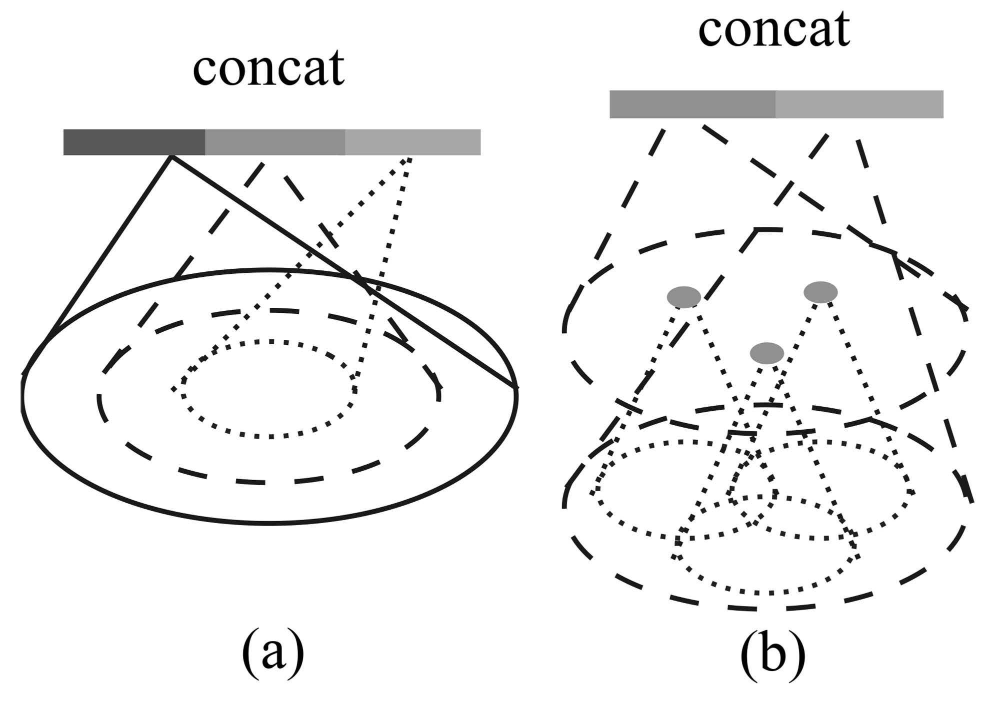
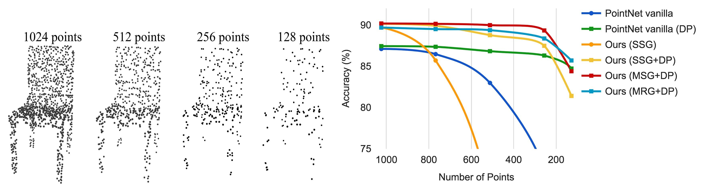
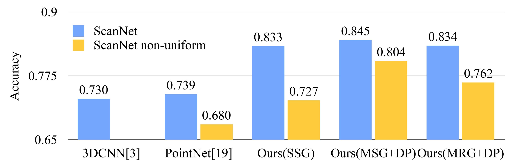
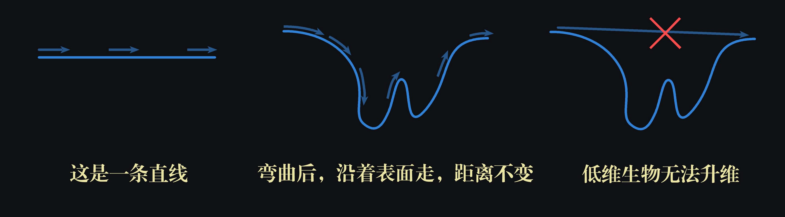

# 論文詳細解析——《PointNet++: Deep Hierarchical Feature Learning on Point Sets in a Metric Space》

[TOC]

> **注意**：この記事は元々中国語で執筆され、[こちらのサイト](https://blog.csdn.net/liaoziqiang/article/details/144987352)に公開されました。日本語版はGPT-4oを使用して翻訳されています。なお、筆者は日本語のレベルが初級であり、プロのコラムニストでもありません。また、人工翻訳や徹底的な校正を行う時間や能力が不足しているため、不備がある可能性があります。どうかご容赦いただければ幸いです。この記事が皆様の読書体験に影響を与えないことを願っています。言語や内容に関する問題、または改善案がありましたら、遠慮なく[liaoziqiang7@gmail.com](mailto:liaoziqiang7@gmail.com)までご連絡ください。

### 著者の前書き

約1か月前、私は[PointNetの論文解析](https://liao-ziqiang.github.io/fyaxm-blog/pointnet/pointnet-Interpretion-en.html)を書きました。内容が少し難解で学術的であるため、かつ領域も狭いため、あまり多くの人が見ることはないと思っていましたが、この1か月で閲覧数がなんと1.2Kに達しました。ここで筆者は、私の小さな仕事へのご支持に感謝いたします！今日お届けするのは、前回予告したPointNet++の論文解析です。PointNetに比べて、PointNet++は明らかにより成熟しており、私たちのプロジェクトにとってもより良い選択となります。それはPointNetの研究の拡張であるため、読者は必ず**先に**[**PointNetの論文解析**](https://liao-ziqiang.github.io/fyaxm-blog/pointnet/pointnet-Interpretion-en.html)を読んで、PointNetのアーキテクチャと原理を熟知し、その後にこの記事を読むことをお勧めします。多くの重複した内容についてはこの記事で再度説明しません。以下にいくつかの質問を示していますが、読者は自分でテストし、PointNetの理解度を確認してみてください：

1. 置換不変性（permutation invariance）とは何か？その記事で他にどのような不変性が言及されているか？PointNetはどのようにして置換不変性を実現しているか？
2. 重要な点集合（critical point set）とは何か？これらの点の実際の意味をどのように理解するのか？定理2を簡単に通俗的に説明できるか？
3. T-Netの主な機能を簡単に説明してください。その入力と出力の形式はどのようなものか？それはネットワーク全体にどのように作用するのか？
4. 意味分割タスクにおいて、PointNetはどのようにして局所特徴と全体特徴を統合するのか？
5. 元の文章を見ず、ネットワークアーキテクチャ図（図2）を見ながら、データの流れの経路をたどり、その各ステップの詳細を言うことができますか？

上記の質問に流暢に答えることができれば、おめでとうございます、次の読み物を進めることができます。この記事は基本的にPointNet論文解析のスタイルを引き継いでおり、同様にPointNetの原理を理解したい読者、特に研究の道に足を踏み入れたばかりの学生向けです。私は原文で設計された概念や背景知識を拡張するだけでなく、私が原文を理解する際の思考過程もできるだけ示します。また、PointNet++論文はPointNetに比べて内容がやや少なく、手動で設計されたステップが多く含まれているため、可能な限りコードを組み合わせて、より多くの詳細をカバーします。ただし、私はまだ研究初心者であり、限られた能力を持っているので、誤りを発見したり改善提案があれば、読者は惜しみなく教えてください。この記事が皆様の学習や研究に役立つことを願っています。より良い読み取り体験を望む場合は、[このウェブページ](https://liao-ziqiang.github.io/fyaxm-blog/pointnet/pointnet-pp-Interpretion-jp.html)にアクセスし、去る前にいいねとコレクションを残してくださいね。対応する[GitHubリポジトリ](https://github.com/Liao-Ziqiang/fyaxm-blog)で元のファイルを入手することもできます。それでは正式に始めましょう。

---------

### Abstract (概要)

> Few prior works study deep learning on point sets. PointNet [20] is a pioneer in this direction. However, by design, PointNet does not capture local structures induced by the metric space points live in, limiting its ability to recognize fine-grained patterns and generalizability to complex scenes. In this work, we introduce a hierarchical neural network that applies PointNet recursively on a nested partitioning of the input point set. By exploiting metric space distances, our network is able to learn local features with increasing contextual scales. With further observation that point sets are usually sampled with varying densities, which results in greatly decreased performance for networks trained on uniform densities, we propose novel set learning layers to adaptively combine features from multiple scales. Experiments show that our network called PointNet++ is able to learn deep point set features efficiently and robustly. In particular, results significantly better than state-of-the-art have been obtained on challenging benchmarks of 3D point clouds.

① これまでの研究では、点集合上の深層学習に関する研究はほとんど行われていません。PointNet [20] はこの分野の先駆者です。② しかし、設計上の制限により、PointNet は点集合が存在するメトリック空間によって誘発される局所構造を捉えることができず、細かいパターンを認識したり、複雑なシーンに一般化したりする能力が制限されています。③ 本研究では、入力点集合の**入れ子のような分割**に対してPointNetを**再帰的**に適用する階層的ニューラルネットワークを導入します。メトリック空間の距離を利用することで、ネットワークは徐々に拡大する文脈的スケールで局所特徴を学習することができます。④ さらに、点集合が通常異なる密度でサンプリングされるため、一様密度で訓練されたネットワークの性能が大幅に低下することを観察し、この問題に対処するために、複数のスケールからの特徴を適応的に結合する新しい集合学習レイヤーを提案します。⑤ 実験の結果、PointNet++と呼ばれる我々のネットワークは、点集合の深い特徴を効率的かつ堅牢に学習できることが示されました。特に、困難な3D点群のベンチマークにおいて、現状の技術を大幅に上回る結果が得られました。

**説明**：

- [PointNet解析](https://liao-ziqiang.github.io/fyaxm-blog/pointnet/pointnet-Interpretion-en.html)においては、点群を対象とした深層学習手法が少ない理由について詳細に説明されています。総じて、点群の**不規則性**がうまく解決されていないことが原因です。
- ②文は、PointNetのアーキテクチャが点群タスクで良好な成績を収めたものの、欠点として、各スケールの情報を融合できないということを指摘しています。平たく言えば、各スケールはピラミッドの階層のように考えることができ、ピラミッドの頂点は全体の情報で、最下部は各点の局所情報です。PointNetは2層のピラミッドであり、PointNet++はこのピラミッドをさらに高く築き、中間層を追加することで、密度、曲率、局所的な形状など、複数の層次で情報を抽出できるようにし、特徴抽出能力を大幅に向上させたということです。
- ③は、この考え方の具体的な表れである階層構造について説明しています。これは、点群を段階的に分割・グループ化して、局所から全体への特徴を抽出していくものです。ここで説明が必要なのは、まず**入れ子のような分割**であり、これは、メトリック空間の距離（たとえば、ユークリッド距離）を用いて入力点群を局所領域に分割し、この分割は入れ子状となっていることです。つまり、ある局所の内部がさらに細分化されるということです。次に**再帰的**という用語ですが、PointNet++はPointNetを基本モジュールとして使用しているため、PointNet++が点群の全体情報を抽出しようとするときは、`pointnet(pc)`という関数を呼び出していると考えることができます。この`pc`が`N`個に分割され、それぞれの部分が`pointnet(pc[i])`を呼び出し、`pc[i]`が`M`個に分割され、それぞれの部分が`pointnet(pc[i][j])`を呼び出す、最大深度に達するまで続きます。トップレベルの`pointnet(pc)`にとって、`N`個の部分に分割された各部分が1点として抽象化され、それは実際には`N`個の点の点群のみを処理することに相当します。各階層のある点の元々の特徴は、事実上次の階層における対応する領域の全体特徴なのです。この呼び出し構造は、再帰構造というものです。もっとも、実際には点群処理の順序は底から上への順序です。
- ④文は、このような空間的評価に依存した分割法が、点群の密度分布に影響されやすい結果となることを指摘しています。疎な領域では、小スケールの近傍に過少な点しか含まれず、局所的な幾何情報が失われる可能性があります。PointNet++は、この問題を解決するために、2つの方法をとっています：1つ目は多スケールグルーピング（Multi-Scale Grouping）で、複数の半径を用いて近傍を分け、それぞれの近傍で特徴抽出を行い、それらを融合させます。こうすることで、疎な領域で内容が不完全である問題を避けられます。2つ目は多重解像度グルーピング（Multi-Resolution Grouping）で、同一のスケール下で複数の解像度を用いて特徴抽出・融合を行います。両者の具体的な原理とネットワーク内での位置は後ほど紹介しますが、ここではそのアイデアが大まかに理解できれば十分です。

---------

### 1. Introduction (はじめに)

> We are interested in analyzing geometric point sets which are collections of points in a Euclidean space. A particularly important type of geometric point set is point cloud captured by 3D scanners, e.g., from appropriately equipped autonomous vehicles. As a set, such data has to be invariant to permutations of its members. In addition, the distance metric defines local neighborhoods that may exhibit different properties. For example, the density and other attributes of points may not be uniform across different locations — in 3D scanning, the density variability can come from perspective effects, radial density variations, motion, etc.

私たちはユークリッド空間内の点の集合である幾何学的な点集合を分析することに関心を寄せています。特に重要なタイプの幾何学的な点集合は3Dスキャナーによってキャプチャされた点群であり、これは適切な装備を備えた自律型車両から取得されることがあります。集合として、このようなデータはそのメンバーの順列に対して不変でなければなりません。さらに、距離計量は異なる特性を示す可能性のある局所的な近傍を定義します。例えば、点の密度や他の属性は異なる位置で均一でないかもしれません。3Dスキャンにおいては、密度の変動は視点効果、放射状密度の変動、運動などから生じる可能性があります。

**説明**：

- 3Dスキャンによって取得される点群と、三次元メッシュから変換される点群には顕著な違いがあり、それは密度の不均一性です。例えば、遠くの物体からの点群は常により疎になります。センサーに特定の角度である面の密度も低くなります。これは面積の投影公式$A_{\text{proj}} = |A| \cdot |\cos\theta|$によるもので、このような表面がセンサーに投影される際に非常に小さく平坦になるため、分解能も当然低くなります。PointNetでは空間距離に基づいた分割が必要ありませんでしたので、この問題について特に議論されていませんでしたが、PointNet++では解決策を提案する必要があります。

---------

> Few prior works study deep learning on point sets. PointNet [20] is a pioneering effort that directly processes point sets. The basic idea of PointNet is to learn a spatial encoding of each point and then aggregate all individual point features to a global point cloud signature. By its design, PointNet does not capture local structure induced by the metric. However, exploiting local structure has proven to be important for the success of convolutional architectures. A CNN takes data defined on regular grids as the input and is able to progressively capture features at increasingly larger scales along a multi-resolution hierarchy. At lower levels, neurons have smaller receptive fields, whereas at higher levels, they have larger receptive fields. The ability to abstract local patterns along the hierarchy allows better generalizability to unseen cases.

① 現在、点集合に関する深層学習を研究しているのはごく少数の研究です。PointNet [20] は点集合を直接処理する画期的な取り組みです。PointNet の基本的なアイデアは、各点の空間符号化を学習し、すべての点の特徴を集約してグローバルな点群のシグニチャを生成することです。しかし、その設計上の制約により、PointNetはメトリックによって誘導される局所構造を捉えることはできません。② しかし、局所構造を利用することが、畳み込みアーキテクチャの成功にとって重要であることが証明されています。畳み込みニューラルネットワーク（CNN）は、規則的なグリッド上のデータを入力として、多解像度の階層に沿って徐々に大きなスケールの特徴を捕捉することができます。低いレベルでは、ニューロンは小さな受容野を持ちますが、高いレベルでは、より大きな受容野を持ちます。階層に沿って局所パターンを抽象化する能力は、未知のケースに対してより良い一般化性を可能にします。

**説明**：

- ①文と要約部分は基本的に一致しており、これ以上は言いません。②文は、この論文のインスピレーションの元であるCNNを説明しています。CNNの成功は、多層次にわたる局所パターンの抽象化がより良い汎化能力を有することを証明しており、これは一方ではより高度な思考と見ることができ、他方では小さなスケールの情報の統合が「ノイズ除去」プロセスと見ることができるためです。各局所を全体として扱うことで、高レベルではその全体的な特徴、核となる特徴により集中することができ、些細な摂動や冗長なノイズの影響を受けないのです。この部分は[この文章](https://blog.csdn.net/liaoziqiang/article/details/143206275)で一定の紹介をしています。

---------

> We introduce a hierarchical neural network, named PointNet++, to process a set of points sampled in a metric space in a hierarchical fashion. The general idea of PointNet++ is simple. We first partition the set of points into overlapping local regions by the distance metric of the underlying space. Similar to CNNs, we extract local features capturing fine geometric structures from small neighborhoods; such local features are further grouped into larger units and processed to produce higher-level features. This process is repeated until we obtain the features of the whole point set.

我たちは PointNet++ という名前の階層型ニューラルネットワークを紹介し、これはメトリックスペースでサンプリングされた点集合を階層的に処理します。PointNet++ の基本アイデアはシンプルです。まず、基礎空間の距離メトリックによって点集合を重なり合った局所領域に分割します。CNN に似た方法で、小さな近傍から微細な幾何学的構造を捉える局所的な特徴を抽出し、それらの局所的な特徴をより大きな単位にグループ化して処理し、より高次の特徴を生成します。このプロセスを繰り返すことで、点集合全体の特徴を取得します。

**説明**：

- ここでまず空間分割の基本概念を紹介します。まず、それは重なりがあるため、各ブロックは隣接するブロックと一部の領域が重なり、特徴抽出がより詳細で連続性が高まります。読者はこれを畳み込み操作のストライドに類似だと考えることができます。各畳み込み操作の領域も通常は重なりがあります。次に、それは**最も離れた点のサンプリング**（Farthest Point Sampling, FPS）に基づいており、これは点群をサンプリングするためのアルゴリズムです。類似のアルゴリズムにはランダムサンプリングがあります。FPSは必要なサンプリング点の数を表すパラメータ $k$ が必要で、具体的な原理は後で説明しますが、ここでは最大限のカバレッジを保証し、点の分布特性を最大限に保存できることだけを知っていれば十分です。これらの $k$ 個の点が選ばれた後、それぞれの $k$ 個の点を球心として近傍を構築し、分割を行います。ここで一つの問題を残します：半径の選択戦略。半径が小さすぎると、一部の点または領域がどの球形近傍にも含まれず、情報が失われる可能性があります。半径が大きすぎると、局所的な特徴が「希釈」され、点群の詳細を捉えることができなくなる可能性があります。

---------

> The design of PointNet++ has to address two issues: how to generate the partitioning of the point set, and how to abstract sets of points or local features through a local feature learner. The two issues are correlated because the partitioning of the point set has to produce common structures across partitions, so that weights of local feature learners can be shared, as in the convolutional setting. We choose our local feature learner to be PointNet. As demonstrated in that work, PointNet is an effective architecture to process an unordered set of points for semantic feature extraction. In addition, this architecture is robust to input data corruption. As a basic building block, PointNet abstracts sets of local points or features into higher level representations. In this view, PointNet++ applies PointNet recursively on a nested partitioning of the input set.

PointNet++の設計には二つの問題を解決する必要があります：点集合の分割を生成する方法、そして局所的な特徴学習者を通じて点集合または局所的な特徴を抽象化する方法です。①この二つの問題は相互に関連しており、点集合の分割は異なる分割間での共通の構造を生み出す必要があります。これは畳み込み設定と同様に、局所的な特徴学習者の重みを共有できるようにするためです。②私たちは局所的な特徴学習者としてPointNetを選択します。この作業で示されたように、PointNetは無秩序な点集合を処理して、セマンティックな特徴抽出を行う効果的なアーキテクチャです。さらに、このアーキテクチャは入力データの破損に対する頑健性を持っています。基本的な構成要素として、PointNetは局所的な点または特徴集合をより高次の表現に抽象化することができます。この観点から、PointNet++は入力点集合のネストされた分割に対してPointNetを再帰的に適用します。

**説明**：

- 「重みの共有」部分について、読者はCNNの知識とあわせて理解できるはずです。ここで一点説明が必要なのは、パラメータの共有は同じ階層内でのみ発生するという点です。これもCNNに類似しています。異なる階層間では、それに対応する異なるスケールの特徴が必要ですので、異なるネットワークによる抽出が必要であり、具体的なパラメータは異なります。実際には、各層はすべてPointNetネットワークを使用しますが、ネットワークの超パラメータ、例えばネットワークのサイズは異なります。これは理解するのは難しくありません。最後の層が三次元空間を処理するものである以外は、残りの部分はすべて特徴空間を処理しており、各層の特徴次元の設定は異なるため、ネットワークサイズも当然異なります。
- ②文に関しては、なぜPointNetが無秩序な点集合の処理に優れており、また入力データの破損に対して頑健性を持つのかを振り返ることができます。この部分はPointNetの4.3節の定理一および定理二に対応しています。読者が忘れてしまった場合は、[こちら](https://liao-ziqiang.github.io/fyaxm-blog/pointnet/pointnet-Interpretion-en.html)で復習することができます。簡単にまとめると、PointNetは対称関数を使用しており、出力結果は鍵となる点集合にのみ依存している、ということです。

---------

> One issue that still remains is how to generate overlapping partitioning of a point set. Each partition is defined as a neighborhood ball in the underlying Euclidean space, whose parameters include centroid location and scale. To evenly cover the whole set, the centroids are selected among input point set by a farthest point sampling (FPS) algorithm. Compared with volumetric CNNs that scan the space with fixed strides, our local receptive fields are dependent on both the input data and the metric, and thus more efficient and effective.

まだ解決されていない問題の一つは、点集合の重複する分割をどのように生成するかということです。各分割は、基礎となるユークリッド空間内の近傍球として定義され、そのパラメータには、重心の位置とスケールが含まれます。点集合全体を均等にカバーするために、重心は最遠点サンプリング（FPS）アルゴリズムによって入力点集合から選択されます。固定したストライドで空間を走査する体積的なCNNと比較して、我々の局所受容野は入力データとメトリックの両方に依存しているため、より効率的かつ効果的です。

**説明**：

- PointNetの論文では、点群が非正規化されたデータ形式であると述べられています。CNNを参照し、点群を固定サイズのグリッドに分割して処理することもできます。しかし、著者はFPSサンプリングアルゴリズムを選択しており、これはサンプリング点の分布が固定されたスケールに依存せず、点群自身の分布状況に基づいて決定されることを意味します。これにより、限られたサンプリング数を最大限に活用し、完全にカバーしつつ、無駄を避けることができます。

---------


**Figure 1:** Visualization of a scan captured from a Structure Sensor (left: RGB; right: point cloud).

**図1：** Structure Sensorから取得したスキャンの可視化（左：RGB；右：点群）。

---------

> Deciding the appropriate scale of local neighborhood balls, however, is a more challenging yet intriguing problem, due to the entanglement of feature scale and non-uniformity of input point set. We assume that the input point set may have variable density at different areas, which is quite common in real data such as Structure Sensor scanning. Our input point set is thus very different from CNN inputs which can be viewed as data defined on regular grids with uniform constant density. In CNNs, the counterpart to local partition scale is the size of kernels. Research shows that using smaller kernels helps to improve the ability of CNNs. Our experiments on point set data, however, give counter evidence to this rule. Small neighborhoods may consist of too few points due to sampling deficiency, which might be insufficient to allow PointNets to capture patterns robustly.

しかし、局所的な近傍球の適切なスケールを決定することは、特徴のスケールと入力点セットの非均一性の絡み合いによって、より挑戦的で興味深い問題となります。入力点セットが異なる領域で変動する密度を持つ可能性があると仮定します。これはStructure Sensorのスキャンのような実際のデータでは非常に一般的です。したがって、私たちの入力点セットは、均一な常数密度で正規グリッド上に定義されたデータとみなされるCNNの入力とは大きく異なります。CNNにおいて、局所的な分割スケールに対応するのはカーネルのサイズです。小さいカーネルを使うことでCNNの能力が向上することが研究で示されています。しかし、点セットデータに関する我々の実験は、この規則に対する反証を提供します。小さな近傍はサンプリング不足のためにあまりにも少ない点しか含んでいない可能性があり、これはPointNetがパターンを確実に捉えるには不十分かもしれません。

**説明**：

- CNNにおいて、小さなカーネルを用いることで、パラメータ数を減らし、過学習の可能性を低下させることができます。同時に、小さいカーネルは多くの階層を生み、その非線形表現能力を強化します。VGGネットワーク（例えば、VGG-16およびVGG-19）は、すべて3×3カーネルを用いた古典的なCNNアーキテクチャとして知られています。
- しかし、点群処理の場合、状況は異なります。個人的には、点の局所的特徴が点自身によるものではなく、それが全体の中でどこにありどのような機能を持つかに依存するため、②の文が示唆するように、各点は孤立していません。例えば、単一の点は曲率を定義できませんが、複数の点があれば、それぞれの点に曲率ができます。隣接する領域が大きすぎても小さすぎてもいけません。また、点群の密度が不均一な場合、小さすぎる隣接領域は十分な点を含まない可能性があり、局所的な幾何学的特徴を表現するには不十分です。さらに、点が少なすぎるとノイズの影響を受けやすくなる可能性もあります。

---------

> A significant contribution of our paper is that PointNet++ leverages neighborhoods at multiple scales to achieve both robustness and detail capture. Assisted with random input dropout during training, the network learns to adaptively weight patterns detected at different scales and combine multi-scale features according to the input data. Experiments show that our PointNet++ is able to process point sets efficiently and robustly. In particular, results that are significantly better than state-of-the-art have been obtained on challenging benchmarks of 3D point clouds.

我々の論文の重要な貢献の一つは、PointNet++が多スケールでの近傍を活用して、頑健性と詳細捕捉の両方を実現することです。トレーニング時にランダムな入力ドロップアウトを併用し、ネットワークが異なるスケールで検出されたパターンに適応的に重み付けを行い、入力データに応じて多スケールの特徴を組み合わせることを学習します。実験から、PointNet++が点セットを効率的かつ安定的に処理できることが示されています。特に、チャレンジングな3Dポイントクラウドのベンチマークで、最先端技術を大幅に上回る結果が得られました。

**説明**：

- この段落は、重要な革新点である「多スケールグルーピング」（MSG, Multi-Scale Grouping）を紹介しています。固定されたスケールが存在しないので、複数のスケールで同時に特徴抽出を行い、その後統合します。ここで注意すべきは、同一層で異なる半径を使用し、これらの近傍間にはネスト関係が存在しないことです。具体的な技術的詳細については、第3章を参照してください。

---------

### 2. Problem Statement (問題陳述)

> Suppose that $\mathcal{X}=(M,d)$ is a discrete metric space whose metric is inherited from a Euclidean space $\mathbb{R}^n$, where $M \subseteq \mathbb{R}^n$ is the set of points and $d$ is the distance metric. In addition, the density of $M$ in the ambient Euclidean space may not be uniform everywhere. We are interested in learning set functions $f$ that take such $\mathcal{X}$ as the input (along with additional features for each point) and produce information of semantic interest regarding $\mathcal{X}$. In practice, such $f$ can be a classification function that assigns a label to $\mathcal{X}$ or a segmentation function that assigns a per-point label to each member of $M$.

仮定 $M \subseteq \mathbb{R}^n$ が点の集合であり、$d$ が距離測度であるとします。これにより、$\mathcal{X}=(M,d)$ はユークリッド空間 $\mathbb{R}^n$ に由来する距離を持つ離散メトリック空間になります。加えて、ユークリッド空間における $M$ の密度は必ずしも一様ではないかもしれません。我々はそのような $\mathcal{X}$ を入力とし（各点の付加的な特徴と共に）、$\mathcal{X}$ に関するセマンティックな興味のある情報を生成する集合関数 $f$ の学習に関心を持っています。実際には、このような $f$ は、$\mathcal{X}$ にラベルを割り当てる分類関数や、$M$ 内の各点にラベルを割り当てるセグメンテーション関数であることがあります。

---------

### 3. Method (方法)

> Our work can be viewed as an extension of PointNet [20] with added hierarchical structure. We first review PointNet (Sec. 3.1) and then introduce a basic extension of PointNet with hierarchical structure (Sec. 3.2). Finally, we propose our PointNet++ that is able to robustly learn features even in non-uniformly sampled point sets (Sec. 3.3).

私たちの仕事は、階層構造を追加したPointNet [20] の拡張として見ることができます。まず、PointNet（第3.1節）をレビューした後、階層構造を持つPointNetの基本的な拡張を紹介します（第3.2節）。最後に、非均一にサンプリングされた点集合でも堅牢に特徴を学習できるPointNet++を提案します（第3.3節）。

**説明**：

- 読者は[PointNet++のGithubホームページ](https://github.com/charlesq34/pointnet2)でPointNet++のソースコードをダウンロードできます。プロジェクトディレクトリに入ってから`./models`に移動すると、6つのファイルが見つかります。以下では、コードを用いて物体カテゴリーの識別を例に説明します。
- その中で、`pointnet_cls_basic.py`はPointNetの実装（第3.1節）、`pointnet2_cls_ssg.py`はSSG（シングルスケールグルーピング）の実装（第3.2節）、`pointnet2_cls_msg.py`は前述のMSG（マルチスケールグルーピング）、つまりPointNet++の実装（第3.3節）です。

---------

#### 3.1 PointNet [20] 综述：通用連続集合関数近似器

> Given an unordered point set $\{x_1,x_2,\ldots,x_n\}$ with $x_i \in \mathbb{R}^d$, one can define a set function $f:\mathcal{X} \to \mathbb{R}$ that maps a set of points to a vector:
> $$
> f\left( {x_1,x_2, \ldots ,x_n} \right) = \gamma \left( {\mathop {{\mathop{\rm MAX}\nolimits} }\limits_{i = 1, \ldots ,n} \left\{ {h\left( {x_i} \right)} \right\}} \right)\ \quad \quad (1)
> $$
> where $\gamma$ and $h$ are usually multi-layer perceptron (MLP) networks.
>
> The set function $f$ in Eq. 1 is invariant to input point permutations and can arbitrarily approximate any continuous set function [20]. Note that the response of $h$ can be interpreted as the spatial encoding of a point (see [20] for details).
>
> PointNet achieved impressive performance on a few benchmarks. However, it lacks the ability to capture local context at different scales. We will introduce a hierarchical feature learning framework in the next section to resolve the limitation.

無作為の点集合 $\{x_1,x_2,\ldots,x_n\}$ が与えられ、ここで $x_i \in \mathbb{R}^d$、集合関数 $f:\mathcal{X} \to \mathbb{R}$ を定義できます。この関数は一組の点をベクトルにマッピングします：
$$
f\left( {x_1,x_2, \ldots ,x_n} \right) = \gamma \left( {\mathop {{\mathop{\rm MAX}\nolimits} }\limits_{i = 1, \ldots ,n} \left\{ {h\left( {x_i} \right)} \right\}} \right)\ \quad \quad (1)
$$
ここで、$\gamma$ と $h$ は通常、多層パーセプトロン (MLP) ネットワークです。

式 (1) の集合関数 $f$ は入力点の順序に対する不変性を持ち、任意の連続集合関数を近似することができます [20]。注意すべきは、$h$ の応答は点の空間エンコーディングとして解釈できることです（詳細は [20] を参照）。

PointNet はいくつかのベンチマークで印象的な性能を達成しました。しかし、異なるスケールで局所的な文脈を捉える能力が不足しています。この制限を解決するために、次のセクションで階層フィーチャー学習フレームワークを導入します。

**説明**：

- この部分は、PointNetの原理と構造を理解している読者にとっては理解が難しくないはずです。ここでは簡単に振り返ってみます：公式(1)は4.3節のPointNetで提示されている順序不変性と任意近似能力に基づいています。
- なぜ $h$ の出力が点の空間エンコーディングと解釈できるかを説明します。PointNetでは、点間の情報は最大プール時に統合され、それ以前の処理（すなわち$h$ 関数）では各点が個別に処理されます。各点の初期情報は通常、三次元座標であるため、最終的に得られる特徴ベクトルはその座標の再エンコーディング、すなわち空間エンコーディングに過ぎません。

---------

#### 3.2 層次化点集特徴学習

> While PointNet uses a single max pooling operation to aggregate the whole point set, our new architecture builds a hierarchical grouping of points and progressively abstracts larger and larger local regions along the hierarchy.

PointNetは、単一の最大プーリング操作を使用して全体の点集合を集約していますが、私たちの新しいアーキテクチャは分層的に点をグループ化し、階層に沿ってだんだんと大きな局所領域を抽象化します。

> 本小節で使用するコードはすべて`./models/pointnet2_cls_ssg.py`およびその関連コードから来ています。

---------


**Figure 2:** Illustration of our hierarchical feature learning architecture and its application for set segmentation and classification using points in 2D Euclidean space as an example. Single scale point grouping is visualized here. For details on density adaptive grouping, see Fig. 3

**図2：** 私たちの階層的特徴学習アーキテクチャの概念図と、2Dユークリッド空間での点を用いた集合のセグメンテーションと分類への応用。ここでは単一スケールの点グループ化が視覚化されています。密度適応型グループ化の詳細については、図3を参照してください。

---------

> Our hierarchical structure is composed of a number of *set abstraction* levels (Fig. 2). At each level, a set of points is processed and abstracted to produce a new set with fewer elements. The set abstraction level is made of three key layers: *Sampling layer,* *Grouping layer*, and *PointNet layer*. The *Sampling layer* selects a set of points from input points, which defines the centroids of local regions. The *Grouping layer* then constructs local region sets by finding “neighboring” points around the centroids. The *PointNet layer* uses a mini-PointNet to encode local region patterns into feature vectors.

我々の階層構造は、複数のセット抽象レベルで構成されています（図2参照）。各レベルで、一組の点が処理され抽象化され、要素数が少ない新しい集合が生成されます。セット抽象レベルは、*サンプリング層*、グルーピング層、そしてPointNet層の3つの主要層から成り立っています。*サンプリング層*は入力点から一組の点を選択し、局所領域の中心を定義します。その後、*グルーピング層*はこれらの中心の周りに「隣接する」点を見つけて局所領域セットを構築します。*PointNet層*は、小型のPointNetを使用して局所領域のパターンを特徴ベクトルにエンコードします。

**説明**：

- 簡単に言うと、PointNet++の処理手順は多段階であり、各段階は3つのステップに細分されます。最初にどの点を中心としてグループ化するかを決定し、その次にこれらの点を中心として一定の半径内の点を一つのグループとし、最後に各グループに対してPointNetを実行し、各グループのグループ内の全体特徴を反映する特徴ベクトルを得ます。
- サンプリング層とグルーピング層は`pointnet_util.py`の`sample_and_group`関数に対応しています。

---------

> A set abstraction level takes an $N \times (d + C)$ matrix as input that is from $N$ points with $d$-dim coordinates and $C$-dim point feature. It outputs an $N' \times (d + C')$ matrix of $N'$ subsampled points with $d$-dim coordinates and new $C'$-dim feature vectors summarizing local context. We introduce the layers of a set abstraction level in the following paragraphs.

ある集合抽象レベルは、$d$次元座標と$C$次元の点特徴を持つ$N$個の点からの入力として$N \times (d + C)$行列を取り、局所コンテキストを要約する新しい$C'$次元特徴ベクトルを持つ$d$次元座標の$N'$個のサブサンプリング点の$N' \times (d + C')$行列を出力します。集合抽象レベルの各層を次の段落で紹介します。

**説明**：

- 核心処理コードは以下の通りです：

  ```python
  l1_xyz, l1_points, l1_indices = pointnet_sa_module(l0_xyz, l0_points, npoint=512, radius=0.2, nsample=32, mlp=[64,64,128], mlp2=None, group_all=False, is_training=is_training, bn_decay=bn_decay, scope='layer1', use_nchw=True)
  l2_xyz, l2_points, l2_indices = pointnet_sa_module(l1_xyz, l1_points, npoint=128, radius=0.4, nsample=64, mlp=[128,128,256], mlp2=None, group_all=False, is_training=is_training, bn_decay=bn_decay, scope='layer2')
  l3_xyz, l3_points, l3_indices = pointnet_sa_module(l2_xyz, l2_points, npoint=None, radius=None, nsample=None, mlp=[256,512,1024], mlp2=None, group_all=True, is_training=is_training, bn_decay=bn_decay, scope='layer3')
  ```

  `xyz`サフィックスのあるものは$d$次元座標、`points`サフィックスのあるものは$C$次元特徴を示します。`xyz`は最初に点の座標を示し、その後はブロックの中心座標を示します。特徴はすでに位置のエンコードを含んでいますが、残りの層では原始座標情報が$C$次元特徴に連結され続けます。

---------

> **Sampling layer.** Given input points $\{x_1, x_2, \ldots, x_n\}$, we use iterative farthest point sampling (FPS) to choose a subset of points $\{x_{i_1}, x_{i_2}, \ldots, x_{i_m}\}$, such that $x_{i_j}$ is the most distant point (in metric distance) from the set $\{x_{i_1}, x_{i_2}, \ldots, x_{i_{j-1}}\}$ with regard to the rest points. Compared with random sampling, it has better coverage of the entire point set given the same number of centroids. In contrast to CNNs that scan the vector space agnostic of data distribution, our sampling strategy generates receptive fields in a data-dependent manner.

**サンプリングレイヤー（Sampling layer）。** 入力点集$\{x_1, x_2, \ldots, x_n\}$が与えられた場合、反復最遠点サンプリング（Iterative Farthest Point Sampling, FPS）を使用して、集合$\{x_{i_1}, x_{i_2}, \ldots, x_{i_m}\}$を選択します。ここで、$x_{i_j}$は、集合$\{x_{i_1}, x_{i_2}, \ldots, x_{i_{j-1}}\}$に対して、残りの点から最も遠い点（距離尺度に基づく）です。ランダムサンプリングと比較して、同じ数のセントロイドを与えた場合、FPSは全体の点集をより良くカバーします。データ分布に無関心にベクトル空間を走査するCNNとは対照的に、私たちのサンプリング戦略はデータに依存した方法で受容野を生成します。

**説明**：

- ここでは、FPSアルゴリズムの原理とステップをコードに基づいて紹介します。主なコードは`./tf_ops/sampling/tf_sampling_g.cu`にあります：
  - まず、点集$P$から任意の初期点$s_1$を選び、集合$S = \{s_1\}$を定義します。コードでは索引$0$の点を直接選択します。
  - 次に、全ての点$s_k$を巡回し、$d(s_k, S)$を計算して、$d(s_k, S)$が最大の点を$s_2$として$S$に加えます。
    - ここで、点と集合の距離を定義する必要があります。PointNet++の定義は$d(s, S) = \min_{t \in S} \|s - t\|$であり、すなわち、その点と集合内のすべての点の距離の最小値です。
    - この考え方は最小値を最大化することであり、平たく言えば、集合内の点それぞれに対しても最も遠い点を選ぶということです。
    - コードでは、点と集合の距離は動的に更新され、毎回再計算されることはありません。これは`farthestpointsamplingKernel`関数の`td`配列に保存されています。
  - 上記の手順を繰り返し、$m$個の点を選び出します。
- ここで初期点の選択はランダムであるため、不確定性があります。しかし、著者は付録C.3で実験を行い、異なるランダムシードの下でも結果が安定していることを発見しました。

---------

> **Grouping layer.** The input to this layer is a point set of size $N \times (d + C)$ and the coordinates of a set of centroids of size $N' \times d$. The output are groups of point sets of size $N' \times K \times (d + C)$, where each group corresponds to a local region and $K$ is the number of points in the neighborhood of centroid points. Note that $K$ varies across groups but the succeeding PointNet layer is able to convert a flexible number of points into a fixed-length local region feature vector.

**分割層 (Grouping layer)。**このレイヤーへの入力は、サイズが $N \times (d + C)$ の点セットと、サイズが $N' \times d$ の中心点の座標セットです。出力は、サイズが $N' \times K \times (d + C)$ の点セットのグループで、各グループは局所領域に対応し、$K$ は中心点の近傍の点の数です。注意すべきは、$K$ はグループ間で異なる可能性がありますが、次の PointNet レイヤーは可変数の点を固定長の局所領域特徴ベクトルに変換することが可能です。

**説明**：

- サンプリングとグルーピングは同じ関数内で実装されているため、一緒に説明します。以下は完全なコードです：

  ```python
  def sample_and_group(npoint, radius, nsample, xyz, points, knn=False, use_xyz=True):
      new_xyz = gather_point(xyz, farthest_point_sample(npoint, xyz)) # (batch_size, npoint, 3)
      if knn:
          _,idx = knn_point(nsample, xyz, new_xyz)
      else:
          idx, pts_cnt = query_ball_point(radius, nsample, xyz, new_xyz)
      grouped_xyz = group_point(xyz, idx) # (batch_size, npoint, nsample, 3)
      grouped_xyz -= tf.tile(tf.expand_dims(new_xyz, 2), [1,1,nsample,1]) # translation normalization
      if points is not None:
          grouped_points = group_point(points, idx) # (batch_size, npoint, nsample, channel)
          if use_xyz:
              new_points = tf.concat([grouped_xyz, grouped_points], axis=-1) # (batch_size, npoint, nample, 3+channel)
          else:
              new_points = grouped_points
      else:
          new_points = grouped_xyz
      return new_xyz, new_points, idx, grouped_xyz
  ```

- 第2行：`farthest_point_sample(npoint, xyz)` は、すべての点の座標から FPS アルゴリズムを用いて `npoint` 個の点（つまり $N'$ 個の点）を見つけ、そのインデックスを返します。`gather_point(xyz, farthest_point_sample(npoint, xyz))` は、これらのインデックスを使用してこれらの点の実際の座標を見つけます。これがサンプリング層です。

- 第6行：サンプリングされた各点に対して、`query_ball_point` はそれを半径とする球を描き、その中に含まれるすべての点を一つのグループにします。ここで返されるのもインデックスです。`group_point(xyz, idx)` はこれらのインデックスに対応する座標を取り出します。注意すべきは、このステップの出力サイズは `(batch_size, npoint, nsample, 3)` ですが、各近傍に実際に `nsample` (つまり $K$) 個の点がちょうど存在するわけではありません。解決策は、点群のすべての点を一通り確認し、それらとサンプリング点の距離を求め、距離が `r` より小さい場合にはそのグループに入れ、数が `nsample` に達したらそこで終わるというものです。もし `nsample` に満たなければ、見つけた最初の点群で不足部分を埋めます。どんな場合でも少なくとも当該点自身が含まれるため、どの点も見つからないということはありません。詳細なコードは `./tf_ops/grouping/tf_grouping_g.cu` の `query_ball_point_gpu` 関数にあります。PointNet の論文の定理 2 によれば、欠損時の埋め込み操作は出力結果に影響しません。もちろん、これによって計算量は増えますが、埋め込むことで並列性が向上するので、妥当なコストと言えます。`knn` 戦略は最も近い $k$ 個の点を選択するもので、その効果はやや劣ります。

- 第8行：ここでは3つの作業をしました。まず `tf.expand_dims(new_xyz, 2)` を使って `new_xyz` の次元を `(batch_size, npoint, 1, 3)` に拡張し、その後第3次元を複製して `(batch_size, npoint, nsample, 3)` に拡張します。この時点で、後の2つの次元は現在のグループの中心点の座標の繰り返しのリストであり、グループ内のすべての点と一対一で対応しています。この操作の主な目的は並列計算を容易にし、逐次処理を避けることです。最後に `-=` を用いてグループ内のすべての点の座標を中心点の座標から引き、位置を平衡化します。ここではスケーリングは行いません。スケーリングは尺度情報を破壊する可能性があるためと推測されます。

- `l1` レイヤーでは、初期の特徴がないため入力 `l0_points` は `None` です。したがって、元の座標から特徴を抽出する必要があります。そのため、16行目で `grouped_xyz` が初期特徴として直接使用され、PointNet レイヤーに入力されます。以降のレイヤーでは、特徴が前のグループに従って再配置され、PointNet レイヤーに入力されます。`use_xyz` 変数はコード全体で `True` のままであり、元の座標がすべてのレベルで特徴として保持されることを意味します。

---------

> In convolutional neural networks, a local region of a pixel consists of pixels with array indices within a certain Manhattan distance (kernel size) of the pixel. In a point set sampled from a metric space, the neighborhood of a point is defined by metric distance.
>
> Ball query finds all points that are within a radius to the query point (an upper limit of $K$ is set in implementation). An alternative range query is K nearest neighbor (kNN) search which finds a fixed number of neighboring points. Compared with kNN, ball query’s local neighborhood guarantees a fixed region scale, thus making local region features more generalizable across space, which is preferred for tasks requiring local pattern recognition (e.g. semantic point labeling).

① 畳み込みニューラルネットワークにおいて、ピクセルの局所領域はそのピクセルから一定のマンハッタン距離（カーネルサイズ）内の配列インデックスを持つピクセルで構成されます。一方、計量空間からサンプリングされた点集合においては、点の近傍は計量距離によって定義されます。

球クエリ（Ball query）は、クエリポイントから一定の半径内にあるすべてのポイントを見つけます（実装では $K$ の上限が設定されます）。別の範囲クエリ手法として $k$ 近傍（kNN）探索があり、これは固定数の隣接点を見つけます。kNNと比較して、球クエリの局所的な近傍は固定された領域スケールを保証するため、空間を超えて局所領域の特徴をより一般化可能にします。これは局所パターン認識（例：セマンティックポイントラベリング）を必要とするタスクにおいてより優れています。

**説明**：

- ①文では、CNNと本論文がどのようにして近傍を定義するかについて述べています。数学は普遍性を追求することが多く、異なるシステムで統一的な計量、例えば距離を定義したがります。ここでPointNetはユークリッド距離を用いて計量を行い、点群をいくつかの部分に分割します。離散的なピクセル空間にはマンハッタン距離が使用されます。ここは誤りである可能性があります。なぜならマンハッタン距離 $d_M=r$ で構築されるのはひし形であり、もしくは $45 \degree$ 回転した正方形で、辺長は $\sqrt{2}r$ です。著者の説明とは一致しないようです。ピクセルの局所領域はチェビシェフ距離を用いて定義すべきです。画像 $I$ 内のピクセル点 $p$ に対する近傍を $\{q \mid d_C(p, q) \le r \and q \in I\}$ とし、その中で $d_C(p, q) = \max(|x_p - x_q|, |y_p - y_q|)$ であり、$r = \left\lfloor k/2 \right\rfloor$ である。$k$ は畳み込みカーネルのサイズです。読者は自身で検証することができます。
- kNN戦略の実装は `./tf_ops/grouping/tf_grouping_g.cu` の `selection_sort_gpu` 関数にあります。これは選択ソートに基づくアルゴリズムで、毎回未ソートの点群から中心点に最も近い点を見つけ、$k$ 回繰り返して終了します。同様にしてインデックスを返します。

---------

> **PointNet layer.** In this layer, the input consists of $N'$ local regions of points with data size $N' \times K \times (d + C)$. Each local region in the output is abstracted by its centroid and local feature that encodes the centroid’s neighborhood. The output data size is $N' \times (d + C')$.
>
> The coordinates of points in a local region are firstly translated into a local frame relative to the centroid point:
>
> $$
> x_i^{(j)} = x_i^{(j)} - \hat{x}^{(j)} \quad \text{for } i = 1, 2, \ldots, K \text{ and } j = 1, 2, \ldots, d
> $$
>
> where $\hat{x}$ is the coordinate of the centroid. We use PointNet [20] as described in Sec. 3.1 as the basic building block for local pattern learning. By using relative coordinates together with point features, we can capture point-to-point relations in the local region.

**PointNet レイヤー。**このレイヤーの入力は$N'$の局所領域の点で構成され、データサイズは$N' \times K \times (d + C)$である。出力において、各局所領域はそのセンターポイントとセンターポイントの近隣をエンコードする局所特徴によって抽象されている。データサイズは$N' \times (d + C')$である。

局所領域内の点の座標はまずセンターポイントに相対的な局所座標系に変換される：

$$
x_i^{(j)} = x_i^{(j)} - \hat{x}^{(j)} \quad \text{for } i = 1, 2, \ldots, K \text{ and } j = 1, 2, \ldots, d
$$

ここで、$\hat{x}$はセンターポイントの座標である。我々は第3.1節で説明されているPointNet [20]を局所パターン学習の基本構築ブロックとして使用する。相対的な座標と点の特徴を使用することで、局所領域内の点と点の関係を捉えることができる。

**解説**：

- 座標の並進変換は実際には前の`sample_and_group`関数で実行されている。

- PointNet層の実装は`./utils/pointnet_utils.py`の`pointnet_sa_module`関数内にあり、以下がそのソースコードである：

  ```python
  def pointnet_sa_module(xyz, points, npoint, radius, nsample, mlp, mlp2, group_all, is_training, bn_decay, scope, bn=True, pooling='max', knn=False, use_xyz=True, use_nchw=False):
      data_format = 'NCHW' if use_nchw else 'NHWC'
      with tf.variable_scope(scope) as sc:
          # Sample and Grouping
          if group_all:
              nsample = xyz.get_shape()[1].value
              new_xyz, new_points, idx, grouped_xyz = sample_and_group_all(xyz, points, use_xyz)
          else:
              new_xyz, new_points, idx, grouped_xyz = sample_and_group(npoint, radius, nsample, xyz, points, knn, use_xyz)
  
          # Point Feature Embedding
          if use_nchw: new_points = tf.transpose(new_points, [0,3,1,2])
          for i, num_out_channel in enumerate(mlp):
              new_points = tf_util.conv2d(new_points, num_out_channel, [1,1], padding='VALID', bn=bn, 
                                          stride=[1,1], is_training=is_training, scope='conv%d'%(i), 
                                          bn_decay=bn_decay, data_format=data_format) 
          if use_nchw: new_points = tf.transpose(new_points, [0,2,3,1])
  
          # Pooling in Local Regions
          if pooling=='max':
              new_points = tf.reduce_max(new_points, axis=[2], keep_dims=True, name='maxpool')
          elif pooling=='avg':
              new_points = tf.reduce_mean(new_points, axis=[2], keep_dims=True, name='avgpool')
          elif pooling=='weighted_avg':
              # 省略
          elif pooling=='max_and_avg':
              # 省略
  
          # [Optional] Further Processing 
          # 省略
  
          new_points = tf.squeeze(new_points, [2]) # (batch_size, npoints, mlp2[-1])
          return new_xyz, new_points, idx
  ```

- 第5\~9行：この部分はサンプリング層とグループ化層である。`sample_and_group_all`は`sample_and_group`が`npoints=1`のときの状態と考えられる、この場合すべての点が同じグループに含まれるため、操作の簡素化が可能で、近隣を探索するために再び区分する必要がなく、直接集約される。

- 第11\~19行：この部分はMLPモジュール（$h$関数）に相当し、特徴抽出モジュールである。`new_points`は各層で更新されていき、最終的な出力時には各点に対応したベクトルとして更新される。同じレベル内で、すべてのグループが共有するパラメーターを使用する。読者はこの公式に復帰できる：
  $$
  \gamma \left( {\mathop {{\mathop{\rm MAX}\nolimits} }\limits_{i = 1, \ldots ,n} \left\{ {h\left( {{x_i}} \right)} \right\}} \right)\
  $$

- 第19\~27行：この部分は$\rm MAX$関数に相当し、すなわち対称関数部分を構成する。デフォルトでは`pooling='max'`が使用され、つまり最大プール（プーリングと訳すと誤解を招く可能性があり、一般的なCNNのプール層とあまり似ていない。ここでのPoolingは「集約」と翻訳する方が適切であると私は考えている）。ここでの四つのモードはすべて対称的であり、`max_and_avg`モードでは最大プールと平均プールで生成されたベクトルが接続される。`weighted_avg`は加重平均であり、モード時は、近接点の距離に基づいた重み平均を計算し、近接点特徴の重み付き平均値を計算する。このPointNetの実験によれば、`max`を使用すると効果が最良で、これはキーセットを抽出するに等しい。

- 第32行：前段階で最大プールを経たため、第三の次元には統合されたベクトルのみが残り、`tf.squeeze`を用いて削除可能である。

---------

#### 3.3 非均一なサンプリング密度におけるロバストな特徴学習

> As discussed earlier, it is common that a point set comes with non-uniform density in different areas introduces a significant challenge for point set feature learning. Features learned in dense data may not generalize to sparsely sampled regions. Consequently, models trained for sparse point clouds may not recognize fine-grained local structures.

前述のとおり、点集合は異なる領域で非均一な密度を持つことが常であり、これは点集合特徴学習に重大な課題をもたらします。密集データで学習された特徴は、疎にサンプリングされた領域には一般化できないおそれがあります。したがって、疎な点群のために訓練されたモデルは、細部にわたる局所的な構造を認識できないかもしれません。

**説明**：

- 3.2節の手法は再帰的な構造を導入しましたが、FPSアルゴリズムを使用して最大限のカバーを保証したものの、各レベルでの半径設定が固定であるため、疎な領域では未カバーとなる空間が発生する可能性があります。本節ではこの問題を解決します。
- 本節で説明するコードは`./models/pointnet2_cls_msg.py`および関連コードからのものです。

---------



**Figure 3:** (a) Multi-scale grouping (MSG); (b) Multiresolution grouping (MRG).

**図3：**(a) マルチスケールグルーピング（MSG）；(b) マルチレゾリューショングルーピング（MRG）。

---------

> Ideally, we want to inspect as closely as possible into a point set to capture the finest details in densely sampled regions. However, such close inspection is prohibited in low-density areas because local patterns may be corrupted by the sampling deficiency. In this case, we should look for larger scale patterns in greater vicinity. To achieve this goal, we propose density adaptive PointNet layers (Fig. 3) that learn to combine features from regions of different scales when the input sampling density changes. We call our hierarchical network with density adaptive PointNet layers *PointNet++*.
>
> Previously, in Sec. 3.2, each abstraction level contains grouping and feature extraction of a single scale. In PointNet++, each abstraction level extracts multiple scales of local patterns and combines them intelligently according to local point densities. In terms of grouping local regions and combining features from different scales, we propose two types of density adaptive layers as listed below.

理想的には、できるだけ密にサンプリングされた領域で点集合を詳細に調べ、最も微細な部分を捉えたいです。しかし、密度が低い領域では、サンプリングが不十分であるため、局所パターンが損なわれる恐れがあるため、そのような詳細な調査は禁じられています。この場合には、より大きな付近でより大きなスケールのパターンを探す必要があります。この目標を達成するために、入力サンプリング密度が変化した際に異なるスケールの領域から特徴を組み合わせることを学ぶ、密度適応型PointNetレイヤー（図3）の提案を行います。密度適応型PointNetレイヤーを含む階層的ネットワークをPointNet++と呼びます。

前文の第3.2節では、各抽象化レベルが単一スケールのグループ化と特徴抽出を含んでいました。しかし、PointNet++では、各抽象化レベルで複数のスケールの局所パターンを抽出し、それらを局所点密度に応じて賢く組み合わせます。局所領域のグループ化と異なるスケールの特徴の組み合わせに関して、以下の2種類の密度適応レイヤーを提案します。

---------

> **Multi-scale grouping (MSG).** As shown in Fig. 3 (a), a simple but effective way to capture multi-scale patterns is to apply grouping layers with different scales followed by corresponding PointNets to extract features of each scale. Features at different scales are concatenated to form a multi-scale feature.

**マルチスケールグルーピング（Multi-scale grouping, MSG）。**図3 (a)に示すように、マルチスケールパターンを捉えるための簡単かつ効果的な方法は、異なるスケールのグルーピング層を適用し、それに続いて対応するPointNetを使用して各スケールの特徴を抽出することです。異なるスケールの特徴を連結してマルチスケール特徴を形成します。

**説明**：

- 最初の解決策は、近傍を構築する際に複数の半径を同時に使用し、1つの中心点に対して複数の異なるスケールの領域を提供することです。それからこれらの領域の特徴をそれぞれ求め、それを直接連結します。コードは`./utils/pointnet_utils.py`の`pointnet_sa_module_msg`にあります。以下の通りです：

  ```python
  def pointnet_sa_module_msg(xyz, points, npoint, radius_list, nsample_list, mlp_list, is_training, bn_decay, scope, bn=True, use_xyz=True, use_nchw=False):
      data_format = 'NCHW' if use_nchw else 'NHWC'
      with tf.variable_scope(scope) as sc:
          new_xyz = gather_point(xyz, farthest_point_sample(npoint, xyz))
          new_points_list = []
          for i in range(len(radius_list)):
              radius = radius_list[i]
              nsample = nsample_list[i]
              idx, pts_cnt = query_ball_point(radius, nsample, xyz, new_xyz)
              grouped_xyz = group_point(xyz, idx)
              grouped_xyz -= tf.tile(tf.expand_dims(new_xyz, 2), [1,1,nsample,1])
              if points is not None:
                  # 略
              if use_nchw: grouped_points = tf.transpose(grouped_points, [0,3,1,2])
              for j,num_out_channel in enumerate(mlp_list[i]):
                  grouped_points = tf_util.conv2d(grouped_points, num_out_channel, [1,1],
                                                  padding='VALID', stride=[1,1], bn=bn, is_training=is_training,
                                                  scope='conv%d_%d'%(i,j), bn_decay=bn_decay)
              if use_nchw: grouped_points = tf.transpose(grouped_points, [0,2,3,1])
              new_points = tf.reduce_max(grouped_points, axis=[2])
              new_points_list.append(new_points)
          new_points_concat = tf.concat(new_points_list, axis=-1)
          return new_xyz, new_points_concat
  ```

- 第4~14行：3.2章のコードと基本的に同じで、詳述しません。第6行では、半径がリストの形式で与えられます。

- 第15~19行：現在の半径下での領域に対してMLPを使用して特徴を抽出します。この抽出方法は3.2章と同様です。すべての特徴は一時的に`new_points_list`に保存されます。

- 第22行：すべての特徴を連結し、より長いベクトルを形成します。

---------

> We train the network to learn an optimized strategy to combine the multi-scale features. This is done by randomly dropping out input points with a randomized probability for each instance, which we call *random input dropout*. Specifically, for each training point set, we choose a dropout ratio $\theta$ uniformly sampled from $[0, p]$ where $p \leq 1$. For each point, we randomly drop a point with probability $\theta$. In practice, we set $p = 0.95$ to avoid generating empty point sets. In doing so, we present the network with training sets of various sparsity (induced by $\theta$) and varying uniformity (induced by randomness in dropout). During testing, we keep all available points.

我々はネットワークを訓練してマルチスケール特徴を組み合わせるための最適化された戦略を学習させます。これは各インスタンスごとにランダム化された確率で入力点をランダムにドロップアウトすることによって行われ、これをランダム入力ドロップアウトと呼びます。具体的には、各トレーニングポイントセットに対して、ドロップアウト率$\theta$を区間$[0, p]$（$p \leq 1$）から均等にサンプリングし、各点を確率$\theta$でランダムにドロップアウトします。実際には、空のポイントセットを生成しないように$p = 0.95$に設定します。この方法によって、ネットワークには様々な疎度（$\theta$によって誘発される）や均一性が異なる（ドロップアウトのランダム性によって誘発される）トレーニングセットが提供されます。テスト時には、利用可能なすべての点を保持します。

**説明**：

- データセットの観点から見ると、各点群に割り当てられる$\theta$値は均等分布しています。各点群に対して、各点がドロップされるかどうかはベルヌーイ分布に従います。この2つの分布を1つに統合して、データセット全体の分布を研究することができます。ある分布、ベータ二項分布と呼ばれるものが、この状況に非常に似ており、その中のベータ分布は$[0, 1]$上の一様分布に退化することができます。では、標準的なベータ二項分布に改良できないでしょうか？もちろん、まず空のサブセットが生成されないようにしなければなりません。興味がある方は試してみると良いでしょう。私も時間ができれば試してみるかもしれません。

  > ランダムドロップアウトなどのデータ拡張に関連するコードは`./utils/provider.py`にあります。

- 異なる$\theta$を生成することによってデータセットの疎度を制御することは比較的理解しやすい点です。しかし、ランダムドロップアウトが異なる均一性を引き起こすという主張はやや混乱を招きます。この問題を更に深く分析するために次の考察を行うことができます。無限に密な均一な点群があると仮定します。この中からランダムに立方体を選び、その立方体内の点をランダムにドロップアウトした場合、この立方体内の点密度の期待値を計算してみると、立方体の位置に関係なく、その期待値は同じであることがわかります。点群の密度が無限であるため、立方体の大きさを非常に小さく、ゼロに近づけることも可能です。すべての小さな立方体の密度期待値が同じであるため、点群全体の密度は任意の位置で一様であるべきであり、著者が述べているように異なる位置で異なる均一性を示すわけではありません。この分析は、一様な、密な点群でランダムドロップアウト操作を導入しても、理論的には不均一性を引き起こさないことを示しています。

- もちろん、点群の密度は無限大ではないため、小範囲で変動することがあります。しかし、小規模なモデルのデータセットを除いて、多くの大型物のデータセット、または屋内外のシーンをターゲットにしたデータセットは、点群数が非常に多く、何十万を超えることもあります。このような点群をランダムドロップアウトすることにより、不均一性は非常に小さな範囲にしか現れません。もちろん、点群分割を除いて、多くの点群タスクが実際に必要とする点群数は少ないため、先にサンプリングを行ってから処理することができます。しかし、現実のシナリオにおいて、著者が述べている密度の不均一の問題は、しばしば幾何構造や距離と関連しており、しばしば物体間の密度が大きく異なることがあります。したがって、著者のこの結論に対して私は困惑し、この方法が現実のシナリオにおける点群密度の不均一をシミュレートできるかどうかは疑問です。もちろん、現時点では実験を行うための時間がないため、分析に誤りがある場合やより良い理論分析方法があれば、関連知識のある読者に指導をお願いしたいと思います。

- ここで、不均一度を向上させることができるデータ拡張方法を提案します。例えば、Habitatのような一般的なシミュレーションプラットフォームを選択し、目標物体をシーンの中央に配置し、周囲環境を空に設定して地面を透明にします。そして、ランダムに$N$個のカメラ姿勢（$N$は大き過ぎない範囲が望ましい）を生成し、これらの姿勢で仮想のRGB-Dカメラを使用して撮影を行い、対応する深度画像を生成してさらに点群データに変換します。生成された点群は直接結合することもできますし、[tsdf-fusionアルゴリズム](https://github.com/andyzeng/tsdf-fusion)を使用して融合し、新しい点群を得ることもできます。ランダム化されたカメラの位置と角度により、異なる視点での撮影距離と視角が異なるため、生成された点群はマクロの観点では目標物体の形状の一貫性を保ちながら、ミクロの観点では密度分布が均一でなくなり、一定の穴や欠損領域も存在する可能性があります。このように生成されたデータはマクロの特徴を保持しながらミクロの特徴を多様化することができ、より現実に即したシナリオに適しているため、ネットワークのロバスト性を効果的に向上させ、データセットの数を大幅に拡大することが可能です。

---------

> **Multi-resolution grouping (MRG).** The MSG approach above is computationally expensive since it runs local PointNet at large scale neighborhoods for every centroid point. In particular, since the number of centroid points is usually quite large at the lowest level, the time cost is significant.
>
> Here we propose an alternative approach that avoids such expensive computation but still preserves the ability to adaptively aggregate information according to the distributional properties of points. In Fig. 3 (b), features of a region at some level $L_i$ is a concatenation of two vectors. One vector (left in figure) is obtained by summarizing the features at each subregion from the lower level $L_{i-1}$ using the set abstraction level. The other vector (right) is the feature that is obtained by directly processing all raw points in the local region using a single PointNet.

**マルチ解像度グループ化（MRG）。** 上述のMSG方法は計算コストが高く、各セントロイドポイントに対して大規模な近隣でローカルPointNetを実行する必要があります。特に、最も低いレベルではセントロイドポイントの数が通常非常に多いため、時間コストが顕著です。

ここで、こうした高価な計算を避けつつ、点の分布特性に応じて情報を適応的に集約する能力を保持する代替アプローチを提案します。図3（b）では、あるレベル $L_i$ の領域の特徴は2つのベクトルの連結で構成されています。1つのベクトル（図の左側）は、集合抽象レベルを使用して、下位レベル $L_{i-1}$ の各サブリージョンで特徴を要約することによって得られます。もう1つのベクトル（右側）は、単一のPointNetを使用して局所領域内のすべての生の点を直接処理して得られる特徴です。

**説明**：

- 可能性としてMRGの効果がMSGほどではないため、MRGの実装は公開されたコードで提供されておらず、付録で少し触れられているだけです。これにより、MRGの理解が難しくなっています。私の理解は以下の通りです：
  - まず、図3の左側のベクトルです。これは1つのグループに対応しますが、そのグループのすべてのサブグループの特徴を融合して得られたものではなく、これらのサブグループ内の点の特徴を融合して得られたものです。これは、前のレベルの生の情報を現在のレベルに渡すのと同等です。具体的な要約アルゴリズムがどのようであるか、直接平均なのか、PointNetを通しているのか、分組があるのかなどの詳細は不明です。
  - 次に、図3の右側のベクトルです。これは現在のレベルをサンプリングしてグループ化し、その後にPointNetを使用して特徴抽出を行い、1つのベクトルを得るものです。このステップは3.2節と完全に一致しています。
  - 二者が連結され、MLPを通じ最終的なベクトルに処理されます。
- 次に、SSG（すなわち3.2方法）、MSG、MRGを比較します。MSGはマルチスケールであり、異なるスケールを使用して近隣を構築することで、異なるスケールでの情報を同時に取得します。MRGはマルチ解像度であり、PointNetを使用して現在のレベルを要約するだけでなく、次のレベル中で現在のグループに対応するすべての点の情報を活用します。これは、2つの解像度で特徴を抽出することとして見ることができます。
- MRGが密度不均一問題をどのように解決するか：前述のように、MSGとMRGはどちらも点群の密度不均一問題を解決する方法です。MSGは十分な点群を取り込むために範囲を拡大します。MRGは近隣内の点を「アンパック」し、各点群の点をすべて「解放」することで、密度が向上します。

---------

> When the density of a local region is low, the first vector may be less reliable than the second vector, since the subregion in computing the first vector contains even sparser points and suffers more from sampling deficiency. In such a case, the second vector should be weighted higher. On the other hand, when the density of a local region is high, the first vector provides information of finer details since it possesses the ability to inspect at higher resolutions recursively in lower levels.
>
> Compared with MSG, this method is computationally more efficient since we avoid the feature extraction in large scale neighborhoods at lowest levels.

局所領域の点密度が低い場合、第1ベクトルは第2ベクトルよりも信頼性が低い可能性があります。これは、第1ベクトルの計算に使用されるサブ領域に更に希薄な点が含まれ、サンプリング不足の影響をより受けるためです。このような場合、第2ベクトルの重みを高くするべきです。一方、局所領域の点密度が高い場合、第1ベクトルは再帰的に低いレベルで高解像度の観察を行う能力を持っているため、より細かい情報を提供できます。

MSGと比較して、この手法は計算上効率的です。最低レベルでの大規模な近傍での特徴抽出を避けるためです。

**説明**：

- ここでは2つのベクトルの重みが異なるべきと述べられていますが、実装方法は示されていません。公開されたコードがないため、いくつかの推測をするしかありません。
  - 第一の推測は、著者が空間密度を使って重みを計算した可能性があるということです。半径が決まれば、グループ内の有効点の数を数えるだけで済みます。同時に、`query_ball_point`が2つの値を返すことに注意が必要です。1つ目はグループごとに整理された各点のインデックス、2つ目は各グループ内の実際の点の数です。この量は`pointnet_sa_module_msg`などの関数では使用されませんが、存在しているため、MRG方法に使用されていると推測するのが合理的です。
  - 第二の推測は、重みを学習可能なパラメータとして、すなわちネットワークの一部として扱ったということです。ただし、可能性は低いと感じます。
  - 第三の推測は、MLPが自動で両者の重みを学習したということです。PointNetのMLP層は特徴の信頼度を予測し、暗黙的に2つのベクトルに異なる重みを割り当てることが可能です。

---------

#### 3.4 セット分割のための点特徴伝播

> In the set abstraction layer, the original point set is subsampled. However, in the set segmentation task such as semantic point labeling, we want to obtain point features for all the original points. One solution is to always sample *all* points as centroids in all set abstraction levels, which, however, results in high computation cost. Another way is to propagate features from subsampled points to the original points.

セット抽象レイヤーでは、元の点集合がサンプリングされます。しかし、意味点ラベリングのようなセット分割タスクにおいては、すべての元の点に対して点特徴を取得したいと考えます。一つの解決策は、すべてのセット抽象レベルで*すべて*の点を中心点として常にサンプリングすることですが、これは高い計算コストをもたらします。もう一つの方法は、サンプリングされた点から元の点に特徴を伝播することです。

**説明**：

- PointNetでは、点の局所特徴と全体点群のグローバル特徴を結合するだけで済みます。しかし、PointNet++では複数のレベルで特徴が抽出されるので、これらの特徴を活用する方法を考える必要があります。ここで著者は単純な結合ではなく、補間+結合の方式を採用しました。一言で言えば、グローバル特徴を距離の重みに基づいて次のレイヤーの各点に広がくし、次のレイヤーの各点が再度距離の重みに基づいてさらに次のレイヤーに広がくし、最終レイヤーである元の点にまで伝播するということです。各伝播において、受信する点は自身の特徴と受信した特徴を融合します。このレイヤーはFPレイヤーと略します。

---------

> We adopt a hierarchical propagation strategy with distance-based interpolation and across-level skip links (as shown in Fig. 2). In a *feature propagation* level, we propagate point features from $N_l \times (d + C)$ points to $N_{l-1}$ points where $N_{l-1}$ and $N_l$ (with $N_l \leq N_{l-1}$) are point set sizes of input and output of set abstraction level $l$. We achieve feature propagation by interpolating feature values $f$ of $N_l$ points at coordinates of the $N_{l-1}$ points. Among the many choices for interpolation, we use inverse distance weighted average based on $k$ nearest neighbors (as in Eq. 2, in default we use $p = 2$, $k = 3$). The interpolated features on $N_{l-1}$ points are then concatenated with skip linked point features from the set abstraction level. Then the concatenated features are passed through a “unit pointnet”, which is similar to one-by-one convolution in CNNs. A few shared fully connected and ReLU layers are applied to update each point’s feature vector. The process is repeated until we have propagated features to the original set of points.
> $$
> f^{(j)}(x) = \frac {\sum\nolimits_{i=1}^k \omega_i(x) f_i^{(j)}}{\sum\nolimits_{i=1}^k \omega_i(x)} \quad \text{where} \quad \omega_i(x) = \frac {1}{d(x, x_i)^p}, \quad j=1, \dots, C \quad \quad (2)
> $$

我々は、距離に基づく補間とレベル間スキップリンクを組み合わせた階層型伝播戦略を採用しています（図2参照）。特徴伝播レベルでは、ポイント特徴を$N_l \times (d + C)$ポイントから$N_{l-1}$ポイントに伝播させます。ここで、$N_{l-1}$と$N_l$（$N_l \leq N_{l-1}$）はセット抽象レベル$l$の入力および出力のポイントセットサイズです。特徴伝播は、$N_{l-1}$ポイントの座標で$N_l$ポイントの特徴値$f$を補間することによって実現されます。多くの補間の選択肢の中で、我々は$k$近傍に基づく逆距離加重平均を使用します（式2のように、デフォルトでは$p = 2$、$k = 3$を使用）。$N_{l-1}$ポイントで補間された特徴は、その後セット抽象レベルからスキップリンクされたポイント特徴と結合されます。その後、結合された特徴は「ユニットPointNet」を通過し、これはCNNの1対1の畳み込みに似ています。いくつかの共有された全結合層とReLU層が適用され、各ポイントの特徴ベクトルを更新します。このプロセスは、元のポイントセットに特徴を伝播するまで繰り返されます。

$$
f^{(j)}(x) = \frac {\sum\nolimits_{i=1}^k \omega_i(x) f_i^{(j)}}{\sum\nolimits_{i=1}^k \omega_i(x)} \quad \text{where} \quad \omega_i(x) = \frac {1}{d(x, x_i)^p}, \quad j=1, \dots, C \quad \quad (2)
$$

**説明**：

- ここでまず、次の2点を説明します：
  - 順序上は逆伝播で、上層（グローバル特徴）から下層（ローカル特徴）へ伝播し、節3.3とは正反対です。
  - 下層ポイントと上層ポイントは**一対多**の関係です。すべての下層ポイントに伝播が行き渡るようにするためです。下層のポイントの特徴はまず、$k$個の上層ポイントの情報と自身の特徴を結合して更新され、それからMLPを通して処理されます。
- 著者の記述と公式は一見抽象的に見えますが、実は難しくありません：$\omega$部分は単に重みとして見なせます。距離が大きいほど、重みは小さくなります。分子部分は、これら上層ポイントの特徴を加重平均したもので、分母の目的は重みの和を1にすることです。
- 次に、「ユニットPointNet」を通じて更新を行います。このネットワークも学習可能で、各レベルに1つあります。同レベル内では重みが共有されます。PointNetの通常の構造との核心的な違いは、最大プーリング層がないという点です。単一ポイントの特徴を更新するだけだからです。そのため、著者はこれをCNNの「逐点畳み込み」に類似していると表現しています。MLPを通すため、更新後のポイントの特徴次元は、自身の特徴次元と上層の特徴次元の和ではなく、手動で設計された量になります。
- 要するに、逐点ラベル付けタスク（例えば、セマンティックセグメンテーションや法線予測）にPointNet++を使用する場合、FPモジュールを使用する必要があります。

---------

### 4. Experiments (実験)

> **Datasets.** We evaluate on four datasets ranging from 2D objects (MNIST [11]), 3D objects (ModelNet40 [31] rigid object, SHREC15 [12] non-rigid object) to real 3D scenes (ScanNet [5]). Object classification is evaluated by accuracy. Semantic scene labeling is evaluated by average voxel classification accuracy following [5]. We list below the experiment setting for each dataset:
>
> - **MNIST**: Images of handwritten digits with 60k training and 10k testing samples.
> - **ModelNet40**: CAD models of 40 categories (mostly man-made). We use the official split with 9,843 shapes for training and 2,468 for testing.
> - **SHREC15**: 1200 shapes from 50 categories. Each category contains 24 shapes which are mostly organic ones with various poses such as horses, cats, etc. We use five-fold cross-validation to acquire classification accuracy on this dataset.
> - **ScanNet**: 1513 scanned and reconstructed indoor scenes. We follow the experiment setting in [5] and use 1201 scenes for training, 312 scenes for testing.

**データセット.** 我々は四つのデータセットで評価を行った。これらのデータセットは、2Dオブジェクト（MNIST [11]）、3Dオブジェクト（ModelNet40 [31] 剛性オブジェクト、SHREC15 [12] 非剛性オブジェクト）から実際の3Dシーン（ScanNet [5]）に至る。オブジェクト分類は正確さで評価され、セマンティックシーンラベリングは平均ボクセル分類精度による評価を行った。[5]に基づく手法を利用している。各データセットの実験設定は以下の通りである：

- **MNIST**：手書き数字イメージデータセットで、60kのトレーニングサンプルと10kのテストサンプルを含む。
- **ModelNet40**：40カテゴリ（主に人工物）のCADモデルデータセット。我々は公式分割を使用し、トレーニングには9,843の形状を、テストには2,468の形状を使用する。
- **SHREC15**：50カテゴリ計1,200の形状を含むデータセット。各カテゴリには24の形状が含まれ、これらは主に馬や猫などの様々なポーズを持つ有機物体である。このデータセットの分類精度を得るために、五分割交差検証を使用する。
- **ScanNet**：スキャンおよび再構成された1,513の屋内シーンを含む。我々は[5]の実験設定に従い、1,201のシーンでトレーニングし、312のシーンでテストを行う。

---------


**表1：**MNIST数字分类。  

**表2：**ModelNet40形状分类。

---------

#### 4.1 ユークリッド距離空間における点集合の分類

> We evaluate our network on classifying point clouds sampled from both 2D (MNIST) and 3D (ModelNet40) Euclidean spaces. MNIST images are converted to 2D point clouds of digit pixel locations. 3D point clouds are sampled from mesh surfaces from ModelNet40 shapes. By default, we use 512 points for MNIST and 1024 points for ModelNet40. In the last row (ours normal) in Table 2, we use face normals as additional point features, where we also use more points ($N = 5000$) to further boost performance. All point sets are normalized to be zero mean and within a unit ball. We use a three-level hierarchical network with three fully connected layers.

我々は、2次元（MNIST）および3次元（ModelNet40）ユークリッド空間からサンプリングされた点群の分類能力を評価しました。MNIST画像は数字のピクセル位置からなる2次元点群に変換されます。3次元点群はModelNet40形状のメッシュ表面からサンプリングされます。デフォルトでは、MNISTには512ポイント、ModelNet40には1024ポイントを使用します。表2の最後の行（「ours normal」）では、面の法線を追加の点の特徴として使用し、パフォーマンスをさらに向上させるためにサンプルポイント数を増やしています（$N = 5000$）。すべての点集合はゼロ平均に正規化され、単位球内に収められています。ネットワークは3層の階層構造と3つの全結合層を持ちます。

---------

> **Results.** In Table 1 and Table 2, we compare our method with a representative set of previous state-of-the-art methods. Note that PointNet (vanilla) in Table 2 is the version in [20] that does not use transformation networks, which is equivalent to our hierarchical net with only one level.

まず、私たちの階層的学習アーキテクチャは、非階層的PointNet [20] よりも性能が大幅に向上しています。MNISTでは、PointNet（vanilla）およびPointNetと比較して、それぞれ60.8%および34.6%の相対的なエラー率の低下が見られます。ModelNet40分類では、同じ入力データサイズ（1,024点）と特徴（座標のみ）を使用した場合、私たちの方法はPointNetよりもはるかに強力です。次に、点集合に基づく方法が成熟した画像CNNと同等以上の性能を達成できることを観察しました。MNISTでは、私たちの方法（二次元の点集合に基づく）は、Network in Network CNNに近い精度を達成しています。ModelNet40では、法線情報を結合することで、以前の最先端の方法であるMVCNN [26] を大幅に上回ります。

---------



**Figure 4:** 左: ランダムなポイントドロップアウトを伴うポイントクラウド。右: 非一様密度を処理する際の密度適応戦略の利点を示す曲線。DPはトレーニング中のランダム入力のドロップアウトを意味します。それ以外の場合は、均一に密なポイントでのトレーニングです。詳細は第3.3節を参照してください。

---------

> **Robustness to Sampling Density Variation.** センサーから取得したデータは、通常、深刻な不規則サンプリングの問題に悩まされます（図1を参照）。我々のアプローチは、複数のスケールの点の近隣を選択し、それらを適切に重み付けすることで、記述性と堅牢性のバランスを取ります。
>
> 我々はテスト時にランダムに点をドロップアウトさせ（図4左を参照）、ネットワークが非均一で希薄なデータに対する堅牢性を検証します。図4右に示すように、MSG+DP（訓練時にランダム入力ドロップアウトを伴う多スケールグループ化）とMRG+DP（訓練時にランダム入力ドロップアウトを伴う多解像度グループ化）は、サンプリング密度の変動に対して非常に堅牢です。MSG+DPの性能は、1024点から256点へのテストで1%未満しか低下しません。さらに、代替手段と比較して、ほぼすべてのサンプリング密度で最良の性能を発揮します。PointNet vanilla [20]は、密度の変動に対してかなり堅牢ですが、これは細部ではなくグローバルな抽象に焦点を当てているためです。しかし、細部を失うことは、我々のアプローチと比較して威力が劣ることにもつながります。SSG（各レベルで単一スケールグループ化を行うPointNet++の改良版）は、希薄なサンプリング密度に対して一般化できませんが、SSG+DPは、訓練時にランダムで点をドロップアウトさせることにより、これを修正します。

**サンプリング密度変動に対する堅牢性について.** 現実世界から直接取得したセンサーデータは、通常、深刻な不規則サンプリングの問題に悩まされています（図1を参照）。我々の方法は、複数のスケールで点の近傍を選択し、適切な重み付けにより記述性と堅牢性をバランスよく調整して、この問題を解決します。

---------



**Figure 5:** Scannet labeling accuracy.

**図5:** Scannetラベリングの正確性。

---------

#### 4.2 语义シーンラベリングのための点群分割

> To validate that our approach is suitable for large scale point cloud analysis, we also evaluate on the semantic scene labeling task. The goal is to predict semantic object labels for points in indoor scans. [5] provides a baseline using fully convolutional neural networks on voxelized scans. They purely rely on scanning geometry instead of RGB information and report the accuracy on a per-voxel basis. To make a fair comparison, we remove RGB information in all our experiments and convert point cloud label prediction into voxel labeling following [5]. We also compare with [20]. The accuracy is reported on a per-voxel basis in Fig. 5 (blue bar).

我々のアプローチが大規模な点群解析に適していることを検証するために、セマンティックシーンラベリングタスクでも評価を行いました。このタスクの目標は、室内スキャンにおける点群の点に対してセマンティックなオブジェクトラベルを予測することです。[5] は、ボクセル化されたスキャンに完全畳み込みニューラルネットワークを使用したベースラインを提供しています。この方法はRGB情報ではなく、スキャンジオメトリに完全に依存しており、1ボクセルごとの精度を報告しています。公正な比較を行うために、すべての実験においてRGB情報を削除し、[5] に従って点群ラベル予測をボクセルラベリングに変換しました。我々はまた[20]の方法とも比較を行いました。各ボクセルの精度は、図5（青の棒グラフ）に示されています。

---------


**Figure 6:** Scannet labeling results. [20] captures the overall layout of the room correctly but fails to discover the furniture. 私たちのアプローチは、対照的に部屋のレイアウト以外の物体をよりよくセグメント化します。

---------

> Our approach outperforms all the baseline methods by a large margin. In comparison with [5], which learns on voxelized scans, we directly learn on point clouds to avoid additional quantization error, and conduct data-dependent sampling to allow more effective learning. Compared with [20], our approach introduces hierarchical feature learning and captures geometry features at different scales. This is very important for understanding scenes at multiple levels and labeling objects with various sizes. We visualize example scene labeling results in Fig. 6.

私たちのアプローチは、すべてのベースライン方法に対して大きな優位性を示しています。[5]と比較すると、[5]はボクセル化されたスキャンで学習しますが、私たちは直接ポイントクラウド上で学習し、追加の量子化誤差を避け、そしてデータ依存のサンプリングを行ってより効果的な学習を可能にします。[20]と比較すると、私たちのアプローチは階層的な特徴学習を導入し、異なるスケールでの幾何的特徴を捉えます。これは、複数のレベルでシーンを理解し、さまざまなサイズのオブジェクトにラベルを付けるために非常に重要です。図6に例のシーンラベリング結果を可視化しています。

---------

> **Robustness to Sampling Density Variation.** To test how our trained model performs on scans with non-uniform sampling density, we synthesize virtual scans of Scannet scenes similar to that in Fig. 1 and evaluate our network on this data. We refer readers to supplementary material for how we generate the virtual scans. We evaluate our framework in three settings (SSG, MSG+DP, MRG+DP) and compare with a baseline approach [20].

**サンプリング密度変動に対するロバスト性。** トレーニングされたモデルが非一様なサンプリング密度のスキャンシーンでどのように機能するかをテストするために、図1に似たScannetシーンの仮想スキャンを合成し、このデータでネットワークを評価しました。仮想スキャンの生成方法については、補足資料を参照してください。3つの設定（SSG、MSG+DP、MRG+DP）でフレームワークを評価し、ベースラインアプローチ[20]と比較しました。

---------

> Performance comparison is shown in Fig. 5 (yellow bar). We see that SSG performance greatly falls due to the sampling density shift from uniform point clouds to virtually scanned scenes. The MRG network, on the other hand, is more robust to the sampling density shift since it is able to automatically switch to features depicting coarser granularity when the sampling is sparse. Even though there is a domain gap between training data (uniform points with random dropout) and scanned data with non-uniform density, our MSG network is only slightly affected and achieves the best accuracy among methods in comparison. These prove the effectiveness of our density adaptive layer design.

性能比較は図5（黄色のバー）に示されている。SSGの性能は、均一な点群から仮想的にスキャンされたシーンへのサンプリング密度の変化により大幅に低下することがわかる。一方、MRGネットワークはサンプリングが粗い場合に粗い粒度を描写する特徴に自動的に切り替えることができるため、サンプリング密度の変化に対してよりロバストである。トレーニングデータ（ランダムなドロップアウトを伴う均一な点群）と非均一密度のスキャンデータとの間にドメインギャップが存在しても、我々のMSGネットワークはわずかに影響を受けるのみで、比較手法の中で最高の精度を達成している。これらは我々の密度適応レイヤーデザインの有効性を証明している。

---------


**Figure 7:** An example of nonrigid shape classification.

**図7：**非剛性形状分類の例。

---------

#### 4.3 非ユークリッド距離空間における点集合の分類

> In this section, we show the generalizability of our approach to non-Euclidean space. In non-rigid shape classification (Fig. 7), a good classifier should be able to classify (a) and (c) in Fig. 7 correctly as the same category even given their difference in pose, which requires knowledge of intrinsic structure. Shapes in SHREC15 are 2D surfaces embedded in 3D space. Geodesic distances along the surfaces naturally induce a metric space. We show through experiments that adopting PointNet++ in this metric space is an effective way to capture intrinsic structure of the underlying point set.

このセクションでは、我々の方法が非ユークリッド空間でも一般化できることを示します。非剛性形状分類タスク（図7）では、優れた分類器は、姿勢が異なっても図7の(a)と(c)を同じカテゴリとして正しく分類できなければなりません。これには、内在的な構造に関する知識が必要です。SHREC15の形状は3次元空間に埋め込まれた2次元の曲面です。曲面に沿った測地距離は、自然に距離空間を定義します。実験を通じて、この距離空間でPointNet++を採用することが、基礎的な点集合の内在的構造を捉えるための効果的な方法であることを示します。

**説明**：

- この部分では、PointNet++の重要な拡張として、非ユークリッド距離空間における成果を探求します。SHREC15の表面は、完全な皮のように理解できます。それは伸びたり、縮んだりします。2つの点の距離は、3次元空間では変化するかもしれませんが、あなたがそのねじれた表面に住む2次元の生物だと仮定した場合、その表面がねじれていることは認識できません。したがって、表皮がどのように変形しても、あなたにとっては、直線（2次元生物の目に映る直線）を歩く限り、AからBへの距離は変わりません。この距離こそが測地距離です。このモデルは非剛性の形状をよく表現します。なぜなら、表面の各点の相対的な位置が変わらない限り、測地距離も変わらないからです。このため、距離は本質に良く適合します（読者には[こちらのビデオ](https://www.bilibili.com/video/BV18b4y1K7qK/)を参考に理解を深めることをお勧めします）。

  

- したがって、ユークリッド距離から他の非ユークリッド距離への距離測定手段を変換すれば、図7の(a)と(c)の形状は完全に一致します——馬は依然として馬であり、マクロな形状も細部も何も変わりません。そしてPointNet++はまさにこの距離測定手段を変換し、非剛性形状に適応させます。もちろん、たとえ変換しなくても、単にユークリッド距離を使用するだけで、PointNet++はかなりの頑丈さを備え、異なる姿勢の馬を概ね正しく識別することができます（表3を参照）。しかし、変換後のPointNet++はより良い効果をもたらし、そのアーキテクチャの汎用性を証明します。

---------

> For each shape in [12], we firstly construct the metric space induced by pairwise geodesic distances. We follow [23] to obtain an embedding metric that mimics geodesic distance. Next, we extract intrinsic point features in this metric space including WKS [1], HKS [27], and multi-scale Gaussian curvature [16]. We use these features as input and then sample and group points according to the underlying metric space. In this way, our network learns to capture multi-scale intrinsic structure that is not influenced by the specific pose of a shape. Alternative design choices include using XYZ coordinates as point features or using Euclidean space $\mathbb{R}^3$ as the underlying metric space. We show below these are not optimal choices.

[12]の各形状について、まず点対間の測地距離によって誘導される距離空間を構築します。[23]の方法に従い、測地距離を模倣する埋め込み距離を取得します。次に、この距離空間で点の内在的な特徴を抽出し、WKS [1]、HKS [27]、およびマルチスケールのガウス曲率[16]を含みます。これらの特徴を入力として使用し、基礎的な距離空間に従って点をサンプリングおよびグループ化します。この方法により、ネットワークは形状の具体的な姿勢に影響されずに多スケールの内在構造をキャプチャすることを学習します。他の設計選択肢には、XYZ座標を点の特徴として使用することや、基礎距離空間としてユークリッド空間$\mathbb{R}^3$を使用することがあります。これらはベストな選択ではないことを下記で示しています。

**説明**：

- この部分では詳しくは述べません。原文で言及している「点の内在特征の抽出」は、オリジナルのPointNetでの点群の座標情報を置き換えるために利用されています。欧州空間での点の原始的な特徴（または内在特征）は座標そのものか、または法線ベクトルを追加したものです。非欧州空間では、他の情報を原始的な特徴として使用します。

---------


**表3：** SHREC15非剛性形状分類。

---------

> **Results.** We compare our methods with the previous state-of-the-art method [14] in Table 3. [14] extracts geodesic moments as shape features and uses a stacked sparse autoencoder to digest these features to predict shape category. Our approach, using non-Euclidean metric space and intrinsic features, achieves the best performance in all settings and outperforms [14] by a large margin.

**結果。**表3で、私たちの方法と以前の最新方法[14]を比較しました。[14]は形状特徴として測地モーメントを抽出し、これらの特徴をスタックされたスパースオートエンコーダを使用して処理し、形状カテゴリーを予測します。私たちの方法は、非ユークリッド計量空間と内在的な特徴を用いて、すべての設定で最高のパフォーマンスを達成し、大きな差で[14]を上回っています。

---------

> Comparing the first and second settings of our approach, we see intrinsic features are very important for non-rigid shape classification. The XYZ feature fails to reveal intrinsic structures and is greatly influenced by pose variation. Comparing the second and third settings of our approach, we see using geodesic neighborhood is beneficial compared with Euclidean neighborhood. Euclidean neighborhood might include points far away on surfaces and this neighborhood could change dramatically when shapes afford non-rigid deformation. This introduces difficulty for effective weight sharing since the local structure could become combinatorially complicated. Geodesic neighborhood on surfaces, on the other hand, gets rid of this issue and improves the learning effectiveness.

我々のアプローチの最初の設定と2番目の設定を比較すると、内在的な特徴が非剛性形状の分類に非常に重要であることがわかります。XYZ特徴は内在的な構造を明らかにすることができず、姿勢の変化に大きく影響されます。我々のアプローチの2番目と3番目の設定を比較すると、測地線近傍を使用することがユークリッド近傍と比較して有益であることがわかります。ユークリッド近傍は、曲面上で遠く離れた点を含む可能性があり、形状が非剛性変形を許すときに、この近傍は劇的に変化する可能性があります。これにより、局所構造が組み合わせ的に複雑になり、効果的な重み共有が難しくなります。一方で、曲面上の測地線近傍はこの問題を解消し、学習の有効性を向上させます。

---------


**Figure 8:** 3D point cloud patterns learned from the first layer kernels. The model is trained for ModelNet40 shape classification (20 out of the 128 kernels are randomly selected). Color indicates point depth (red is near, blue is far).

**図8：**第一層のカーネルから学習した3D点群パターン。このモデルは、ModelNet40の形状分類に使用されます（128個のカーネルから20個をランダムに選択）。色は点の深さを示し、赤色は近いことを、青色は遠いことを表します。

---------

#### 4.4 特徴の可視化

> In Fig. 8, we visualize what has been learned by the first level kernels of our hierarchical network. We created a voxel grid in space and aggregate local point sets that activate certain neurons the most in grid cells (highest 100 examples are used). Grid cells with high votes are kept and converted back to 3D point clouds, which represent the pattern that the neuron recognizes. Since the model is trained on ModelNet40, which is mostly consisted of furniture, we see structures of planes, double planes, lines, corners, etc. in the visualization.

図8では、階層ネットワークの最初のレベルのカーネルが学習した内容を可視化しています。空間にボクセルグリッドを作成し、特定のニューロンを最も活性化するローカルポイントセットをグリッドセルに集約します（最高100例を使用します）。活性化値の高いグリッドセルを保持し、それを3Dポイントクラウドに変換します。これがニューロンが認識するパターンを表しています。モデルは家具が主に含まれるModelNet40で訓練されているため、可視化では平面、二重平面、線、角などの構造が見られます。

**説明**：

- 著者は関連するコードを公開していませんが、具体的な手順を再現することが可能であると考えられます。以下は私の推測に基づいています：
  - まず、可視化は最初のレイヤーに対して行われます。これは、原始のポイントを直接処理する層です。この層を処理する際に、点群はグループ化され、複数のローカルポイントセットが得られます。
  - 最終的に各ポイントセットから特徴ベクトルを抽出し、これらの特徴ベクトルの同じまたは複数の次元（次元はニューロンに対応する）を抽出して比較し、これらの次元で最も活性化する100個のベクトルを取得します。
  - これらのベクトルに対応するポイントセットを見つけ、それらを「集約」します。これは、サンプリングポイントを中心に移動して重ね合わせ、正規化した後に同じボクセルに属するものを結合することを意味します。
  - 重ね合わせた後、これらのポイントセットは特定の形状、例えばコーナーや平面を示します。
  - これは、これらの次元を活性化できるのは必ずコーナーや平面を含むポイントセットであり、つまりこれらの次元がコーナーや平面の特徴を抽出できることを示しています。

---------

### 5. Related Work (関連作業)

> The idea of hierarchical feature learning has been very successful. Among all the learning models, convolutional neural network [10, 25, 8] is one of the most prominent ones. However, convolution does not apply to unordered point sets with distance metrics, which is the focus of our work.
>
> A few very recent works [20, 28] have studied how to apply deep learning to unordered sets. They ignore the underlying distance metric even if the point set does possess one. As a result, they are unable to capture local context of points and are sensitive to global set translation and normalization. In this work, we target at points sampled from a metric space and tackle these issues by explicitly considering the underlying distance metric in our design.

階層的な特徴学習の考え方は非常に成功しています。すべての学習モデルの中で、畳み込みニューラルネットワーク[10, 25, 8]は最も代表的な方法の一つです。しかし、畳み込みは距離メトリックを持つ無秩序な点集合には適用されず、これが私たちの研究の焦点です。

いくつかの最近の研究[20, 28]は、深層学習を無秩序な集合に適用する方法を研究しています。これらの方法は、点集合がメトリックを持っていても、その下位の距離メトリックを無視しています。そのため、点の局所文脈を捉えることができず、グローバルな集合の移動および正規化に対して敏感です。本研究では、メトリック空間からサンプリングされた点に注視し、設計において下位の距離メトリックを明示的に考慮することで、これらの問題を解決します。

---------

> Points sampled from a metric space are usually noisy and have non-uniform sampling density. This affects effective point feature extraction and causes difficulty for learning. One of the key issues is to select the proper scale for point feature design. Previously, several approaches have been developed regarding this [19, 17, 2, 6, 7, 30] either in the geometry processing community or in photogrammetry and remote sensing community. In contrast to all these works, our approach learns to extract point features and balance multiple feature scales in an end-to-end fashion.
>
> In 3D metric space, other than point sets, there are several popular representations for deep learning, including volumetric grids [21, 22, 29] and geometric graphs [3, 15, 33]. However, in none of these works has the problem of non-uniform sampling density been explicitly considered.

度量空間からサンプリングされた点は通常、ノイズがあり、サンプリング密度が不均一です。これにより効果的な点特徴抽出に影響を与え、学習に困難をもたらします。重要な問題の1つは、点特徴設計のための適切なスケールを選択することです。これまで、いくつかのアプローチが幾何処理コミュニティや写真測量・リモートセンシングコミュニティで開発されてきました [19, 17, 2, 6, 7, 30]。これらのすべての作業とは対照的に、私たちのアプローチは、エンドツーエンドで点特徴を抽出し、複数の特徴スケールをバランスすることを学習します。

3Dメトリックスペースでは、点集合以外にも、体積グリッド [21, 22, 29] や幾何学的グラフ [3, 15, 33] を含むディープラーニングのためのいくつかの人気のある表現があります。しかし、これらの作品のいずれにおいても、サンプリング密度の不均一性の問題が明示的に考慮されていることはありません。

---------

### 6. Conclusion (結論)

> In this work, we propose PointNet++, a powerful neural network architecture for processing point sets sampled in a metric space. PointNet++ recursively functions on a nested partitioning of the input point set and is effective in learning hierarchical features with respect to the distance metric. To handle the non-uniform point sampling issue, we propose two novel set abstraction layers that intelligently aggregate multi-scale information according to local point densities. These contributions enable us to achieve state-of-the-art performance on challenging benchmarks of 3D point clouds.
>
> In the future, it’s worthwhile to think about how to accelerate the inference speed of our proposed network, especially for MSG and MRG layers, by sharing more computation in each local region. It’s also interesting to find applications in higher-dimensional metric spaces where CNN-based methods would be computationally unfeasible while our method can scale well.

本研究では、度量空間でサンプリングされた点集合を処理するための強力なニューラルネットワークアーキテクチャであるPointNet++を提案します。PointNet++は、入力点集合を再帰的に入れ子状に分割し、距離計量に関する階層的特徴を効果的に学習します。サンプリング密度の不均一という問題に対処するために、局所点密度に応じてマルチスケール情報をインテリジェントに集約する2つの新しい集合抽象層を提案します。これらの貢献により、難易度の高い3D点群のベンチマークで最先端のパフォーマンスを達成しました。

今後の研究としては、特にMSGとMRG層において、各局所領域でより多くの計算を共有することで、提案したネットワークの推論速度をどのように加速するかを考える価値があります。また、CNNに基づく方法では計算的に実現不可能な高次元度量空間での応用を見つけることも興味深いです。

---------

PointNetシリーズの論文の解説はここで終了です。もちろん、この2つの重要な論文が発表された後、すぐに様々な改善版が登場しました。しかし、それにもかかわらず、近年では多くの論文がオリジナルのPointNet++に基づいており、その重要な意義がわかります。これら2つの論文を読むことは難易度が高いと感じますが、得られるものも非常に多く、今後の学習や研究に大いに役立ちます。

最後に、この記事を読んでいただき、心から感謝いたします。この記事があなたの学習や研究に役立てば幸いです。他のページ上の記事にも興味をお持ちでしたら、ぜひ「いいね」や「お気に入り登録」、フォローをクリックしてくださいね！
