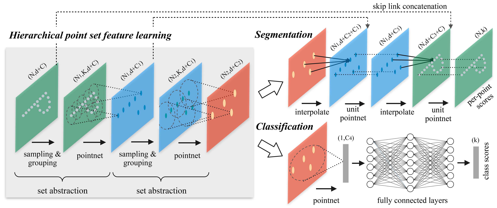
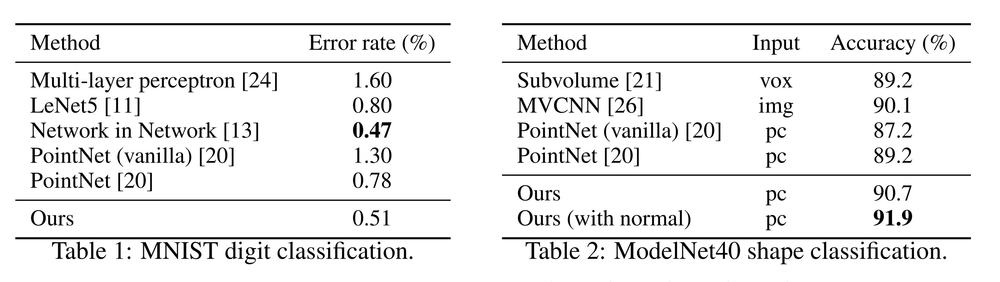
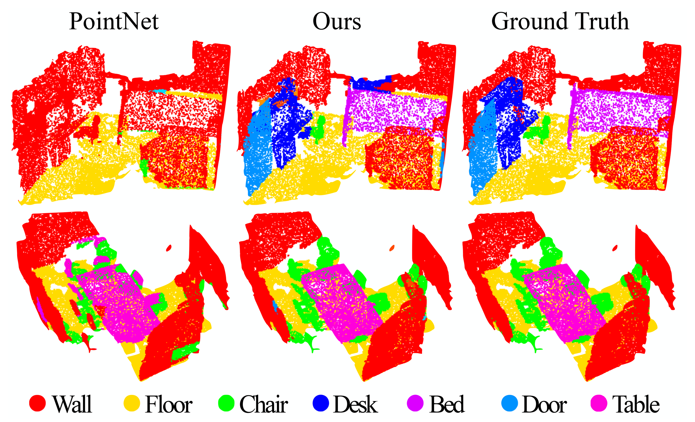
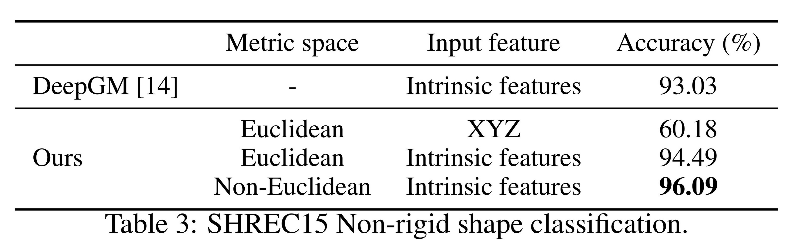

# 论文深度解析——《PointNet++: Deep Hierarchical Feature Learning on Point Sets in a Metric Space》

[TOC]

### 笔者前言

大约一个月前，我写了一篇[PointNet的论文解析](https://blog.csdn.net/liaoziqiang/article/details/144381151)，因为内容较晦涩且学术化，领域又比较窄，本以为应该没几个人看，结果一个月来观看数量竟达到1.2K，这里笔者郑重感谢大家对我小小工作的支持！今天带来的是上文预告过的PointNet++论文解析。相比于PointNet，PointNet++显然更为成熟，对于我们的项目而言也是更好的选择。它是对PointNet工作的扩展，因此，请读者务必**先阅读**[**PointNet的论文解析**](https://blog.csdn.net/liaoziqiang/article/details/144381151)，熟悉PointNet的架构和原理，然后再阅读本文。很多重复内容本文不会再次介绍。下面我给出了几个问题，读者可以进行自测，看看自己对PointNet的熟悉程度如何：

1. 什么是置换不变性（permutation invariance）？该文章还提到了哪些不变性？PointNet如何实现置换不变性？
2. 什么是关键点集（critical point set）？如何理解这些点的实际意义？你能通俗地描述定理2吗？
3. 请简单描述T-Net的主要功能。它的输入输出形式如何？它如何作用于整个网络？
4. 在语义分割任务中，PointNet 如何对局部特征与全局特征进行整合？
5. 你能否在不看原文的情况下，对照网络架构图（图2），追踪数据流动路径并说出每一个步骤的细节？

如果你能流畅地回答上面的问题，那么，恭喜你可以进行接下来的阅读了。本文基本延续PointNet论文解析的风格，同样主要面向想要理解PointNet原理的读者，尤其是刚走上科研道路的同学。我不仅会对原文设计的概念和背景知识进行扩展，而且会尽量给出我理解原文时的思维过程。同时，PointNet++论文相对PointNet而言内容较少，又涉及更多手动设计的步骤，因而我会尽可能结合代码，保证覆盖更多细节。当然，本人只是科研小白，水平有限，如果发现错误或者有改进意见，请读者不吝赐教。希望本文能够给大家的学习、科研带来帮助。如果您想要更好的阅读体验，可以进入[这个网页](https://liao-ziqiang.github.io/fyaxm-blog/pointnet/pointnet-pp-Interpretion.html)，走之前记得留个点赞和收藏哦~您还可以到相应的[GitHub仓库](https://github.com/Liao-Ziqiang/fyaxm-blog)获取原始文件。下面我们正式开始。

---------------

### Abstract (摘要)

> Few prior works study deep learning on point sets. PointNet [20] is a pioneer in this direction. However, by design, PointNet does not capture local structures induced by the metric space points live in, limiting its ability to recognize fine-grained patterns and generalizability to complex scenes. In this work, we introduce a hierarchical neural network that applies PointNet recursively on a nested partitioning of the input point set. By exploiting metric space distances, our network is able to learn local features with increasing contextual scales. With further observation that point sets are usually sampled with varying densities, which results in greatly decreased performance for networks trained on uniform densities, we propose novel set learning layers to adaptively combine features from multiple scales. Experiments show that our network called PointNet++ is able to learn deep point set features efficiently and robustly. In particular, results significantly better than state-of-the-art have been obtained on challenging benchmarks of 3D point clouds.

① 目前只有少量研究关注点集上的深度学习。PointNet [20] 是这一领域的先驱。② 然而，由于设计上的限制，PointNet 未能捕捉点集所在度量空间所诱导的局部结构，这限制了其识别细粒度模式的能力以及对复杂场景的泛化能力。③ 在本文中，我们提出了一种分层神经网络，它在输入点集的**嵌套划分**上**递归**应用 PointNet。通过利用度量空间距离，我们的网络能够学习具有逐步扩大的上下文尺度的局部特征。④ 此外，我们观察到，点集通常以不同的密度进行采样，这会显著降低在均匀密度上训练的网络的性能。针对这一问题，我们提出了一种新颖的集合学习层，用于自适应地结合来自多个尺度的特征。⑤ 实验表明，我们的网络 PointNet++ 能够高效且鲁棒地学习点集的深度特征。特别是，在挑战性的 3D 点云基准上，我们取得了显著优于当前技术水平的结果。

**解释**：

- [PointNet解析](https://blog.csdn.net/liaoziqiang/article/details/144381151)中已经详细解释了为什么针对点云的深度学习方法较少，总的来说原因在于点云的**不规则性**没能得到很好地解决。
- ②句是说，PointNet架构在点云任务上取得了很好的成绩，但它有一个很大的缺陷，即不能融合各个尺度上的信息。通俗来说，你可以将各个尺度看作是金字塔的层级，金字塔的顶端是全局信息，最底端是每个点的局部信息，而PointNet就是一个两层的金字塔。PointNet++则将这个金字塔修得更高一些，增加了一些中间层次，使得网络能够同时在多个层级上提取信息，如密度、曲率、局部形状等，因而大大增强了特征的提取能力。
- ③就说明了这种思想的具体体现：分层架构。它会通过递归地对点云进行分割和分组，逐步提取局部到全局的特征。这里需要解释两个词，首先是**嵌套划分**，这其实就是通过度量空间的距离（如欧几里得距离）将输入点云分割成局部区域，而且这种划分是嵌套的，即一个局部内部还会继续细分；然后是**递归**，我们可以这样理解，PointNet++是使用PointNet作为基本模块的，因此当PointNet++要提取点云的全局信息时，可以看作是调用函数`pointnet(pc)`，这个`pc`又会划分为`N`份，每一份都会调用`pointnet(pc[i])`，`pc[i]`又被划分为`M`份，每一份都调用`pointnet(pc[i][j])`，直到达到最大深度。对于顶层`pointnet(pc)`而言，它划分的`N`个部分每一个都被抽象为一个点，它相当于仅处理`N`个点的点云。每一个层级某个点的原始特征，事实上就是下一个层级对应区域的全局特征。这种调用结构就是一种递归结构。当然这只是理论结构，事实上点云处理顺序是自底向上的。
- ④句是说，这种依赖空间度量的划分方式会导致结果容易受点云密度分布的影响。在稀疏区域，小尺度邻域可能包含过少点，导致局部几何信息丢失。PointNet++通过两个手段解决这个问题：一是多尺度分组（Multi-Scale Grouping），使用多个半径划分邻域，每个邻域都进行特征提取，然后将它们进行融合，这样一来就避免了稀疏区域内容不全的问题；二是多分辨率分组（Multi-Resolution Grouping），它在同一个尺度下使用多个分辨率进行特征提取、融合。二者的具体原理和在网络中位置会在后面进行介绍，这里读者大致了解其思想即可。

---------------

### 1. Introduction (引入)

> We are interested in analyzing geometric point sets which are collections of points in a Euclidean space. A particularly important type of geometric point set is point cloud captured by 3D scanners, e.g., from appropriately equipped autonomous vehicles. As a set, such data has to be invariant to permutations of its members. In addition, the distance metric defines local neighborhoods that may exhibit different properties. For example, the density and other attributes of points may not be uniform across different locations — in 3D scanning, the density variability can come from perspective effects, radial density variations, motion, etc.

我们感兴趣的是分析几何点集，这些点集是欧几里得空间中的点的集合。一类特别重要的几何点集是通过 3D 扫描仪捕获的点云，例如，从配备适当设备的自动驾驶车辆中获取的数据。作为一个集合，这类数据需要对其成员的排列保持不变。此外，距离度量定义了局部邻域，这些邻域可能表现出不同的属性。例如，点的密度和其他属性在不同位置可能并不均匀——在 3D 扫描中，密度变化可能来自透视效应、径向密度变化、运动等因素。

**解释**：

- 通过3D扫描获得的点云和通过转换三维网格获得的点云有一个显著不同，即密度不均匀。例如，远处的物体点云总是更加稀疏；和传感器呈一定角度的面密度也较低，因为根据面积投影公式$A_{\text{proj}} = |A| \cdot |\cos\theta|$，这类表面投影到传感器后只占很小很扁的一部分，分辨率自然也较低。PointNet不需要根据空间距离进行分块，因此没有专门讨论这个问题，但PointNet++则必须提出解决方案。

---

> Few prior works study deep learning on point sets. PointNet [20] is a pioneering effort that directly processes point sets. The basic idea of PointNet is to learn a spatial encoding of each point and then aggregate all individual point features to a global point cloud signature. By its design, PointNet does not capture local structure induced by the metric. However, exploiting local structure has proven to be important for the success of convolutional architectures. A CNN takes data defined on regular grids as the input and is able to progressively capture features at increasingly larger scales along a multi-resolution hierarchy. At lower levels, neurons have smaller receptive fields, whereas at higher levels, they have larger receptive fields. The ability to abstract local patterns along the hierarchy allows better generalizability to unseen cases.

① 目前只有少量研究关注点集上的深度学习。PointNet [20] 是一个开创性的工作，它直接处理点集。PointNet 的基本思想是学习每个点的空间编码，然后将所有点的特征聚合为一个全局点云特征。然而，由于设计上的限制，PointNet 未能捕捉度量诱导的局部结构。② 然而，利用局部结构对于卷积架构的成功已被证明是重要的。卷积神经网络（CNN）以规则网格上的数据作为输入，能够沿着多分辨率层次结构逐步捕获不同尺度的特征。在较低的层次，神经元具有较小的感受野，而在较高层次，感受野更大。沿着层次结构抽象局部模式的能力使其对未见案例具有更好的泛化能力。

**解释**：

- ①句和摘要部分基本一致，不再赘述。②句说明了本文的灵感来源，即CNN。CNN的成功证明了多层次抽象局部模式具有更好的泛化能力，这一方面是因为它可以看作是一种更高级的思维，另一方面则是因为对小尺度信息的整合可以看作是一个“降噪”过程，通过将各个局部看做一个整体，高层可以更加关注它的整体特征、核心特征，而不会被一些微小扰动和冗余噪声影响，这部分我在[这篇文章](https://blog.csdn.net/liaoziqiang/article/details/143206275)中有过一定的介绍。

---

> We introduce a hierarchical neural network, named PointNet++, to process a set of points sampled in a metric space in a hierarchical fashion. The general idea of PointNet++ is simple. We first partition the set of points into overlapping local regions by the distance metric of the underlying space. Similar to CNNs, we extract local features capturing fine geometric structures from small neighborhoods; such local features are further grouped into larger units and processed to produce higher-level features. This process is repeated until we obtain the features of the whole point set.

我们提出了一种分层神经网络，称为 PointNet++，以分层方式处理采样于度量空间中的点集。PointNet++ 的核心思想很简单。我们首先根据底层空间的距离度量将点集划分为重叠的局部区域。类似于 CNN，我们从小的邻域中提取捕捉细粒度几何结构的局部特征；这些局部特征进一步组合成更大的单元并进行处理，以生成更高层次的特征。这个过程重复进行，直到提取出整个点集的全局特征。

**解释**：

- 这里先初步介绍空间划分的基本思想。首先，它是重叠的，这意味着每个分块都和相邻分块有一部分重叠的区域，这使得特征提取更加细致，连续性更强，读者可以类比为卷积操作中的步长，每次卷积操作的区域一般都是有重叠区域的。其次，它是基于**最远点采样**（Farthest Point Sampling, FPS）的，这是一种对点云进行采样的算法，类似算法还有随机采样。FPS需要一个参数 $k$，代表需要采样的点的数量，具体原理我会在后文介绍，这里读者只需要知道它能够保证最大覆盖，且能最大限度保留点的分布特征。选出这 $k$ 个点后，就分别以这 $k$ 个点为球心构建邻域进行划分。这里暂时留一个问题：半径的选择策略。如果半径过小，可能会导致某些点或区域没有被任何球形邻域包含，从而丢失信息；如果半径过大，可能会导致局部特征被“稀释”，从而无法捕获点云的细节。

-----------

> The design of PointNet++ has to address two issues: how to generate the partitioning of the point set, and how to abstract sets of points or local features through a local feature learner. The two issues are correlated because the partitioning of the point set has to produce common structures across partitions, so that weights of local feature learners can be shared, as in the convolutional setting. We choose our local feature learner to be PointNet. As demonstrated in that work, PointNet is an effective architecture to process an unordered set of points for semantic feature extraction. In addition, this architecture is robust to input data corruption. As a basic building block, PointNet abstracts sets of local points or features into higher level representations. In this view, PointNet++ applies PointNet recursively on a nested partitioning of the input set.

PointNet++ 的设计需要解决两个问题：如何生成点集的划分，以及如何通过局部特征学习器对点集或局部特征进行抽象。① 这两个问题是相关的，因为点集的划分必须在不同划分之间产生共同结构，以便局部特征学习器的权重可以共享，如同卷积设置一样。② 我们选择 PointNet 作为局部特征学习器。正如该工作所示，PointNet 是一种有效的架构，用于处理无序点集以进行语义特征提取。此外，该架构对输入数据的损坏具有鲁棒性。作为一个基本构建块，PointNet 能够将局部点或特征集合抽象为更高层次的表示。从这一视角来看，PointNet++ 在输入点集的嵌套划分上递归应用 PointNet。

**解释**：

- 关于“权重共享”部分，读者结合CNN的知识应该就能理解。这里需要说明一点，即参数共享仅发生在同一层次中，这同样类比于CNN。不同层次之间对应的是不同尺度的特征，需要不同的网络进行提取，因而具体参数是不一样的。事实上，各层虽然都是用PointNet网络，但网络的超参数，如网络大小是不一样的。这不难理解，除了最后一层是对三维空间进行处理外，剩下的部分都是对特征空间进行处理，而每一层的特征维度设置是不同的，因而网络大小也自然不同。
- 对于②句，我们可以回顾一下为什么PointNet善于处理无序点集，且对输入数据的损坏具有鲁棒性。这部分对应PointNet的4.3小节的定理一和定理二，读者如果忘记了可以返回[这里](https://blog.csdn.net/liaoziqiang/article/details/144381151)复习一下。简单概括，就是PointNet使用了对称函数，且输出结果仅依赖于关键点集。

---

> One issue that still remains is how to generate overlapping partitioning of a point set. Each partition is defined as a neighborhood ball in the underlying Euclidean space, whose parameters include centroid location and scale. To evenly cover the whole set, the centroids are selected among input point set by a farthest point sampling (FPS) algorithm. Compared with volumetric CNNs that scan the space with fixed strides, our local receptive fields are dependent on both the input data and the metric, and thus more efficient and effective.

一个仍需解决的问题是如何生成点集的重叠划分。每个划分定义为底层欧几里得空间中的邻域球，其参数包括中心位置和尺度。为了均匀覆盖整个点集，中心点通过最远点采样（FPS）算法从输入点集中选择。与通过固定步长扫描空间的体素 CNN 相比，我们的局部感受野依赖于输入数据和度量，因此更加高效且有效。

**解释**：

- PointNet论文已经提到，点云是一种非规范化的数据格式。我们可以参照CNN，将点云划分为固定大小的网格进行处理。但作者选择了FPS采样算法，这使得采样点的分布不是依赖固定尺度的，而是根据点云自身的分布状况决定的。这可以最大化利用有限的采样数量，即保证完全覆盖，又避免浪费。

----------


**Figure 1:** Visualization of a scan captured from a Structure Sensor (left: RGB; right: point cloud).

**图1：** 从结构传感器捕获的扫描的可视化（左：RGB；右：点云）。

---

> Deciding the appropriate scale of local neighborhood balls, however, is a more challenging yet intriguing problem, due to the entanglement of feature scale and non-uniformity of input point set. We assume that the input point set may have variable density at different areas, which is quite common in real data such as Structure Sensor scanning. Our input point set is thus very different from CNN inputs which can be viewed as data defined on regular grids with uniform constant density. In CNNs, the counterpart to local partition scale is the size of kernels. Research shows that using smaller kernels helps to improve the ability of CNNs. Our experiments on point set data, however, give counter evidence to this rule. Small neighborhoods may consist of too few points due to sampling deficiency, which might be insufficient to allow PointNets to capture patterns robustly.

然而，如何确定局部邻域球的合适尺度是一个更具挑战性且有趣的问题，这主要是由于特征尺度与输入点集非均匀性的相互纠缠。我们假设输入点集在不同区域可能具有可变密度，这在诸如Structure Sensor扫描这样的真实数据中非常常见。因此，我们的输入点集与CNN的输入数据有很大不同，后者可以被视为定义在规则网格上、具有均匀密度的数据。在CNN中，与局部划分尺度对应的是卷积核的大小。① 研究表明，使用较小的卷积核有助于提高CNN的能力。② 然而，我们针对点集数据的实验对这一规律提供了相反的证据。由于采样不足，小邻域可能仅包含过少的点，这可能不足以让PointNet稳健地捕捉模式。

**解释**：

- 对于①句，在CNN中，较小的卷积能够减少参数量，从而降低过拟合的可能；同时，较小的卷积核导致更多的层级，其非线性表达能力也会更强。VGG 网络（如 VGG-16 和 VGG-19）作为经典的 CNN 架构，就完全采用了 3×3 的卷积核。
- 然而，情况在点云处理时有所不同。我个人对②句的理解是，首先，点的局部特征不取决于它自己，而取决于它在整体中所处的位置和功能，每个点都不是孤立的。例如，单个点是无法定义曲率的，但一旦有了多个点，每个点就有了自己的曲率。因而，邻域大小不可太大，但也决不能太小；其次，点云的密度是不均匀的，如果邻域太小，则可能出现稀疏区域的小邻域可能包含过少的点，导致特征不足以表达局部的几何特征。此外，点过少还容易受到噪声影响。

-----------------

> A significant contribution of our paper is that PointNet++ leverages neighborhoods at multiple scales to achieve both robustness and detail capture. Assisted with random input dropout during training, the network learns to adaptively weight patterns detected at different scales and combine multi-scale features according to the input data. Experiments show that our PointNet++ is able to process point sets efficiently and robustly. In particular, results that are significantly better than state-of-the-art have been obtained on challenging benchmarks of 3D point clouds.

我们论文的一项重要贡献是PointNet++利用多尺度邻域来同时实现鲁棒性和细节捕捉。在训练过程中辅助随机输入丢弃，网络能够自适应地对不同尺度下检测到的模式进行加权，并根据输入数据结合多尺度特征。实验表明，我们的PointNet++能够高效且稳健地处理点集。特别是在具有挑战性的3D点云基准测试中，PointNet++取得了显著优于现有技术的结果。

**解释**：

- 这一段引出了一个关键创新，即**多尺度分组**（MSG, Multi-Scale Grouping）。既然不存在一个固定的尺度，那么就在多个尺度上同时进行特征提取，然后进行整合。注意这里是在同一层次使用不同半径，这些邻域之间不存在嵌套关系。具体技术细节见第三章。

---------------

### 2. Problem Statement (问题陈述)

> Suppose that $\mathcal{X}=(M,d)$ is a discrete metric space whose metric is inherited from a Euclidean space $\mathbb{R}^n$, where $M \subseteq \mathbb{R}^n$ is the set of points and $d$ is the distance metric. In addition, the density of $M$ in the ambient Euclidean space may not be uniform everywhere. We are interested in learning set functions $f$ that take such $\mathcal{X}$ as the input (along with additional features for each point) and produce information of semantic interest regarding $\mathcal{X}$. In practice, such $f$ can be a classification function that assigns a label to $\mathcal{X}$ or a segmentation function that assigns a per-point label to each member of $M$.

假设 $\mathcal{X}=(M,d)$ 是一个离散度量空间，其度量继承自欧几里得空间 $\mathbb{R}^n$，其中 $M \subseteq \mathbb{R}^n$ 是点集，$d$ 是距离度量。此外，$M$ 在欧几里得空间中的密度可能不是处处均匀的。我们感兴趣的是学习函数 $f$，该函数以这样的 $\mathcal{X}$ 作为输入（以及每个点的附加特征），并生成关于 $\mathcal{X}$ 的语义信息。在实践中，这样的 $f$ 可以是一个分类函数，将标签分配给 $\mathcal{X}$，也可以是一个分割函数，为 $M$ 中的每个点分配一个标签。

-------------

### 3. Method (方法)

> Our work can be viewed as an extension of PointNet [20] with added hierarchical structure. We first review PointNet (Sec. 3.1) and then introduce a basic extension of PointNet with hierarchical structure (Sec. 3.2). Finally, we propose our PointNet++ that is able to robustly learn features even in non-uniformly sampled point sets (Sec. 3.3).

我们的工作可以被视为对PointNet [20] 的扩展，增加了层次结构。我们首先回顾PointNet (第3.1节)，然后介绍一个带有层次结构的PointNet基本扩展 (第3.2节)。最后，我们提出了PointNet++，即使在非均匀采样的点集中也能够稳健地学习特征 (第3.3节)。

**解释**：

- 读者可以在[PointNet++的Github主页](https://github.com/charlesq34/pointnet2)下载PointNet++的源代码。进入项目目录，然后进入`./models`，可以看到六个文件。下面我们会以识别物体类别为例结合代码讲解。
- 其中，`pointnet_cls_basic.py`是PointNet的实现 (第3.1节)，`pointnet2_cls_ssg.py`则实现了SSG（Single Scale Grouping）(第3.2节)，`pointnet2_cls_msg.py`则实现了前面提到的MSG（Multi-Scale Grouping），即PointNet++ (第3.3节)。

-------------

#### 3.1 PointNet [20] 综述：一个通用的连续集合函数近似器

> Given an unordered point set $\{x_1,x_2,\ldots,x_n\}$ with $x_i \in \mathbb{R}^d$, one can define a set function $f:\mathcal{X} \to \mathbb{R}$ that maps a set of points to a vector:
> $$
> f\left( {{x_1},{x_2}, \ldots ,{x_n}} \right) = \gamma \left( {\mathop {{\mathop{\rm MAX}\nolimits} }\limits_{i = 1, \ldots ,n} \left\{ {h\left( {{x_i}} \right)} \right\}} \right)\ \quad \quad (1)
> $$
> where $\gamma$ and $h$ are usually multi-layer perceptron (MLP) networks.
>
> The set function $f$ in Eq. 1 is invariant to input point permutations and can arbitrarily approximate any continuous set function [20]. Note that the response of $h$ can be interpreted as the spatial encoding of a point (see [20] for details).
>
> PointNet achieved impressive performance on a few benchmarks. However, it lacks the ability to capture local context at different scales. We will introduce a hierarchical feature learning framework in the next section to resolve the limitation.

给定一个无序点集 $\{x_1,x_2,\ldots,x_n\}$，其中 $x_i \in \mathbb{R}^d$，可以定义一个集合函数 $f:\mathcal{X} \to \mathbb{R}$，将一组点映射为一个向量：
$$
f\left( {{x_1},{x_2}, \ldots ,{x_n}} \right) = \gamma \left( {\mathop {{\mathop{\rm MAX}\nolimits} }\limits_{i = 1, \ldots ,n} \left\{ {h\left( {{x_i}} \right)} \right\}} \right)\ \quad \quad (1)
$$
其中 $\gamma$ 和 $h$ 通常是多层感知机（MLP）网络。

公式 (1) 中的集合函数 $f$ 对输入点的排列具有不变性，并且可以任意逼近任何连续集合函数 [20]。注意，$h$ 的输出可以被解释为点的空间编码（详情见 [20]）。

PointNet 在一些基准测试上取得了令人印象深刻的性能。然而，它缺乏在不同尺度上捕捉局部上下文的能力。我们将在下一节引入一个分层特征学习框架来解决这一局限性。

**解释**：

- 这部分读者如果已经理解了PointNet的原理和架构，应该不难理解。这里简单回顾：公式(1)在PointNet 4.3小节，排列不变性和任意逼近能力在4.3小节定理一。
- 这里再说明为什么说 $h$ 的输出可以被解释为点的空间编码。在PointNet中，点与点之间的信息仅在最大池化时进行了整合，在之前（即$h$函数）的处理中，每个点都是单独处理的，而每个点的初始信息默认情况下只有三维坐标，因而最终输出的特征向量就仅是对这个坐标的重新编码，即空间编码。

-----------

#### 3.2 层次化点集特征学习

> While PointNet uses a single max pooling operation to aggregate the whole point set, our new architecture builds a hierarchical grouping of points and progressively abstracts larger and larger local regions along the hierarchy.

PointNet 使用单一的最大池化操作来聚合整个点集，而我们的新架构通过分层分组点的方式，逐级抽象出越来越大的局部区域。

> 本小节所用代码均来自`./models/pointnet2_cls_ssg.py`即其相关代码。

------------------



**Figure 2:** Illustration of our hierarchical feature learning architecture and its application for set segmentation and classification using points in 2D Euclidean space as an example. Single scale point grouping is visualized here. For details on density adaptive grouping, see Fig. 3

**图2：** 我们的层次特征学习架构的示意图及其在二维欧几里得空间中使用点进行集合分割和分类的应用。这里可视化了单尺度点分组。有关密度自适应分组的详细信息，请参见图3。

-------

> Our hierarchical structure is composed of a number of *set abstraction* levels (Fig. 2). At each level, a set of points is processed and abstracted to produce a new set with fewer elements. The set abstraction level is made of three key layers: *Sampling layer,* *Grouping layer*, and *PointNet layer*. The *Sampling layer* selects a set of points from input points, which defines the centroids of local regions. The *Grouping layer* then constructs local region sets by finding “neighboring” points around the centroids. The *PointNet layer* uses a mini-PointNet to encode local region patterns into feature vectors.

我们的层次结构由多个集合抽象级别组成（如图2所示）。在每个级别，一组点被处理并抽象，生成具有更少元素的新集合。集合抽象级别由三个关键层组成：采样层、分组层和PointNet层。采样层从输入点中选择一组点，定义为局部区域的中心点。分组层随后通过找到这些中心点附近的“邻近”点来构造局部区域集合。PointNet层使用一个小型PointNet对局部区域模式进行编码并生成特征向量。

**解释**：

- 通俗来说，就是PointNet++的处理步骤是多级的，每一级又细分为三个步骤，首先确定以哪些点为中心进行分组；然后以这些点为中心，将一定半径内的点归为一组；最后对每一组执行PointNet得到一个特征向量，反映每一组的组内全局特征。
- 采样层和分组层对应`pointnet_util.py`的`sample_and_group`函数

----------

> A set abstraction level takes an $N \times (d + C)$ matrix as input that is from $N$ points with $d$-dim coordinates and $C$-dim point feature. It outputs an $N' \times (d + C')$ matrix of $N'$ subsampled points with $d$-dim coordinates and new $C'$-dim feature vectors summarizing local context. We introduce the layers of a set abstraction level in the following paragraphs.

一个集合抽象级别以 $N \times (d + C)$ 矩阵作为输入，这个矩阵代表 $N$ 个点，每个点具有 $d$ 维坐标和 $C$ 维点特征。它输出一个 $N' \times (d + C')$ 矩阵，这个矩阵代表 $N'$ 个子采样点，这些点具有 $d$ 维坐标以及新的 $C'$ 维特征向量，后者总结了局部上下文。我们将在接下来的段落中介绍集合抽象级别的各层。

**解释**：

- 核心处理代码如下：

  ```python
  l1_xyz, l1_points, l1_indices = pointnet_sa_module(l0_xyz, l0_points, npoint=512, radius=0.2, nsample=32, mlp=[64,64,128], mlp2=None, group_all=False, is_training=is_training, bn_decay=bn_decay, scope='layer1', use_nchw=True)
  l2_xyz, l2_points, l2_indices = pointnet_sa_module(l1_xyz, l1_points, npoint=128, radius=0.4, nsample=64, mlp=[128,128,256], mlp2=None, group_all=False, is_training=is_training, bn_decay=bn_decay, scope='layer2')
  l3_xyz, l3_points, l3_indices = pointnet_sa_module(l2_xyz, l2_points, npoint=None, radius=None, nsample=None, mlp=[256,512,1024], mlp2=None, group_all=True, is_training=is_training, bn_decay=bn_decay, scope='layer3')
  ```

  带`xyz`后缀的是 $d$ 维坐标，带`points`后缀的是 $C$ 维特征。`xyz`一开始表示点的坐标，后来则表示分块的中心坐标。虽然特征已经包含了对位置的编码，但剩余层仍然会将原始坐标信息拼接在 $C$ 维特征中。

-----------

> **Sampling layer.** Given input points $\{x_1, x_2, \ldots, x_n\}$, we use iterative farthest point sampling (FPS) to choose a subset of points $\{x_{i_1}, x_{i_2}, \ldots, x_{i_m}\}$, such that $x_{i_j}$ is the most distant point (in metric distance) from the set $\{x_{i_1}, x_{i_2}, \ldots, x_{i_{j-1}}\}$ with regard to the rest points. Compared with random sampling, it has better coverage of the entire point set given the same number of centroids. In contrast to CNNs that scan the vector space agnostic of data distribution, our sampling strategy generates receptive fields in a data-dependent manner.

**采样层（Sampling layer）。** 给定输入点集 $\{x_1, x_2, \ldots, x_n\}$，我们使用迭代最远点采样（Iterative Farthest Point Sampling, FPS）从中选择一个子集 $\{x_{i_1}, x_{i_2}, \ldots, x_{i_m}\}$，其中 $x_{i_j}$ 是与集合 $\{x_{i_1}, x_{i_2}, \ldots, x_{i_{j-1}}\}$ 中的点相比，距离最远的点（基于度量距离）。与随机采样相比，在相同数量的采样点下，FPS 能更好地覆盖整个点集。与卷积神经网络（CNN）中对数据分布无关的扫描方式相比，我们的采样策略能够以数据为中心生成感受野。

**解释**：

- 这里结合代码介绍下FPS算法的原理和步骤，主要代码位于`./tf_ops/sampling/tf_sampling_g.cu`：
  - 首先，从点集$P$中任选一个初始点$s_1$，定义集合$S = \{s_1\}$，代码直接选取了索引为$0$的点
  - 接下来遍历所有点$s_k$并计算$d(s_k, S)$，找到$d(s_k, S)$最大的点作为$s_2$放入$S$中
    - 这里首先要定义点到集合的距离，PointNet++的定义是$d(s, S) = \min_{t \in S} \|s - t\|$，即该点和集合中所有点的距离的最小值
    - 这里的思想是最大化最小值，通俗来说，就是和集合中最近的点都最远，那么它离整个集合也就最远
    - 代码中，点到集合的距离是动态更新的，不会每次都重复计算。它存储在`farthestpointsamplingKernel`函数的`td`数组中
  - 重复上述过程，直到成功选出$m$个点
- 这里初始点的选择是随机的，因而存在不确定性。不过作者在附录C.3部分进行了实验，发现不同随机种子下，结果能够保持稳定。

------------

> **Grouping layer.** The input to this layer is a point set of size $N \times (d + C)$ and the coordinates of a set of centroids of size $N' \times d$. The output are groups of point sets of size $N' \times K \times (d + C)$, where each group corresponds to a local region and $K$ is the number of points in the neighborhood of centroid points. Note that $K$ varies across groups but the succeeding PointNet layer is able to convert a flexible number of points into a fixed-length local region feature vector.

**分组层（Grouping layer）。** 该层的输入是大小为 $N \times (d + C)$ 的点集，以及大小为 $N' \times d$ 的一组中心点坐标。输出为大小为 $N' \times K \times (d + C)$ 的点集分组，其中每一组对应一个局部区域，$K$ 是中心点邻域中的点的数量。需要注意的是，$K$ 在不同的分组中可能不同，但后续的 PointNet 层能够将可变数量的点转换为固定长度的局部区域特征向量。

**解释**：

- 由于采样和分组实现在同一个函数中，所以一起讲解。下面是完整代码：

  ```python
  def sample_and_group(npoint, radius, nsample, xyz, points, knn=False, use_xyz=True):
      new_xyz = gather_point(xyz, farthest_point_sample(npoint, xyz)) # (batch_size, npoint, 3)
      if knn:
          _,idx = knn_point(nsample, xyz, new_xyz)
      else:
          idx, pts_cnt = query_ball_point(radius, nsample, xyz, new_xyz)
      grouped_xyz = group_point(xyz, idx) # (batch_size, npoint, nsample, 3)
      grouped_xyz -= tf.tile(tf.expand_dims(new_xyz, 2), [1,1,nsample,1]) # translation normalization
      if points is not None:
          grouped_points = group_point(points, idx) # (batch_size, npoint, nsample, channel)
          if use_xyz:
              new_points = tf.concat([grouped_xyz, grouped_points], axis=-1) # (batch_size, npoint, nample, 3+channel)
          else:
              new_points = grouped_points
      else:
          new_points = grouped_xyz
      return new_xyz, new_points, idx, grouped_xyz
  ```

- 第2行：`farthest_point_sample(npoint, xyz)`是从所有点的坐标中，通过FPS算法找到`npoint`个点（即$N'$个点），返回它们的索引。`gather_point(xyz, farthest_point_sample(npoint, xyz))`则是使用这些索引找出这些点的真实坐标。这就是采样层。

- 第6行：对于每个采样的点，`query_ball_point`会以它为半径画一个球，将所有包裹的点纳入一个组。这里返回的同样是索引。`group_point(xyz, idx)`则将这些索引对应的坐标提取出来。注意这一步输出的大小是`(batch_size, npoint, nsample, 3)`，然而每个邻域其实不可能正好有`nsample`（即$K$）个点。解决方案是：对点云中的所有点进行遍历，求它们和采样点的距离，小于`r`就纳入该组，数量达到`nsample`后直接停止退出；如果不足`nsample`，则使用找到的第一个点云填充缺失部分。不可能找不到任何点，因为至少该点自身会被纳入。详细代码见`./tf_ops/grouping/tf_grouping_g.cu`中的`query_ball_point_gpu`函数。根据PointNet论文定理二，缺失时的填充操作对输出结果不会有影响。当然，这个操作会增加计算量，但考虑到填充后有利于并行性，这个代价也是合理的。`knn`策略是选择 $k$ 个最近的点，该算法效果较差。

- 第8行：这里做了三件事，首先是使用`tf.expand_dims(new_xyz, 2)`将`new_xyz`的维度扩展为`(batch_size, npoint, 1, 3)`，然后再通过复制第三维扩展为`(batch_size, npoint, nsample, 3)`。此时，后两个维度就是一个重复的列表，每个元素都是当前分组中心点的坐标，和当前分组的所有点一一对应。这个操作主要是为了方便并行计算，避免遍历。最后，使用`-=`将分组内所有点坐标减去中心点坐标，位置上完成平移归一化。这里不会进行放缩，推测是因为放缩会破坏尺度信息。

- 在`l1`层，输入的`l0_points`是`None`，因为不存在初始特征，我们需要从原始坐标中提取特征，因而第16行直接将`grouped_xyz`作为初始特征送入PointNet层。对于后面的层，则是将特征按照前面的分组重新排列送入PointNet层。`use_xyz`在代码中一直是保持为`True`的，意味着原始坐标在各个层次中都作为特征保留。

-----------

> In convolutional neural networks, a local region of a pixel consists of pixels with array indices within a certain Manhattan distance (kernel size) of the pixel. In a point set sampled from a metric space, the neighborhood of a point is defined by metric distance.
>
> Ball query finds all points that are within a radius to the query point (an upper limit of $K$ is set in implementation). An alternative range query is K nearest neighbor (kNN) search which finds a fixed number of neighboring points. Compared with kNN, ball query’s local neighborhood guarantees a fixed region scale, thus making local region features more generalizable across space, which is preferred for tasks requiring local pattern recognition (e.g. semantic point labeling).

① 在卷积神经网络中，一个像素的局部区域由其曼哈顿距离（即内核大小）范围内的像素组成。而在从度量空间中采样得到的点集里，一个点的邻域由其度量距离定义。

球查询（Ball query）找到所有位于查询点一定半径范围内的点（在实现中设置了 $K$ 的上限）。另一种范围查询方法是 $k$ 近邻（kNN）搜索，它找到固定数量的邻近点。与 kNN 相比，球查询的局部邻域保证了固定的区域尺度，从而使得局部区域特征在空间中更具泛化性，这在需要局部模式识别的任务（例如语义点标注）中更为优越。

**解释**：

- ①句说的是CNN和本论文如何对邻域进行定义。数学往往追求通用性，希望在不同系统中都定义一个统一的度量，比如距离。这里PointNet使用了欧式距离进行度量，将点云划分为一个个部分；离散的像素空间则使用**曼哈顿距离**。这里可能是一个错误，因为曼哈顿距离 $d_M=r$ 构建的是一个菱形，或旋转 $45 \degree$的正方形，边长为 $\sqrt{2}r$，与作者描述似乎不符。像素的局部区域应该使用**切比雪夫距离**进行定义，对于图像 $I$ 中的像素点 $p$，其邻域为 $\{q \mid d_C(p, q) \le r \and q \in I\}$，其中 $d_C(p, q) = \max(|x_p - x_q|, |y_p - y_q|)$，$r = \left\lfloor k/2 \right\rfloor$，$k$ 为卷积核大小。读者可以自行验证。
- kNN策略的实现在`./tf_ops/grouping/tf_grouping_g.cu`中的`selection_sort_gpu`函数。它是一种基于选择排序的算法，每次都从所有未排序点中找到和中心点距离最短的点，迭代$k$次即结束。同样返回索引。

---

> **PointNet layer.** In this layer, the input consists of $N'$ local regions of points with data size $N' \times K \times (d + C)$. Each local region in the output is abstracted by its centroid and local feature that encodes the centroid’s neighborhood. The output data size is $N' \times (d + C')$.
>
> The coordinates of points in a local region are firstly translated into a local frame relative to the centroid point:
>
> $$
> x_i^{(j)} = x_i^{(j)} - \hat{x}^{(j)} \quad \text{for } i = 1, 2, \ldots, K \text{ and } j = 1, 2, \ldots, d
> $$
>
> where $\hat{x}$ is the coordinate of the centroid. We use PointNet [20] as described in Sec. 3.1 as the basic building block for local pattern learning. By using relative coordinates together with point features, we can capture point-to-point relations in the local region.

**PointNet 层。** 该层的输入由 $N'$ 个局部区域的点组成，数据大小为 $N' \times K \times (d + C)$。输出中，每个局部区域由其中心点及编码中心点邻域的局部特征抽象而成，数据大小为 $N' \times (d + C')$。

局部区域内的点的坐标首先被转换为相对于中心点的局部坐标系：

$$
x_i^{(j)} = x_i^{(j)} - \hat{x}^{(j)} \quad \text{for } i = 1, 2, \ldots, K \text{ and } j = 1, 2, \ldots, d
$$

其中 $\hat{x}$ 是中心点的坐标。我们使用第 3.1 节中描述的 PointNet [20] 作为局部模式学习的基本构建模块。通过采用相对坐标以及点特征，我们能够捕获局部区域内点与点之间的关系。

**解释**：

- 坐标的平移变换事实上是在前面的`sample_and_group`函数中实现的。

- PointNet层实现在`./utils/pointnet_utils.py`的`pointnet_sa_module`函数中，以下是源码：

  ```python
  def pointnet_sa_module(xyz, points, npoint, radius, nsample, mlp, mlp2, group_all, is_training, bn_decay, scope, bn=True, pooling='max', knn=False, use_xyz=True, use_nchw=False):
      data_format = 'NCHW' if use_nchw else 'NHWC'
      with tf.variable_scope(scope) as sc:
          # Sample and Grouping
          if group_all:
              nsample = xyz.get_shape()[1].value
              new_xyz, new_points, idx, grouped_xyz = sample_and_group_all(xyz, points, use_xyz)
          else:
              new_xyz, new_points, idx, grouped_xyz = sample_and_group(npoint, radius, nsample, xyz, points, knn, use_xyz)
  
          # Point Feature Embedding
          if use_nchw: new_points = tf.transpose(new_points, [0,3,1,2])
          for i, num_out_channel in enumerate(mlp):
              new_points = tf_util.conv2d(new_points, num_out_channel, [1,1], padding='VALID', bn=bn, 
                                          stride=[1,1], is_training=is_training, scope='conv%d'%(i), 
                                          bn_decay=bn_decay, data_format=data_format) 
          if use_nchw: new_points = tf.transpose(new_points, [0,2,3,1])
  
          # Pooling in Local Regions
          if pooling=='max':
              new_points = tf.reduce_max(new_points, axis=[2], keep_dims=True, name='maxpool')
          elif pooling=='avg':
              new_points = tf.reduce_mean(new_points, axis=[2], keep_dims=True, name='avgpool')
          elif pooling=='weighted_avg':
              # 省略
          elif pooling=='max_and_avg':
              # 省略
  
          # [Optional] Further Processing 
          # 省略
  
          new_points = tf.squeeze(new_points, [2]) # (batch_size, npoints, mlp2[-1])
          return new_xyz, new_points, idx
  ```

- 第5\~9行：这部分是采样层和分组层。`sample_and_group_all`可以简单理解为`sample_and_group`在`npoints=1`时的情况，此时将所有点纳入到同一个组中，因此可以简化操作，不必再划分邻域进行查找，而是直接进行聚合。

- 第11\~19行：这部分对应MLP模块（$h$ 函数），即特征提取模块。`new_points`被逐层更新，最终输出时更新为各点对应的向量。同一层级下，所有分组使用的参数是共享的。读者可以回顾下这个公式：
  $$
  \gamma \left( {\mathop {{\mathop{\rm MAX}\nolimits} }\limits_{i = 1, \ldots ,n} \left\{ {h\left( {{x_i}} \right)} \right\}} \right)\
  $$

- 第19\~27行：这部分对应$\rm MAX$函数，即对称函数部分。其中默认使用的是`pooling='max'`，即最大池化（翻译为池化可能产生误导，因为它和常见的CNN中的池化层不太一样。我一直认为Pooling这里翻译为“聚合”更合适）。这里四个模式都是对称的，`max_and_avg`模式其实就是把最大池化和平均池化产生的向量进行拼接。`weighted_avg`则是一种加权平均，它根据点到采样点（中心点）的距离进行加权，计算邻域点特征的加权平均值。根据PointNet的实验，使用`max`效果最佳，因为它相当于提取关键点集。

- 第32行：前面经过了最大池化后，第三个维度仅剩一个整合后的向量，因此可以删去，此处使用`tf.squeeze`实现。

---

#### 3.3 在非均匀采样密度下的鲁棒特征学习

> As discussed earlier, it is common that a point set comes with non-uniform density in different areas introduces a significant challenge for point set feature learning. Features learned in dense data may not generalize to sparsely sampled regions. Consequently, models trained for sparse point clouds may not recognize fine-grained local structures.

如前所述，点集在不同区域内通常具有非均匀密度，这对点集特征学习提出了重大挑战。在密集数据中学习到的特征可能无法泛化到稀疏采样的区域。因此，为稀疏点云训练的模型可能无法识别精细的局部结构。

**解释**：

- 3.2小节的方法引入了递归结构，但它虽然使用FPS算法保证了最大覆盖，但半径设置对于每个层级是固定的，这导致稀疏区域可能出现未覆盖空间。本小节解决该问题。
- 本小节讲解代码均来自`./models/pointnet2_cls_msg.py`及其相关代码。

-----------


**Figure 3:** (a) Multi-scale grouping (MSG); (b) Multiresolution grouping (MRG).

**图3：**(a) 多尺度分组（MSG）；(b) 多分辨率分组（MRG）。

---

> Ideally, we want to inspect as closely as possible into a point set to capture the finest details in densely sampled regions. However, such close inspection is prohibited in low-density areas because local patterns may be corrupted by the sampling deficiency. In this case, we should look for larger scale patterns in greater vicinity. To achieve this goal, we propose density adaptive PointNet layers (Fig. 3) that learn to combine features from regions of different scales when the input sampling density changes. We call our hierarchical network with density adaptive PointNet layers *PointNet++*.
>
> Previously, in Sec. 3.2, each abstraction level contains grouping and feature extraction of a single scale. In PointNet++, each abstraction level extracts multiple scales of local patterns and combines them intelligently according to local point densities. In terms of grouping local regions and combining features from different scales, we propose two types of density adaptive layers as listed below.

理想情况下，我们希望尽可能仔细地检查点集，以捕获密集采样区域中的最精细细节。然而，在低密度区域中，这种仔细检查可能因为采样不足而导致局部模式被破坏。在这种情况下，我们应当在更大的邻域范围内寻找更大尺度的模式。为实现这一目标，我们提出了密度自适应 PointNet 层（如图 3 所示），该层能够在输入采样密度变化时，学习如何结合来自不同尺度的特征。我们将含有密度自适应 PointNet 层的分层网络称为 PointNet++。

在前文第 3.2 节中，每个抽象层仅包含单一尺度的分组和特征提取。而在 PointNet++ 中，每个抽象层提取多个尺度的局部模式，并根据局部点密度智能地将它们结合起来。在对局部区域进行分组和结合不同尺度的特征时，我们提出了以下两种密度自适应层。

---

> **Multi-scale grouping (MSG).** As shown in Fig. 3 (a), a simple but effective way to capture multi-scale patterns is to apply grouping layers with different scales followed by corresponding PointNets to extract features of each scale. Features at different scales are concatenated to form a multi-scale feature.

**多尺度分组（Multi-scale grouping, MSG）。**如图 3 (a) 所示，捕获多尺度模式的一种简单而有效的方法，是对不同尺度分别应用分组层，并通过相应的 PointNet 提取每个尺度的特征。然后将不同尺度的特征拼接起来，形成多尺度特征。

**解释**：

- 第一种解决方案是，构建邻域时同时使用多个半径，对一个中心点给出多个不同尺度的领域。然后对这些邻域分别求特征，然后直接拼接。代码在`./utils/pointnet_utils.py`的`pointnet_sa_module_msg`中，如下：

  ```python
  def pointnet_sa_module_msg(xyz, points, npoint, radius_list, nsample_list, mlp_list, is_training, bn_decay, scope, bn=True, use_xyz=True, use_nchw=False):
      data_format = 'NCHW' if use_nchw else 'NHWC'
      with tf.variable_scope(scope) as sc:
          new_xyz = gather_point(xyz, farthest_point_sample(npoint, xyz))
          new_points_list = []
          for i in range(len(radius_list)):
              radius = radius_list[i]
              nsample = nsample_list[i]
              idx, pts_cnt = query_ball_point(radius, nsample, xyz, new_xyz)
              grouped_xyz = group_point(xyz, idx)
              grouped_xyz -= tf.tile(tf.expand_dims(new_xyz, 2), [1,1,nsample,1])
              if points is not None:
                  # 省略
              if use_nchw: grouped_points = tf.transpose(grouped_points, [0,3,1,2])
              for j,num_out_channel in enumerate(mlp_list[i]):
                  grouped_points = tf_util.conv2d(grouped_points, num_out_channel, [1,1],
                                                  padding='VALID', stride=[1,1], bn=bn, is_training=is_training,
                                                  scope='conv%d_%d'%(i,j), bn_decay=bn_decay)
              if use_nchw: grouped_points = tf.transpose(grouped_points, [0,2,3,1])
              new_points = tf.reduce_max(grouped_points, axis=[2])
              new_points_list.append(new_points)
          new_points_concat = tf.concat(new_points_list, axis=-1)
          return new_xyz, new_points_concat
  ```

- 第4\~14行：和3.2小节的代码基本一致，不再赘述。第6行中半径以一个list的形式给出。

- 第15\~19行：使用MLP对当前半径下的邻域进行特征提取，提取方式同3.2小节。所有特征暂存入`new_points_list`中。

- 第22行：对所有特征进行拼接，形成一个更长的向量。

-------

> We train the network to learn an optimized strategy to combine the multi-scale features. This is done by randomly dropping out input points with a randomized probability for each instance, which we call *random input dropout*. Specifically, for each training point set, we choose a dropout ratio $\theta$ uniformly sampled from $[0, p]$ where $p \leq 1$. For each point, we randomly drop a point with probability $\theta$. In practice, we set $p = 0.95$ to avoid generating empty point sets. In doing so, we present the network with training sets of various sparsity (induced by $\theta$) and varying uniformity (induced by randomness in dropout). During testing, we keep all available points.

我们通过训练网络学习一种优化策略来结合多尺度特征。这是通过对输入点随机丢弃点实现的，我们称之为随机输入丢弃（random input dropout）。具体来说，对于每个训练点集，我们从区间 $[0, p]$（$p \leq 1$）中均匀采样一个丢弃率 $\theta$，然后对每个点以概率 $\theta$ 随机丢弃。在实践中，我们设置 $p = 0.95$ 以避免生成空点集。通过这种方式，我们为网络提供了具有不同稀疏度（由 $\theta$ 引入）和不同均匀度（由随机丢弃引入）的训练集。在测试时，我们保留所有可用的点。

**解释**：

- 从数据集的角度来看，每个点云分配的 $\theta$ 值的大小呈均匀分布；对于每个点云，每个点是否被丢弃呈伯努利分布。我们也可以将这两个分布整合为一个，从而研究整个数据集的分布。有一种分布叫Beta-binomial分布，和这种情况比较类似，且其中的Beta分布可以退化为$[0, 1]$上的均匀分布。那么，能不能改进为标准的Beta-binomial分布呢？当然，首先要避免生成空子集。读者如果有兴趣也许可以试试，我有时间可能也会进行尝试。

  > 随机丢弃等数据增强相关代码在`./utils/provider.py`中

- 通过生成不同的 $\theta$ 来控制数据集的稀疏度，这一点相对容易理解。然而，关于随机丢弃导致不同均匀度的说法，却令人感到困惑。为了深入分析这一问题，我们可以进行如下思考：假设我们有一个无限密集的均匀点云。如果我们从中随机选取一个立方体，并对该立方体内的点进行随机丢弃，那么计算该立方体内点密度的期望值，我们会发现，无论立方体的位置如何，这个期望值都是相同的。由于点云的密度是无限的，我们可以将立方体的尺寸取得非常小，甚至趋近于零。由于所有小立方体的密度期望值都相同，因此整个点云的密度在任意位置都应保持一致，而不是像作者所说的那样在不同位置表现出不同的均匀度。这一分析表明，在一个均匀的、密集的点云上引入随机丢弃操作在理论上并不会引入不均匀性。

- 当然，点云密度不可能无穷大，因此在小范围内是会有波动的。但除了部分小型模型的数据集外，不少针对大型物体的数据集，甚至是针对室内、室外场景的数据集，点云数量非常之多，超过几十万个也是有可能的。对这类点云进行随机丢弃，不均匀也只会在很小的范围内呈现。当然，除点云分割外，大部分点云任务实际需要的点云数量较少，可以先下采样再处理。但在真实情境下，作者提到的密度不均匀的问题往往和几何结构、距离相关，常常是一个物体和另一个物体之间密度相差较大。因此，我对作者的这一结论感到困惑，且怀疑该方法是否能模拟真实情景中的点云密度不均情况。当然，我目前也抽不出时间做实验，如果我的分析有错误或有更好的理论分析方法，也希望有相关知识背景的读者不吝赐教。

- 这里我尝试提出一个能提高不均匀度的数据增强方法。可以选择一个常见的仿真平台，如Habitat，然后将目标物体摆放在场景中央，周围环境设置为空，地面设为透明。然后随机生成 $N$ 个相机姿态（$N$ 不宜过大），并利用虚拟 RGB-D 相机在这些姿态下进行拍摄，生成对应的深度图，并进一步转换为点云数据。生成的点云可以直接拼合，也可以通过 [tsdf-fusion 算法](https://github.com/andyzeng/tsdf-fusion)进行融合，从而得到新的点云。由于随机化的相机位置和角度，不同视角的拍摄距离和视角会有所不同，生成的点云在宏观上依然保持目标物体的形状一致性，但在微观上密度分布则不再均匀，同时可能还会存在一定的破洞和缺失区域。通过这种方式生成的数据，可以在保持宏观特征不变的前提下，使微观特征多样化，且更加符合真实情景，因此可能可以有效提升网络的鲁棒性，且能够大大扩展数据集数量。

------------

> **Multi-resolution grouping (MRG).** The MSG approach above is computationally expensive since it runs local PointNet at large scale neighborhoods for every centroid point. In particular, since the number of centroid points is usually quite large at the lowest level, the time cost is significant.
>
> Here we propose an alternative approach that avoids such expensive computation but still preserves the ability to adaptively aggregate information according to the distributional properties of points. In Fig. 3 (b), features of a region at some level $L_i$ is a concatenation of two vectors. One vector (left in figure) is obtained by summarizing the features at each subregion from the lower level $L_{i-1}$ using the set abstraction level. The other vector (right) is the feature that is obtained by directly processing all raw points in the local region using a single PointNet.

**多分辨率分组（MRG）。**上述的MSG方法计算开销较大，因为它需要在每个中心点的大规模邻域上运行局部PointNet。特别是在最低层级中，中心点的数量通常非常大，因此耗时显著。

这里我们提出了一种替代方法，该方法避免了如此高昂的计算代价，同时仍然保留了根据点的分布特性自适应聚合信息的能力。如图3(b)所示，某一层级 $L_i$ 的区域特征由两个向量拼接而成。第一个向量（图中左侧）是通过在下一层级 $L_{i-1}$ 的子区域上使用集合抽象层对特征进行总结得到的；第二个向量（图中右侧）是通过直接处理局部区域中的所有原始点，使用单一的PointNet得到的特征。

**解释**：

- 可能由于MRG效果不如MSG，作者在公布的代码中没有给出MRG的实现，仅在附录有少量提及。这也使得MRG的理解较为困难。我的理解如下：
  - 首先是图3左边的向量。它对应一个分组，但它不是由该分组的所有子分组的特征融合而来，而是这些子分组内的点的特征融合而来的。这相当于将上一层的原始信息跨级传递到了当前层。至于总结的具体算法如何，是直接平均，还是经过了PointNet，是否进行了分组等细节就不得而知了。
  - 其次是图3右边的向量。它首先对当前层级进行采样和分组，然后使用PointNet进行特征提取得到一个向量，这一步和3.2小节是完全一致的。
  - 二者进行拼接，经过MLP再处理形成最终向量。
- 接下来我们对比一下SSG（即3.2方法）、MSG、MRG。MSG是多尺度，这体现在使用不同的尺度构建邻域，从而同时获得不同尺度下的信息；MRG是多分辨率，体现在不仅使用PointNet对当前层次进行总结，还将下一层中和当前分组对应的所有点的信息拿来使用。这可以看作是在两种分辨率下进行特征提取。
- MRG如何解决密度不均问题：前面提到，MSG和MRG都是解决点云密度不均问题的方法。MSG通过扩大范围将足够的点云纳入邻域；MRG则是将邻域内的点进行“解包”，把每个点集的点都“释放”出来，这样一来密度就提高了。

---

> When the density of a local region is low, the first vector may be less reliable than the second vector, since the subregion in computing the first vector contains even sparser points and suffers more from sampling deficiency. In such a case, the second vector should be weighted higher. On the other hand, when the density of a local region is high, the first vector provides information of finer details since it possesses the ability to inspect at higher resolutions recursively in lower levels.
>
> Compared with MSG, this method is computationally more efficient since we avoid the feature extraction in large scale neighborhoods at lowest levels.

当局部区域的点密度较低时，第一个向量可能会比第二个向量更不可靠，因为用于计算第一个向量的子区域包含的点更加稀疏，受采样不足的影响更大。在这种情况下，第二个向量的权重应更高。另一方面，当局部区域的点密度较高时，第一个向量由于能够通过递归的方式在较低层级中进行更高分辨率的观察，因此可以提供更细节的信息。

与MSG相比，该方法在计算上更高效，因为我们避免了在最低层级的大规模邻域中提取特征。

**解释**：

- 这里提到两个向量的权重应该不同，但没有给出实现方法。由于没有公开的代码，我只能做出一些猜想。
  - 第一种猜想是作者可能使用了空间密度进行权重计算，毕竟半径确定，只需要统计分组内有效点的数量即可。同时，注意到`query_ball_point`返回两个值，第一个是按组整理的各点的索引，第二个就是各组内实际点的数量。这个量在`pointnet_sa_module_msg`等函数中均没有使用，但它又存在，因此可以合理推测用在了MRG方法上。
  - 第二种猜想是将权重作为可学习参数，即作为网络的一部分进行。不过我个人感觉可能性偏小。
  - 第三种猜想是MLP自动学习了二者的权重。PointNet的MLP层获取可能预测出特征的置信度，并隐式地为两个向量分配不同的权重。

---

#### 3.4 用于集合分割的点特征传播

> In the set abstraction layer, the original point set is subsampled. However, in the set segmentation task such as semantic point labeling, we want to obtain point features for all the original points. One solution is to always sample *all* points as centroids in all set abstraction levels, which, however, results in high computation cost. Another way is to propagate features from subsampled points to the original points.

在集合抽象层中，原始点集会被下采样。然而，在诸如语义点标注的集合分割任务中，我们希望为所有原始点生成点特征。一种解决方法是始终在所有集合抽象层中将所有点作为中心点进行采样，但这会导致高计算成本。另外一种方法是将特征从下采样后的点传播回原始点。

**解释**：

- 在PointNet中，我们只需要将点的局部特征和整体点云的全局特征拼接即可。但PointNet++在多个层次上都提取了特征，因此作者就需要想办法将这些特征都利用起来。这里作者不再使用简单的拼接，而是采用了插值+拼接的方式。用一句话概括，就是把全局特征按照距离权重散播到下一层的各点；下一层各点又按照距离权重散播到再下一层，直到转播到最后一层，即原始点。每次传播，接收端的点都会将自身特征和接收的特征进行融合。这一层简称为FP层。

---

> We adopt a hierarchical propagation strategy with distance-based interpolation and across-level skip links (as shown in Fig. 2). In a *feature propagation* level, we propagate point features from $N_l \times (d + C)$ points to $N_{l-1}$ points where $N_{l-1}$ and $N_l$ (with $N_l \leq N_{l-1}$) are point set sizes of input and output of set abstraction level $l$. We achieve feature propagation by interpolating feature values $f$ of $N_l$ points at coordinates of the $N_{l-1}$ points. Among the many choices for interpolation, we use inverse distance weighted average based on $k$ nearest neighbors (as in Eq. 2, in default we use $p = 2$, $k = 3$). The interpolated features on $N_{l-1}$ points are then concatenated with skip linked point features from the set abstraction level. Then the concatenated features are passed through a “unit pointnet”, which is similar to one-by-one convolution in CNNs. A few shared fully connected and ReLU layers are applied to update each point’s feature vector. The process is repeated until we have propagated features to the original set of points.
> $$
> f^{(j)}(x) = \frac {\sum\nolimits_{i=1}^k \omega_i(x) f_i^{(j)}}{\sum\nolimits_{i=1}^k \omega_i(x)} \quad \text{where} \quad \omega_i(x) = \frac {1}{d(x, x_i)^p}, \quad j=1, \dots, C \quad \quad (2)
> $$

我们采用了一种基于距离插值的分层传播策略，并结合跨层跳跃连接（如图2所示）。在特征传播层级中，我们将点特征从 $N_l \times (d + C)$ 点传播到 $N_{l-1}$ 点，其中 $N_{l-1}$ 和 $N_l$（满足 $N_l \leq N_{l-1}$）分别为集合抽象层 $l$ 的输入和输出点集的大小。我们通过在 $N_{l-1}$ 点的坐标上插值 $N_l$ 点的特征值 $f$ 来实现特征传播。在多种插值方法中，我们使用基于 $k$ 近邻的逆距离加权平均（如公式2所示，默认情况下我们使用 $p = 2$，$k = 3$）。在 $N_{l-1}$ 点上插值得到的特征随后与集合抽象层的跳跃连接点特征拼接起来。然后，拼接后的特征通过一个“单位PointNet”处理，类似于CNN中的逐点卷积。接着应用若干共享的全连接层和ReLU层来更新每个点的特征向量。这个过程重复进行，直到我们将特征传播到原始点集。

$$
f^{(j)}(x) = \frac {\sum\nolimits_{i=1}^k \omega_i(x) f_i^{(j)}}{\sum\nolimits_{i=1}^k \omega_i(x)} \quad \text{其中} \quad \omega_i(x) = \frac {1}{d(x, x_i)^p}, \quad j=1, \dots, C \quad \quad (2)
$$

**解释**：

- 这里我们首先说明两点：
  - 顺序上是反向传播，从顶层（全局特征）传播到底层（局部特征），和3.3小节正好相反
  - 底层点和顶层点是**一对多**的关系，因为我们要保证所有底层点都得到传播。一个底层点的特征首先被更新为 $k$ 个高层点的信息和它自身特征的拼接，然后经过MLP进行处理
- 作者的描述和公式看似有些抽象，但其实不难：$\omega$ 部分就直接看做权重，距离越大，权重越小。分子部分就是将这些高层点的特征加权相加，分母的目的是保证权重之和为1。
- 接下来会再经过一个所谓“单位PointNet”进行更新。注意这个网络同样是可学习的，而且每个层级一个，权重在同层级内共享。它和一般PointNet的核心区别就是：它没有最大池化层，因为它只是更新单个点的特征。因此作者将其类比为CNN的“逐点卷积”。由于通过了MLP，因此更新后点的特征维度不再是自身特征维度+上层特征维度，而是一个手动设计的量。
- 总之，如果你需要使用PointNet++进行逐点标注的任务，例如语义分割、法向量预测，就必须使用FP模块。

--------------

### 4. Experiments (实验)

> **Datasets.** We evaluate on four datasets ranging from 2D objects (MNIST [11]), 3D objects (ModelNet40 [31] rigid object, SHREC15 [12] non-rigid object) to real 3D scenes (ScanNet [5]). Object classification is evaluated by accuracy. Semantic scene labeling is evaluated by average voxel classification accuracy following [5]. We list below the experiment setting for each dataset:
>
> - **MNIST**: Images of handwritten digits with 60k training and 10k testing samples.
> - **ModelNet40**: CAD models of 40 categories (mostly man-made). We use the official split with 9,843 shapes for training and 2,468 for testing.
> - **SHREC15**: 1200 shapes from 50 categories. Each category contains 24 shapes which are mostly organic ones with various poses such as horses, cats, etc. We use five-fold cross-validation to acquire classification accuracy on this dataset.
> - **ScanNet**: 1513 scanned and reconstructed indoor scenes. We follow the experiment setting in [5] and use 1201 scenes for training, 312 scenes for testing.

**数据集.** 我们在四个数据集上进行了评估，这些数据集涵盖了从二维物体（MNIST [11]）、三维物体（ModelNet40 [31] 刚性物体，SHREC15 [12] 非刚性物体）到真实三维场景（ScanNet [5]）。物体分类使用准确率进行评估，语义场景标注使用平均体素分类准确率进行评估，方法参考 [5]。以下列出了每个数据集的实验设置：

- **MNIST**：手写数字图像数据集，包含 60k 的训练样本和 10k 的测试样本。
- **ModelNet40**：包含 40 类（大多为人工制作）CAD 模型的数据集。我们使用官方划分，其中训练样本为 9,843 个形状，测试样本为 2,468 个形状。
- **SHREC15**：包含 50 类共 1,200 个形状的数据集。每一类别有 24 个形状，这些形状大多为有机物体，且具有各种姿态，如马、猫等。我们使用五折交叉验证来获得该数据集的分类准确率。
- **ScanNet**：包含 1,513 个扫描并重建的室内场景。我们遵循 [5] 的实验设置，使用 1,201 个场景进行训练，312 个场景进行测试。

------------------



**表1：**MNIST数字分类。  

**表2：**ModelNet40形状分类。

---

#### 4.1 欧几里得度量空间中的点集分类

> We evaluate our network on classifying point clouds sampled from both 2D (MNIST) and 3D (ModelNet40) Euclidean spaces. MNIST images are converted to 2D point clouds of digit pixel locations. 3D point clouds are sampled from mesh surfaces from ModelNet40 shapes. By default, we use 512 points for MNIST and 1024 points for ModelNet40. In the last row (ours normal) in Table 2, we use face normals as additional point features, where we also use more points ($N = 5000$) to further boost performance. All point sets are normalized to be zero mean and within a unit ball. We use a three-level hierarchical network with three fully connected layers.

我们在二维（MNIST）和三维（ModelNet40）欧几里得空间中采样的点云上评估了我们的网络的分类能力。MNIST 图像被转换为二维点云，点云由数字像素位置组成。三维点云从 ModelNet40 形状的网格表面采样获得。默认情况下，我们对 MNIST 使用 512 个点，对 ModelNet40 使用 1,024 个点。在表 2 的最后一行（“ours normal”）中，我们使用面法线作为附加点特征，同时增加采样点数量（$N = 5000$）以进一步提升性能。所有点集均被归一化为零均值并在单位球内。我们的网络采用三级层次结构，并包含三个全连接层。

---

> **Results.** In Table 1 and Table 2, we compare our method with a representative set of previous state-of-the-art methods. Note that PointNet (vanilla) in Table 2 is the version in [20] that does not use transformation networks, which is equivalent to our hierarchical net with only one level.
>
> Firstly, our hierarchical learning architecture achieves significantly better performance than the non-hierarchical PointNet [20]. In MNIST, we see a relative 60.8% and 34.6% error rate reduction from PointNet (vanilla) and PointNet to our method. In ModelNet40 classification, we also see that using the same input data size (1024 points) and features (coordinates only), ours is remarkably stronger than PointNet. Secondly, we observe that point set based methods can even achieve better or similar performance as mature image CNNs. In MNIST, our method (based on 2D point set) achieves an accuracy close to the Network in Network CNN. In ModelNet40, ours with normal information significantly outperforms the previous state-of-the-art method MVCNN [26].

**结果.** 在表 1 和表 2 中，我们将我们的方法与一组具有代表性的现有最先进方法进行了对比。需要注意的是，表 2 中的 PointNet（vanilla）是 [20] 中未使用变换网络的版本，这相当于我们只采用单层的层次化网络。

首先，我们的层次学习架构在性能上显著优于非层次化的 PointNet [20]。在 MNIST 数据集上，与 PointNet（vanilla）和 PointNet 相比，我们的方法分别实现了 60.8% 和 34.6% 的相对错误率降低。在 ModelNet40 分类任务中，使用相同输入数据大小（1,024 个点）和特征（仅坐标）的情况下，我们的方法比 PointNet 强大得多。其次，我们观察到基于点集的方法甚至可以达到或超过成熟的图像卷积神经网络（CNN）的性能。在 MNIST 数据集中，我们的方法（基于二维点集）实现了接近 Network in Network CNN 的准确率。在 ModelNet40 数据集中，我们的方法结合法线信息后显著超越了之前的最先进方法 MVCNN [26]。

--------------------


**Figure 4:** Left: Point cloud with random point dropout. Right: Curve showing advantage of our density adaptive strategy in dealing with non-uniform density. DP means random input dropout during training; otherwise training is on uniformly dense points. See Sec. 3.3 for details.

**图4：**左：具有随机点丢失的点云。右：曲线显示我们在处理非均匀密度时密度自适应策略的优势。DP表示在训练期间随机输入丢失；否则训练是在均匀密集的点上进行。有关详细信息，请参见第3.3节。

---

> **Robustness to Sampling Density Variation.** Sensor data directly captured from the real world usually suffers from severe irregular sampling issues (Fig. 1). Our approach selects point neighborhoods of multiple scales and learns to balance descriptiveness and robustness by properly weighting them.
>
> We randomly drop points (see Fig. 4 left) during test time to validate our network’s robustness to non-uniform and sparse data. In Fig. 4 right, we see MSG+DP (multi-scale grouping with random input dropout during training) and MRG+DP (multi-resolution grouping with random input dropout during training) are very robust to sampling density variation. MSG+DP performance drops by less than 1% from 1024 to 256 test points. Moreover, it achieves the best performance on almost all sampling densities compared with alternatives. PointNet vanilla [20] is fairly robust under density variation due to its focus on global abstraction rather than fine details. However, loss of details also makes it less powerful compared to our approach. SSG (ablated PointNet++ with single scale grouping in each level) fails to generalize to sparse sampling density while SSG+DP amends the problem by randomly dropping out points during training.

**对采样密度变化的鲁棒性.** 从真实世界直接捕获的传感器数据通常会遭受严重的不规则采样问题（见图 1）。我们的方法通过选择多尺度的点邻域，并通过适当加权来平衡描述性和鲁棒性，从而解决了这个问题。

我们在测试时随机丢弃点（见图 4 左）来验证网络对非均匀和稀疏数据的鲁棒性。在图 4 右中，我们看到 MSG+DP（训练时使用随机输入丢弃的多尺度分组）和 MRG+DP（训练时使用随机输入丢弃的多分辨率分组）对采样密度变化表现出很强的鲁棒性。MSG+DP 的性能从 1,024 点降至 256 点时仅下降不到 1%。此外，与其他方法相比，它在几乎所有采样密度下均表现最佳。PointNet vanilla [20] 在密度变化下相当鲁棒，因为它专注于全局抽象而非细节。然而，细节的丢失也使其性能不如我们的方法。SSG（去掉多尺度分组的 PointNet++）无法很好地推广到稀疏采样密度，而通过在训练时随机丢弃点的 SSG+DP 修复了这一问题。

--------------


**Figure 5:** Scannet labeling accuracy.

**图5：**Scannet标注准确性。

-------

#### 4.2 语义场景标注的点集分割

> To validate that our approach is suitable for large scale point cloud analysis, we also evaluate on the semantic scene labeling task. The goal is to predict semantic object labels for points in indoor scans. [5] provides a baseline using fully convolutional neural networks on voxelized scans. They purely rely on scanning geometry instead of RGB information and report the accuracy on a per-voxel basis. To make a fair comparison, we remove RGB information in all our experiments and convert point cloud label prediction into voxel labeling following [5]. We also compare with [20]. The accuracy is reported on a per-voxel basis in Fig. 5 (blue bar).

为了验证我们的方法适用于大规模点云分析，我们还在语义场景标注任务上进行了评估。任务目标是为室内扫描点云中的点预测语义物体标签。[5] 提供了基于体素化扫描的全卷积神经网络基线方法。该方法完全依赖扫描几何信息而非 RGB 信息，并且报告每体素的准确率。为了公平比较，我们在所有实验中去掉了 RGB 信息，并按照 [5] 将点云标签预测转换为体素标签预测。我们还与 [20] 的方法进行了对比。每体素的准确率如图 5（蓝色柱状图）所示。

----------------



**Figure 6:** Scannet labeling results. [20] captures the overall layout of the room correctly but fails to discover the furniture. Our approach, in contrast, is much better at segmenting objects besides the room layout. 

**图6：** Scannet标注结果。[20]正确捕捉了房间的整体布局，但未能发现家具。相比之下，我们的方法在分割房间布局以外的物体方面表现得更好。

---

> Our approach outperforms all the baseline methods by a large margin. In comparison with [5], which learns on voxelized scans, we directly learn on point clouds to avoid additional quantization error, and conduct data-dependent sampling to allow more effective learning. Compared with [20], our approach introduces hierarchical feature learning and captures geometry features at different scales. This is very important for understanding scenes at multiple levels and labeling objects with various sizes. We visualize example scene labeling results in Fig. 6.

我们的方法以较大优势超越了所有基线方法。与 [5] 相比，后者基于体素化扫描进行学习，而我们直接在点云上学习，避免了额外的量化误差，并通过数据依赖的采样实现更高效的学习。与 [20] 相比，我们的方法引入了层次化特征学习，能够捕获不同尺度上的几何特征。这对于理解多层次场景和标注具有不同大小的物体至关重要。我们在图 6 中可视化了示例场景的标注结果。

---

> **Robustness to Sampling Density Variation.** To test how our trained model performs on scans with non-uniform sampling density, we synthesize virtual scans of Scannet scenes similar to that in Fig. 1 and evaluate our network on this data. We refer readers to supplementary material for how we generate the virtual scans. We evaluate our framework in three settings (SSG, MSG+DP, MRG+DP) and compare with a baseline approach [20].

**对采样密度变化的鲁棒性。**为测试训练模型在非均匀采样密度扫描场景下的表现，我们合成了类似于图1所示的Scannet场景的虚拟扫描，并在此数据上评估了我们的网络。虚拟扫描的生成方法请参考补充材料。我们在三种设置（SSG、MSG+DP、MRG+DP）下评估了我们的框架，并与基线方法[20]进行了比较。

---

> Performance comparison is shown in Fig. 5 (yellow bar). We see that SSG performance greatly falls due to the sampling density shift from uniform point clouds to virtually scanned scenes. The MRG network, on the other hand, is more robust to the sampling density shift since it is able to automatically switch to features depicting coarser granularity when the sampling is sparse. Even though there is a domain gap between training data (uniform points with random dropout) and scanned data with non-uniform density, our MSG network is only slightly affected and achieves the best accuracy among methods in comparison. These prove the effectiveness of our density adaptive layer design.

性能比较如图5（黄色柱状图）所示。我们发现，SSG的性能由于采样密度从均匀点云到虚拟扫描场景的变化而显著下降。而MRG网络由于能够在采样稀疏时自动切换到描述更粗粒度的特征，因此对采样密度变化更具鲁棒性。尽管训练数据（带随机丢弃的均匀点云）与扫描数据（非均匀密度）之间存在域间差异，我们的MSG网络仅受到了轻微影响，并在所有对比方法中取得了最佳的准确性。这证明了我们密度自适应层设计的有效性。

-------------------


**Figure 7:** An example of nonrigid shape classification.

**图7：**非刚性形状分类的示例。

---

#### 4.3 非欧几里得度量空间中的点集分类

> In this section, we show the generalizability of our approach to non-Euclidean space. In non-rigid shape classification (Fig. 7), a good classifier should be able to classify (a) and (c) in Fig. 7 correctly as the same category even given their difference in pose, which requires knowledge of intrinsic structure. Shapes in SHREC15 are 2D surfaces embedded in 3D space. Geodesic distances along the surfaces naturally induce a metric space. We show through experiments that adopting PointNet++ in this metric space is an effective way to capture intrinsic structure of the underlying point set.

在本节中，我们展示了我们的方法在非欧几里得空间中的泛化能力。在非刚性形状分类任务（图7）中，一个优秀的分类器应能正确分类图7中的(a)和(c)为同一类别，即使它们在姿态上存在差异，这需要对内在结构的理解。SHREC15中的形状是嵌入在三维空间中的二维曲面。曲面上的测地距离自然定义了一个度量空间。实验表明，在该度量空间中采用PointNet++是一种有效捕获点集内在结构的方法。

**解释**：

- 这部分探究了PointNet++的一个重要扩展：在非欧几里得度量空间中的效果。对于SHREC15，我们可以将它的表面理解为一张完整的皮，它可以抻开、可以皱缩。两个点的距离虽然在三维空间会变化，但假设你是一个二维生物，生活在这个扭曲的表面，你自身无法意识到这个表面是扭曲的，因此不管表皮如何变形，对于你来说，只要你走直线（二维生物眼中的直线），从A到B的距离就是不变的，这个距离就是测地距离。这种模型可以很好地描述非刚性的形状，因为我们找到了一个不变量，只要表面各点的相对位置没有变，它们的测地距离就不变，因此度量很好地符合了本质（建议读者结合[这个视频](https://www.bilibili.com/video/BV18b4y1K7qK/)理解）。

  

- 这样一来，只要我们将度量手段从欧氏距离转换到其他非欧度量，图7的(a)和(c)的形状就是完全一致的了——马还是马，不管是宏观形状还是每一处细节没有任何变化。而PointNet++正是要转换度量方式，使其适应非刚性形状。当然，即使不转换，仅使用欧式距离，PointNet++也能具有相当的鲁棒性，能够大致正确识别不同姿态的马（见表3）。但转换后的PointNet++效果更好，也能证明PointNet++架构的通用性。

---

> For each shape in [12], we firstly construct the metric space induced by pairwise geodesic distances. We follow [23] to obtain an embedding metric that mimics geodesic distance. Next, we extract intrinsic point features in this metric space including WKS [1], HKS [27], and multi-scale Gaussian curvature [16]. We use these features as input and then sample and group points according to the underlying metric space. In this way, our network learns to capture multi-scale intrinsic structure that is not influenced by the specific pose of a shape. Alternative design choices include using XYZ coordinates as point features or using Euclidean space $\mathbb{R}^3$ as the underlying metric space. We show below these are not optimal choices.

对于[12]中的每个形状，我们首先构建由点对间测地距离定义的度量空间。我们遵循[23]的方法，获得模拟测地距离的嵌入度量。接着，我们在该度量空间中提取点的内在特征，包括WKS [1]、HKS [27]和多尺度高斯曲率[16]。我们将这些特征作为输入，并按照基础度量空间对点进行采样和分组。通过这种方式，我们的网络能够学习捕捉多尺度的内在结构，而不受形状姿态的具体影响。其他设计选择包括使用XYZ坐标作为点特征，或使用欧几里得空间$\mathbb{R}^3$作为基础度量空间。我们在下文中展示了这些并非最佳选择。

**解释**：

- 这部分就不再深入。原文说的“提取点的内在特征”是用来替代原版PointNet中点云的坐标信息的。欧式空间中，一个点的原始特征（或者内在特征）就是其坐标，或者附加上法向量。非欧空间则使用其他信息作为原始特征。

----------------



**表3：** SHREC15非刚性形状分类。

---

> **Results.** We compare our methods with the previous state-of-the-art method [14] in Table 3. [14] extracts geodesic moments as shape features and uses a stacked sparse autoencoder to digest these features to predict shape category. Our approach, using non-Euclidean metric space and intrinsic features, achieves the best performance in all settings and outperforms [14] by a large margin.

**结果。**我们在表3中将我们的方法与之前的最新方法[14]进行了比较。[14]提取了测地矩作为形状特征，并通过堆叠稀疏自编码器处理这些特征以预测形状类别。我们的方法采用非欧几里得度量空间和内在特征，在所有设置下均取得了最佳性能，并以较大优势超越了[14]。

---

> Comparing the first and second settings of our approach, we see intrinsic features are very important for non-rigid shape classification. The XYZ feature fails to reveal intrinsic structures and is greatly influenced by pose variation. Comparing the second and third settings of our approach, we see using geodesic neighborhood is beneficial compared with Euclidean neighborhood. Euclidean neighborhood might include points far away on surfaces and this neighborhood could change dramatically when shapes afford non-rigid deformation. This introduces difficulty for effective weight sharing since the local structure could become combinatorially complicated. Geodesic neighborhood on surfaces, on the other hand, gets rid of this issue and improves the learning effectiveness.

比较我们方法的第一种和第二种设置，可以发现内在特征对于非刚性形状分类非常重要。XYZ特征无法揭示内在结构，并且受姿态变化的影响很大。比较第二种和第三种设置，可以看出使用测地邻域相比欧几里得邻域更有优势。欧几里得邻域可能包含曲面上相距较远的点，并且在形状发生非刚性变形时，这种邻域可能会发生剧烈变化。这会导致局部结构变得组合复杂，从而增加有效权重共享的难度。而曲面上的测地邻域则避免了这一问题，显著提高了学习的有效性。

--------------


**Figure 8:** 3D point cloud patterns learned from the first layer kernels. The model is trained for ModelNet40 shape classification (20 out of the 128 kernels are randomly selected). Color indicates point depth (red is near, blue is far).

**图8：**从第一层卷积核学习到的3D点云模式。该模型用于ModelNet40形状分类（从128个卷积核中随机选择20个）。颜色表示点的深度（红色表示近，蓝色表示远）。

---

#### 4.4 特征可视化

> In Fig. 8, we visualize what has been learned by the first level kernels of our hierarchical network. We created a voxel grid in space and aggregate local point sets that activate certain neurons the most in grid cells (highest 100 examples are used). Grid cells with high votes are kept and converted back to 3D point clouds, which represent the pattern that the neuron recognizes. Since the model is trained on ModelNet40, which is mostly consisted of furniture, we see structures of planes, double planes, lines, corners, etc. in the visualization.

在图8中，我们可视化了分层网络第一层卷积核所学习的内容。我们在空间中创建了一个体素网格，并将激活某些神经元最多的局部点集聚合到网格单元中（使用激活次数最高的100个样本）。保留激活值较高的网格单元，并将其转换回三维点云，这些点云代表了神经元识别的模式。由于模型在以家具为主的ModelNet40数据集上进行了训练，我们在可视化中观察到了平面、双平面、线条、角等结构。

**解释**：

- 尽管作者没有公布相关代码，但我们可以尝试还原具体步骤，以下仅基于我的推测：
  - 首先，可视化针对的是第一层，即直接处理原始点的一层。处理这一层时会对点云进行分组，得到多个局部点集
  - 每个点集最后都提取出一个特征向量，将这些特征向量的同一个或多个维度（一个维度就对应一个神经元）提取出来进行比较，得到这些维度上激活值最高的100个向量
  - 找到这些向量对应的点集，将它们“聚合”到一起，应该就是随采样点平移到中心后重叠到一起，规范化后属于同一个体素的就合并
  - 重叠后就可以发现这些点集呈现特定的形状，例如转角、平面
  - 这就说明能够激活这些维度的一定是包含转角、平面的点集，即这些维度能够提取转角、平面的特征

----------

### 5. Related Work (相关工作)

> The idea of hierarchical feature learning has been very successful. Among all the learning models, convolutional neural network [10, 25, 8] is one of the most prominent ones. However, convolution does not apply to unordered point sets with distance metrics, which is the focus of our work.
>
> A few very recent works [20, 28] have studied how to apply deep learning to unordered sets. They ignore the underlying distance metric even if the point set does possess one. As a result, they are unable to capture local context of points and are sensitive to global set translation and normalization. In this work, we target at points sampled from a metric space and tackle these issues by explicitly considering the underlying distance metric in our design.

分层特征学习的思想非常成功。在所有学习模型中，卷积神经网络[10, 25, 8]是最具代表性的方法之一。然而，卷积操作不适用于具有度量的无序点集，这是我们工作的重点。

一些最近的研究[20, 28]探讨了如何将深度学习应用于无序集合。然而，即使点集具有度量，这些方法也忽略了其底层的距离度量。因此，它们无法捕获点的局部上下文，并且对全局集合的平移和归一化敏感。在本工作中，我们专注于从度量空间采样的点，并通过在设计中显式考虑底层距离度量来解决这些问题。

---

> Points sampled from a metric space are usually noisy and have non-uniform sampling density. This affects effective point feature extraction and causes difficulty for learning. One of the key issues is to select the proper scale for point feature design. Previously, several approaches have been developed regarding this [19, 17, 2, 6, 7, 30] either in the geometry processing community or in photogrammetry and remote sensing community. In contrast to all these works, our approach learns to extract point features and balance multiple feature scales in an end-to-end fashion.
>
> In 3D metric space, other than point sets, there are several popular representations for deep learning, including volumetric grids [21, 22, 29] and geometric graphs [3, 15, 33]. However, in none of these works has the problem of non-uniform sampling density been explicitly considered.

从度量空间中采样的点通常带有噪声，且采样密度不均匀。这会影响有效的点特征提取，并对学习过程造成困难。一个关键问题是如何选择适当的尺度来设计点特征。此前，一些方法已经在几何处理领域或摄影测量与遥感领域中得到了发展 [19, 17, 2, 6, 7, 30]。与所有这些方法不同，我们的方法能够端到端地学习提取点特征，并在多个特征尺度间进行平衡。

在三维度量空间中，除了点集外，还有一些其他用于深度学习的流行表示方法，包括体素网格 [21, 22, 29] 和几何图 [3, 15, 33]。然而，这些工作都没有明确考虑采样密度不均匀的问题。

---

### 6. Conclusion (结论)

> In this work, we propose PointNet++, a powerful neural network architecture for processing point sets sampled in a metric space. PointNet++ recursively functions on a nested partitioning of the input point set and is effective in learning hierarchical features with respect to the distance metric. To handle the non-uniform point sampling issue, we propose two novel set abstraction layers that intelligently aggregate multi-scale information according to local point densities. These contributions enable us to achieve state-of-the-art performance on challenging benchmarks of 3D point clouds.
>
> In the future, it’s worthwhile to think about how to accelerate the inference speed of our proposed network, especially for MSG and MRG layers, by sharing more computation in each local region. It’s also interesting to find applications in higher-dimensional metric spaces where CNN-based methods would be computationally unfeasible while our method can scale well.

在本文中，我们提出了 PointNet++，一种用于处理度量空间中点集的强大神经网络架构。PointNet++ 通过递归地对输入点集进行嵌套划分，能够有效地学习与度量距离相关的层次化特征。为了解决采样密度不均匀的问题，我们提出了两个新颖的集合抽象层，这些层能够根据局部点密度智能地聚合多尺度信息。这些贡献使我们在具有挑战性的 3D 点云基准测试中达到了最先进的性能。

未来的研究中，可以考虑如何加速我们提出的网络（尤其是 MSG 和 MRG 层）的推理速度，比如在每个局部区域中共享更多的计算。此外，探索高维度量空间中的应用也十分有趣，因为在这些空间中，基于 CNN 的方法可能因计算量过大而不可行，而我们的方法则能够很好地扩展。

-----------------

PointNet系列论文讲解到此就结束了，当然这样两篇重磅论文推出后，很快就出现了各种改良版本。但即使如此，近几年仍然有大量论文基于原版的PointNet++，可见其重要意义。这两篇论文读下来感觉难度较大，但收获也极为丰富，其中的思想对于我们今后的学习、研究都大有裨益。

最后，再次感谢您阅读本文，希望这篇带读对您的学习与研究有所助益。如果您对我主页上其他文章也有兴趣，请点赞收藏并点击关注哦！
